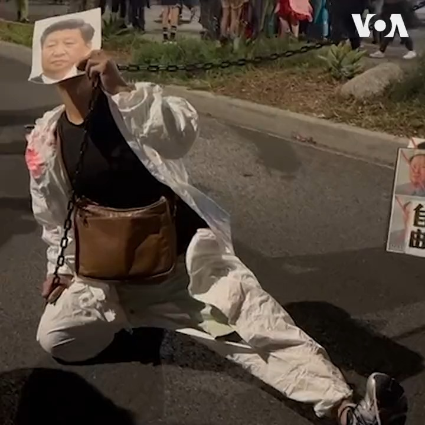

美国之音中文网 北京时间 2023-11-02T04:34:37Z 1719815228353888555 “清零政策，把人关了3年。。。是我们做了3年的噩梦，”一群中国异议人士31日晚上参加在好莱坞圣莫妮卡大道举行的万圣节游行，他们穿着红卫兵和大白的服装，以讽刺行为向中共压制政策发出声讨。详细内容：https://t.co/No2iQ7YIcB https://t.co/gQtNJjnw2m   