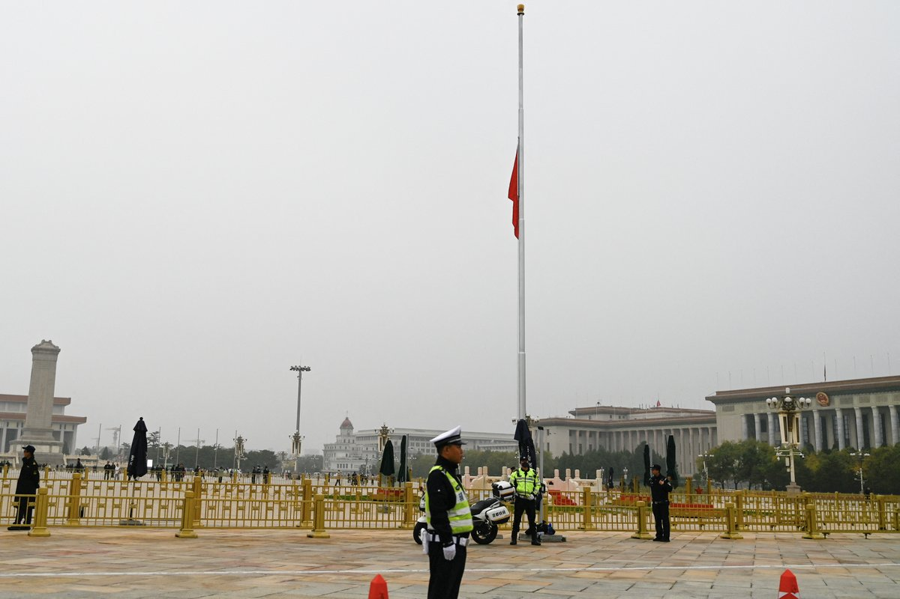
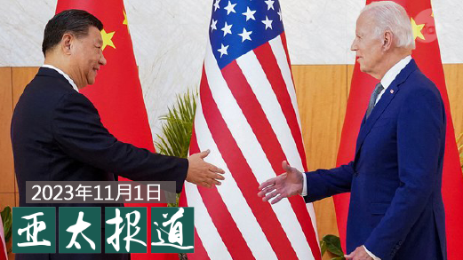
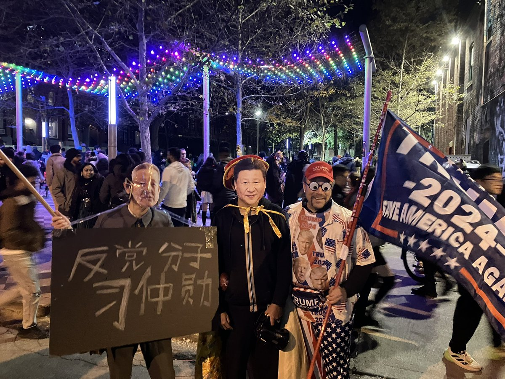
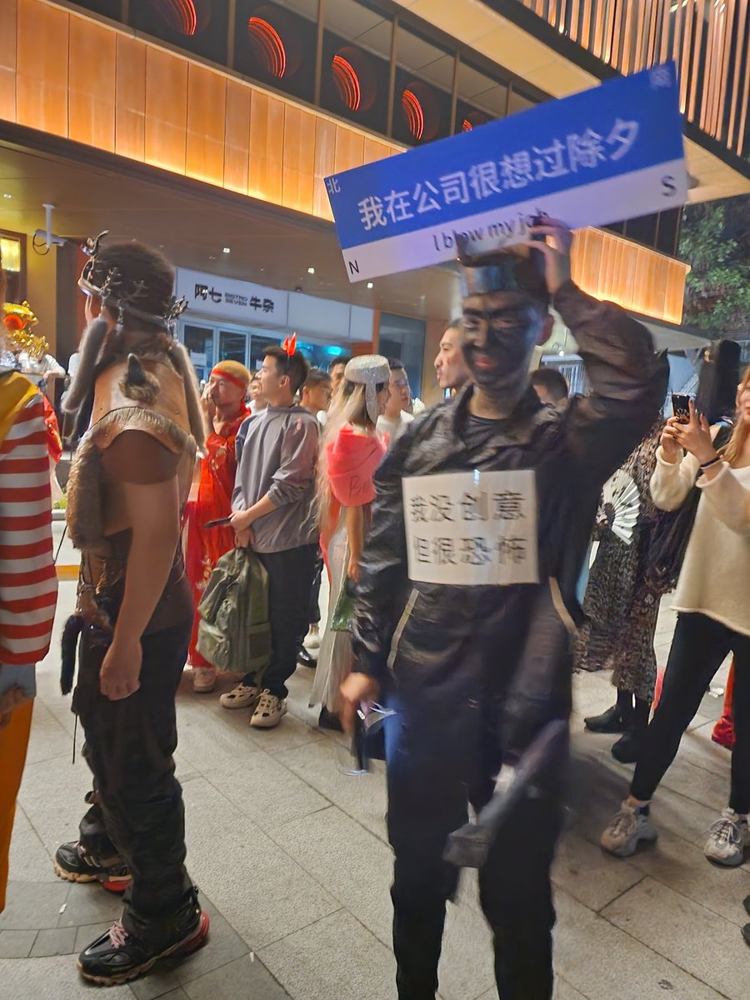
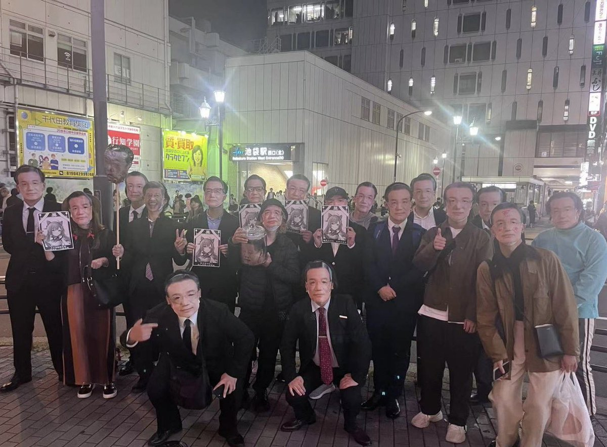
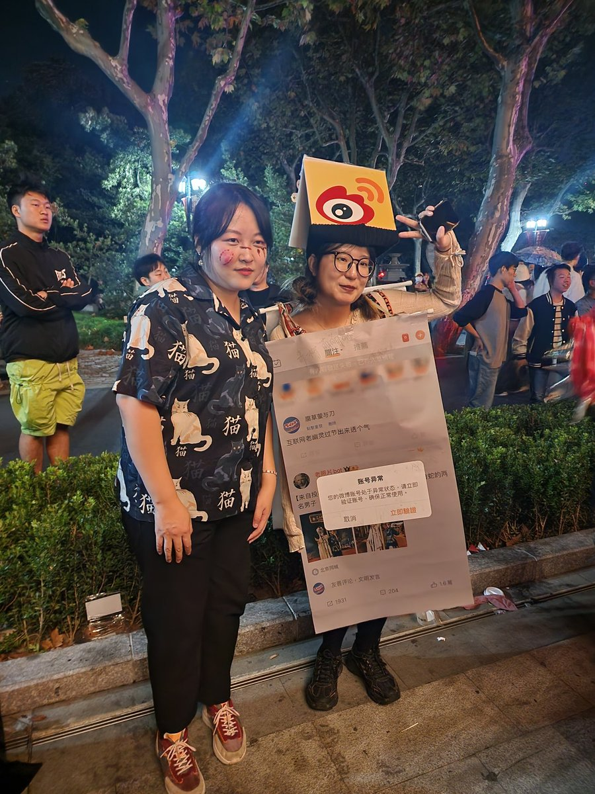

自由亚洲电台 北京时间 2023-11-02T09:53:10Z 1719895391536353585 【李克强遗体今火化 天安门和中南海降半旗】
中国国务院前总理李克强猝逝，2日上午于北京八宝山革命公墓火化。中南海和天安门广场已降半旗表达哀悼。
(左图法新社，右图美联社) #李克强 https://t.co/w4JJuFh4G3   自由亚洲电台 北京时间 2023-11-02T05:10:11Z 1719824177564389521 本周一（10月30日）至周四（11月2日），#北京 市发布空气重污染橙色预警，意味着连续2天会是5级 #重度污染 或连续3天4级中度污染。周边至少十几个城市像是天津、河北石家庄、唐山等地也发布 #橙色预警，影响大约1亿居民。

 https://t.co/RSZ8ymys8Q   自由亚洲电台 北京时间 2023-11-02T05:30:01Z 1719829168991715518 本周三，美国白宫宣布美国总统拜登提名白宫印太事务协调官 #坎贝尔（Kurt Campbell）担任副国务卿。外界关注，这样的人事安排隐含着什么政治信号？#美国外交政策 会因此出现调整吗？
 https://t.co/mgtL8thqXT   自由亚洲电台 北京时间 2023-11-02T06:00:00Z 1719836715064635557 美国白宫周二(10月31日)对外宣布，美国总统 #拜登 预计11月将在旧金山亚太经合组织(#APEC) 峰会期间会晤中国领导人 #习近平 。中方对此也做出了积极回应。这一会晤是否意味着曾经剑拔弩张的 #中美关系 就此转暖？

 https://t.co/6cdGhAzHX1   自由亚洲电台 北京时间 2023-11-02T07:00:08Z 1719851848495165881 欢迎收听和订阅播客【亚太报道（2023-11-1）】 https://t.co/MjLNSvVMqc
#李克强 遗体火化前夕 #八宝山 成敏感区域; #拜习会 在即 中美关系止跌回稳? 拜登提名 #坎贝尔 为副国务卿; 被香港拒签的 #何晓清 接受本台专访; "#天安门母亲"成员 #周淑庄 去世 https://t.co/bwQTKOwcM1   自由亚洲电台 北京时间 2023-11-02T07:30:01Z 1719859367338705326 周三，网上传出 #李克强 灵堂的相片，引发许多中国网民愤怒，认为对于一个正国级领导而言，灵堂太过简陋，且冷冷清清。有网友说：“但凡是个村支书，灵堂都比这阔气。” 港媒则称，灵堂相信是设在李家。 https://t.co/WIStVITL1S   自由亚洲电台 北京时间 2023-11-02T08:00:07Z 1719866943984087116 #404共和国 | 中国在对外关系上的思考逻辑
 https://t.co/BiEvnYi7C6   自由亚洲电台 北京时间 2023-11-02T08:36:10Z 1719876015223173225 RT @RFA_Chinese: 欢迎收听和订阅播客【亚太报道（2023-11-1）】 https://t.co/MjLNSvVMqc
#李克强 遗体火化前夕 #八宝山 成敏感区域; #拜习会 在即 中美关系止跌回稳? 拜登提名 #坎贝尔 为副国务卿; 被香港拒签的 #何晓清…   自由亚洲电台 北京时间 2023-11-02T02:57:22Z 1719790755684991080 加拿大华裔学者 #何晓清 遭香港政府拒绝续签签证并被香港中文大学解雇。
她说：#最大红线就是没有红线
 https://t.co/XCRscDeQqZ   自由亚洲电台 北京时间 2023-11-02T03:29:13Z 1719798768936292755 【#万圣节 创意大赏】猜猜哪几张不出自 #上海？ https://t.co/wpNi3u9YyB   自由亚洲电台 北京时间 2023-11-02T03:53:09Z 1719804792309268615 杨恒均的两个儿子28日致信阿尔巴尼斯说，上周才收到 #杨恒均 失去自由四年里，被允许从拘留所寄出的第一封信，信中称：“我病了，我很虚弱，我快不行了。”  https://t.co/pqJRf7NUpO   自由亚洲电台 北京时间 2023-11-02T00:32:32Z 1719754305144852978 台湾的鸿海集团创办人 #郭台铭 不受 #富士康 遭中国查税影响，周三(1日)前往台北市选举委员会送交总统参选连署书。郭台铭竞选办公室(郭办)有信心募集到远超过参选资格门槛(28万9667份)的连署书，通过审查。

 https://t.co/uhiGpBOkUd   自由亚洲电台 北京时间 2023-11-02T00:50:39Z 1719758863581495418 据法新社本周三报道，一项最新研究发现，由于中国 #电动汽车 行业蓬勃发展，在青藏高原掀起重要原料金属 #锂 的开采热潮，这将进一步损害该地区脆弱的生态环境，并加剧侵犯人权的行为。

 https://t.co/ec9nKUdhZc   自由亚洲电台 北京时间 2023-11-02T01:04:22Z 1719762317871858114 【死不瞑目】“#天安门母亲”成员 #周淑庄 逝世 https://t.co/HzjiStrnQ8   自由亚洲电台 北京时间 2023-11-02T01:28:27Z 1719768376426500410 【润！】今年 1月至9月，美国的边境巡逻队已逮捕了22,187名从墨西哥 #非法越境 的中国人，几乎是2022年同期的13倍。
9月份在 #美墨边境 被捕的中国人数量达到4010人的峰值！
#走线  https://t.co/QDiYHXj6w2   自由亚洲电台 北京时间 2023-11-02T01:58:34Z 1719775957668728868 距离 #台湾总统大选 还有2个多月。民进党总统参选人 #赖清德 周二（31日）在电视专访中透露，考虑搭档竞选的副总统人选目前有6人，外界热传的台湾驻美代表 #萧美琴 在名单中是“优先之上”。

 https://t.co/U5vhQSL2BG   