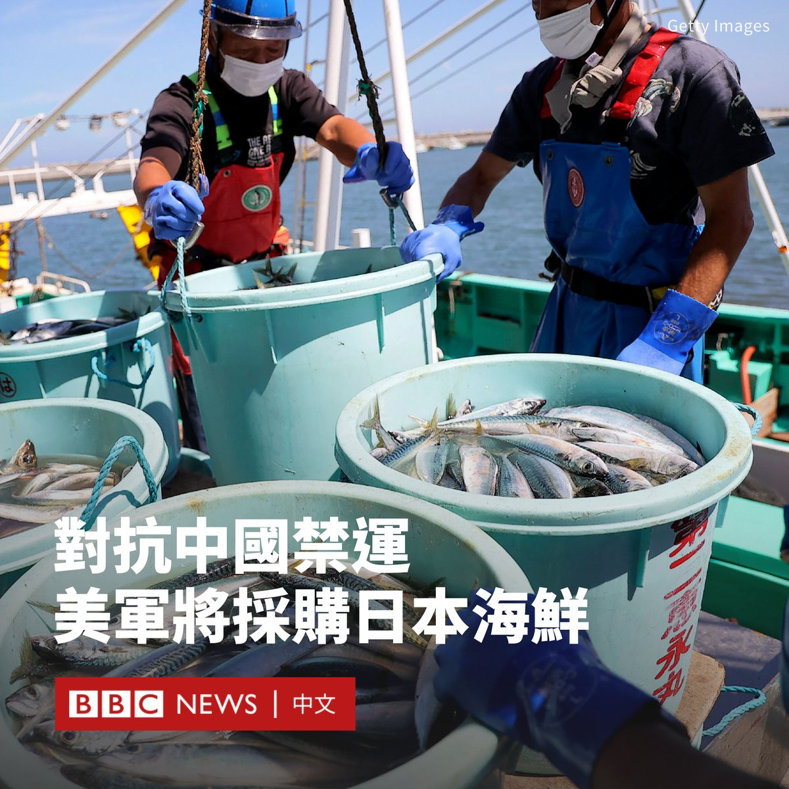
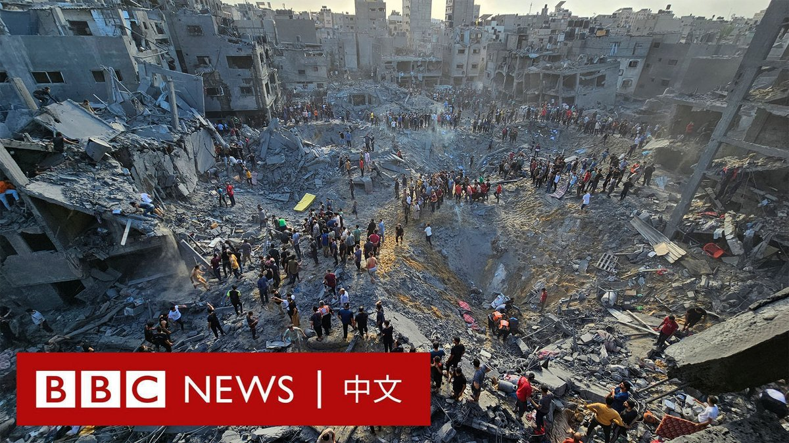

D英国广播公司BBC 北京时间 2023-11-01T20:47:28Z 1719697667050377488 “我可以控制第一杯酒。”

在热门美剧《老友记》中饰演钱德勒·宾（Chandler Bing）的马修·派瑞（Matthew Perry）上周去世。他生前因酗酒及药物成瘾问题困扰多年。

他生前在2013年BBC一档节目中与知名右翼专栏作家彼得·希钦斯（Peter Hitchens）就成瘾是否是一种疾病而展开交锋的片段近日重新广为流传。 https://t.co/kTZNEZu6LB   D英国广播公司BBC 北京时间 2023-11-01T21:52:32Z 1719714041709625437 在香港闹市区寸土寸金的一幢楼里，一名香港人将自己经营的唱片店变成一个独立的“唱片博物馆”。

自幼对音乐和旧唱片情有独钟的邓汉深，数十年来一直从世界各地搜集“稀世珍藏”，其中最重要的部分是各种流行音乐母带，以及超过20,000份不同年代的录音复本。

他认为，即使在数字和AI潮流之下，“模拟声”时代的录音制品仍有自己独特的“DNA”。   D英国广播公司BBC 北京时间 2023-11-01T17:38:43Z 1719650165093503063 从做核酸检测的“大白” ，到质问观众“哪里贵了”的网红“李佳琦”和《甄嬛传》里的安陵容……在万圣夜到来之际，中国上海的一条马路意外成为年轻人自我放飞和表达的舞台。
https://t.co/ii8vgoOlY1   D英国广播公司BBC 北京时间 2023-11-01T12:44:00Z 1719575998906384560 在中国对福岛水产品实施进口禁令后，驻日美军已开始批量采购日本海鲜，以表达对日本的支持。

美国驻日本大使拉姆·伊曼纽尔（Rahm Emanuel）表示，华盛顿还可能会寻找其他方式来帮助日本对抗中国的禁令。他将北京的行为描述为“经济战”的一部分。

中国是日本海鲜的最大买家，表示禁令是出于对日本向太平洋排放经处理的放射性核污水引发的安全担忧。

根据美方计划，此次采购将包括近一吨的扇贝，这与日本去年向中国出口超过10万吨扇贝相比仍微不足道。

伊曼纽尔对路透社说，这是一份长期合同的开始。随着时间推移，合作将拓展到所有类型的海鲜。

这批海鲜将在军队食堂和舰艇上供应，同时也将在基地的商店和餐馆中出售。

伊曼纽尔表示：“消除中国经济胁迫的最佳方式是向目标国家或行业提供援助。”

他称，美国还在与日本当局进行谈判，以帮助将当地捕捞的扇贝运送到在美国注册的加工商。

针对伊曼纽尔的言论，中国外交部发言人汪文斌回应称：“外交官的职责是促进国家间友好，而不是抹黑别国、搬弄是非。”   D英国广播公司BBC 北京时间 2023-11-01T10:33:58Z 1719543274913099817 以色列军方证实，其战机周二（10月31日）对加沙北部的贾巴利亚地区发动了袭击。

以色列国防军表示，哈马斯一名高级指挥官在袭击中死亡。他被指是10月7日策划和执行袭击以色列的“关键人物”。

以色列军方发言人还表示，数十名哈马斯武装分子在地下隧道中被杀。

哈马斯管理的卫生部称至少有50人在袭击中身亡，巴勒斯坦红新月会估计死亡人数为25人。哈马斯否认有任何高级指挥官在场，并称该说法是以色列杀害平民的借口。

现场画面显示了巨大的弹坑和被夷为平地的建筑物。

与此同时，世界卫生组织表示，加沙的“公共卫生灾难”已近在咫尺。联合国儿童基金会警告称，加沙的日供水量仅为正常水平的5%，婴儿脱水死亡的“威胁越来越大”。

加沙南部拉法边境最早可能于今天开放，允许一些伤势最严重的巴勒斯坦人在埃及接受治疗。   