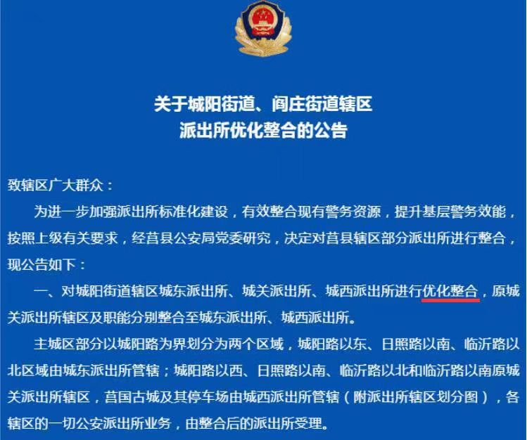
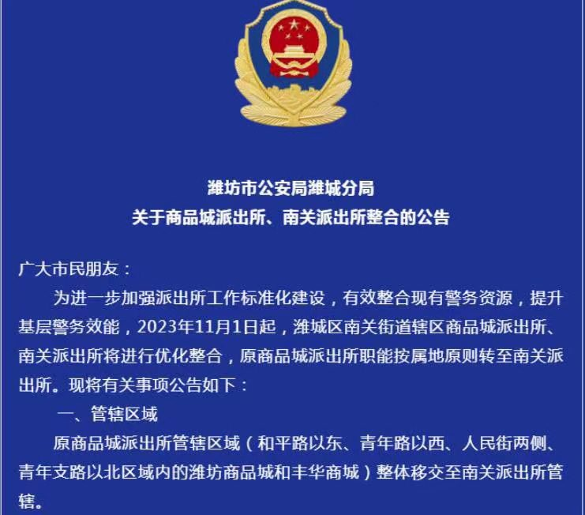
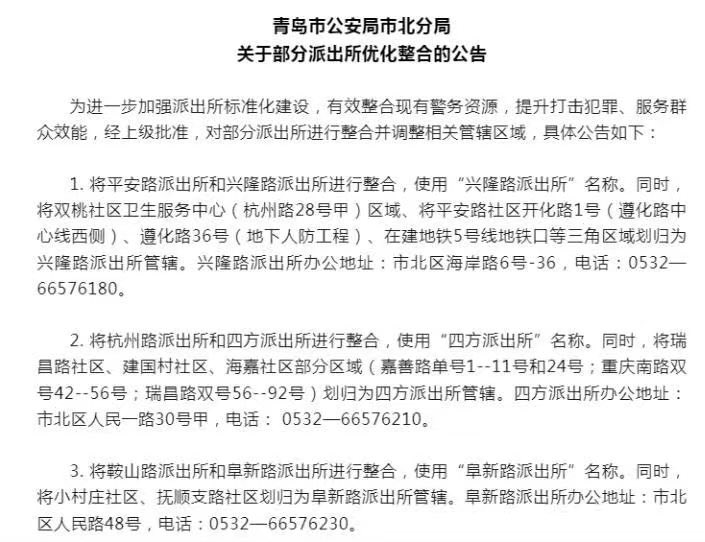
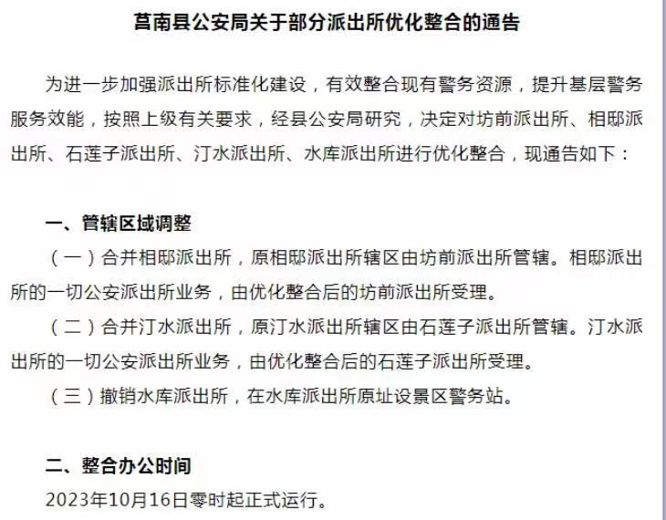

Petrichor 北京时间 2023-11-01T09:18:21Z 1719524242318877165 财政枯竭，多地开始裁撤合并派出所！ 

过去20年维稳队伍扩张太甚，终于养不起了。被下岗的“维稳人员”势必成为不稳定因素。

李自成不就是如此吗？ https://t.co/u2IUyiwNa7   Petrichor 北京时间 2023-11-01T09:19:11Z 1719524451094512096 加拿大禁政府公用手机上用微信，就如中国政府长期禁止公民上Google，脸书等西方媒体一样。   