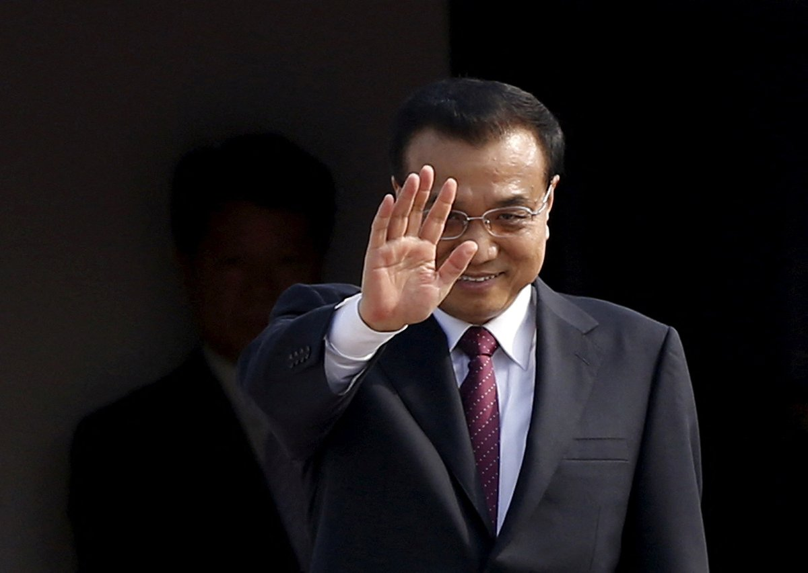
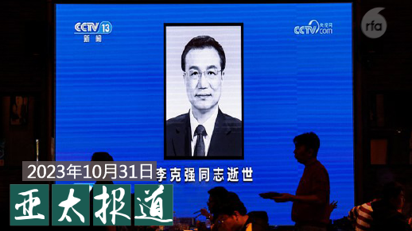
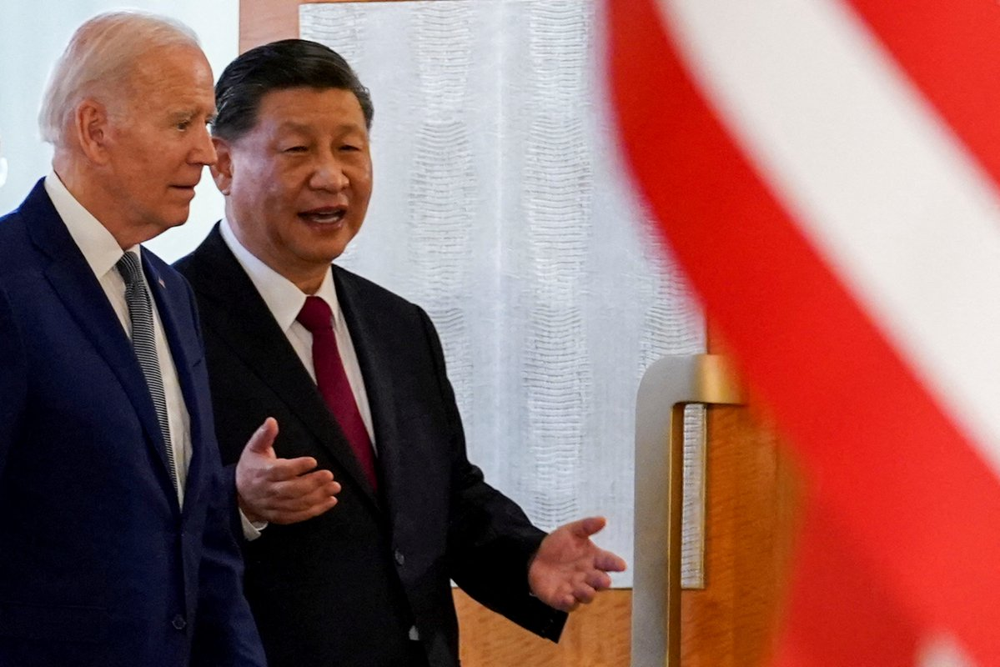
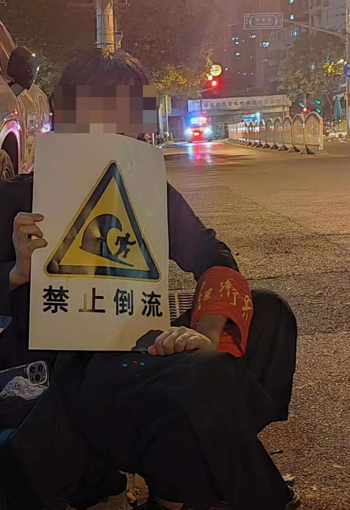

自由亚洲电台 北京时间 2023-11-01T14:05:43Z 1719596560206729530 【李克强遗体火化前夕 当局管控升级】
【北京八宝山公墓成敏感区域】
中国前总理李克强的遗体本周四将在八宝山公墓火化，公墓成为敏感区域，当局实施交通管制，所有车辆需绕道行驶。周三，北京包括高瑜等知名异议人士被上岗。有北京居民抱怨最近无法正常接收快递邮件。详细报道：https://t.co/eaC3NwN8jL  #李克强 #八宝山   自由亚洲电台 北京时间 2023-11-01T11:12:14Z 1719552901968806047 RT @RFA_Chinese: #您怎么看 ？
#上海万圣节 出圈了！（图片转自@whyyoutouzhele） 
中国青年跳脱大胆，创意无限，集齐内娱所有梗，再现社会敏感点，用角色扮演表达态度--原来他们并非没有态度。
您被内涵到了吗？您看好中式万圣节的未来吗？ 
今年 #…   自由亚洲电台 北京时间 2023-11-01T12:02:55Z 1719565659602837537 RT @RFA_Chinese: 魔都过鬼节， #膜蛤文化 延续？
疫情已解封，心境回不去
本台记者王允 @Jeff23Wang 报道。
#上海万圣节 https://t.co/f3obaDZ6rD   自由亚洲电台 北京时间 2023-11-01T09:30:01Z 1719527179275702758 中国国家安全部10月31日发布消息，宣称“发现数百非法 #涉外气象探测站点”，实时向境外传输气象数据，“对国家安全造成风险隐患”, 并指称有的探测项目“受境外政府直接资助”，有的则“服务于外国国土安全和气象监测”。

 https://t.co/lpBhEGxqda   自由亚洲电台 北京时间 2023-11-01T08:06:31Z 1719506164302676207 魔都过鬼节， #膜蛤文化 延续？
疫情已解封，心境回不去
本台记者王允 @Jeff23Wang 报道。
#上海万圣节 https://t.co/f3obaDZ6rD   自由亚洲电台 北京时间 2023-11-01T08:30:55Z 1719512304445010207 美国国务卿布林肯10月31日出席参议院拨款委员会听证会时重申，美国需要强化与印太地区伙伴的合作：〝面对中国金融胁迫时，我们能提供资源给世界银行及国际货币基金，让我们的发展中国家伙伴能有替代方案...〞 https://t.co/gA5XNuveKM   自由亚洲电台 北京时间 2023-11-01T08:35:15Z 1719513397040234860 欢迎收听和订阅播客【#亚太报道（2023-10-31）】 https://t.co/MjLNSvVMqc

#李克强 遗体火化日期公布；中国民众 “#万圣节”装扮引热议；中国经济再回收缩区间；#香港民主派 参选 #区议会 受阻；《#蒋中正日记》首次在台湾出版。 https://t.co/XRJzkHiewO   自由亚洲电台 北京时间 2023-11-01T08:39:55Z 1719514570279055793 RT @RFA_Chinese: 【本土化的万圣节 中国题材取之不竭 哪个最惊悚？】

今年 #上海万圣节 玩疯了！很多人都在努力cos，扮各种明星，卡通人物，童年记忆...像是一场大型行为艺术！

多个相关话题冲上微博热搜。@胡锡进 发文称，又一个洋节万圣节被中国的小青年们生…   自由亚洲电台 北京时间 2023-11-01T08:50:29Z 1719517230491443307 #加拿大 官方周一（30日）宣布，禁止在政府配备的智能手机和其他移动设备上使用中国社媒应用程序 #微信 和俄罗斯的应用平台卡巴斯基（Kaspersky），理由是存在隐私和安全风险。

 https://t.co/LuWHtqgK78   自由亚洲电台 北京时间 2023-11-01T09:18:38Z 1719524314901557379 【白宫: 拜登习近平预期11月APEC场边会谈】

美国白宫发言人尚皮耶卡琳·让-皮埃尔（Karine Jean-Pierre）31日证实，美国总统拜登与中国国家主席习近平预期将于11月中旬在旧金山举行的亚太经济合作会议领袖峰会场边举行双边会谈，进行建设性对话。她说“这是一场艰难但重要的对话。”另外她也说拜登总统对此充满期待。https://t.co/8n09FzCIz9 #拜习会 #拜登 #习近平   自由亚洲电台 北京时间 2023-11-01T03:15:21Z 1719432891393036309 国际社会高度关注中国当局在新疆大规模拘押 #穆斯林 少数民族之际，中国国务院本周二下发文件，宣布成立 #新疆自贸试验区，以加强“#一带一路”核心区建设。那么，新疆自贸区的成立能否达到官方预期的效果呢？

 https://t.co/63DU7CLOAo   自由亚洲电台 北京时间 2023-11-01T03:37:55Z 1719438572284203301 美国国会众议院 #美国与中国共产党战略竞争特设委员会 的两党领袖敦促财政部长 #耶伦（Janet Yellen）加快实施 #对华投资 的限制规定，并警告称中国正利用美国资金发展技术。

 https://t.co/noAJe31tE8   自由亚洲电台 北京时间 2023-11-01T03:48:59Z 1719441356056334677 #李尚福 被免职事件可为 #美中关系 止跌停损创造契机？ https://t.co/yRnVmgEpLi   自由亚洲电台 北京时间 2023-11-01T03:50:48Z 1719441813441044624 评论 | #程晓农：中国的 #外汇储备 敲响警钟
 https://t.co/lCMTuxXFfJ   自由亚洲电台 北京时间 2023-11-01T00:27:13Z 1719390580348948558 10月31日，中国国家统计局公布10月份 #制造业采购经理指数(PMI)。该指数降至49.5，再次跌破荣枯线，中国经济从而重回收缩区间。

 https://t.co/71tBt8okWa   自由亚洲电台 北京时间 2023-11-01T01:31:10Z 1719406672894915026 #您怎么看 ？
#上海万圣节 出圈了！（图片转自@whyyoutouzhele） 
中国青年跳脱大胆，创意无限，集齐内娱所有梗，再现社会敏感点，用角色扮演表达态度--原来他们并非没有态度。
您被内涵到了吗？您看好中式万圣节的未来吗？ 
今年 #万圣节 还有哪些造型让您过目不忘，欢迎跟帖分享。 https://t.co/ykAl3JfW5P   自由亚洲电台 北京时间 2023-11-01T01:48:58Z 1719411150771900623 在 #李克强 位于安徽 #合肥 的故居前，大批民众连日来自发排队献花，形成人潮和花海。但也有民众发现，故居外开始出现神秘的“蓝背心人”，专门审查花束上的字卡是否有不当用语。 https://t.co/GUeC3JQJzz   自由亚洲电台 北京时间 2023-11-01T02:12:50Z 1719417156612555077 #聚焦维吾尔 | 伊利夏提：#李克强， 是贤臣还是屠夫
 https://t.co/5FcnhxSfZD   自由亚洲电台 北京时间 2023-11-01T00:16:34Z 1719387897823166851 历经十年跨海争讼，美国加州法院今年7月最终判决，所有寄存在斯坦福大学的两蒋文物全部归台湾的国史馆所有。相关的59箱两蒋文物于今年9月运抵台湾，其中包括 #蒋中正 从1917年至1972年写了55年的日记，#蒋经国 1937年至1979年共42年的日记正本等。 https://t.co/KPw7TqzBv9   