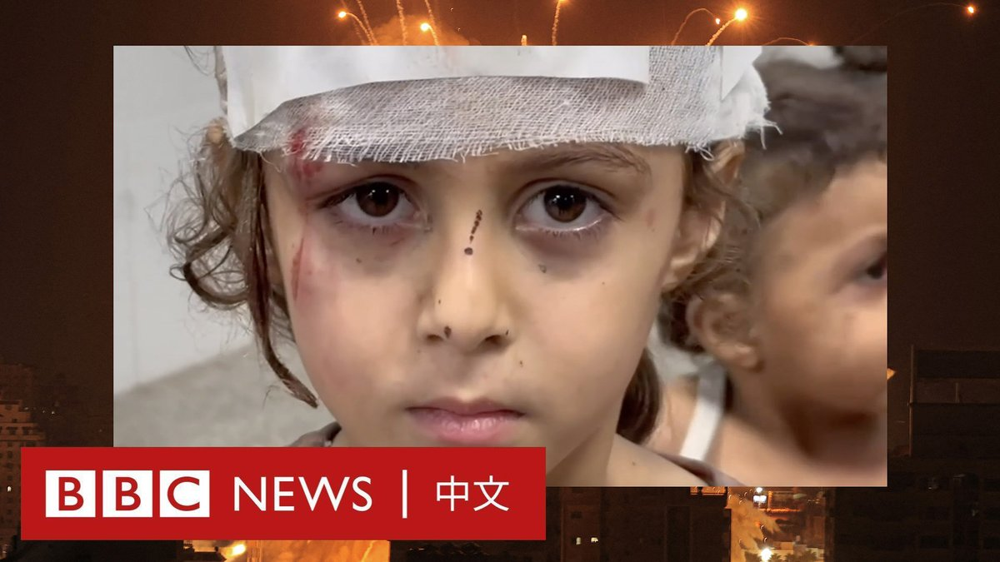
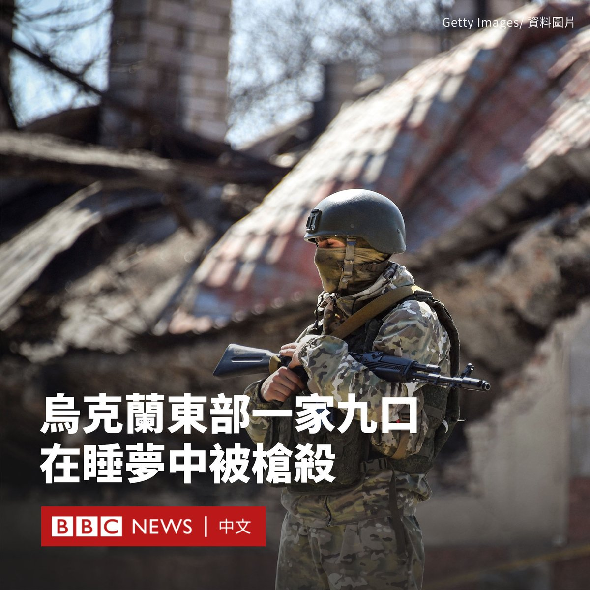
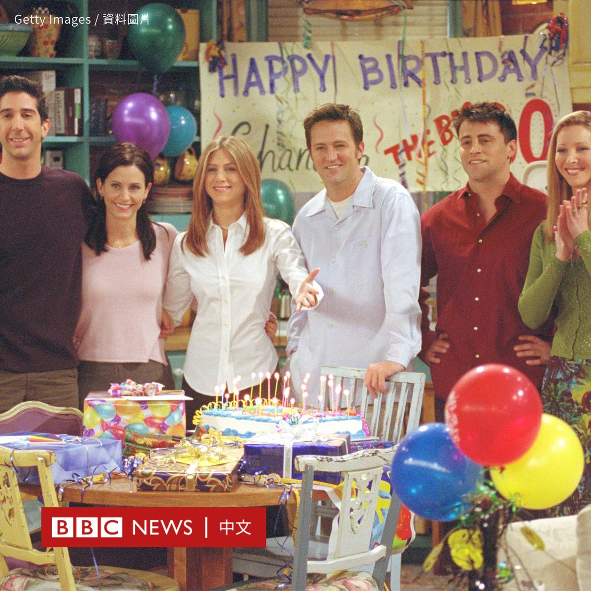

D英国广播公司BBC 北京时间 2023-10-31T20:45:36Z 1719334806679400539 在李克强逝世后，尽管安徽、河南等地都出现民众献花悼念，但当局很快试图对线下和网上的这些悼念活动进行“降温”。官方媒体提及这名前总理的报道开启了评论审核，并且统一采用通稿。

专家表示，中国当局想要避免民众对李克强的表扬，变成对习近平及其政策的批评。https://t.co/l09j6cGqVq   D英国广播公司BBC 北京时间 2023-10-31T21:35:27Z 1719347353499373776 以色列持续对加沙的空袭导致儿童受到牵连。慈善机构“救助儿童会”报告说，在三周内有近3200名儿童在袭击中丧生。

联合国官员表示，加沙正在发生的人类悲剧是“无法忍受的”，在因空袭而丧生的人中，近70%是妇孺。 https://t.co/M5hp9Hp7fr   D英国广播公司BBC 北京时间 2023-10-31T16:35:08Z 1719271775895490957 以色列总理内塔尼亚胡（Benjamin Netanyahu）拒绝了在加沙停火的呼吁，称“这是战争时期”。他称以色列将继续推进消灭哈马斯的计划。https://t.co/1rcLiNBZDr   D英国广播公司BBC 北京时间 2023-10-31T15:21:38Z 1719253278964539701 在乌克兰东部遭俄罗斯占领的城镇沃尔诺瓦哈（Volnovakha）一所房屋内，有九人遭枪杀身亡，当中包括两名幼童。

该事件在乌克兰引发民愤。乌克兰和俄罗斯分别对这起袭击展开调查。

社交媒体上的照片显示，屋内的床上躺着被子弹射穿的血迹斑斑的尸体，有遗体仍然拥抱在一起。

乌方监察员德米特罗·卢宾内茨（Dmytro Lubinets）周一（10月30日）表示，“俄罗斯人沾满鲜血的双手”参与了沃尔诺瓦哈的杀戮。

他在Telegram上说：“根据初步信息，占领者杀死了卡普卡涅茨（Kapkanets）一家的所有人，他们当时正庆祝生日，并拒绝将自己的房屋交给车臣占领者。”

乌克兰顿涅茨克检方表示，他们认为俄罗斯士兵于10月27日杀害了卡普卡涅茨一家，因为他们拒绝腾出房子。

官员表示，根据初步信息，枪手在离开后又在这家人熟睡时折返，枪杀了他们。

俄罗斯方面的调查委员会证实了该事件，称有两名男性嫌疑人已被拘留。其将被捕人员描述为来自俄罗斯远东的雇佣士兵，他们与俄罗斯军方签订了合同。

该委员会在一份声明中表示：“根据初步信息，犯罪动机是家庭冲突。”

沃尔诺瓦哈自2022年2月被俄罗斯占领，该镇的大部分建筑已经被摧毁。   D英国广播公司BBC 北京时间 2023-10-31T13:34:15Z 1719226255915233589 加拿大政府公布，即日起将禁止在政府通讯设备使用中国通讯软件微信。

当局表示，做出这一决定是为了保护国家的网络和数据安全。但就私人设备而言是“个人选择”。

加拿大国库委员会主席安妮塔·阿南德（Anita Anand）在一份声明中表示，目前没有证据表明政府信息已遭泄漏。

她说：“我们正采取基于风险的网络安全方法，通过禁止在政府发放的手机等装置使用这些应用，来降低风险。”

BBC已联系微信母公司腾讯寻求评论，但尚未收到回复。

除此之外，加拿大政府还禁止政府通讯设安装俄罗斯防毒软件卡巴斯基，指其存在隐私和安全风险。

用户将移除这些应用程式，并且无法重新下载。

此前，加拿大已禁止在联邦政府设备上使用TikTok。

微信常被称为“万能应用”，集合了聊天、资讯和购物等多种功能。它在中国、东南亚以及华人社区中很受欢迎。

然而，西方政府担忧该应用存在安全问题，包括用户可能遭到监视。

美国前总统特朗普（Donald Trump）曾试图在2020年通过行政令禁止该应用，但该禁令后来被推翻。   D英国广播公司BBC 北京时间 2023-10-31T12:18:54Z 1719207291256471832 中国的一项研究表明，太极拳可能有助于抑制帕金森病的症状数年之久。

研究人员说，与不练习太极拳的人相比，每周练习两次太极拳的人并发症更少，生活质量也更好。

帕金森病是一种渐进性脑部疾病，会导致颤抖和行动迟缓，目前尚无根治方法。专家表示，这一发现佐证了此前关于运动对帕金森病患者有益的研究。

上海交通大学医学院的这项研究对数百名帕金森病患者的健康状况进行了长达五年的监测。其中一组147人定期练习太极，另一组187人则不练习。

研究人员发现，基于对症状、运动和平衡能力的测量，打太极拳的这一组患者的疾病发展得更慢。

与另一组相比，这一组摔倒、背痛和头晕的情况更少，记忆力和注意力问题也更少。与此同时，患者的睡眠和生活质量不断提高。

此前对练习太极拳六个月的帕金森病患者进行的一项试验发现，他们在行走、姿势和平衡方面的改善程度要比不练习者更好。

李根（音译，Gen Li）博士及其合著者在《神经病学、神经外科学与精神病学杂志》（Neurology Neurosurgery & Psychiatry）上撰文称，他们的研究表明，“太极拳对帕金森病具有长期有益作用”。

作者称，太极拳可用于长期控制帕金森病，延长生活质量，同时还有助于保持患者的活力。

但他们也承认，这项研究的规模相对较小，无法证明太极拳就是其中一组患者取得所有积极疗效的原因。

伦敦国王学院运动障碍和神经学教授K·罗伊·乔杜里（K Ray Chaudhuri）说：“尽管（太极拳）在运动和非运动功能方面的积极影响令人印象深刻，但基于这项研究声称其对神经有保护作用还为时过早。”他说，芭蕾舞也被发现对帕金森病有类似的效果。   D英国广播公司BBC 北京时间 2023-10-31T10:24:40Z 1719178543077470308 热门美剧《老友记》（Friends）剧组表示，该剧的演员们对主演马修·派瑞（Matthew Perry）的去世感到“悲痛万分”。

在该剧中饰演钱德勒·宾（Chandler Bing）一角的派瑞于周六（10月28日）去世，终年54岁。据报道，他被发现在洛杉矶家中的浴缸中不省人事。

詹妮弗·安妮斯顿（Jennifer Aniston）、柯特妮·考克斯（Courteney Cox）、马特·勒布朗（Matt LeBlanc）、大卫·史威默（David Schwimmer）和丽莎·库卓（Lisa Kudrow）在一份联合声明中表示，这是一个“无法估量的损失”。

目前，派瑞的尸检尚未得出结论，有待进行毒理学测试。

《老友记》剧组在一份给BBC的声明中说：“我们都为失去马修而悲痛万分。”

“我们不仅仅是搭档，还是一家人。纵有千言万语，但我们现在要花点时间来悼念和处理这个难以估量的损失。”

此前，这部情景喜剧的创作者也对派瑞的去世表示哀悼，称其是一个“才华横溢的天才”，并且“总是房间里最有趣的人”。

《老友记》讲述了居住在纽约的六位朋友的命运。其从1994年到2004年上映，在美国和很多国家风靡一时。

仅在美国就有超过5200万观众收看了2004年的大结局，成为2000年代收视率最高的美国电视剧集。

1969年，派瑞出生于马萨诸塞州，在加拿大渥太华长大。他在那里与后来成为加拿大总理的贾斯汀·特鲁多（Justin Trudeau）成为小学同学。

但在名声最盛的时候，派瑞因酗酒及阿片类药物成瘾困扰多年，多次接受康复治疗。   