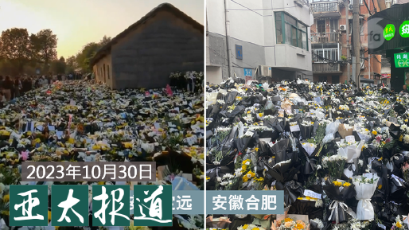
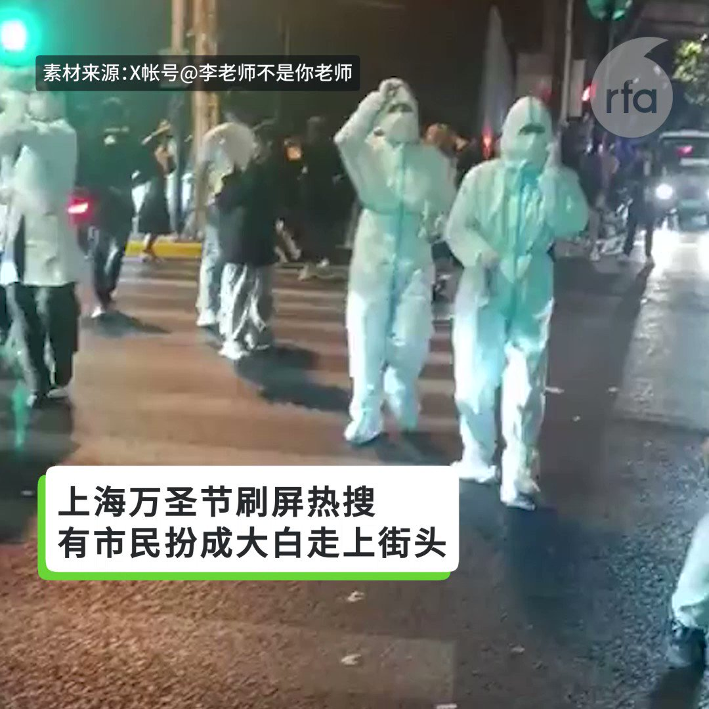
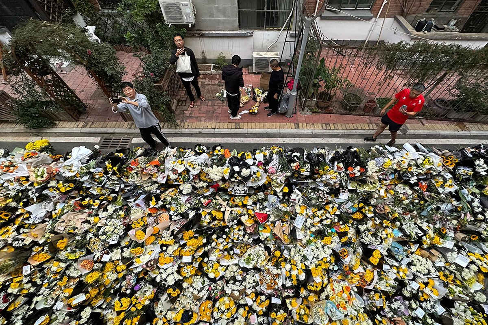

自由亚洲电台 北京时间 2023-10-31T17:42:22Z 1719288695390674965 【“两蒋日记”原件重返台湾】
【台湾国史馆发表第一批“蒋中正日记”】
历经10年缠讼，59箱“两蒋日记”等文物原件重返台湾，台湾的国史馆31日发表“蒋中正日记(1948-1954)”新书。“蒋中正日记”预计2024年3月可开始提供查询，“蒋经国日记”将于今年年底先出版1970年至1979年的日记。蒋中正的孙媳妇蒋方智怡说她有信心《蒋中正日记》成为权威版本，她盼各方理性公正客观使用档案。#蒋中正日记 #蒋经国日记   自由亚洲电台 北京时间 2023-10-31T13:35:28Z 1719226562388885525 新华社31日发布消息，国务院原总理 #李克强 的遗体，将于11月2日在北京火化。 https://t.co/gWRMW7ZyCp   自由亚洲电台 北京时间 2023-10-31T13:36:18Z 1719226768815456407 RT @RFA_Chinese: 【欢迎加入自由亚洲电台电报群】https://t.co/UkKZmFSRkG https://t.co/Qid2LNZxJn   自由亚洲电台 北京时间 2023-10-31T14:21:08Z 1719238052894351600 【何晓清签证被拒 遭中大解聘】
【李家超:依原则处理】
加拿大籍华裔知名“六四”学者 #何晓清（Rowena He）在香港的工作签证延期申请突然被拒后，随即遭她任教的香港中文大学“立即解聘”。
香港行政长官李家超31日回应媒体询问此事时说，入境处在决定是否批准签证申请时，会根据“当时的政策及原则”，包括有关人士是否持有有效旅游证件、会否对香港造成负担，又或在保安及犯罪方面是否有任何风险。他相信入境处在处理所有个案时，都是按照有关原则而定。https://t.co/8my90j7kYX   自由亚洲电台 北京时间 2023-10-31T10:32:59Z 1719180639059022188 RT @RFA_Chinese: 【集会蔓延多省市 | 多地民众展示标语】
前总理逝世引发群众上街，悼念集会已从 #李克强 故居蔓延至其他地区。在 #郑州，大批民众在市中心聚集，有人展示大幅画像及立体标语；在 #定远县，悼念者围绕李的祖屋大排长龙，连停下摄影的时间都没有；在合肥…   自由亚洲电台 北京时间 2023-10-31T10:33:19Z 1719180721699381740 RT @RFA_Chinese: 【本土化的万圣节 中国题材取之不竭 哪个最惊悚？】

今年 #上海万圣节 玩疯了！很多人都在努力cos，扮各种明星，卡通人物，童年记忆...像是一场大型行为艺术！

多个相关话题冲上微博热搜。@胡锡进 发文称，又一个洋节万圣节被中国的小青年们生…   自由亚洲电台 北京时间 2023-10-31T09:57:45Z 1719171771398578422 #您怎么看
10月29日，在第十届北京 #香山论坛 开幕前的高端对话论坛上，复旦大学中国研究院院长 #张维为 谈论世界格局变化等问题时说：从不少靠谱的民调来看，世界已经进入了新的“觉醒年代”，整个非西方世界几乎没有例外，从拉美，到中东，到非洲，都在谈论“向东看”，主要就是向中国看。这不是中国故意推广的，而是全球南方国家经历了这么多年的跌宕起伏后发现，还是中国和中国模式靠谱。
张维为提出，世界早就进入了后美国时代，这不是说美国不重要了，美国还是很重要，而是说美国所做的这一切不再代表时代的方向，甚至某种形式它在逆潮流而动。“像美国这样的国家，只有通过交锋才能更好地交流”
张维为说得对吗？他对中国执政者和中国社会舆论引导有什么作用？   自由亚洲电台 北京时间 2023-10-31T06:30:01Z 1719119492272583167 #事实查核｜德国外长说“不能想像跟中国在同一星球上”？
 https://t.co/QnvYgeDiij   自由亚洲电台 北京时间 2023-10-31T07:40:06Z 1719137131237646462 欢迎收听和订阅播客【#亚太报道(2023-10-30)】 https://t.co/MjLNSvVMqc
#李克强 故居聚集献花人潮；民众为何缅怀李克强？；人权律师 #卢思位 获得取保候审；#香山论坛 开幕；台湾“#蓝白合”政党协商。 https://t.co/9DfHu8qbP2   自由亚洲电台 北京时间 2023-10-31T08:08:52Z 1719144369494601735 RT @RFA_Chinese: 【悼李诗抄，欢迎跟帖】

此刻，我需要一碗酒
———一个无名的蝼蚁
有些人活着，

他咋还不死？
有些人死了，
他咋走的这么早？！
我打完最后一颗螺丝，

老板说，下班了
愿意留下的，我们一起
喝点酒，送送那个人
我停下出租车，顾客却没下

他…   自由亚洲电台 北京时间 2023-10-31T08:26:02Z 1719148689279582432 RT @RFA_Chinese: 有网友说：他是谁并不重要，他曾经干了啥也不重要，重要的是人们为什么会自发的走上街头，纪念一个毫无政绩的总理？
#您怎么看？ https://t.co/MNzHYXQ99o   自由亚洲电台 北京时间 2023-10-31T09:13:54Z 1719160733928182099 【本土化的万圣节 中国题材取之不竭 哪个最惊悚？】

今年 #上海万圣节 玩疯了！很多人都在努力cos，扮各种明星，卡通人物，童年记忆...像是一场大型行为艺术！

多个相关话题冲上微博热搜。@胡锡进 发文称，又一个洋节万圣节被中国的小青年们生生给“中国化”了。

万圣节正在中国化为“万梗节”。你能认出几个梗？哪个扮相吓到您？

您预测上海这样的狂欢能持续多久？   自由亚洲电台 北京时间 2023-10-31T05:10:55Z 1719099588353884493 英国“#军情五处”处长本月中罕有的联同其他“#五眼联盟”情报首脑，公开就中国的间谍行为发出警告，而英国国会也接连出现“#中国间谍”疑云。
一批英国议员忧虑相关活动将随大选临近而倍增，因此去信国会议长，建议对所有议员及员工进行强制安全培训等，以防御外国干预。

 https://t.co/vcCdQYCt6a   自由亚洲电台 北京时间 2023-10-31T05:32:00Z 1719104891959079084 #李克强 逝世后，网络上出现大量悼念的声音。为什么 #江泽民、#赵紫阳 过世时，并未出现如此广泛的民间纪念活动？
 https://t.co/WIGWQsTzfi   自由亚洲电台 北京时间 2023-10-31T05:38:00Z 1719106401958871399 有网友说：他是谁并不重要，他曾经干了啥也不重要，重要的是人们为什么会自发的走上街头，纪念一个毫无政绩的总理？
#您怎么看？ https://t.co/MNzHYXQ99o   自由亚洲电台 北京时间 2023-10-31T06:04:27Z 1719113059485249888 专栏 | #夜话中南海：当年毛让周先去，如今习让李早走？
 https://t.co/z8stf78f84   自由亚洲电台 北京时间 2023-10-31T06:05:59Z 1719113445042209088 RT @RFA_Chinese: 【悼李诗抄，欢迎跟帖】

此刻，我需要一碗酒
———一个无名的蝼蚁
有些人活着，

他咋还不死？
有些人死了，
他咋走的这么早？！
我打完最后一颗螺丝，

老板说，下班了
愿意留下的，我们一起
喝点酒，送送那个人
我停下出租车，顾客却没下

他…   自由亚洲电台 北京时间 2023-10-31T03:06:57Z 1719068391523414350 中国第6次 #全国金融工作会议 30日登场。据外媒日前报导，本次会议30日至31日在北京闭门举行，与会者包括中国领导层、金融监管机构及银行高层。与此同时，中国多家官媒发文，关注防范化解金融风险等议题。

 https://t.co/frNvl1tvds   自由亚洲电台 北京时间 2023-10-31T03:50:59Z 1719079470257299713 美籍华裔记者艾米·伊近日发布新书，聚焦流亡藏人的生活足迹。在这本广受海外舆论关注的书中，她详细介绍了 #流亡藏人 离开西藏的原因，以及他们在海外多样的生活经历。

 https://t.co/OCyIN76C9R   自由亚洲电台 北京时间 2023-10-31T00:29:45Z 1719028831015887308 #蓝白合谈 的中国背后操作有迹可循，令人担忧？ https://t.co/HLGKlyQoNW   自由亚洲电台 北京时间 2023-10-31T01:04:58Z 1719037691080384871 据英国《金融时报》29日报道，今年9月流入中国的外国直接投资同比下降34%，跌至728亿元人民币。这是自2014年公布月度数据以来的最大降幅。
 https://t.co/UPeR5YR2lO   自由亚洲电台 北京时间 2023-10-31T01:54:08Z 1719050066319782243 评论 | 魏京生 @WEI_JINGSHENG：中国的经济困境有解吗（之二） https://t.co/VEMbarddXU   