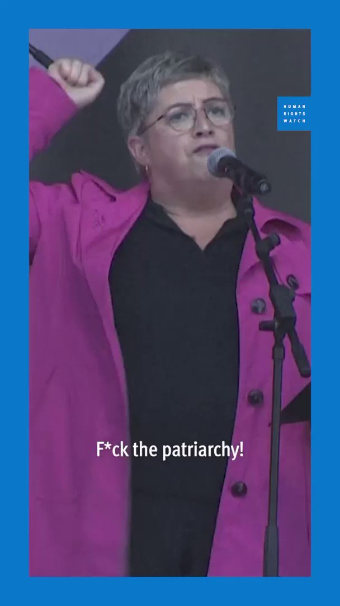
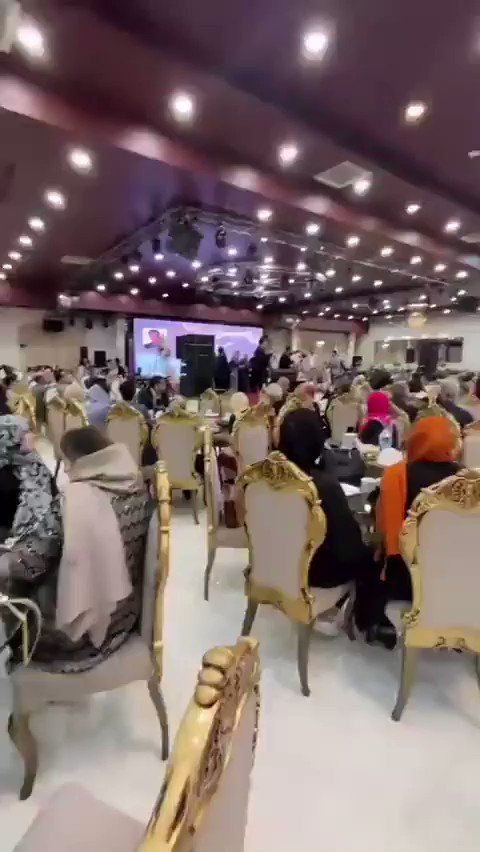

谁将十万横扫三江 北京时间 2023-10-31T19:21:30Z 1719313642892697619 RT @DXDWX999: 湖北武汉，某黄焖鸡米饭店老板当街烫死怀孕狗妈妈一事，引起市民愤怒，很多市民上门抗议，有人送花圈撒冥币，目前涉事餐饮店已经关门 https://t.co/Jx8JtoGQvH   谁将十万横扫三江 北京时间 2023-10-31T20:17:00Z 1719327611355373929 10月29日，四川 成都。
据说西航港街道一摊贩因城管要没收摊铺，摊主推倒摊铺造成城管受伤。
知情人透露，那个臭豆腐摊主今天是第四次被收了，因为别人都是三轮跑得快，他那个是手推车，今天城管又来的时候他就故意把摊子推倒了，砸到了城管 https://t.co/exJQjiNnth   谁将十万横扫三江 北京时间 2023-10-31T11:23:59Z 1719193473327509686 尊敬的上级部门，全国网友：

我叫李朦朦，现年31岁，江苏徐州人。2015年12月17日，我被一个叫丁聪聪男子以招工为名骗到房间里实施强奸谋杀（未遂），在我持续信访举报了5年后才被以“强制猥亵”移交检察院，最终被判处有期徒刑三年。我不服判决继续信访举报期间，再次遭到派出所暴力执法殴打受伤送医，被莫须有的罪名拘留等残酷打击报复。派出所警察还威胁我，要是敢将此事曝光出去就判我刑，让我永远出不去。

在我继续持续信访举报曝光并引发社会关注后，各有关部门才开始重视我的问题。但他们所谓的重视，并不是如何去解决问题，而是想着如何去解决我这个提出问题的人。

2023年8月23日，我应有关单位要求与徐州市政法委陈浩亮处长，徐州经济技术开发区政法委张彬主任、接访人员李丽君见面当面听取我的诉求，下面是谈话实录：

谈话开场，我就问了政法委陈浩亮处长一个最核心的问题：为什么丁聪聪强奸谋杀（未遂）一案，派出所五年多都不移送检察院起诉?

陈浩亮处长称，我不是来回答我问题的，派出所都有办案流程，案件复杂，从无到有。

我又问陈浩亮处长：那为什么案件在我2020年到处求助被网络曝光引发关注后，派出所十来天就把所有事情查清楚了呢？

陈浩亮处长回答说：那都是根据法律事实，证据，客观事实认定的。而且法院最终判定的罪名为强奸又不是猥亵，当初派出所是为了不影响你找对象才将其定性为猥亵的。

陈浩亮处长的回答让我很生气，我继续问他：我明明很早就抗诉了，并且案件庭审时为什么不通知我这个受害者就开庭，为什么案子盘下来后连判决书都不给我送一份？

面对我的质疑，陈浩亮处长再次向我强调，他不是来回答我问题的，并说有些案件不需要通知当事人，由检察院公诉就行。

我继续提起我被开发区分局拘留，被派出所民警殴打折磨，包括派出所威胁房东不准租房给我，威胁邻居不准给我作证的事，政法委李丽军居然当众撒谎，说我不在现场。

当我不断列举派出所其他违法事实时，陈浩亮处长等人就不耐烦了，说不是来回答我问题的。

面对一干领导的不耐烦，我问：既然把我喊来是解决问题的，那你们说怎么解决？

当我提出这个问题后，在座领导领导又将问题推给了我，问我有什么诉求？

我称，我唯一的诉求就是依法处理，公平公正公开处理，依法判决，但我的诉求你们从来不处理。那只有你们说吧，拿个我能接受的方案给我就行，我要个书面回复。

对我的诉求，一干找我谈话的领导避而不谈，反而试图用钱来收买我，说考虑到我经济困难，可以给予贫困救助，民事部分尽可能都给我解决，帮我处理。但是要我息访，不上访。

我坚定的回复称，不可能，我不会要经济补偿，我只要一个公道。

听了我的态度后，开发区政法委李丽军问我：你既然不要钱，当年你姑为什么去谈？

我生气得炸毛，立即反驳李丽军：以前我姑之所以去，那是当年派出所威胁和强制我姑去的，派出所当年一直威胁我家里人才去的，是我让去的吗？我知道吗？没有人性的畜生。

听我骂出“没有人性的畜生”这句话时，在座领导恼羞成怒，开发区信访局局长周建国指着我大吼道：“李朦朦，这里不是你撒野的地方！

我回敬称，我没撒野，我也不怕！我是在依法上访，依法维权！依法申诉!我有理，我依法！有人违法了!我只想要一个公道为什么就这么难？

谈话最后在不愉快的气氛中不欢而散。   谁将十万横扫三江 北京时间 2023-10-31T11:29:40Z 1719194902117200180 10月24日，芬兰女性与非二元性别者集体罢工走上街头，要求性别平等。商店、学校、银行全部停摆。芬兰总理带领所有内阁成员，一起加入了罢工。让我们近距离看看一家商店的歇业公告：今天，我们支持女性和非二元。一如既往，永远支持。

根据世界经济论坛的排名，在最近的14年里，芬兰一直是世界上最为性别平等的国家。但在世界范围，我们还没有完全做到性别平等的国家。甚至在芬兰也完全没有。

1975年，芬兰90%的女性走向街头，要求同工同酬，尊重女性的劳动。一年后，芬兰通过“同工同酬”法。一位芬兰的女性接受采访说：48年前，我们一起罢工走上街头。今天，我们再次罢工，就像48年前那样，因为我们直到今天还没有获得性别平等。只要歧视仍旧存在，我们就会不停抗争。

性别平等是有可能的。请不要停止抗争   谁将十万横扫三江 北京时间 2023-10-31T11:49:57Z 1719200005423349790 法特梅·拉杰拉德 (Fatemeh Rajaeirad) 是伊朗顶级外科医生之一，神棍政权昨天宣布禁止她继续行医，因为她没有在公共场合遮住头发。 起因是她因为几名车祸受害者进行面部重建，去领取获得的阿莫尔医科大学校长颁发的奖项时，没有戴面纱或头巾。 https://t.co/DBT9WUWcBV   谁将十万横扫三江 北京时间 2023-10-31T11:59:17Z 1719202355798032521 以色列电视台的男子声称：“加沙有250万恐怖分子。”
“哈马斯不是敌人，然而，加沙的每个人都是敌人。”
这位以色列人将加沙的新生儿视也必须被屠杀的恐怖分子。 https://t.co/ooRRHzVWsw   谁将十万横扫三江 北京时间 2023-10-31T12:00:43Z 1719202714834337797 中国日报欧盟社长陈卫华，用AI合成的图反以色列被戳穿   谁将十万横扫三江 北京时间 2023-10-31T12:16:47Z 1719206758982565969 RT @Th_McCarthy: 所以说你已经很幸福了。 https://t.co/Mtnwlv14iL   