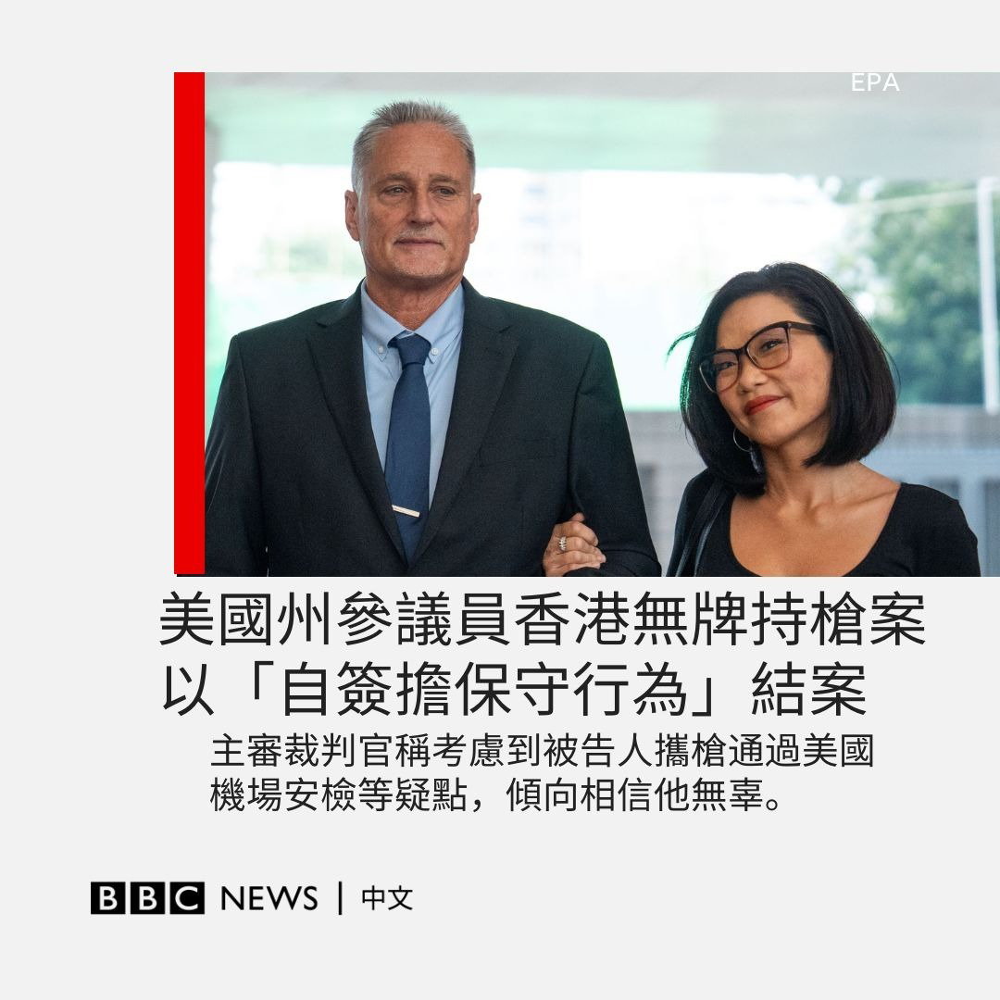
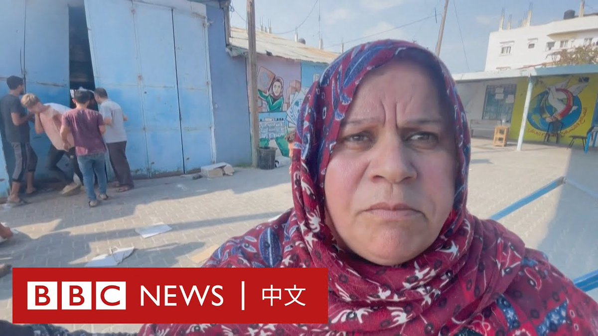
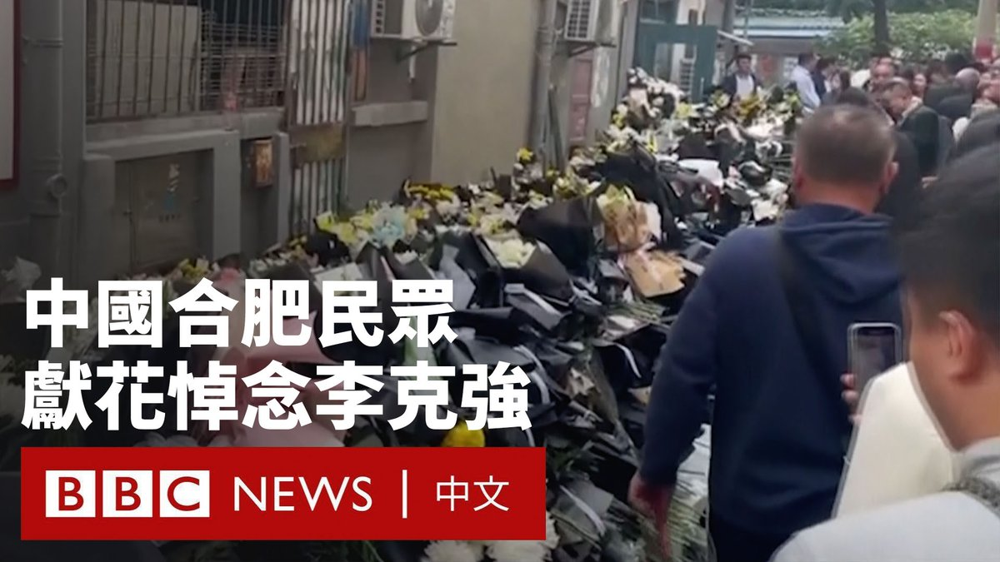
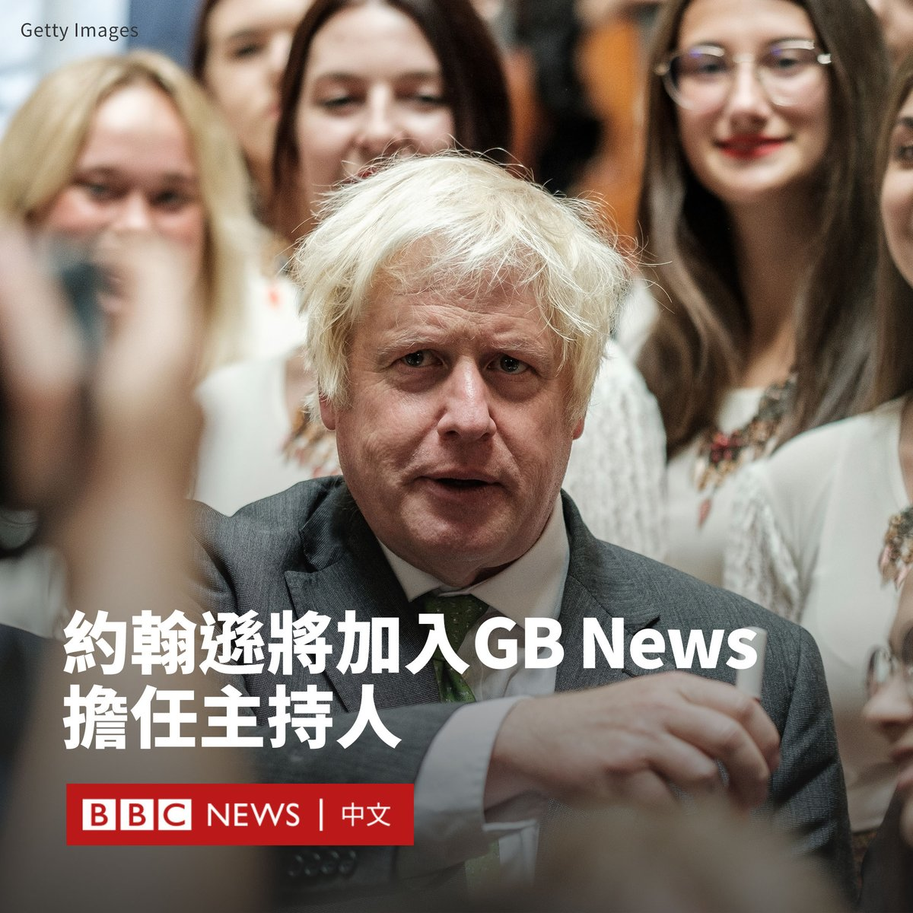
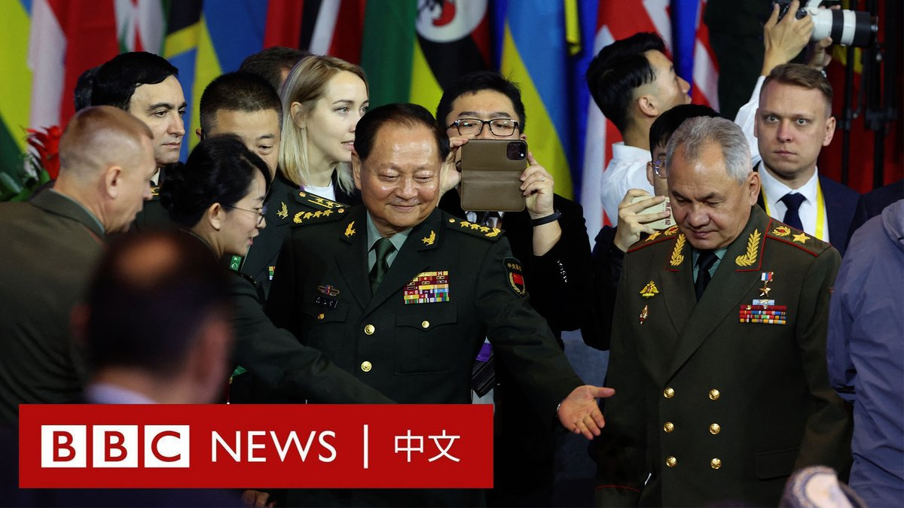
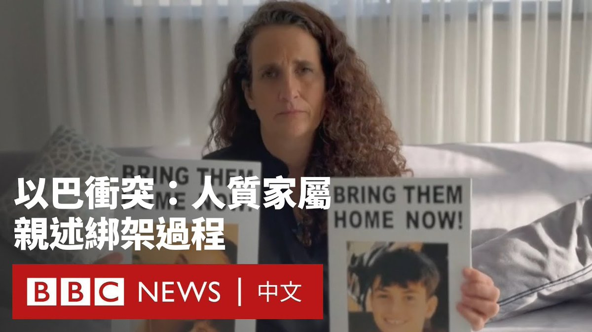

D英国广播公司BBC 北京时间 2023-10-30T18:29:12Z 1718938095700283398 美国州参议员杰夫·威尔逊（Jeff Wilson）携带枪支进入香港一案10月30日在西九龙裁判法院结案，威尔逊获准以2000港元（255美元；1871元人民币）“自签担保守行为”两年。

“自签担保守行为”是沿袭于英格兰普通法法制的一种处理轻微犯罪办法，要是被告人没有案底，而又愿意接受裁判官施加的“守行为”条件，控方就会“不提证供起诉”，被告人技术上没有被裁定有罪，可以释放，但须在指定期间内保持“行为良好”。

63岁的威尔逊是华盛顿州议会参议院共和党籍议员，10月21日在香港国际机场因管有一把左轮手枪而被中国香港海关拘捕，没收手枪，并落案控告一项《火器及弹药条例》下的“无牌管有枪械”罪。案件在沙田裁判法院提讯后转移至西九龙裁判法院。

庭上宣读的被告同意案情指出，威尔逊与妻子从美国波特兰登机出发，经停旧金山，于案发当天傍晚抵达香港后，主动前往海关“红色通道”，向海关人员申报其手提行李内有一支未上弹的手枪。海关利用X光扫描其行李后加以搜查，在里面发现一把以小袋装着的左轮手枪，继而拘捕威尔逊。

威尔逊接受海关人员侦讯，在警诫下承认手枪为他所有，并指出他在美国持有枪械执照。威尔逊称他到访香港的目的是“拓展贸易关系”，打算与妻子逗留两至三天，他在下机后发现意外地带上了手枪，因此前往海关寻求协助。威尔逊又形容，他在波特兰机场成功通过安检，是一件“可怕的意外”。

苏文隆裁判官提出，被告人能携枪通过美方安检，以及只携有手枪而没有子弹，是案件的两大疑点。考虑到被告人曾多次访问香港与中国大陆，理应知悉香港的相关限制，因此倾向于相信被告人无辜。裁判官批准被告人“自签担保守行为”。

对于裁判官的质疑，控方表示，对于被告人为何能携枪通过美国安检，控方“没有相关资料”。

据香港媒体报道，控方由特区律政司高级检控官庄文欣代表出庭；辩方由退休裁判官杜浩成大律师代表出庭，他曾是中国《香港国安法》下的指定承审法官之一。

在香港，“无牌管有枪械”罪若被提起公诉，一旦法庭裁定有罪，被告人最高可被判处有期徒刑14年，罚款10万港元。   D英国广播公司BBC 北京时间 2023-10-30T20:09:44Z 1718963393434923433 “我们的孩子由于饥饿而无法入睡，我们要给他们水和食物。”

随着以色列继续对加沙进行封锁和空袭，数千名缺乏生活物资的巴勒斯坦人闯入加沙的联合国援助中心。 https://t.co/Eq4bdqE6wE   D英国广播公司BBC 北京时间 2023-10-30T17:17:19Z 1718920003381297461 以色列誓言，该国军队打算在军事上和政治上将哈马斯从加沙地带连根拔起。但除了动用压倒性的军事力量外，以色列是否有着具体的战后计划？https://t.co/YorYJf2jka   D英国广播公司BBC 北京时间 2023-10-30T15:18:50Z 1718890187013410925 在中国前总理李克强上周五（10月27日）去世后，大批安徽合肥民众在周末前往其故居外敬献花束。社交媒体上的画面显示，从白天至深夜都有人来悼念。 https://t.co/UYeC0RwS4E   D英国广播公司BBC 北京时间 2023-10-30T12:56:18Z 1718854317833408966 英国前首相鲍里斯·约翰逊（Boris Johnson）已签约加入英国电视台“GB News”。

约翰逊将在这家新闻频道担任主持人、节目制作人和评论员。

该电视台表示，约翰逊将在明年英国和美国大选的报道中“发挥关键作用”，并将主持一个“展示英国在世界各地力量”的系列节目。

约翰逊在X（推特）上发布的一段影片中说：“我很高兴地告诉大家，我很快就要加入GB News了。”

“我将在这个出色的新电视频道上谈论我对俄罗斯、中国、乌克兰战争以及我们如何应对所有这些挑战的坦率看法。”

约翰逊还在为《每日邮报》撰写专栏。他预计将在明年开始在GB News的工作。

约翰逊于2022年辞去首相职务，在今年6月辞任议员。他在新冠疫情期间作为首相的行为和决策仍在被调查。

根据规定，卸任首相在卸任两年内希望从事任何工作，都必须征求独立的商务任命咨询委员会（ACOBA）的意见。

该机构在与约翰逊接洽后表示，他在GB News的工作“没有引起在政府规定下的任何特别关切”。

不过，该机构表示约翰逊应遵守一系列条件，包括不得利用其在任期间的任何特权材料，以及自其卸任首相之日起两年内不得亲自代表GB News参与游说政府的活动。   D英国广播公司BBC 北京时间 2023-10-30T11:43:39Z 1718836032878281061 【现场画面】第十届香山论坛在北京举行。中国军方二号人物、中央军委副主席张又侠与俄罗斯国防部长绍伊古（Sergei Shoigu）见面握手，他们随后共同步入会场。

香山论坛是中国最大的年度防务外交会议，本次论坛于10月29日至31日举行。在中国前国防部长李尚福上周突然遭到免职后，中央军委副主席张又侠在这场通常由防长出席的活动上发表主旨演讲。

华盛顿派出由美国国防部副部长办公室中国事务高级主任辛西娅·桑西·卡莱斯（Cynthia Xanthi Carras）率领的代表团。   D英国广播公司BBC 北京时间 2023-10-30T09:29:16Z 1718802215547396429 对于哈达斯‧卡尔德隆来说，过去的几周度日如年。她的两个孩子和丈夫在哈马斯对以色列的袭击中被绑架为人质，母亲则被杀害。她呼吁以色列和世界各国将解救人质作为首要任务。 https://t.co/4YUZxX0fvv   