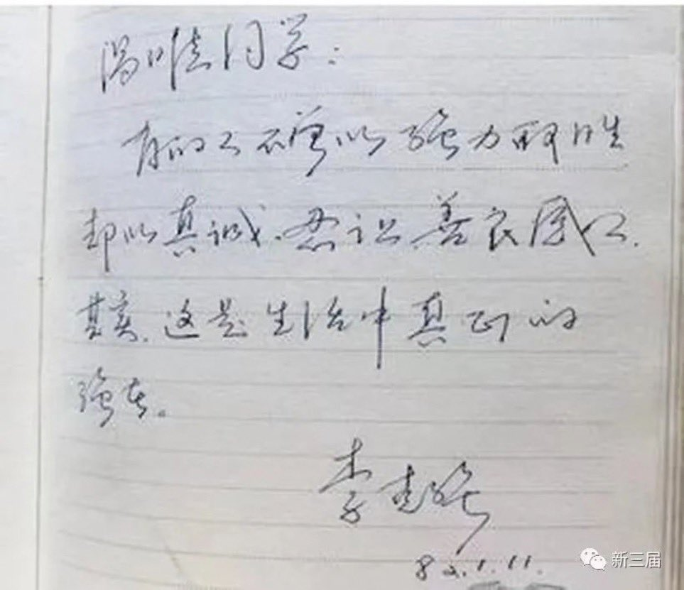
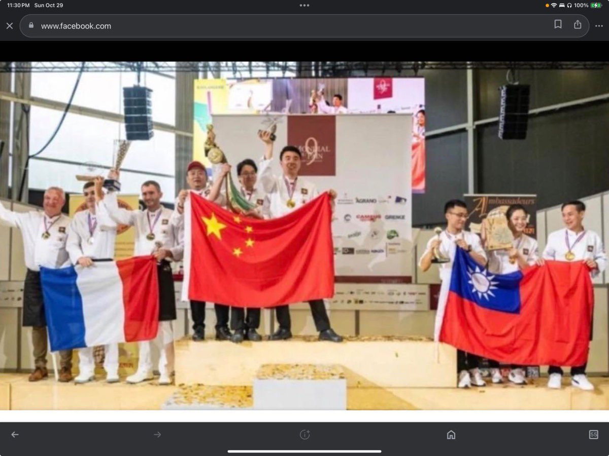
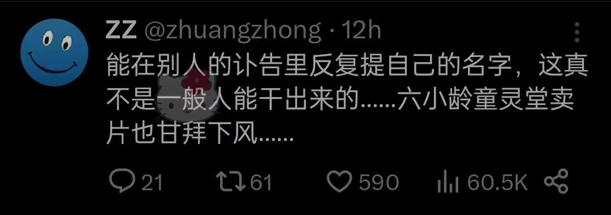
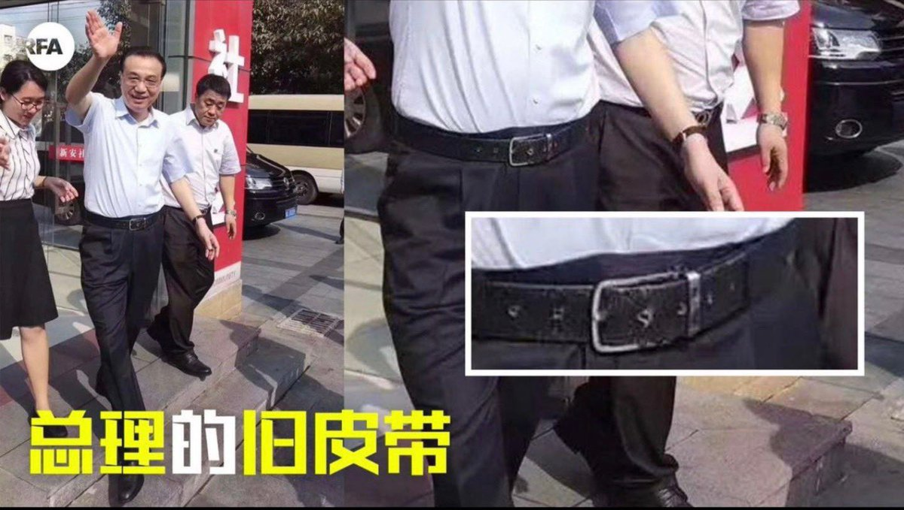
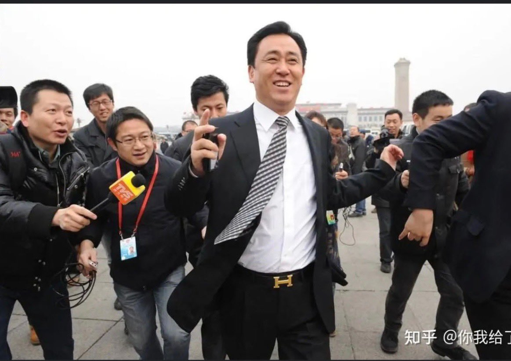

Petrichor 北京时间 2023-10-30T21:30:45Z 1718983782584209557 《纽约时报》采访李中堂，现在读来，依然后背发凉。

1896年9月2日上午9时许，李鸿章在纽约华尔道夫饭店接受了记者的采访，第二天《纽约时报》对这次采访情况的综合报道。

美国记者：
尊敬的阁下，您已经谈了我们很多事情，您能否告诉我们，什么是您认为我们做得不好的事呢？

李鸿章：
我不想批评美国，我对美国政府给予我的接待毫无怨言，这些都是我所期望的。

只是一件事让我吃惊或失望。那就是你们国家有形形色色的政党存在，而我只对其中一部分有所了解。其他政党会不会使国家出现混乱呢？你们的报纸能不能靠国家利益将各个政党联合起来呢？   Petrichor 北京时间 2023-10-30T21:38:50Z 1718985816960114765 1982年初北大毕业时，当时的学生流行给同学留言纪念，李克强给一位名叫汤唯的同学留言是这样写的：

“汤唯同学：

有的人不曾以强力取胜，却以真诚、忍让、善良感人。其实，这是生活中真正的强者。”

这不就是李克强做总理10年的真实写照吗？ https://t.co/qhwuB7Ucm3   Petrichor 北京时间 2023-10-30T14:37:14Z 1718879717640556814 转发：

这也是个小事情，但会写进历史 ———世界面包大赛在法国举行，中、台、法三国获奖。

台湾队打出青天白日旗。居然终共没有抗议、退场、、、事后也悄无声息。

一中一台，现实存在。 https://t.co/PSKbEqgkLQ   Petrichor 北京时间 2023-10-30T00:24:58Z 1718665238579441834 我看仆告里包子的名字出现四次，真是不要脸到了极致！

生前，用各种小组长把李架空，而把最危险责任最大的抗疫领导小组长给了李。让其窝窝囊囊憋屈了十年毫无作为。

人死了还要钻进别人的仆告里 😬😬😢😢

您是怎么看的？ https://t.co/YWJdLfElRD   Petrichor 北京时间 2023-10-30T00:28:55Z 1718666232658866297 总理的李克强旧皮带 
vs
许家印的爱马仕皮带 https://t.co/HMWkYGHRTe   