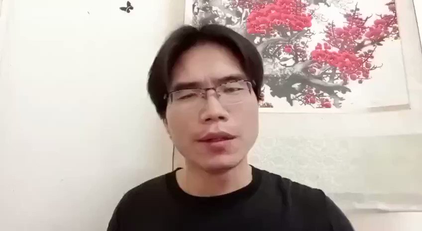
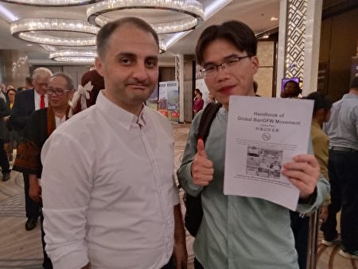

拆墙运动公号 北京时间 2023-10-30T15:13:16Z 1718888785461551135 感谢全球各家人权机构以及各位公义网友的紧急关注和声援🙏
被从老挝跨国抓捕回国的人权律师 #卢思位 暂时安全了！（已经取保候审）！
请大家持续关注被从老挝跨国抓捕回国的 #拆墙运动 发起人 #杨泽伟！
下面是 #拆墙运动 发起人 #杨泽伟 在4月21日发出的求救视频!
@VOAChinese
@SafeguardDefend
@RFI_Cn
@hrw_chinese
@ISHR_chinese
@RightsLawyersCN
@RFA_Chinese
@nytchinese
@ChineseWSJ
@bbcchinese
@rijingzhongwen
@dw_chinese
@CHRDnet
@hrichina 
@RFI_TradCn   拆墙运动公号 北京时间 2023-10-30T01:24:41Z 1718680264950317475 @wanjunxie 国家总理 #李克强 的家属都发声维权了，中国还有谁不被迫害呢？   