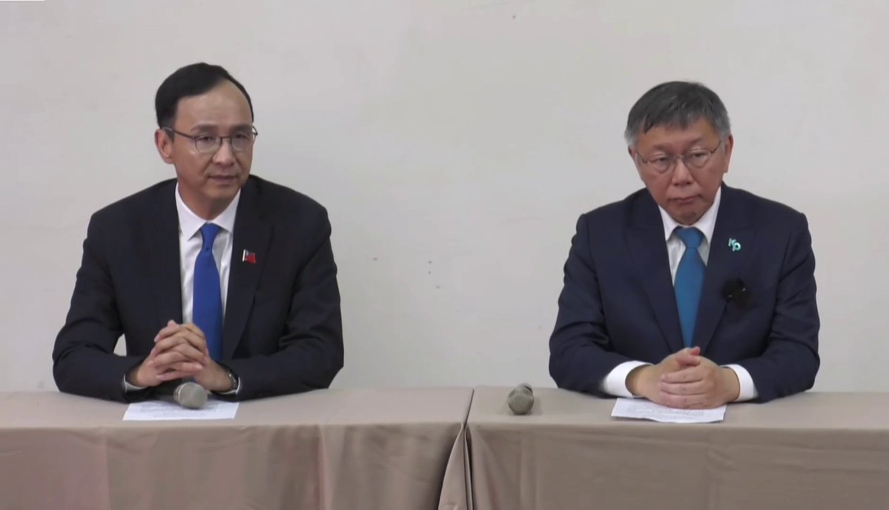

自由亚洲电台 北京时间 2023-10-30T10:38:25Z 1718819618259943687 #事实查核｜美国 #加州 州长 #纽森 宣布将举行 #独立公投？ https://t.co/WFlmNDJbxe   自由亚洲电台 北京时间 2023-10-30T13:25:38Z 1718861698097180777 【台湾蓝白政党协商 发表四点共识】
国民党主席 #朱立伦 与民众党主席 #柯文哲 30号上午进行政党协商，在“共同进行台湾第三波民主改革、立委选举相互支持，总统赴立法院进行国情报告等方面取得共识。但总统副总统搭配人选，依然没有结论。
https://t.co/jqWutk9gUb https://t.co/fWCVNxZeLS   自由亚洲电台 北京时间 2023-10-30T07:20:25Z 1718769787361255727 RT @RFA_Chinese: 【李克强遗体抵京，告别礼规格或与李鹏相同】
官方发布讣告称 #李克强 为中共的 “#优秀党员，久经考验的忠诚的共产主义战士”, 与前总理 #李鹏 相似，预料一周内在八宝山公墓举行的丧礼规格也将参照李鹏。
https://t.co/xJMkpQk…   自由亚洲电台 北京时间 2023-10-30T08:09:23Z 1718782109672677856 印度: 中国派斯里兰卡的科考船有间谍嫌疑。
斯里兰卡：仍然允许其为期两天的活动。
（中国是斯里兰卡52%的债务的债主；斯里兰卡因无法偿还中方$14亿贷款，向中国出租汉班托塔港口99年。）
https://t.co/GEukSg9xx1   自由亚洲电台 北京时间 2023-10-30T04:34:06Z 1718727934993662063 【兜兜转转  正轨在哪里?】
拜登: 美中需保持沟通,  一道努力。
王毅警告: “通往旧金山不会是 #一马平川，不能靠 #自动驾驶。两国元首要切实 #重回巴厘岛，把共识真正落到实处......”
https://t.co/U1lumG8uhM   自由亚洲电台 北京时间 2023-10-30T05:18:51Z 1718739194736984554 【蒋介石: 台湾空气清淡  环境清静】
《蒋中正日记》新书发表会周二举行，将披露 #蒋介石 当年在大陆的最后一天，从成都飞抵 #台湾，感受到 
“空气清淡、环境清静，与 #成都 晦塞阴沉相较则判若天渊矣”。
https://t.co/9r2dzj7fOr   自由亚洲电台 北京时间 2023-10-30T05:33:26Z 1718742863486308717 【大家数一数自己的评论数量吧】
2019年恶俗维基网站成员 #牛腾宇 被 #茂名 警方刑拘。指控包括：
发表评论8条，上传图片20张，用户贡献748条，有285条贡献值，并恶毒攻击诋毁政府和国家领导人及其家属形象。
https://t.co/E5Nf6ImOiw   