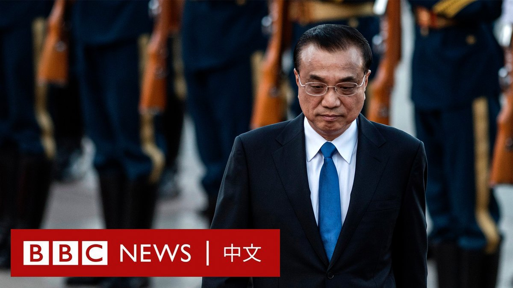

D英国广播公司BBC 北京时间 2023-10-29T17:08:45Z 1718555458150216114 以色列宣称进入“第二阶段”战争  哈马斯首提加沙人质交换
https://t.co/tPLpxYi2Qf   D英国广播公司BBC 北京时间 2023-10-29T15:01:04Z 1718523328431079481 【一周热点回顾】在经过几位候选人落选和长达三周的混乱之后，美国路易斯安那州共和党人迈克·约翰逊（Mike Johnson）成功地让共和党达成一致，支持他成为新一任美国众议院议长。https://t.co/Add5B4wmHk   D英国广播公司BBC 北京时间 2023-10-29T15:44:35Z 1718534277753983152 【一周热点回顾】中国前总理李克强在周五（10月27日）凌晨突发心脏病去世，享年68岁。

这位以温和改革派形象示人的前中共二号人物曾试图采取务实的经济政策，推动中国经济转型并改善民营企业的经营环境。

但在李克强十年总理任期的后半段，被边缘化的他成为习近平权威阴影下的“弱势总理”。 https://t.co/KOgP5P0a99   D英国广播公司BBC 北京时间 2023-10-29T11:01:04Z 1718462929497174274 【一周热点回顾】乔治城大学亚洲法中心的数据分析指出，示威爆发起计首两年内，“反送中”示威相关案件的刑罚比“雨伞运动”严苛。 https://t.co/8xF80g38Fp   D英国广播公司BBC 北京时间 2023-10-29T09:01:04Z 1718432731032678532 【一周热点回顾】美国国防部发布年度中国军力报告称，中国在过去一年大幅扩充了核武库，目前拥有约500枚可用于作战的核弹头。报告还称，北京希望到2030年将其增至1000枚。https://t.co/khjPUteGAl   