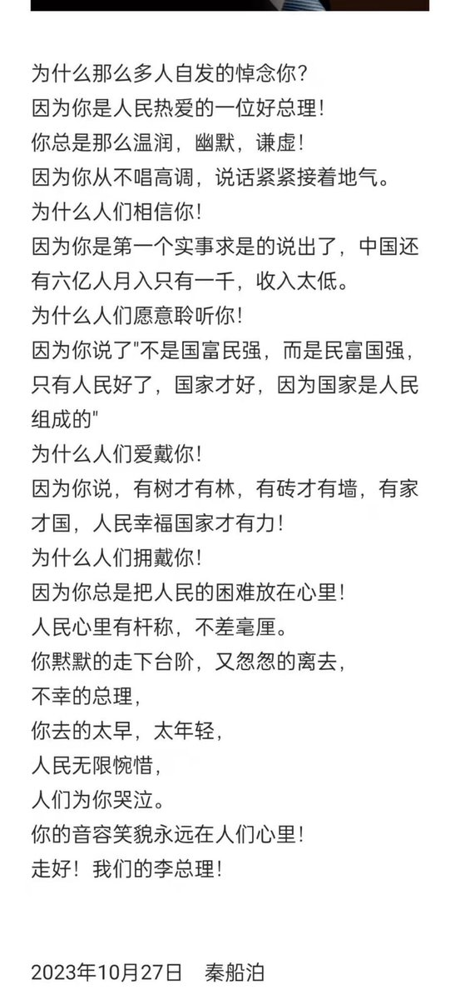
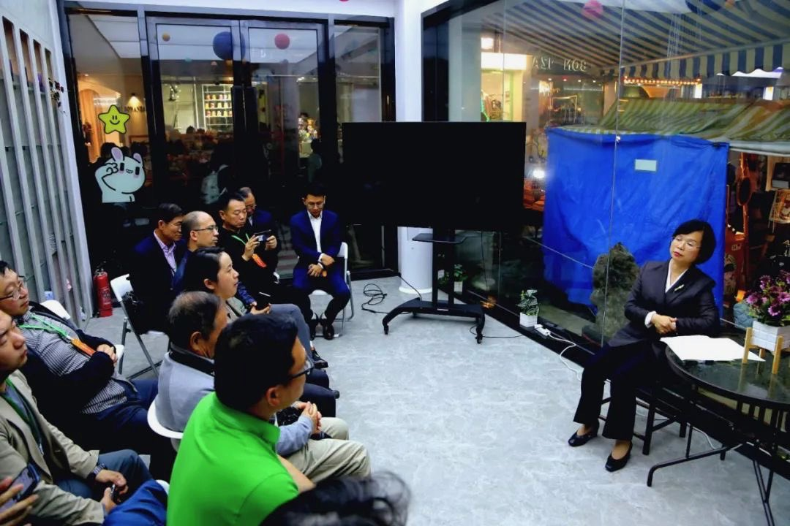

Petrichor 北京时间 2023-10-29T21:40:25Z 1718623826139861309 ❤️ 李克强这段话刷爆了

做人，不一定要风风光光，但一定要堂堂正正。

处事，不一定要尽善尽美，但一定要问心无愧。

以真诚的心，对待身边的每一个人。以感恩的心，感谢拥有的一切。 

未来，不是穷人的天下，也不是富人的天下，而是一群志同道合，敢为人先，正直，正念，正能量人的天下。

真正的危机，不是金融危机，而是道德与信仰的危机。与智者为伍，与善良者同行！   Petrichor 北京时间 2023-10-29T11:33:47Z 1718471161334423625 10月26日至31日，一批所谓的海外华文传媒记者（其中有人从来没有出过国，却自称海外媒体）到中国贫困的贵州山区骗吃骗喝。他们参加所谓的由中国新闻社组织的“行走中国·2023海外华文媒体高层多彩贵州行”活动，计划用六天时间走访贵阳市、黔东南州、黔南州、黔西南州。这些人就是借中共大外宣之名，行骗吃骗喝之事。   Petrichor 北京时间 2023-10-29T11:36:50Z 1718471929143697423 大有1989年春夏之交人民自发悼念胡耀邦的势头，有人要害怕了？   Petrichor 北京时间 2023-10-29T09:37:14Z 1718441831065600407 2005年，钱学森向温家宝总理提出一个问题，后来被称为“钱学森之问”：为什么我们的学校总是培养不出杰出人才？虽然他当时只是针对科学研究而言，但这个问题可以推广到很多领域。

比“钱学森之问”更为一般、更具准确性的问题是：相对于我们的人口规模，相对于我们的经济总量，相对于我们的教育投入，从我们的教育体制中走出来的具有创造力的人才，不是没有，为什么这么少？

中国是世界上人口最多的国家，占全球人口的1/5，是美国人口的4.5倍，日本人口的11倍。中国的经济总量(GDP)占全球总量的1/7，是美国GDP的60%，日本GDP的2.5倍。中国也是世界上在校学生最多的国家。2016年，中国高等教育在学规模有3600多万，高校在校生2700多万，高校每年录取本科专科学生700多万，均为全球第一。

创造性思维由知识、好奇心和想象力、价值取向三个因素决定。

爱因斯坦说过，“我没有特殊的天赋，我只是极度地好奇。”(I have no special talents, I am only passionately curious.

批判性思维和创造性思维是人的思维发展的高级阶段，它是人类文明高级阶段的基石。中国要为人类文明作出贡献，批判性思维与创造性思维教育不可或缺。   