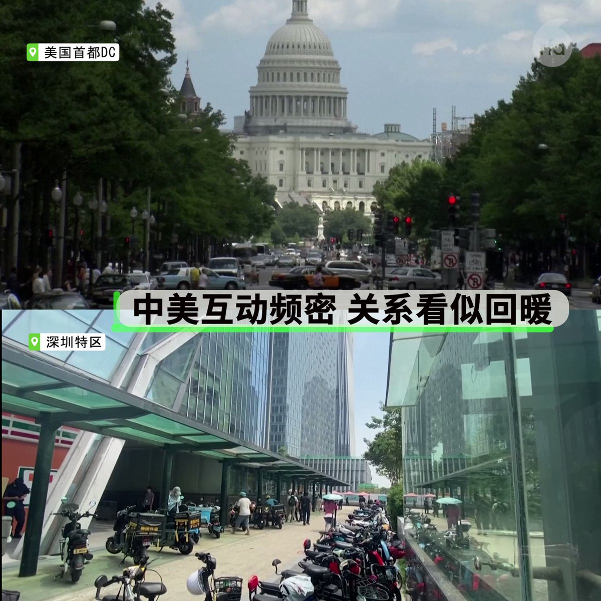
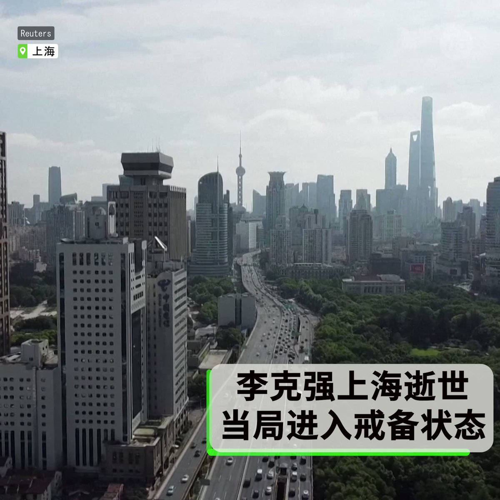

自由亚洲电台 北京时间 2023-10-29T23:33:30Z 1718652285343945012 【中美互动频密 关系"止跌企稳"?】
【话音未落, 南海冲突视频曝光】
大洋西边，加州州长 #纽森 在 #深圳 试驾比亚迪电动车，与 #习近平 谈气候议题；大洋东边，中国外长 #王毅 访美，表示中美要“恢复对话”，美方更称会晤“里程碑”。访问尚未结束，两国军方互放视频，谴责对方危险飞行，险些擦枪走火。 https://t.co/W4b54mb8Ha   自由亚洲电台 北京时间 2023-10-29T19:06:50Z 1718585175842357759 RT @RFA_Chinese: 【聚集悼念被禁止 | 民众连日上街献花】
前总理 #李克强 遗体送抵北京之际，多家高校传出禁止聚集悼念，不准在网上发表个人评论，甚至要求学生将禁令传达给家人。虽然当局严禁公开活动，大批民众依然多日聚集在李克强 #合肥 故居，以花束纸条表达诉求。…   自由亚洲电台 北京时间 2023-10-29T19:07:28Z 1718585335758623016 RT @RFA_Chinese: 【美国总统对李克强逝世表示哀悼】
此外，拜登总统向来访的中国外长王毅强调，中美需负责任地管理两国竞争，保持沟通，共应全球挑战。
（图为2013年, 时任副总统的拜登与李克强在中南海谈笑风生; AP摄）
详阅：https://t.co/wnzWI…   自由亚洲电台 北京时间 2023-10-29T10:37:47Z 1718457070939259356 RT @RFA_Chinese: 中国的手介入台湾选举 #富士康 的命运会如何？（戴忠仁/汪浩/程晓农）
【中共最明目张胆介入 #台湾选举 的一次】
【#汪浩：抖音影响台湾政局 前所未见】
【#程晓农：中共要把中华民国选举变成中华人民共和国的一省选举】
#亚洲很想聊 https…   自由亚洲电台 北京时间 2023-10-29T10:37:55Z 1718457104032264575 RT @RFA_Chinese: 【聚集悼念被禁止 | 民众连日上街献花】
前总理 #李克强 遗体送抵北京之际，多家高校传出禁止聚集悼念，不准在网上发表个人评论，甚至要求学生将禁令传达给家人。虽然当局严禁公开活动，大批民众依然多日聚集在李克强 #合肥 故居，以花束纸条表达诉求。…   自由亚洲电台 北京时间 2023-10-29T07:04:25Z 1718403372842152155 【日英签署备忘录 | 展示G7团结一致?】 
本月28日开幕的 #G7大阪・堺貿易大臣会合  就“经济胁迫”等问题展开探讨。日本和英国将强化在纯电动汽车（#EV）蓄电池等重要矿物供应链上的合作。
https://t.co/ToKclllWEC   自由亚洲电台 北京时间 2023-10-29T08:23:14Z 1718423207378563454 【聚集悼念被禁止 | 民众连日上街献花】
前总理 #李克强 遗体送抵北京之际，多家高校传出禁止聚集悼念，不准在网上发表个人评论，甚至要求学生将禁令传达给家人。虽然当局严禁公开活动，大批民众依然多日聚集在李克强 #合肥 故居，以花束纸条表达诉求。

https://t.co/6ZAhDIgsV0 https://t.co/B78tHyS7aF   自由亚洲电台 北京时间 2023-10-29T00:24:40Z 1718302774486618155 【韩国寄信函 | 中国不回复】中国本月9日晚强行遣返约600名北韩 #脱北者 后，韩国外交部长 #朴振 说他通过信函向王毅明确转达了其反对立场，但尚未收到回复。他表示近期有可能会见 #王毅，会对此再进行核实。
https://t.co/vWbEjAP2lx   自由亚洲电台 北京时间 2023-10-29T00:18:56Z 1718301329850818781 【韩国寄信函 | 中国不回复】中国本月9日晚强行遣返约600名北韩 #脱北者 后，韩国外交部长 #朴振 说他通过信函向王毅转达了这一信息，但尚未收到回复。他表示近期有可能会见 #王毅，会对此再进行核实。
https://t.co/vWbEjAP2lx   