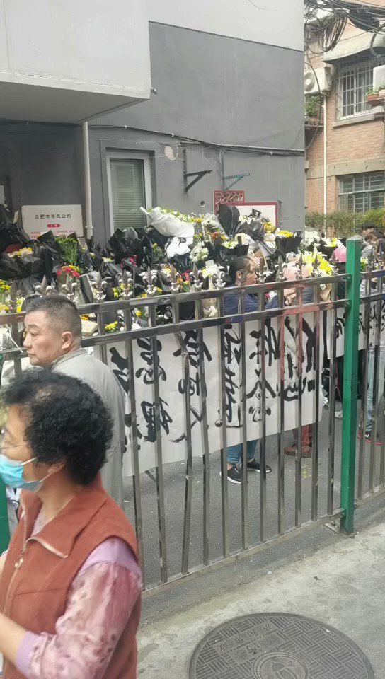
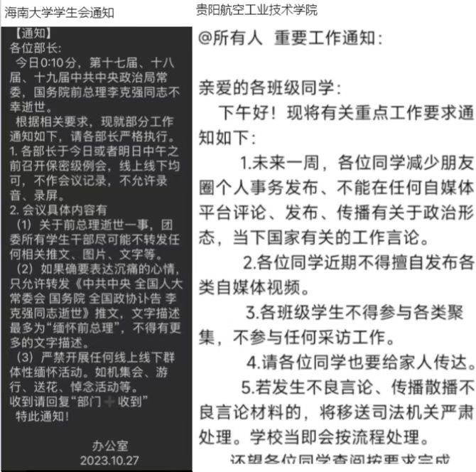

Petrichor 北京时间 2023-10-28T23:05:15Z 1718282789546590709 无事找事：干部多，为了证明他们存在的必要性，只能不断扰民。

基层普遍陷入了“无事找事”的怪圈里。上级就怕基层没事干，就不断布置各种“狗屁工作”，隔断时间一个工作清单，换个时间又是工作提示，还随时有紧急通知。打雷下雨得通知去看看老百姓家里的房屋安全不安全，冬天取暖有消防安全隐患，要搞“敲门行动”。

这些工作，唯一的意义就是证明基层还在干事，至于事情有没有必要干，则是不重要的。

“群众无小事”俨然成了狗屁工作的根源，把群众当作“巨婴”，把基层干部当作“保姆”，群众出点事，上级就要找基层干部的麻烦。

基层花了大量时间在应付各种清单和报表，有些地方动不动就搞个问题清单，但凡是巡视、督查、审计、环保、网络舆情、安全生产、信访、社会平安稳定出现的问题，都要清单化处理。没有问题，也要填各种报表，党建、经济、平安、改革、创新、生态、平安等工作，都有常规化的报表。

基层干部很忙，忙得晕头转向，但都是在“后台”运转，群众不知道，没有任何获得感，很多时候还觉得很扰民。   Petrichor 北京时间 2023-10-28T21:55:09Z 1718265148387766777 有句话怎么说的，群众的眼睛是雪亮的。表面看是悼念李克强，其实就是民众对现实不满情绪的发泄！老百姓并不傻，如果有集会游行示威言论自由的环境，火山早就爆发了！于无声处听惊雷！ https://t.co/JSZ7t91LCm   Petrichor 北京时间 2023-10-28T10:33:16Z 1718093546350162006 好象别的领导都说因病医治无效去世，不说具体什么病，这次直接说心脏病，比较罕见，有此地无银三百两之嫌？ https://t.co/7FxTLLprQ3   Petrichor 北京时间 2023-10-28T12:10:39Z 1718118051965546736 这张照片，我喜欢。李克强总理和四川挑夫。这些挑夫拍的很自然，作装本色，表情放松。不像当地政府安排过来配合演戏的警察或官员。 https://t.co/QD0vgikMU3   Petrichor 北京时间 2023-10-28T12:13:47Z 1718118842088538141 当你不知道如何治理时，就跟着英国学。 https://t.co/swxnY1dYk4   Petrichor 北京时间 2023-10-28T07:48:07Z 1718051985411166703 转发

今晚在朋友家聚会，席间有一个在美国心血管协会工作的心导管专家，于是我们向她咨询李心血管死亡的情况发生率有多大。她说李的这种情况发生率大约0.001%。 原因如下：
1. 李周围一直有医生陪着，可以随时及时抢救
2. 李一直游泳🏊证明他心脏功能不错
3. 李时常做体检，如果发现心脏有问题或者隐患，医生会给他吃药预防血栓
4. 唯一无法抢救的情况是心脏突然产生大块血栓，而且堵住了所有的大血管，但是这种情况的发生都会平时体检会有各种蛛丝马迹，发现后医生也会给药吃预防这种突发情况的发生
5. 有没有意外无法防备的情况呢？有，是0.001%机会，于是发生在李身上了
这个分析就是给群里的朋友们分享的，还是不要转发到其他人或者其他群。谢谢   Petrichor 北京时间 2023-10-28T08:07:46Z 1718056928272674933 有北大学生写了一副挽联：

赔十年小心，虽洁身自好，但活得憋屈；
距一步之遥，却急流勇退，竟死得窝囊。

横批：无能为力 https://t.co/Io2obUoATp   Petrichor 北京时间 2023-10-28T02:27:34Z 1717971315036983578 好人死了，民众痛惜，献鲜花送行。
坏人死了，民众高兴，放鞭炮齐鸣。

合肥红星路，李克强故居，民众悼念的鲜花已经蔓延成一道花路。 https://t.co/fEFk0hIotZ   