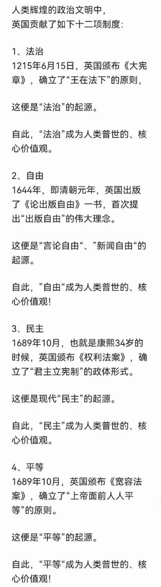
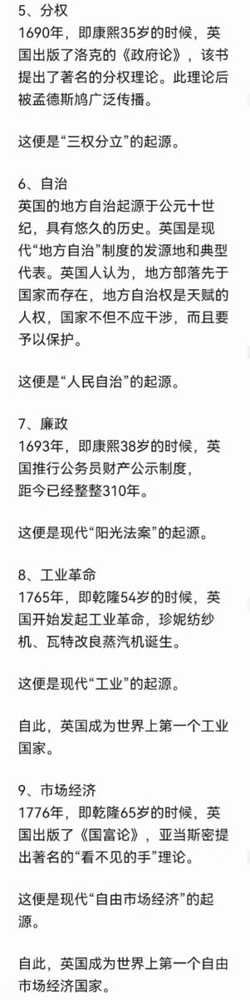
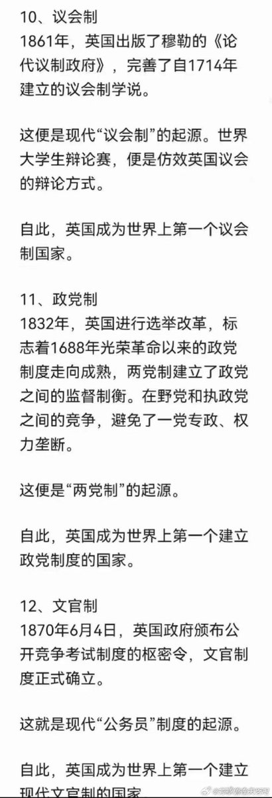
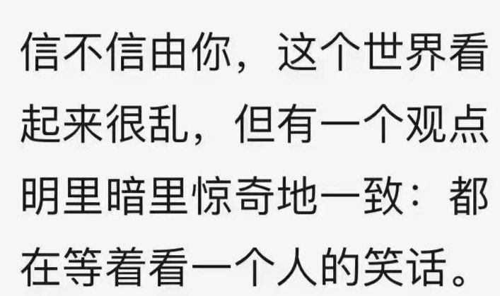

Petrichor 北京时间 2023-10-28T12:13:47Z 1718118842088538141 当你不知道如何治理时，就跟着英国学。 https://t.co/swxnY1dYk4   Petrichor 北京时间 2023-10-28T07:48:07Z 1718051985411166703 转发

今晚在朋友家聚会，席间有一个在美国心血管协会工作的心导管专家，于是我们向她咨询李心血管死亡的情况发生率有多大。她说李的这种情况发生率大约0.001%。 原因如下：
1. 李周围一直有医生陪着，可以随时及时抢救
2. 李一直游泳🏊证明他心脏功能不错
3. 李时常做体检，如果发现心脏有问题或者隐患，医生会给他吃药预防血栓
4. 唯一无法抢救的情况是心脏突然产生大块血栓，而且堵住了所有的大血管，但是这种情况的发生都会平时体检会有各种蛛丝马迹，发现后医生也会给药吃预防这种突发情况的发生
5. 有没有意外无法防备的情况呢？有，是0.001%机会，于是发生在李身上了
这个分析就是给群里的朋友们分享的，还是不要转发到其他人或者其他群。谢谢   Petrichor 北京时间 2023-10-28T08:07:46Z 1718056928272674933 有北大学生写了一副挽联：

赔十年小心，虽洁身自好，但活得憋屈；
距一步之遥，却急流勇退，竟死得窝囊。

横批：无能为力 https://t.co/Io2obUoATp   Petrichor 北京时间 2023-10-28T02:27:34Z 1717971315036983578 好人死了，民众痛惜，献鲜花送行。
坏人死了，民众高兴，放鞭炮齐鸣。

合肥红星路，李克强故居，民众悼念的鲜花已经蔓延成一道花路。 https://t.co/fEFk0hIotZ   