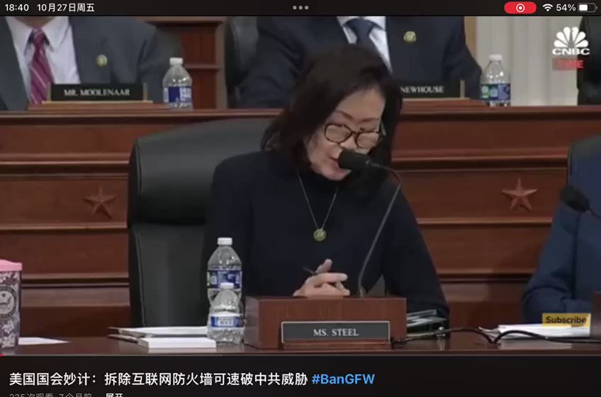

拆墙运动公号 北京时间 2023-10-28T00:56:51Z 1717948485540970511 童逸在今年的2月28日给美国国会开出的改善中国社会2大妙计1、包括了拆除互联网防火墙。
2、资助记者律师。
中共最怕中国人民，如果14亿人能自由上网，那就易知社会真相，能打破中共几十年来编造的谎言世界，促成各大反对派走向联合。

中共 #互联网防火墙（#GFW）犯下危害80亿人的反人类大罪，2000年以来，它每年花费60亿美元，封锁了Google Facebook YouTube等全球31万个网站，切断14亿人与别国人的联系，造成天天仇美反日攻台、、、、、、
请求国际刑事法院 和各国议会公审并制裁！   