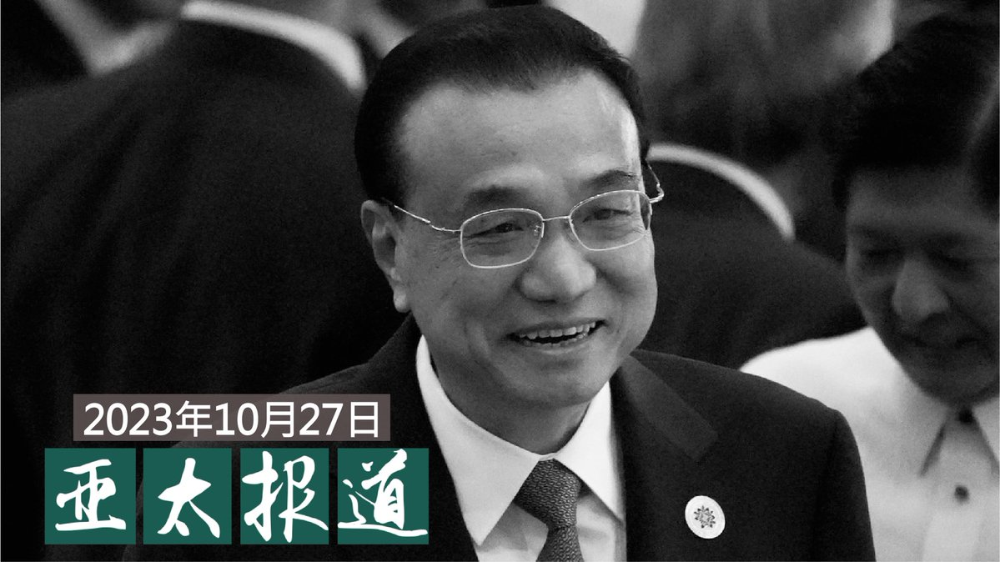
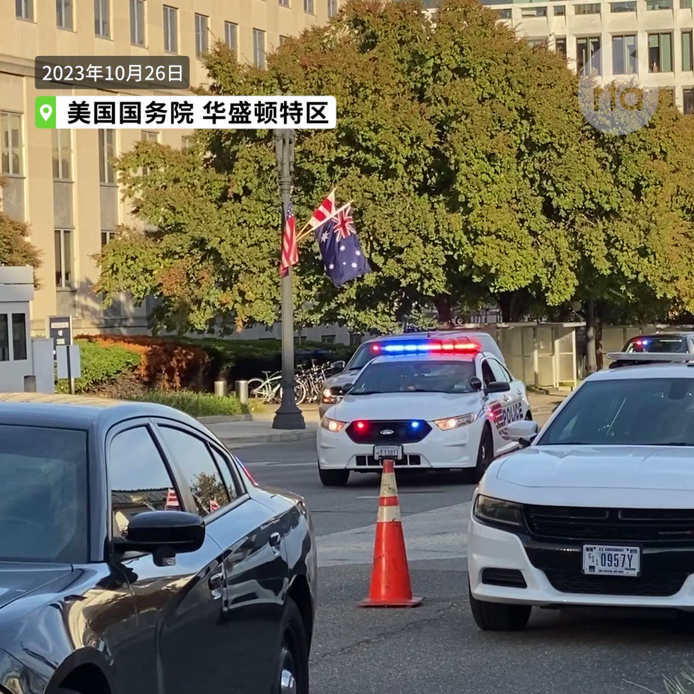

自由亚洲电台 北京时间 2023-10-28T09:28:42Z 1718077294948778459 RT @RFA_Chinese: 68岁的中国国务院原总理 #李克强 27日0时许突然去世，官媒新华社在其逝世十八小时后，才发布了官方讣告。这份长达两千多字的讣告给予李克强怎样的评价？其文字背后又显示出怎样的内部博弈？ https://t.co/fPwLX1imIO   自由亚洲电台 北京时间 2023-10-28T07:44:02Z 1718050956238287136 专栏 | #西藏纵览：四川当局禁止藏区学校使用藏语; 边巴次仁敦促国际社会拒绝西藏更名 https://t.co/HZdXiRz3j4   自由亚洲电台 北京时间 2023-10-28T07:44:29Z 1718051070273060976 专栏 | #解读新疆：联合国专家关切新疆寄宿学校问题；维吾尔妇女发推求助被拘留的弟弟 https://t.co/DM7ZZdvIjk   自由亚洲电台 北京时间 2023-10-28T04:49:50Z 1718007117096030350 68岁的中国国务院原总理 #李克强 27日0时许突然去世，官媒新华社在其逝世十八小时后，才发布了官方讣告。这份长达两千多字的讣告给予李克强怎样的评价？其文字背后又显示出怎样的内部博弈？ https://t.co/fPwLX1imIO   自由亚洲电台 北京时间 2023-10-28T05:52:26Z 1718022872071905402 【亚太报道(2023-10-27）】
欢迎收听和订阅播客 https://t.co/tFDisUtbgy
中国前总理 #李克强 心脏病发作不治病逝；#李克强讣告 凸显习李差异；李克强：学历最高，但改开以来最弱势总理；多国政要哀悼李克强 网民揣测满天飞；中国推动 #保障性住房供给 https://t.co/CYcHeYcrl2   自由亚洲电台 北京时间 2023-10-28T06:16:43Z 1718028981180444729 【王毅会晤布林肯 美国会议员发表声明 访民与亲共者场外对峙】正在美国首都华盛顿访问的中共中央政治局委员、外交部长王毅10月26日(周四）傍晚在美国国务院与国务卿布林肯举行会谈。美国会重量级议员就王毅来访发表联合声明，多名抗议王毅的中国访民与亲共人士在美国国务院大门外，发生对峙。 https://t.co/MpMhDYTh6b   自由亚洲电台 北京时间 2023-10-28T02:47:27Z 1717976318162473127 #评论 | #何清涟：拜习会意在谋求世界稳定 https://t.co/utYYIR7Byp   自由亚洲电台 北京时间 2023-10-28T02:48:16Z 1717976525705023504 专栏 | #财经时时听： 中国增发一万亿特别国债 跌跌不休的股市要反弹了？ https://t.co/msq1iZnBZw   自由亚洲电台 北京时间 2023-10-28T03:20:12Z 1717984558954811659 近日，有消息指出，中国政府将推动全新住房改革，不仅将增加对工薪阶层的保障房供给，也将修正商品住房价格居高不下的问题。外界关注，中国当局为何在此时提出住房整改方案？此外，新推出的方案能根本性解决中国房市所遇到的问题吗？ https://t.co/kFCDdj4m2H   自由亚洲电台 北京时间 2023-10-28T03:20:49Z 1717984715666591971 #李家超 不被美国邀请参加 #APEC会议 https://t.co/2w7v9nhzOF   自由亚洲电台 北京时间 2023-10-28T03:22:03Z 1717985024853836166 英国邀中国出席 #AI峰会 引风波 两任首相隔空交锋 https://t.co/JlI1S66YdU   自由亚洲电台 北京时间 2023-10-28T04:06:34Z 1717996228150231088 中国总理李强日前签署了国务院令，公布了《#未成年人网络保护条例》。这一7章60条的条例将从明年元旦开始正式实施。 https://t.co/ALQTm7rN8U   自由亚洲电台 北京时间 2023-10-28T00:30:02Z 1717941736767435140 RT @RFA_Chinese: 【评论 | #严歌苓: 打狗喽！】
"对狗的围剿，都是运动引发的人类互斗互害的延伸，是互害激发的黑暗激情，把人性最残忍的一面释放了出来。这种极致残忍，就是对自身不幸怨恨迁怒于其他更弱势力的生命，例如迁怒于一万年前就与人类相依为命的狗。"
 ht…   自由亚洲电台 北京时间 2023-10-28T01:14:36Z 1717952950377877615 国际冲突不断，加拿大军方发布一份文件，提醒中国和俄罗斯是加拿大最大的敌人，须强化军备因应作战。此外，#加拿大 国会继续针对 #中国干预 举行听证，安全情报局警告，即使是已经卸任的议员也仍可能成为中国针对的目标。

 https://t.co/BTu6ojnOyw   自由亚洲电台 北京时间 2023-10-28T01:40:59Z 1717959591898878144 中国国务院前总理李克强心脏病突发猝逝上海 民众自发前往其安徽故居悼念 https://t.co/F5tvLjeJCd   自由亚洲电台 北京时间 2023-10-28T02:05:04Z 1717965651267260873 #读者广场 | 为什么我们怀念 #李克强？ https://t.co/nZjRX2d6J3   自由亚洲电台 北京时间 2023-10-28T02:07:31Z 1717966270203924544 专栏 | #劳工通讯：美企重组两间位于中国的工厂　遣散费纠纷暴露工会问题 (五) https://t.co/OC2Mx6EfJg   自由亚洲电台 北京时间 2023-10-28T00:00:01Z 1717934182297661478 香港政府财政状况再亮起红灯。当局承认，疫情后，#香港经济 复苏的速度低于预期，预料财政赤字可能超过一千亿港元。有财经界人士担心，若香港财政储备进一步恶化，将动摇运作了四十年的 #联系汇率制度。

 https://t.co/9DWCt0uLj5   