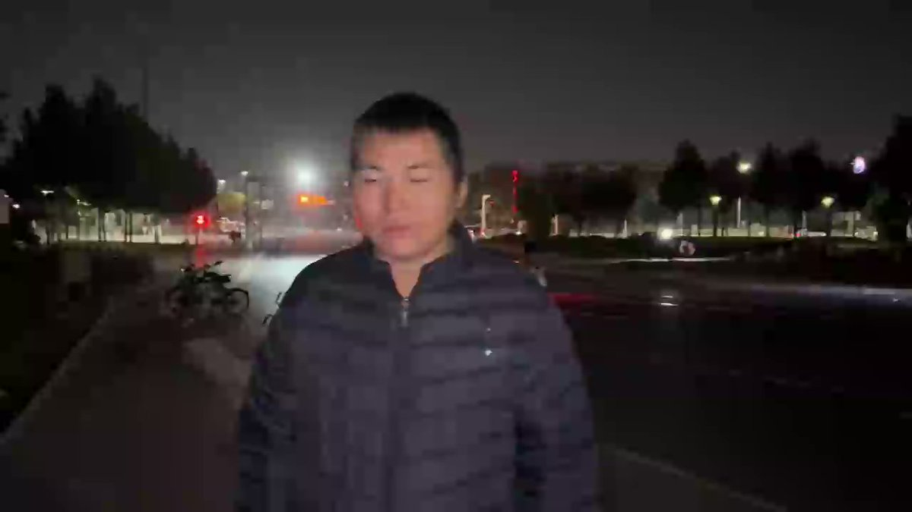
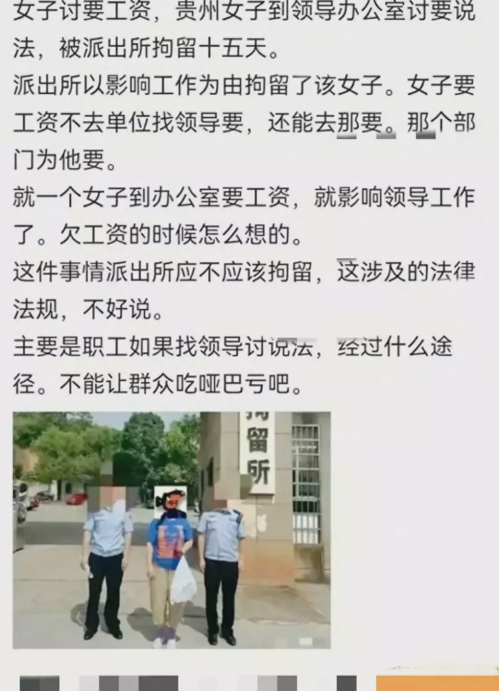
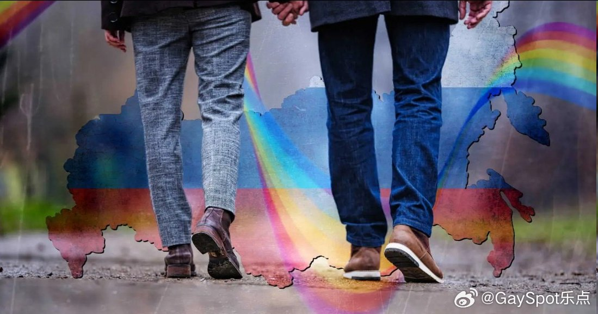
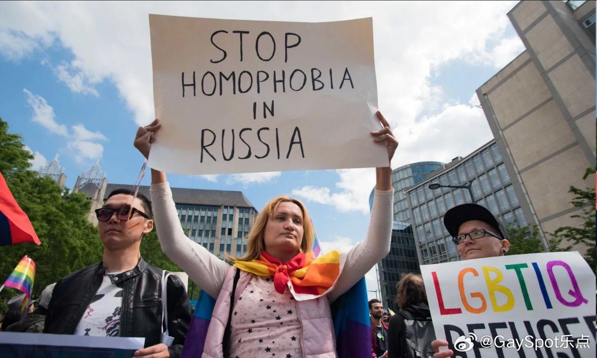

谁将十万横扫三江 北京时间 2023-10-28T23:07:03Z 1718283243018195344 RT @Symbiosities: 关键不在于财产权是否为自然权利，而是现代公民执着这一争辩本身是奇怪的。且不论财产权的自然权利化（早期自然法标志着释经学里对立于民法的公共性领域【财产的最终归属是一个公共所有的上帝的领域】，随后注释法学派重构罗马法里的物权范畴，将其解释为财产权…   谁将十万横扫三江 北京时间 2023-10-28T23:26:48Z 1718288212429509018 河南周口，父亲为帮女儿省钱， 不愿住院治疗，女儿拽住父亲，下跪磕头求父亲住院：
“没有钱还可以掙，但失去爸爸就再不能拥有了。“ https://t.co/Q44m71W1NC   谁将十万横扫三江 北京时间 2023-10-28T23:35:36Z 1718290424572641493 RT @haoduoyu8848: 底层人的生活有多难？ 10月27日北京，一名博主采访了一位在北京打零时工的云南小哥。小哥在20天前突然双目双明导致无法工作，同时手机也丢了。 https://t.co/lhR8lFXpyx   谁将十万横扫三江 北京时间 2023-10-28T16:28:14Z 1718182875298996660 贵州省，一场看似普通的讨薪事件却引发了广泛的社会关注，环卫工人邵桂芬因无法按时拿到工资，多次向相关部门求助，但得到的却是被警方拘留的回应

近日，当地政府驳回其行政复议决定 https://t.co/oQDi6SfHZ9   谁将十万横扫三江 北京时间 2023-10-28T12:02:58Z 1718116120232972799 RT @lsdy1395188: 朋友们好！我的早餐在乌鲁木齐。
清汤加肉牛肉面18元
在乌鲁木齐，你随便走进一家牛肉面馆都好吃。
面里加了碱，很香，牛肉越嚼越香，汤也是香浓可口。冰凉的早晨，一碗面下肚，感觉浑身热乎乎的。
茶蛋2元，拼了一小碟咸菜3元。
八宝茶甜的我喝了3杯。…   谁将十万横扫三江 北京时间 2023-10-28T07:55:12Z 1718053766484898000 同志情侣逃离俄罗斯后：“你离开了俄罗斯，但俄罗斯从未离开你”

近些年，俄罗斯以抵制西方腐化思想的名义大力推行反LGBTQ政策，使当地LGBTQ群的生存状况严重恶化。许多人为了躲避暴力和歧视，选择了逃离俄罗斯去往其他国家另寻生路。麦克斯（Max）和萨沙（Sasha）就是其中的一对情侣。

俄乌战争爆发后，许多国家都加强了边境的管制力度，限制俄罗斯和乌克兰公民入境。在回忆跨越国境的经历时，这对俄罗斯与乌克兰籍情侣说，守卫排查时他们不敢说出真实的原因，只能尽力控制住忍住眼泪，胆战心惊的站在队伍里等候。

尽管过程曲折，麦克斯和萨沙最终还是通过某些途径成功抵达了某个波罗的海国家，并在这里获得了政治避难许可。

首次申请政治避难时，麦克斯和萨沙遭到了拒绝，负责审核资料的工作人员认为俄罗斯的同性恋者生存并不艰难，拒绝承认LGBTQ+群体正遭受虐待的事实。工作人员曾回复说：“你们声称俄罗斯的同性恋者生存艰难，但你们却有机会工作，并完成了学业。”

麦克斯告诉记者：“真实情况是，我们走在俄罗斯的街道上时，一直假装我们是另外一个人。但无论我们多么努力伪装，人们还是能够有所察觉。”“有一次，一辆车突然停在了我们面前，车里的四个男人凶狠地问我们是不是同性恋，说看到了我们亲嘴，而事实上我们什么也没做。”

“在我们申请避难的面试时，他们曾问我们为什么不报警。事实上那毫无意义，报警只会让情况更糟。如果你去报警，你可能会被殴打甚至杀害，而且没有人会知道。人们根本不知道那是什么滋味。我当时非常害怕，去年这个时候在俄罗斯时，我不敢走出家门，因为我很害怕人，尤其是男人。”

如今离开俄罗斯已经过去了很长时间，麦克斯和萨沙仍然感到心有余悸。萨沙说：“距离我们获得避难许可已经一年了，但我还是无法感到安全。对我来说走出家门还是有点难。由于染了头发，我出门时还是会戴一顶帽子。”

“是的，我明白我已经不再身处危险之中了，我理性一部分这样告诉我。但过去的遭遇仍然持续影响着我。你虽然离开了俄罗斯，但俄罗斯从未离开你。”

LGBTQ+公益组织Queer Sovit的创始人安娜·玛丽亚·特斯法耶（Anna-Maria Tesfaye）认为：“许多LGBTQ+以为逃离俄罗斯后就可以抛开过去，但他们发现自己在精神上仍受困于该国的恐怖政策。很多人都明白，这可能是创伤后应激障碍。” source (https://t.co/GZkdf6qIE0)   谁将十万横扫三江 北京时间 2023-10-28T07:55:32Z 1718053851130188056 RT @whyyoutouzhele: 10月26日，四川乐山，一名男子当街行凶并持刀袭击警察，被警察开枪制服。 https://t.co/Tzcu3Jp0xA   谁将十万横扫三江 北京时间 2023-10-28T07:56:45Z 1718054157641486708 RT @SqSTVj0DY: 文革大革命失败或者说不可能成功的原因，就是文革不敢革毛泽东。要是整个《毛泽东反动言论选》那就说明文革打赢了。   谁将十万横扫三江 北京时间 2023-10-28T08:22:24Z 1718060610884383040 山东外事学院有贼用晾晒的内衣“打胶” https://t.co/TfjXfAjB7j   谁将十万横扫三江 北京时间 2023-10-28T08:34:12Z 1718063581412065451 山东一体制内人员养禁养犬不拴绳，称把人咬碎了自己也赔得起 https://t.co/ytGJxjiS5c   