A李老师不是你老师 北京时间 2023-10-27T23:25:18Z 1717925446749196323 https://t.co/3DidixOBjV 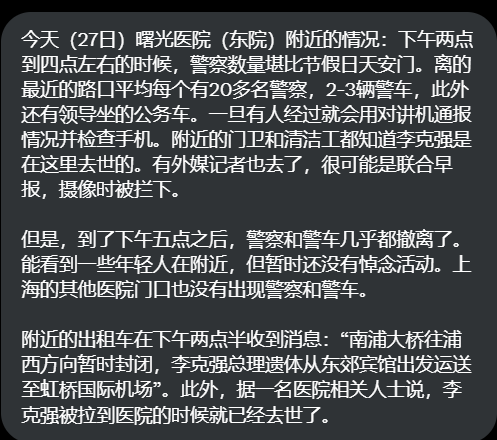  A李老师不是你老师 北京时间 2023-10-27T23:59:49Z 1717934130653012045 合肥红星路，李克强故居前
深夜悼念者依然络绎不绝 https://t.co/uDaszQsSsh   A李老师不是你老师 北京时间 2023-10-27T18:53:08Z 1717856953190252631 夜色降临，李克强故居下的献花越来越多 https://t.co/cHkhtknrhT 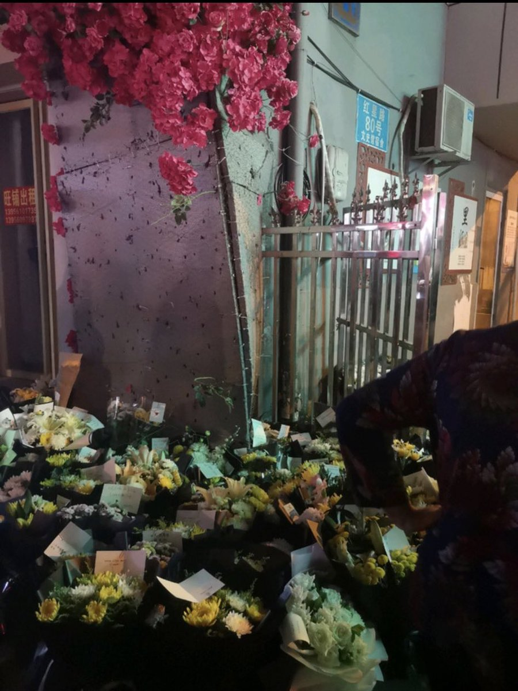  A李老师不是你老师 北京时间 2023-10-27T19:20:15Z 1717863779218669680 新华社发布讣告
【中共中央 全国人大常委会 国务院 全国政协讣告 李克强同志逝世】新华社北京10月27日电 中国共产党中央委员会、中华人民共和国全国人民代表大会常务委员会、中华人民共和国国务院、中国人民政治协商会议全国委员会沉痛宣告：中国共产党的优秀党员，久经考验的忠诚的共产主义战士，杰出的无产阶级革命家、政治家，党和国家的卓越领导人，中国共产党第十七届、十八届、十九届中央政治局常委，国务院原总理李克强同志，因突发心脏病，经全力抢救无效，于2023年10月27日0时10分在上海逝世，享年68岁。

李克强同志，1955年7月生，安徽定远人。他从青少年时代起就热爱党、热爱祖国、热爱人民，刻苦学习，追求进步。1974年3月起，在安徽省凤阳县大庙公社东陵大队插队，1976年5月加入中国共产党，1976年11月至1978年3月任安徽省凤阳县大庙公社大庙大队党支部书记。1978年3月至1982年2月，在北京大学法律系学习，曾任校学生会负责人。1982年2月起，李克强同志先后任北京大学团委书记，共青团中央常委、共青团中央学校部部长兼全国学联秘书长，共青团中央书记处候补书记，共青团中央书记处书记兼全国青联副主席、全国少工委主任。1993年3月起，任共青团中央书记处第一书记兼中国青年政治学院院长，第八届全国人大常委会委员。他紧紧围绕党的中心任务来考虑和安排团的工作，服务党和国家工作大局。1998年6月起，李克强同志历任河南省委副书记、代省长、省长，省委书记、省长，省委书记、省人大常委会主任。他提出实现中原崛起的奋斗目标，在全省上下形成发展共识，在大力推进工业化、城镇化进程的同时，加快农业现代化建设，推动河南经济社会各项事业取得长足发展。2004年12月起，李克强同志历任辽宁省委书记，省委书记、省人大常委会主任。他紧紧抓住东北振兴和沿海开放的双重机遇，着力深化国有企业改革，构建“五点一线”沿海经济带，提出并组织实施集中连片棚户区改造、促进“零就业家庭”就业等民生工程，推动辽宁老工业基地振兴取得显著成绩。2007年10月，李克强同志在中共十七届一中全会上当选为中央政治局委员、常委。2008年3月，任国务院副总理、党组副书记，负责国务院常务工作，负责发展改革、财政、国土资源、环保、建设、卫生方面工作。他协助做好应对国际金融危机、加快经济结构调整、深入实施区域协调发展战略、推进节能减排和生态环境保护、深化医药卫生体制改革等工作。把保基本、强基层、建机制作为医改工作的重心，推动医保、医药、医疗“三轮驱动”。着力推进保障性安居工程，促进人民群众安居乐业。积极探索环境保护新道路，坚持在发展中保护、在保护中发展。2012年11月，李克强同志在中共十八届一中全会上再次当选为中央政治局委员、常委。2013年3月，在十二届全国人大一次会议上，他被任命为国务院总理，同月起任国务院党组书记。面对错综复杂的国内外形势，在以习近平同志为核心的党中央坚强领导下，坚持稳中求进工作总基调，保持战略定力，着力完善宏观调控，注重预调微调，注重定向调控。深入开展“互联网+”行动，加快新旧动能转换。坚持对外开放的基本国策，扎实推进“一带一路”建设。推动依法全面履行政府职能，努力建设人民满意的法治政府、创新政府、廉洁政府和服务型政府。2017年10月，李克强同志在中共十九届一中全会上又一次当选为中央政治局委员、常委。2018年3月，在十三届全国人大一次会议上，他再次被任命为国务院总理，并担任国务院党组书记。在以习近平同志为核心的党中央坚强领导下，面对世界变局加快演进、新冠疫情冲击、国内经济下行等多重考验，坚持稳中求进工作总基调，完整、准确、全面贯彻新发展理念，构建新发展格局，推动高质量发展，统筹发展和安全，持续做好“六稳”、“六保”工作，统筹推进稳增长、促改革、调结构、惠民生、防风险、保稳定各项工作，积极扩大国内有效需求，保持经济运行在合理区间，依靠创新驱动推动产业结构优化升级。贯彻以人民为中心的发展思想，着力保基本、兜底线、促公平，强化就业优先政策导向，扩大保障性住房供给。推进脱贫攻坚，实施乡村振兴战略，巩固拓展脱贫攻坚成果。落实绿水青山就是金山银山的理念，推动生态文明建设取得明显成效。

担任国务院总理后，李克强同志还先后兼任国务院振兴东北地区等老工业基地领导小组组长、国务院西部地区开发领导小组组长、国家科技教育领导小组组长、国家应对气候变化及节能减排工作领导小组组长等，在科技、教育、生态环保和东北全面振兴、西部大开发等领域倾注了大量心血。新冠疫情发生后，李克强同志担任中央应对疫情工作领导小组组长，认真贯彻落实党中央决策部署，坚持人民至上、生命至上，推动统筹疫情防控和经济社会发展取得重大积极成果。李克强同志坚持从中国国情出发，坚持和完善社会主义基本经济制度，持续推动经济体制改革，坚持社会主义市场经济改革方向，处理好政府和市场的关系，使市场在资源配置中起决定性作用，更好发挥政府作用，推动有效市场和有为政府更好结合。他持续推进政府职能转变和行政体制改革，统筹推进财税、金融、投资、科技等重点领域改革，实行更加积极主动的开放战略，实施更大范围、更宽领域、更深层次对外开放。李克强同志对人民群众饱含感情，着力解决好群众就业、教育、住房、医疗、养老等方面的突出困难，兜牢民生底线，不断提升人民群众的获得感、幸福感、安全感。

2023年3月，李克强同志不再担任国务院总理职务。从领导岗位上退下来后，他坚决拥护和支持以习近平同志为核心的党中央领导，关心党和国家事业的发展，坚定支持党风廉政建设和反腐败斗争。

李克强同志的一生，是革命的一生、奋斗的一生、光辉的一生，是全心全意为人民服务的一生，是献身于共产主义事业的一生。他的逝世，是党和国家的重大损失。我们要化悲痛为力量，学习他的革命精神、崇高品德和优良作风，更加紧密地团结在以习近平同志为核心的党中央周围，高举中国特色社会主义伟大旗帜，全面贯彻习近平新时代中国特色社会主义思想，深刻领悟“两个确立”的决定性意义，增强“四个意识”、坚定“四个自信”、做到“两个维护”，坚定信心、同心同德，踔厉奋发、勇毅前行，为以中国式现代化全面推进强国建设、民族复兴伟业而团结奋斗。 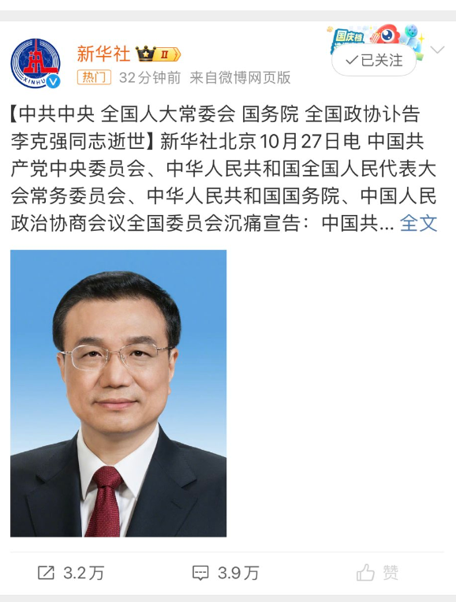  A李老师不是你老师 北京时间 2023-10-27T21:59:38Z 1717903888601244041 https://t.co/DnT0Gtr2RS 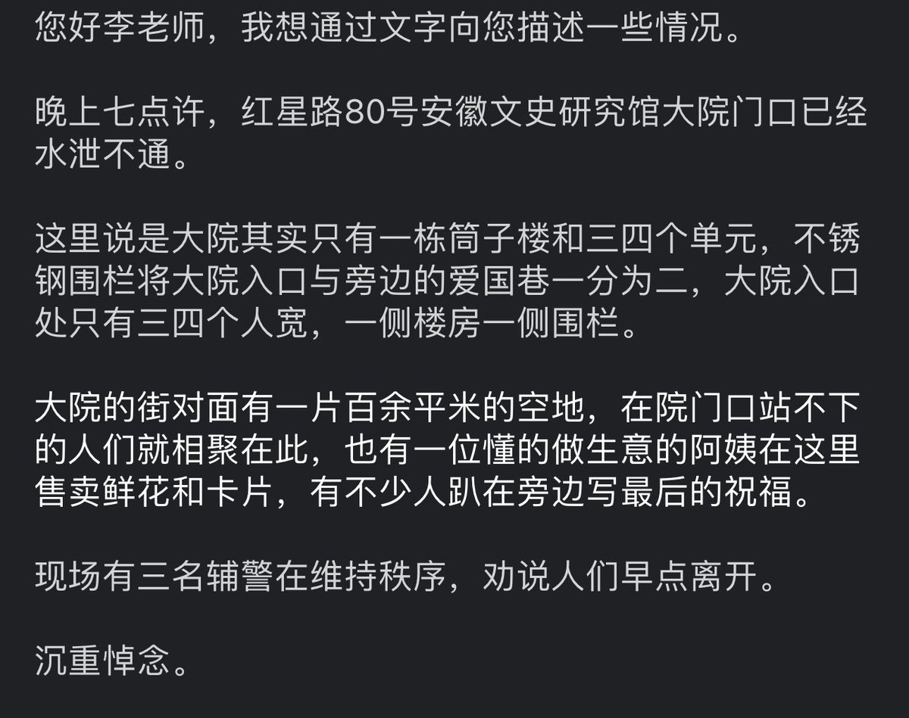  A李老师不是你老师 北京时间 2023-10-27T19:12:53Z 1717861924359090663 贵阳航空工业技术学院 https://t.co/J9dreXcSkN 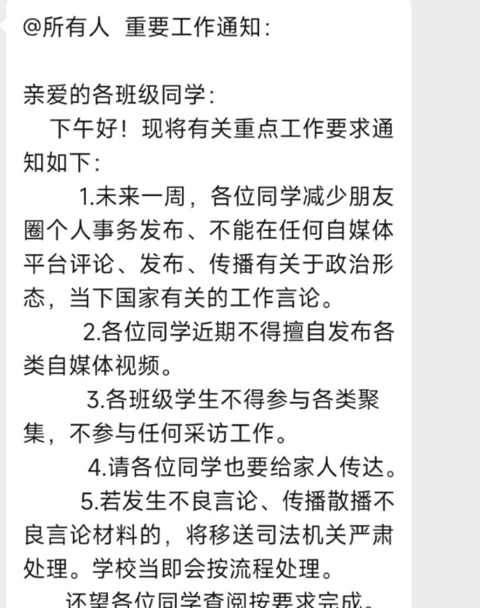  A李老师不是你老师 北京时间 2023-10-27T20:15:18Z 1717877630286942691 海南大学学生会通知 https://t.co/fKlmz9vpUR 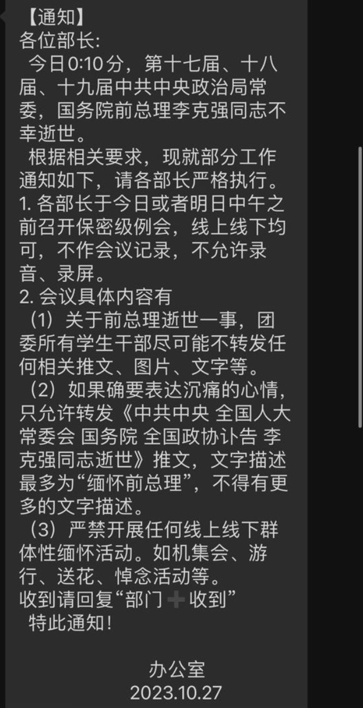  A李老师不是你老师 北京时间 2023-10-27T16:36:15Z 1717822506772389992 合肥，民众前往李克强故居献花。 https://t.co/oFZd8zvuv5 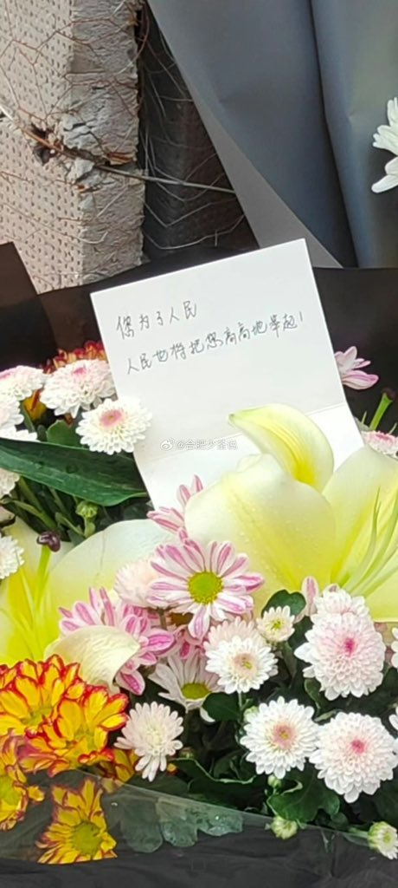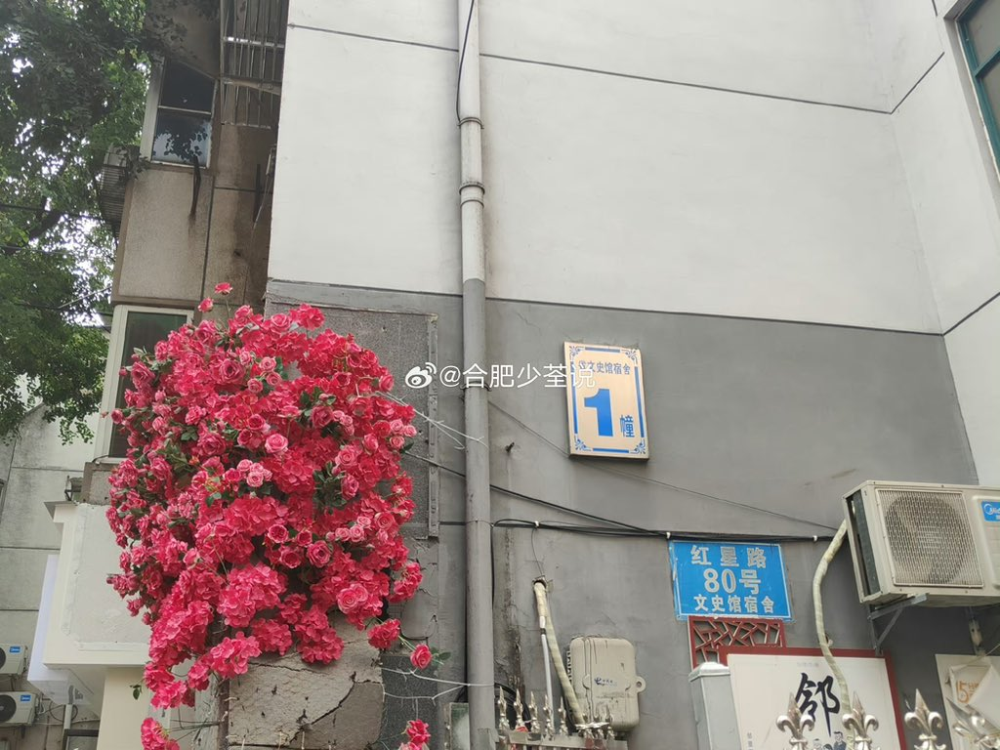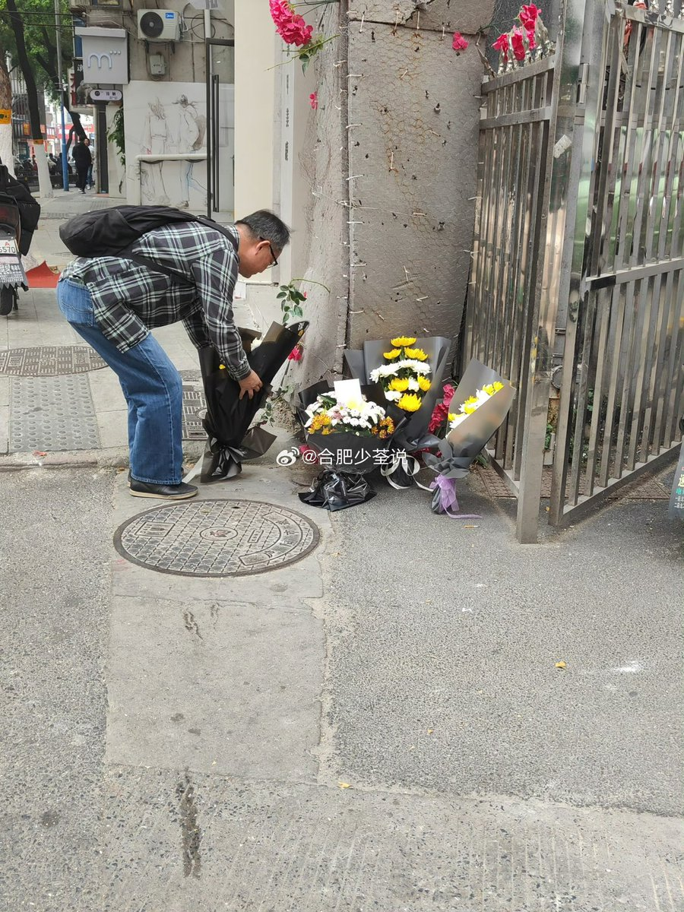  A李老师不是你老师 北京时间 2023-10-27T16:59:02Z 1717828237059862826 吴尊友逝世。 https://t.co/CWAKpgB8nA   A李老师不是你老师 北京时间 2023-10-27T17:41:32Z 1717838935173353503 上海交通大学 https://t.co/wvL6iDz2vs 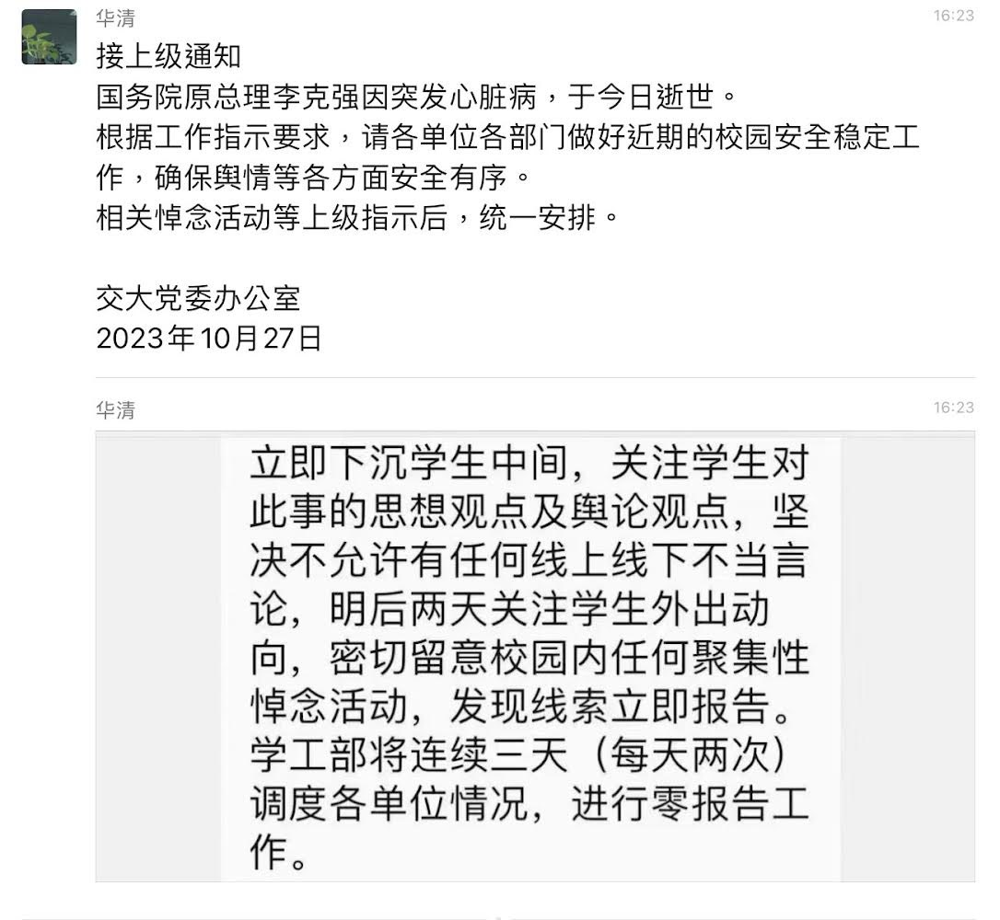  A李老师不是你老师 北京时间 2023-10-27T15:55:02Z 1717812130886410643 https://t.co/g4zzR6Tjq8 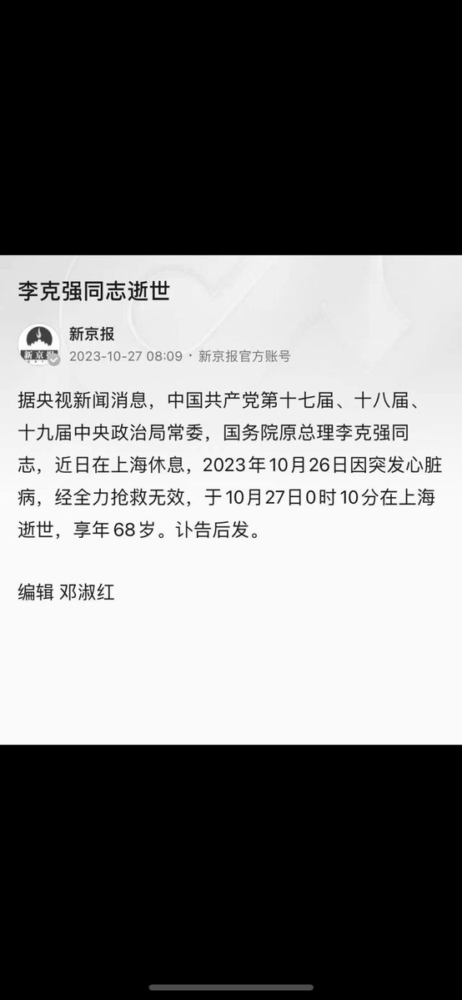  A李老师不是你老师 北京时间 2023-10-27T16:02:59Z 1717814135344521274 https://t.co/XwOjofA2Yz 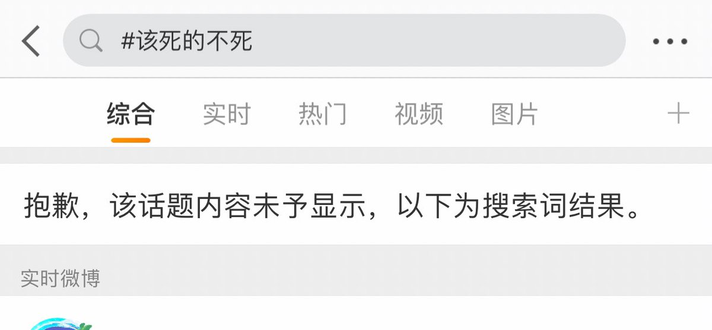  A李老师不是你老师 北京时间 2023-10-27T16:10:48Z 1717816101784912179 https://t.co/t9oUDVu02Q 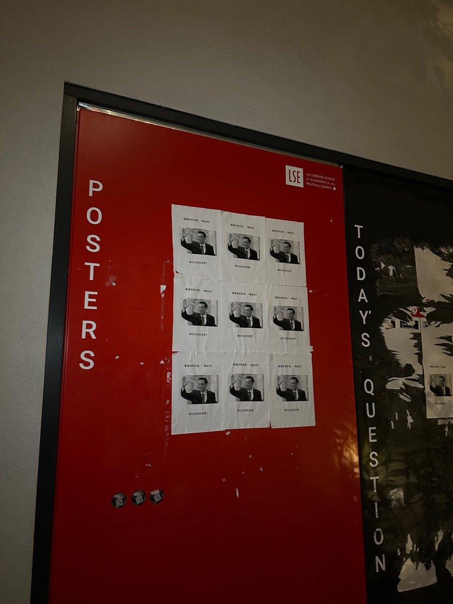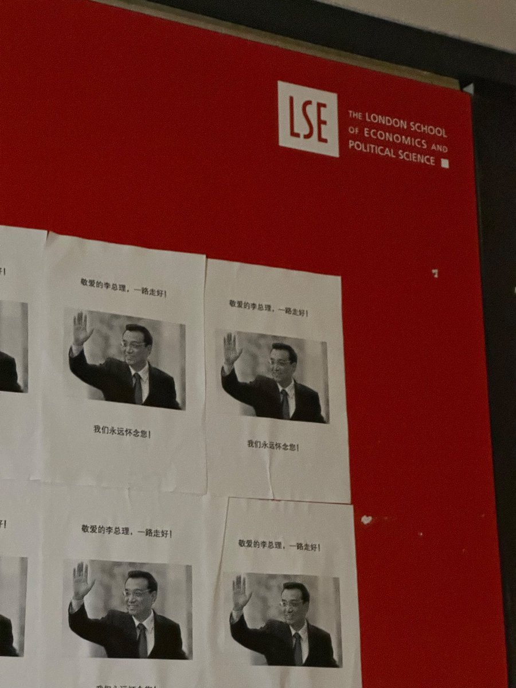  A李老师不是你老师 北京时间 2023-10-27T16:10:55Z 1717816130474012840 https://t.co/gcBmM48oWs 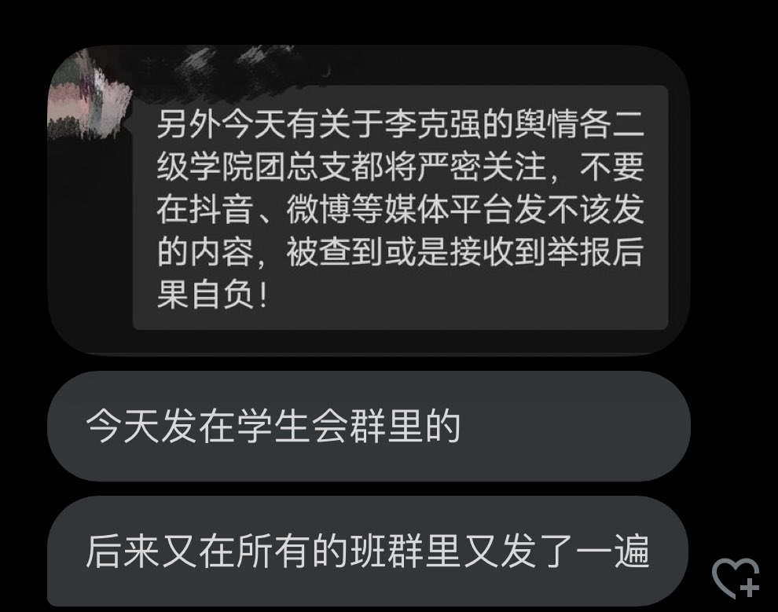  A李老师不是你老师 北京时间 2023-10-27T16:15:38Z 1717817317562716295 https://t.co/2jrzZ29Mh0   A李老师不是你老师 北京时间 2023-10-27T16:15:49Z 1717817364824154253 https://t.co/Sclk6mDPdr 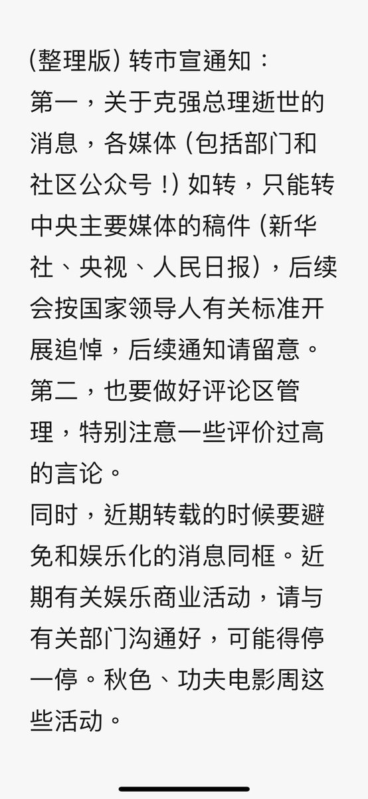  