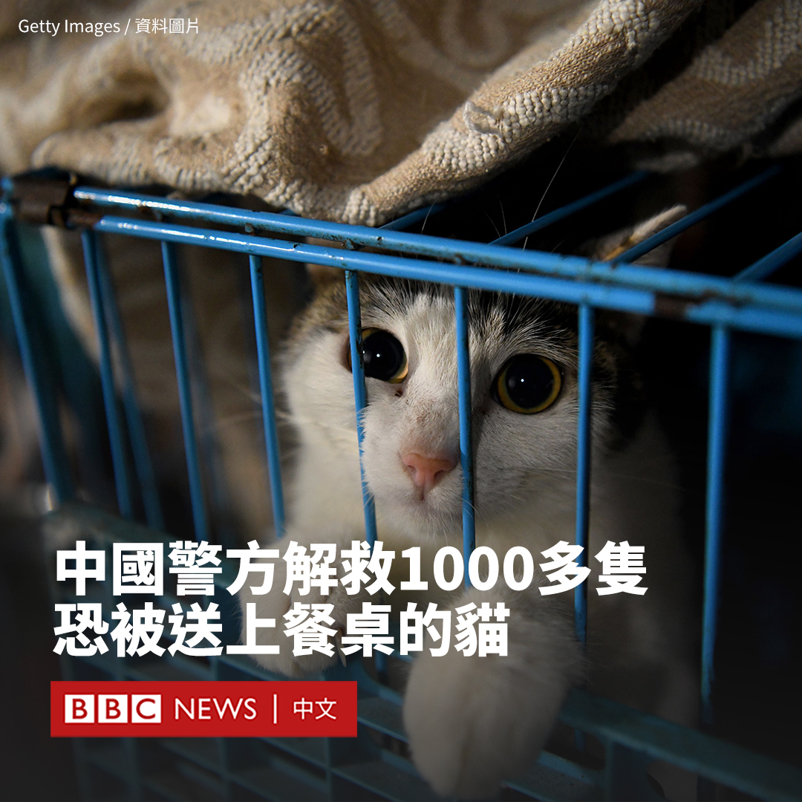
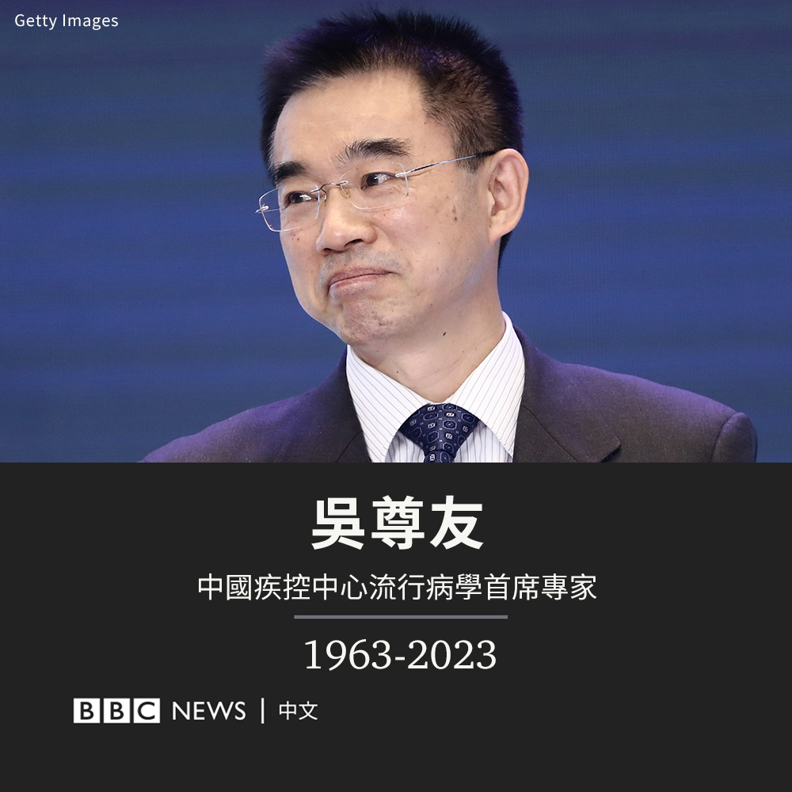
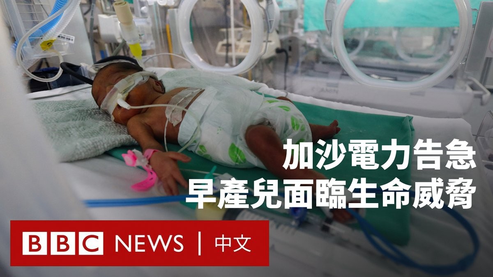
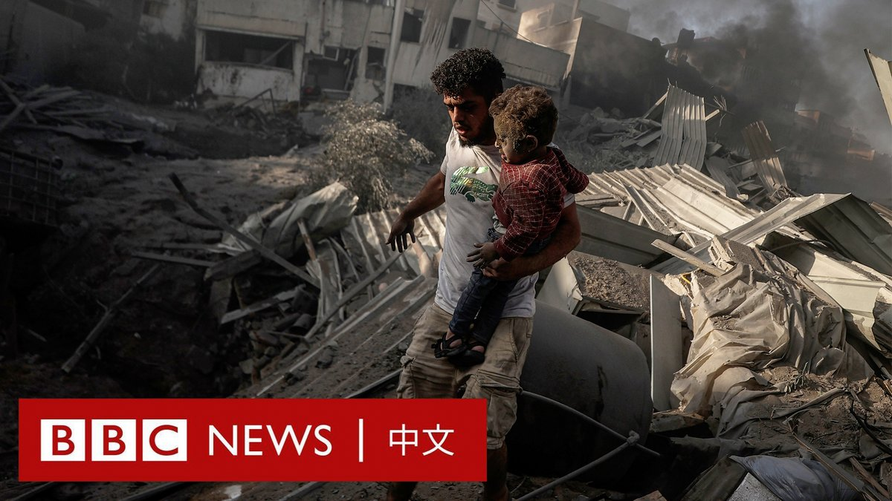

D英国广播公司BBC 北京时间 2023-10-27T18:31:21Z 1717851471881060460 据中国官媒报道，中国警方本月中旬成功解救了超过1000只猫，这些猫本来面临被宰杀以充当猪肉或羊肉送上餐桌的风险。

根据动物福利活动人士的举报，中国警方在江苏张家港截停了一辆装载着这些猫的卡车。

据《澎湃新闻》报道，这些猫随后被转移到一家庇护所。

这次救援行动揭露了一起非法的猫肉交易，并引发了对食品安全的新担忧。

活动人士表示，猫肉在中国每斤售价约4.5元人民币，一只猫能够产出四到五斤肉，而羊肉每斤售价达到30元。

目前尚不清楚被解救的猫是流浪猫还是宠物。它们可能被运往广东等地，被制成烤串或火腿肠等产品，而消费者对此并不知情。

据《澎湃新闻》的报道，活动人士留意到张家港的一个墓地里有大量猫被关在钉着木板的箱子中，发出哀嚎和呜咽声。他们为此进行了六天的蹲守。

当这些猫于10月12日被装上卡车时，他们拦下了车辆并报警。   D英国广播公司BBC 北京时间 2023-10-27T19:41:14Z 1717869058555777440 中国知名公共卫生专家吴尊友周五（10月27日）去世，享年60岁。他所在的中国疾病预防控制中心证实了该消息。

吴尊友是中国疾病预防控制中心流行病学首席专家，在新冠疫情爆发后成为中国版的安东尼·福奇（Anthony Fauci），在中国公众眼中是抗疫的代表人物之一。

他去世的消息在中国社交媒体引发震动，#吴尊友因病去世#成为热搜话题。许多网友表示悼念。

吴尊友1963年出生于安徽，在本地一所医科大学获得本科和硕士学位后，他赴加州大学洛杉矶分校（UCLA）取得流行病学博士学位。

1990年代，吴尊友回国开始从事艾滋病防治工作。2003年，在SARS疫情席卷中国时，他也参与了抗击SARS工作。

在新冠疫情爆发后，他成为“清零”政策的坚定支持者。在该政策后期导致很多城市被封锁、民众抱怨生计困难时，他多次在媒体采访和个人微博上为这一政策辩护，表示取消该政策会给经济带来更大的打击。

“有些人一提到动态清零，就想到对经济影响大。实际上，动态清零，才能最大限度地为经济建设保驾护航。”他在去年4月写道。

尽管他倡导的“清零”政策并不是每个人都喜欢，但他频繁在电视节目中向民众提供防疫知识与见解，让许多民众感谢他的付出。

一些网友还注意到他在疫情伊始曾是一头黑发，但三年后变成了一头白发。

据中国多家媒体报道，吴尊友是因胰腺癌去世，他此前已与癌症搏斗了两年。

中国疾病预防控制中心在讣告中称，出于尊重本人意愿，他的丧事从简，不举行遗体告别仪式。   D英国广播公司BBC 北京时间 2023-10-27T17:50:51Z 1717841278044340554 尽管李克强的总理生涯后期权力被架空，甚至有着“最弱势总理”之称，但他凭借经济政策上的务实主义，成为一位受民间欢迎的领导人。https://t.co/Bo5xpVsvw4   D英国广播公司BBC 北京时间 2023-10-27T16:09:23Z 1717815743973392618 随着以色列切断对加沙的能源和燃料供应，当地的电力和其他能源面临严重短缺。

有医生警告，如果医院的电力耗尽，依赖保温箱的早产儿将在几分钟内死亡。 https://t.co/qVQ5OmQlqp   D英国广播公司BBC 北京时间 2023-10-27T13:46:16Z 1717779729221378467 在哈马斯袭击以色列后，以军已持续三周对加沙地带进行猛烈空袭。不断有家庭失去亲人，而大量的伤亡者让急救人员感到不堪重负。

联合国援助机构表示，他们正在大幅减少在加沙的行动，因为燃料储备已几乎耗尽。 https://t.co/IxMrI0jSiV   D英国广播公司BBC 北京时间 2023-10-27T11:35:41Z 1717746865415061511 据中国官方媒体报导，中国前总理李克强因心脏病周五（10月27日）猝逝，享年68岁。

报导称，李克强“近日在上海休息”，周四突发心脏病，因抢救无效在周五0时10分逝世。

李克强去世的消息最早由中国官方媒体中央电视台在其早上的新闻节目中播报，官方通讯社新华社随后也发布了报导。

李克强在2013年至2023年担任了十年国务院总理，被视为是中国政坛的二号人物。他在今年3月的全国人大会议上刚刚卸任。

由于有良好的健康维护服务，中国高级官员一般很长寿，李克强的去世显得颇为突然。中国网络上很多民众表示“不敢相信”、“太突然了”。

李克强是一名地方官员之子。他早年在中国共青团中央工作，后来在中共党内步步高升，成为中国最年轻的省长，甚至一度有望成为最高领导人。

他被广泛认为是前领导人胡锦涛的得意门生，而与习近平关系疏远。他历任共青团中央书记处书记、河南省省长、中共辽宁省委书记等职务。

作为从中国精英院校北京大学毕业的经济学者，他最初被委以中国经济重任，其减少财政刺激、推行结构改革和去杠杆化的经济政策被称为“克强经济学”。

但分析人士普遍认为，随着中国领导人习近平不断巩固权力，他在职业生涯后期越来越被边缘化。

相关报导：https://t.co/eLlFtCf27m   D英国广播公司BBC 北京时间 2023-10-27T09:32:16Z 1717715806212235342 据中国官方媒体报道，中国前总理李克强因心脏病周五（10月27日）猝逝，享年68岁。

报道称，李克强“近日在上海休息”，周四突发心脏病，因抢救无效在周五0时10分逝世。

李克强去世的消息最早由中国官方媒体中央电视台在其早上的新闻节目中播报，官方通讯社新华社随后也发布了报道。

李克强在2013年至2023年担任了十年国务院总理，被视为是中国政坛的二号人物。他在今年3月的全国人大会议上刚刚卸任。

由于有良好的健康维护服务，中国高级官员一般很长寿，李克强的去世显得颇为突然。中国网络上很多民众表示“不敢相信”、“太突然了”。

李克强出身草根。尽管没有任何权力基础，他还是在中共党内步步高升，甚至一度有望成为最高领导人。

他被视为受到中国前领导人胡锦涛的大力支持，而与习近平关系疏远。他历任共青团中央书记处书记、河南省省长、中共辽宁省委书记等职务。

作为从中国精英院校北京大学毕业的经济学者，他最初被委以中国经济重任，但分析人士普遍认为，随着中国领导人习近平不断巩固权力，他在职业生涯后期越来越被边缘化。   D英国广播公司BBC 北京时间 2023-10-27T09:54:50Z 1717721483454104059 李克强在七个月前刚卸任中国总理，官方媒体称，他是在上海休息期间突发心脏病不治逝世。https://t.co/DYQJiPl96b   D英国广播公司BBC 北京时间 2023-10-27T08:29:38Z 1717700043212292525 【最新消息】据中国中央电视台报道，中国前国务院总理李克强因心脏病周五（10月27日）去世，享年68岁。 https://t.co/CUcH2CQzkp   