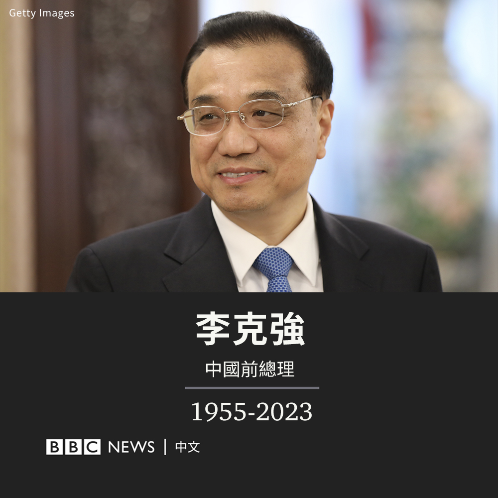

D英国广播公司BBC 北京时间 2023-10-27T11:35:41Z 1717746865415061511 据中国官方媒体报导，中国前总理李克强因心脏病周五（10月27日）猝逝，享年68岁。

报导称，李克强“近日在上海休息”，周四突发心脏病，因抢救无效在周五0时10分逝世。

李克强去世的消息最早由中国官方媒体中央电视台在其早上的新闻节目中播报，官方通讯社新华社随后也发布了报导。

李克强在2013年至2023年担任了十年国务院总理，被视为是中国政坛的二号人物。他在今年3月的全国人大会议上刚刚卸任。

由于有良好的健康维护服务，中国高级官员一般很长寿，李克强的去世显得颇为突然。中国网络上很多民众表示“不敢相信”、“太突然了”。

李克强是一名地方官员之子。他早年在中国共青团中央工作，后来在中共党内步步高升，成为中国最年轻的省长，甚至一度有望成为最高领导人。

他被广泛认为是前领导人胡锦涛的得意门生，而与习近平关系疏远。他历任共青团中央书记处书记、河南省省长、中共辽宁省委书记等职务。

作为从中国精英院校北京大学毕业的经济学者，他最初被委以中国经济重任，其减少财政刺激、推行结构改革和去杠杆化的经济政策被称为“克强经济学”。

但分析人士普遍认为，随着中国领导人习近平不断巩固权力，他在职业生涯后期越来越被边缘化。

相关报导：https://t.co/eLlFtCf27m   D英国广播公司BBC 北京时间 2023-10-27T09:32:16Z 1717715806212235342 据中国官方媒体报道，中国前总理李克强因心脏病周五（10月27日）猝逝，享年68岁。

报道称，李克强“近日在上海休息”，周四突发心脏病，因抢救无效在周五0时10分逝世。

李克强去世的消息最早由中国官方媒体中央电视台在其早上的新闻节目中播报，官方通讯社新华社随后也发布了报道。

李克强在2013年至2023年担任了十年国务院总理，被视为是中国政坛的二号人物。他在今年3月的全国人大会议上刚刚卸任。

由于有良好的健康维护服务，中国高级官员一般很长寿，李克强的去世显得颇为突然。中国网络上很多民众表示“不敢相信”、“太突然了”。

李克强出身草根。尽管没有任何权力基础，他还是在中共党内步步高升，甚至一度有望成为最高领导人。

他被视为受到中国前领导人胡锦涛的大力支持，而与习近平关系疏远。他历任共青团中央书记处书记、河南省省长、中共辽宁省委书记等职务。

作为从中国精英院校北京大学毕业的经济学者，他最初被委以中国经济重任，但分析人士普遍认为，随着中国领导人习近平不断巩固权力，他在职业生涯后期越来越被边缘化。   D英国广播公司BBC 北京时间 2023-10-27T09:54:50Z 1717721483454104059 李克强在七个月前刚卸任中国总理，官方媒体称，他是在上海休息期间突发心脏病不治逝世。https://t.co/DYQJiPl96b   D英国广播公司BBC 北京时间 2023-10-27T08:29:38Z 1717700043212292525 【最新消息】据中国中央电视台报道，中国前国务院总理李克强因心脏病周五（10月27日）去世，享年68岁。 https://t.co/CUcH2CQzkp   