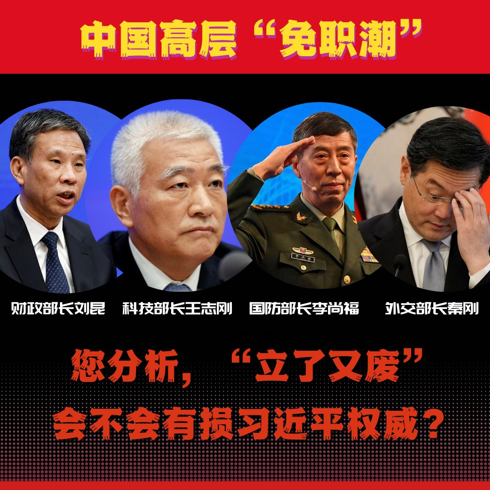
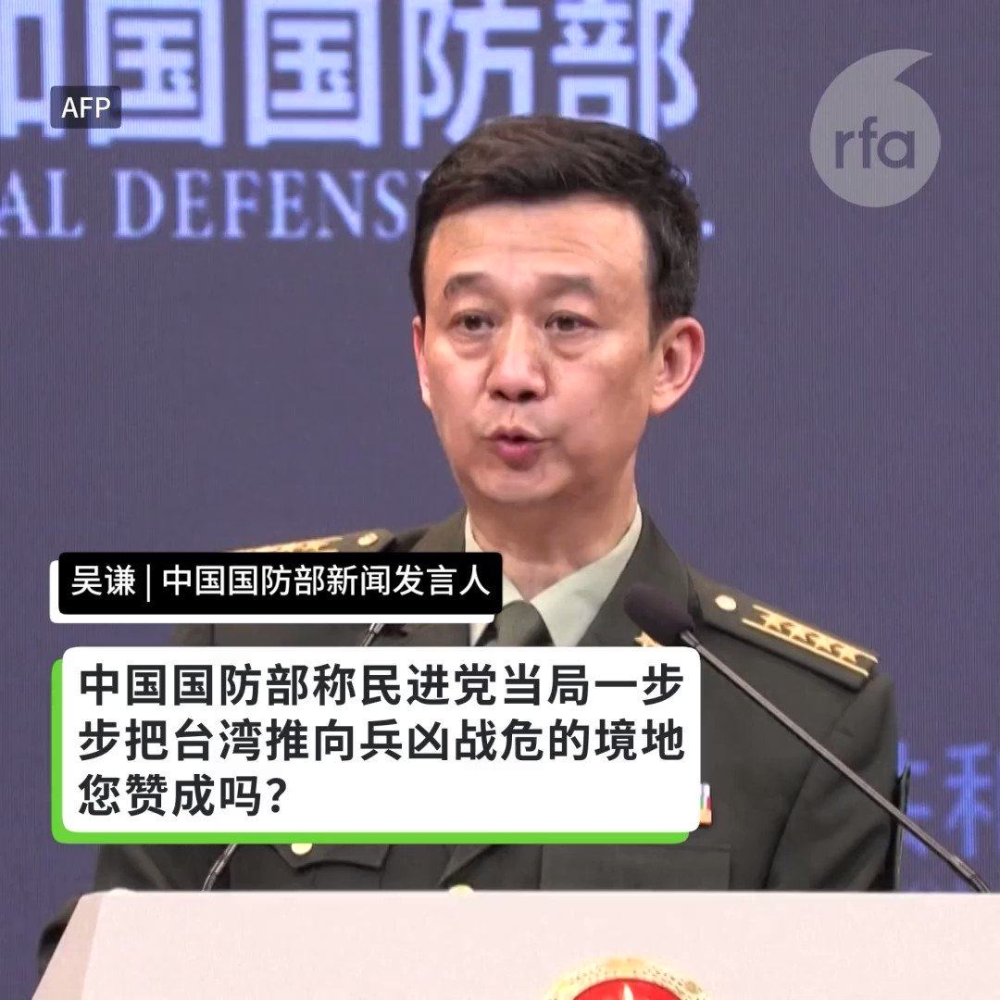
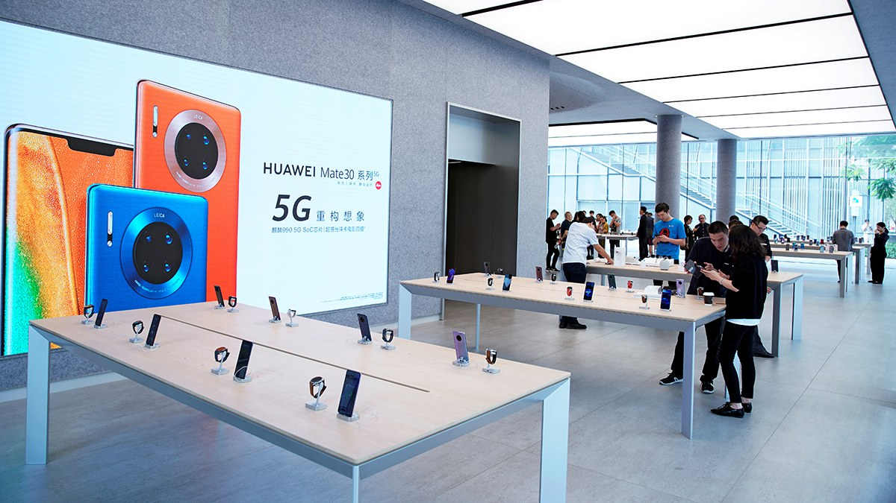
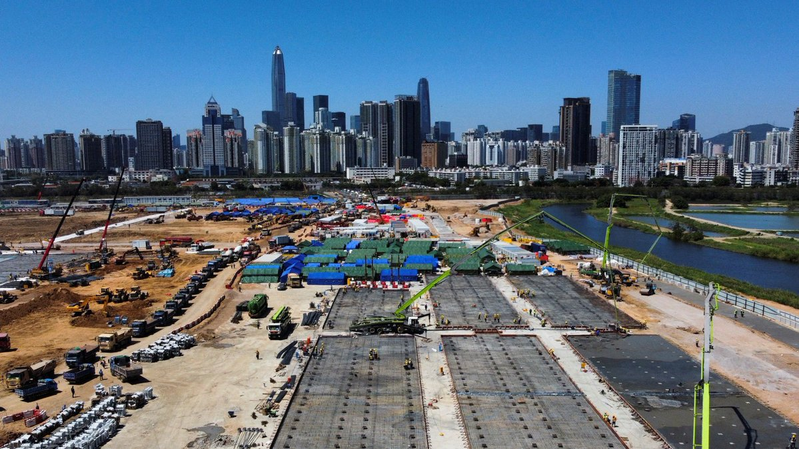

自由亚洲电台 北京时间 2023-10-27T04:45:24Z 1717643615181398028 评论 | #陈破空：#李尚福 免职 #国防部长 空缺 习近平无人可用
 https://t.co/CV1IGglBXI   自由亚洲电台 北京时间 2023-10-27T05:31:33Z 1717655226679775549 【#您怎么看】在毫无官方解释的疑云下，中国高层人事震荡，李尚福、秦刚双双被免职，中国国务委员仅剩三人。这波“免职潮”中还有财政部长刘昆和科技部长王志刚。您分析，为何外交、国防、财政、科技等多个部门的部长在短时间内接连被免职？您分析， “立了又废”，会不会有损习近平权威？ https://t.co/vdnrz9zWYl   自由亚洲电台 北京时间 2023-10-27T03:04:36Z 1717618248232182211 澳大利亚总理阿尔巴尼斯（Anthony Albanese）本周三在访问中国前与美国总统拜登在华盛顿会晤。外界关注，这将为美、中、澳三方关系带来怎样的影响？#阿尔巴尼斯 在与 #拜登 会谈时，两国领导人又重点讨论了什么？

 https://t.co/gDsv1DAHGm   自由亚洲电台 北京时间 2023-10-27T03:18:37Z 1717621772777091565 【#您怎么看】中国国防部10月26日下午举行例行记者会，在记者问及“美政府拟向国会申请大额对台军事援助，近期民进党当局也动用预备金支持与美联训”时，国防部新闻局局长、国防部新闻发言人吴谦这样说。您赞成他的说法吗？ https://t.co/8HLXXAw0Lv   自由亚洲电台 北京时间 2023-10-27T03:46:34Z 1717628809976144281 据美国《华尔街日报》报道，自恒大集团创办人 #许家印 涉嫌犯罪、被采取刑事强制措施后，中国政府正扩大对 #房地产业 的调查范围，涉及协助开发商高风险行为的银行和金融机构。目前正在接受调查的包括中国银行前行长。

 https://t.co/ZMpfSQ2ftK   自由亚洲电台 北京时间 2023-10-27T04:00:13Z 1717632241789276499 中国 #发改委 发出的长文表示，这种安排“从初一放到初八，如果配合带薪休假可以放假9天，堪称新年第一份大礼包。虽然 #除夕 当天名义上不放假，但鼓励各单位和机构根据实际情况来灵活安排”，并说这是“创新之举”、“暖心之举”。
这个大礼包，你领情吗？
 https://t.co/Sl2E1zEc0Y   自由亚洲电台 北京时间 2023-10-27T04:13:30Z 1717635585551077751 【彭博社揭露 #华为手机芯片 秘密】
中国华为公司8月份发布的新款手机Mate 60 Pro让外界广泛好奇，其芯片到底如何制造？华为公司这两个月以来也始终对其讳莫如深。这反映出美国政府以中国为主要对象实施先进芯片技术出口管制所形成的大环境。

据彭博社报道，知情人士透露，华为这款手机的芯片是中芯国际用荷兰阿斯麦（ASML）的浸没式深紫外光刻机搭配其他公司的工具制造的。

报道强调，没有迹象表明荷兰阿斯麦违反了美国的芯片管制措施；而华为这款手机的问世也表明，尽管有诸多出口管制，但已经难以阻止中国在芯片制造上取得进步。

彭博社说，他们是委托半导体行业观察机构TechInsights拆解了这款手机后，才发现了其芯片的秘密，这表明中国的芯片制造能力远远超出了美国试图阻止中国达到的技术水平。

报道就此提出了两个问题：中芯国际为什么能制造这款芯片，以及美国的管制措施还有效吗？   自由亚洲电台 北京时间 2023-10-27T00:31:38Z 1717579749491671324 维权律师 #李昱函 被辽宁当局长期羁押，案件审而不判备受外界关注。10月25日，辽宁法院就案件作出裁决，裁定李昱函寻衅滋事和诈骗罪成，判监六年六个月。她表示会上诉。 https://t.co/oTi3VZwqoe   自由亚洲电台 北京时间 2023-10-27T00:33:02Z 1717580102706528278 【 #撤侨 认知战翻车】
中国国台办宣称，将提供以色列台侨与中国大陆民众同样的海外领事保护。
其实，中国在 #以色列 有10万以上侨民，却迟不见中国派出撤侨专机。台湾的外交部称，目前已协助166名台侨安全离境，同时还有35位在海外的中国公民向台湾求助。 https://t.co/EYFsLs4lej   自由亚洲电台 北京时间 2023-10-27T00:34:34Z 1717580489979306282 专栏 | #绿色情报员：激辛中国（上）　小辣椒闯出红祸 https://t.co/bDE7bxml5R   自由亚洲电台 北京时间 2023-10-27T00:43:10Z 1717582654558937337 在中国“有关系就没关系”？
台湾艺人 #张庭 夫妇 #传销 案撤销　96套房产解封冲热搜。
#林瑞阳 高调报平安，网民一脸懵圈：他们是怎么做到的？

 https://t.co/99D6I9r3V1   自由亚洲电台 北京时间 2023-10-27T01:39:52Z 1717596921102037063 【#跨国企业 加速离开 #香港】
据美国《华尔街日报》报道，近年来涉及银行、投资和科技等领域的跨国企业正大批从香港撤退。

据香港方面的统计，在香港运营的美国公司数量已经连续四年下降。2022年6月，这一数字降到了1258家，是2004年以来最低的水平。与此同时，去年在香港设立地区总部的中国内地公司30年来首次在数量上超过了美国公司。

在香港经营一家研究和出版公司的卡特里奇（Simon Cartledge）表示，在香港经营曾经没有什么风险，但现在一切都要打上问号。另有投资界的人士表示，香港现在被视为中国的延伸。

报道强调，随着香港收紧国家安全方面的限制，以及发生了中国对外资企业的整顿、中美关系持续紧张等情况，外国公司对香港经营环境的考量发生了变化。

但众多跨国公司仍然认为中国是一个重要的市场，并不打算放弃在中国的业务。有不少跨国公司选择留在中国内地，或在新加坡设立亚洲中心。   自由亚洲电台 北京时间 2023-10-27T01:50:43Z 1717599653418660065 #事实查核｜#拜登 称自己在 #以色列 出生？被质疑没资格当美国总统？
 https://t.co/DEK89Pt9yQ   自由亚洲电台 北京时间 2023-10-27T02:11:38Z 1717604918398525595 前澳大利亚外长属下高级国家安全顾问(Senior National Security Adviser)李仓松(John Cheong Seong Lee)向本台指出, 中国要的是 #澳大利亚 减少带头向国际社会倡议声讨中国。 https://t.co/3U91xGizqP   