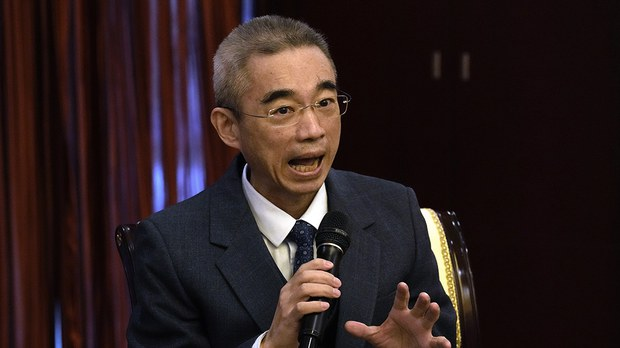
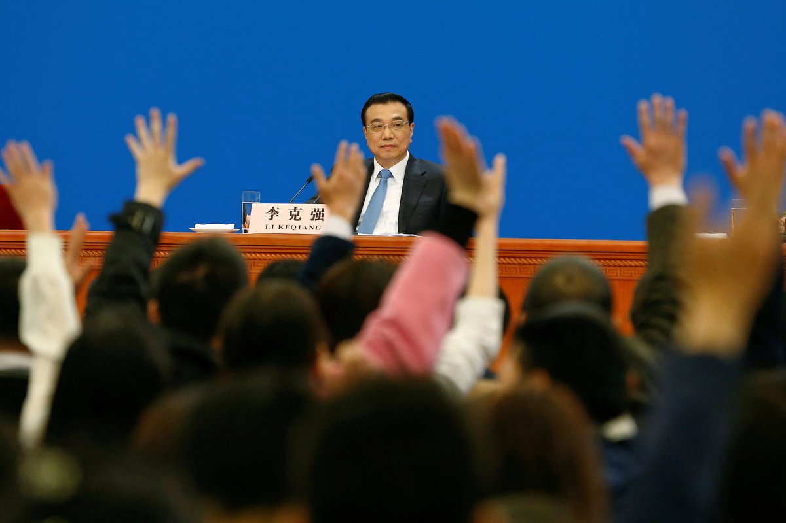
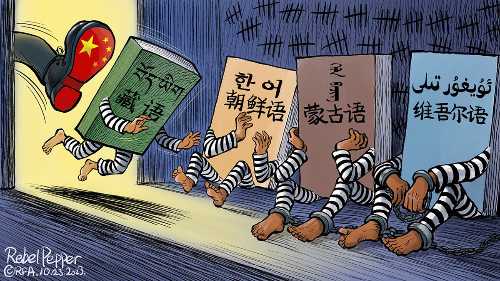
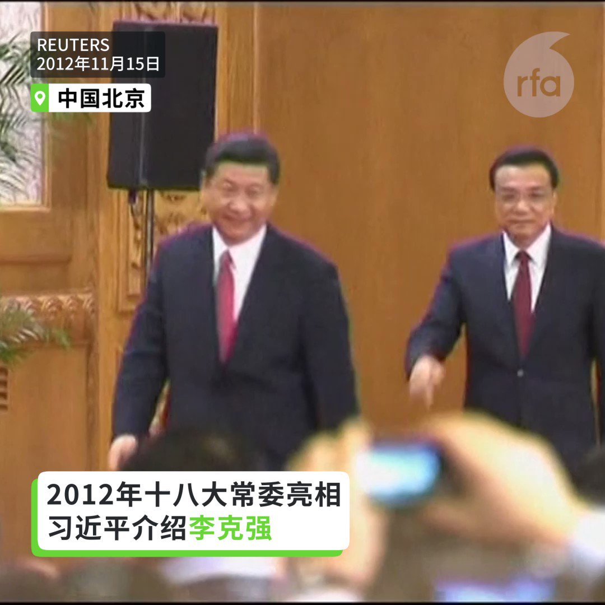
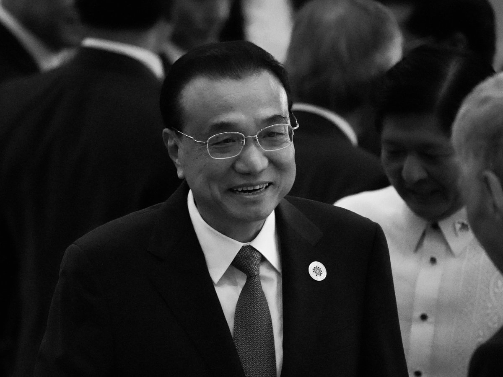
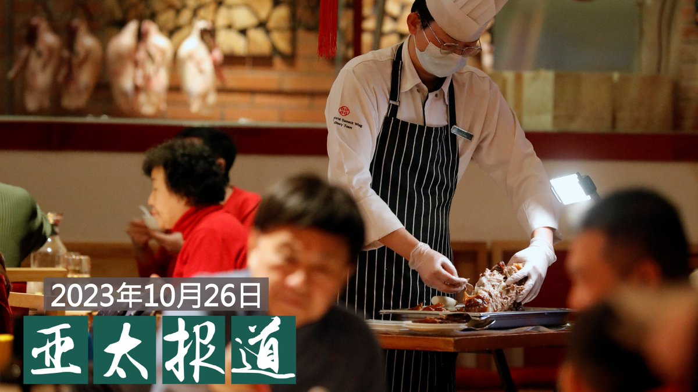
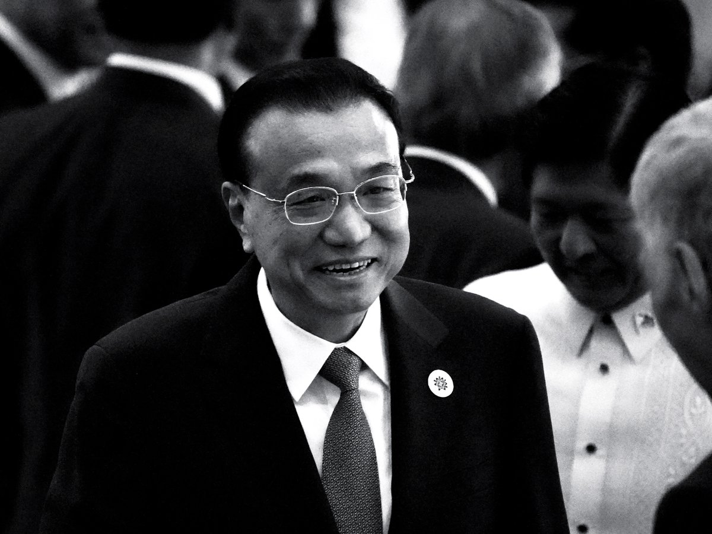
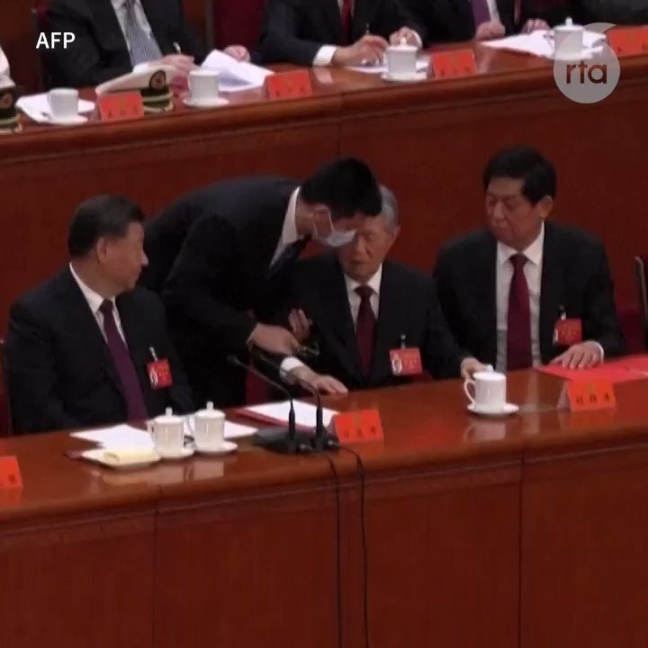

自由亚洲电台 北京时间 2023-10-27T23:52:18Z 1717932239361544603 【“#但愿世间无尊友” 中国疾控专家 #吴尊友病逝 惹争议】
正当外界对中国前总理 #李克强 突然去世表达震惊之际，周五（10月27日）当天又传出消息，知名公共卫生专家、中国疾控中心流行病学首席专家 #吴尊友 因病于当天去世，享年60岁。

吴尊友因为在新冠疫情期间在中国疫情防控一线工作，被新闻多次报道，而被公众熟知。但吴尊友多次为中国政府的动态清零政策辩护，被外界广泛诟病。

吴尊友去世的消息传出后，在网络防火墙之外的社媒X上依然受到舆论的挞伐。有网友留言说，烧几座方舱给他，让他在九泉之下继续封控；还有人把疫情期间流传的讽刺对联翻出来，其中提到：上联：但愿世间无尊友；下联：否则人心凉万年；横批：兽比南山！其中嵌入了三位支持动态清零政策的中国医学专家的名字。

据经济观察网报道，吴尊友1963年6月出生于安徽黄山，1980年考入安徽医科大学卫生系，先后获得学士、硕士学位。1990年代，吴尊友在加州大学洛杉矶分校就读流行病学专业，获博士学位。回国后，吴尊友先后从事防治艾滋病、以及“沙斯”（SARS）等方面的工作；2017年4月，吴尊友任中国疾病预防控制中心流行病学首席专家。   自由亚洲电台 北京时间 2023-10-27T18:56:49Z 1717857880043638908 【新华社晚间发出 #李克强讣告】
【细数李克强政绩】
新华社在27日晚间六点半许发出李克强的讣告，细数李克强历年政绩。讣告文末指出，李克强从领导岗位上退下来后，他坚决拥护和支持以习近平同志为核心的党中央领导，关心党和国家事业的发展，坚定支持党风廉政建设和反腐败斗争。https://t.co/TYrwEfGdSS   自由亚洲电台 北京时间 2023-10-27T21:39:51Z 1717898907299217633 #变态辣椒：无言亦无语
中国政府致力 #汉化 内蒙古，西藏和新疆等地的少数民族，越来越多的学校被禁止使用母语教学。习近平治下的中国，民族融合运动变得越来越带有强制性：许多少数民族儿童被剥夺母语教育权，并被要求学会读写所谓的“普通话” — 中国汉语。 https://t.co/eFnRbtJIQq   自由亚洲电台 北京时间 2023-10-27T19:46:53Z 1717870479850324096 【回顾李克强的政治舞台 国务院总理的起落】
【与习近平的关系起伏 画面透露玄机】
李克强在2013年出任总理，回看影像，李克强刚上任头两年，在全国两会上，与习近平有面带笑容的交谈和互动，但之后不再看到这样的镜头。李克强曾公开说，中国六亿人每月收入只有一千元。他还说过“长江黄河不会倒流”指中国会持续开放。今年在国务院告别讲话时他慨叹“人在干、天在看”都引起热议。
#李克强
#六亿人每月收入一千元
#长江黄河不会倒流
#人在干天在看
#苍天有眼   自由亚洲电台 北京时间 2023-10-27T17:52:30Z 1717841692328628305 【最高学历的李克强 改开以来最弱势总理】
中国国务院前总理李克强过世后，不少网友表达哀悼，并称呼他“人民的总理”。不过，也有许多民众将李克强称为“最弱势的总理”。才刚卸任总理未满一年骤逝也创下纪录。李克强今年3月在国务院内部的告别讲话慨叹:“人在干，天在看，看来是苍天有眼啊！”余茂春认为这番话显示李克强过得非常窝囊，是非常无可奈何的话。胡平说，习近平一上台就把国务院架空，从一开始李克强就成了最弱的总理。详细报道：https://t.co/EIcoIhFLpC
#李克强 #余茂春 #胡平   自由亚洲电台 北京时间 2023-10-27T11:56:50Z 1717752186762101128 【李克强心脏病猝死上海滩】
【消息人士：游泳突发心脏病抢救无效】
中国国务院前总理 #李克强，因突发心脏病，经全力抢救无效，本周五凌晨在上海离世，享年68岁。中国官方在李克强逝世8个小时后，对外发布上述消息。据上海一位不愿具名的医疗界人士披露，李克强入住上海东郊宾馆，游泳时突发心脏病。详细报道：https://t.co/m0vTgHtlSE   自由亚洲电台 北京时间 2023-10-27T09:21:04Z 1717712988298199452 回顾 #李克强 最后几次公开露面的瞬间 https://t.co/7xUXF2jkhB   自由亚洲电台 北京时间 2023-10-27T09:45:59Z 1717719260212920504 RT @RFA_Chinese: #李克强去世。重推这篇他卸任之际的总结。这次是真的谢幕了！ https://t.co/twlm3gts3K   自由亚洲电台 北京时间 2023-10-27T09:46:05Z 1717719282526884301 RT @RFA_Chinese: 【三月刚卸任总理 李克强上海逝世】
中国官方上午8点06分发布消息，国务院前总理 #李克强，2023年10月26日因突发 #心脏病，经全力抢救无效，于10月27日0时10分在上海逝世，享年68岁。讣告后发。
李克强三月刚刚卸任总理，曾任共产党第…   自由亚洲电台 北京时间 2023-10-27T09:48:23Z 1717719863190577389 欢迎收听和订阅播客【亚太报道（2023-10-26）】 https://t.co/MjLNSvVMqc
中国 #除夕不放假 引热议；维权律师 #李昱函 羁押六年被判六年半；中美官员酝酿 #拜习会；澳总理访华前先访美；澳总理访华能否使 #中澳关系 回到过去？ https://t.co/6uIByk8eQg   自由亚洲电台 北京时间 2023-10-27T10:11:12Z 1717725603993149945 正在美国首都华盛顿访问的中共中央政治局委员、外交部长 #王毅 10月26日(周四）傍晚在美国国务院与国务卿 #布林肯 举行会谈。美国会重量级议员就王毅来访发表联合声明，多名抗议王毅的中国访民与亲共人士在美国国务院大门外，发生对峙。
 https://t.co/5yn9MFAohK   自由亚洲电台 北京时间 2023-10-27T06:23:50Z 1717668384915984497 据中国官媒“央视新闻”消息，由中央广播电视总台CGTN打造的《#习近平的故事》多语种播客及融媒体产品日前在德国法兰克福正式向全球发布。80家海外主流媒体刊发，20多个国家和地区的817家海外主流网络媒体转载转发，触达海外潜在受众超4亿人次。
《习近平的故事》播客推出英语、西班牙语、法语、俄语和阿拉伯语版本，在全球180个国家主流播客平台上线播出，并登上多个国家和地区播客市场排行榜。
中国驻法兰克福总领事黄昳扬说：“《习近平的故事》多语种播客为欧洲民众了解新时代中国的掌舵者、领航人，读懂中国、中国共产党、中国式现代化提供一把‘智慧钥匙’，打开一扇‘思想之窗’。
有网友问：这得花多少钱啊？
#您怎么看？   自由亚洲电台 北京时间 2023-10-27T08:37:32Z 1717702033644659078 【三月刚卸任总理 李克强上海逝世】
中国官方上午8点06分发布消息，国务院前总理 #李克强，2023年10月26日因突发 #心脏病，经全力抢救无效，于10月27日0时10分在上海逝世，享年68岁。讣告后发。
李克强三月刚刚卸任总理，曾任共产党第十七届、十八届、十九届中央政治局常委。 https://t.co/a28TRZtzMe   自由亚洲电台 北京时间 2023-10-27T08:39:04Z 1717702417100439610 #李克强去世。重推这篇他卸任之际的总结。这次是真的谢幕了！ https://t.co/twlm3gts3K   自由亚洲电台 北京时间 2023-10-27T09:03:53Z 1717708664780292574 重温去年10月22日 #胡锦涛 被架离场名场面，他为何要拍 #李克强 的肩膀？
#您怎么看？ 请在评论区分享。 https://t.co/UlypPehNcI   自由亚洲电台 北京时间 2023-10-27T09:05:59Z 1717709189974204459 RT @RFA_Chinese: 【李克强告别国务院】
【感叹：人在干 天在看】
被喻为是改开以来最弱势的国务院总理李克强，日前在国务院内部发表告别讲话时，感叹道，今天阳光明媚，如沐春光。“人在干 天在看”。画面也引发网民热议，纷纷嘲讽“影射谁？”
#李克强 
#国务院
#总理…   自由亚洲电台 北京时间 2023-10-27T04:45:24Z 1717643615181398028 评论 | #陈破空：#李尚福 免职 #国防部长 空缺 习近平无人可用
 https://t.co/CV1IGglBXI   自由亚洲电台 北京时间 2023-10-27T05:31:33Z 1717655226679775549 【#您怎么看】在毫无官方解释的疑云下，中国高层人事震荡，李尚福、秦刚双双被免职，中国国务委员仅剩三人。这波“免职潮”中还有财政部长刘昆和科技部长王志刚。您分析，为何外交、国防、财政、科技等多个部门的部长在短时间内接连被免职？您分析， “立了又废”，会不会有损习近平权威？ https://t.co/vdnrz9zWYl   自由亚洲电台 北京时间 2023-10-27T03:04:36Z 1717618248232182211 澳大利亚总理阿尔巴尼斯（Anthony Albanese）本周三在访问中国前与美国总统拜登在华盛顿会晤。外界关注，这将为美、中、澳三方关系带来怎样的影响？#阿尔巴尼斯 在与 #拜登 会谈时，两国领导人又重点讨论了什么？

 https://t.co/gDsv1DAHGm   自由亚洲电台 北京时间 2023-10-27T03:18:37Z 1717621772777091565 【#您怎么看】中国国防部10月26日下午举行例行记者会，在记者问及“美政府拟向国会申请大额对台军事援助，近期民进党当局也动用预备金支持与美联训”时，国防部新闻局局长、国防部新闻发言人吴谦这样说。您赞成他的说法吗？ https://t.co/8HLXXAw0Lv   自由亚洲电台 北京时间 2023-10-27T03:46:34Z 1717628809976144281 据美国《华尔街日报》报道，自恒大集团创办人 #许家印 涉嫌犯罪、被采取刑事强制措施后，中国政府正扩大对 #房地产业 的调查范围，涉及协助开发商高风险行为的银行和金融机构。目前正在接受调查的包括中国银行前行长。

 https://t.co/ZMpfSQ2ftK   自由亚洲电台 北京时间 2023-10-27T04:00:13Z 1717632241789276499 中国 #发改委 发出的长文表示，这种安排“从初一放到初八，如果配合带薪休假可以放假9天，堪称新年第一份大礼包。虽然 #除夕 当天名义上不放假，但鼓励各单位和机构根据实际情况来灵活安排”，并说这是“创新之举”、“暖心之举”。
这个大礼包，你领情吗？
 https://t.co/Sl2E1zEc0Y   自由亚洲电台 北京时间 2023-10-27T04:13:30Z 1717635585551077751 【彭博社揭露 #华为手机芯片 秘密】
中国华为公司8月份发布的新款手机Mate 60 Pro让外界广泛好奇，其芯片到底如何制造？华为公司这两个月以来也始终对其讳莫如深。这反映出美国政府以中国为主要对象实施先进芯片技术出口管制所形成的大环境。

据彭博社报道，知情人士透露，华为这款手机的芯片是中芯国际用荷兰阿斯麦（ASML）的浸没式深紫外光刻机搭配其他公司的工具制造的。

报道强调，没有迹象表明荷兰阿斯麦违反了美国的芯片管制措施；而华为这款手机的问世也表明，尽管有诸多出口管制，但已经难以阻止中国在芯片制造上取得进步。

彭博社说，他们是委托半导体行业观察机构TechInsights拆解了这款手机后，才发现了其芯片的秘密，这表明中国的芯片制造能力远远超出了美国试图阻止中国达到的技术水平。

报道就此提出了两个问题：中芯国际为什么能制造这款芯片，以及美国的管制措施还有效吗？   自由亚洲电台 北京时间 2023-10-27T00:31:38Z 1717579749491671324 维权律师 #李昱函 被辽宁当局长期羁押，案件审而不判备受外界关注。10月25日，辽宁法院就案件作出裁决，裁定李昱函寻衅滋事和诈骗罪成，判监六年六个月。她表示会上诉。 https://t.co/oTi3VZwqoe   自由亚洲电台 北京时间 2023-10-27T00:33:02Z 1717580102706528278 【 #撤侨 认知战翻车】
中国国台办宣称，将提供以色列台侨与中国大陆民众同样的海外领事保护。
其实，中国在 #以色列 有10万以上侨民，却迟不见中国派出撤侨专机。台湾的外交部称，目前已协助166名台侨安全离境，同时还有35位在海外的中国公民向台湾求助。 https://t.co/EYFsLs4lej   自由亚洲电台 北京时间 2023-10-27T00:34:34Z 1717580489979306282 专栏 | #绿色情报员：激辛中国（上）　小辣椒闯出红祸 https://t.co/bDE7bxml5R   自由亚洲电台 北京时间 2023-10-27T00:43:10Z 1717582654558937337 在中国“有关系就没关系”？
台湾艺人 #张庭 夫妇 #传销 案撤销　96套房产解封冲热搜。
#林瑞阳 高调报平安，网民一脸懵圈：他们是怎么做到的？

 https://t.co/99D6I9r3V1   自由亚洲电台 北京时间 2023-10-27T01:39:52Z 1717596921102037063 【#跨国企业 加速离开 #香港】
据美国《华尔街日报》报道，近年来涉及银行、投资和科技等领域的跨国企业正大批从香港撤退。

据香港方面的统计，在香港运营的美国公司数量已经连续四年下降。2022年6月，这一数字降到了1258家，是2004年以来最低的水平。与此同时，去年在香港设立地区总部的中国内地公司30年来首次在数量上超过了美国公司。

在香港经营一家研究和出版公司的卡特里奇（Simon Cartledge）表示，在香港经营曾经没有什么风险，但现在一切都要打上问号。另有投资界的人士表示，香港现在被视为中国的延伸。

报道强调，随着香港收紧国家安全方面的限制，以及发生了中国对外资企业的整顿、中美关系持续紧张等情况，外国公司对香港经营环境的考量发生了变化。

但众多跨国公司仍然认为中国是一个重要的市场，并不打算放弃在中国的业务。有不少跨国公司选择留在中国内地，或在新加坡设立亚洲中心。   自由亚洲电台 北京时间 2023-10-27T01:50:43Z 1717599653418660065 #事实查核｜#拜登 称自己在 #以色列 出生？被质疑没资格当美国总统？
 https://t.co/DEK89Pt9yQ   自由亚洲电台 北京时间 2023-10-27T02:11:38Z 1717604918398525595 前澳大利亚外长属下高级国家安全顾问(Senior National Security Adviser)李仓松(John Cheong Seong Lee)向本台指出, 中国要的是 #澳大利亚 减少带头向国际社会倡议声讨中国。 https://t.co/3U91xGizqP   