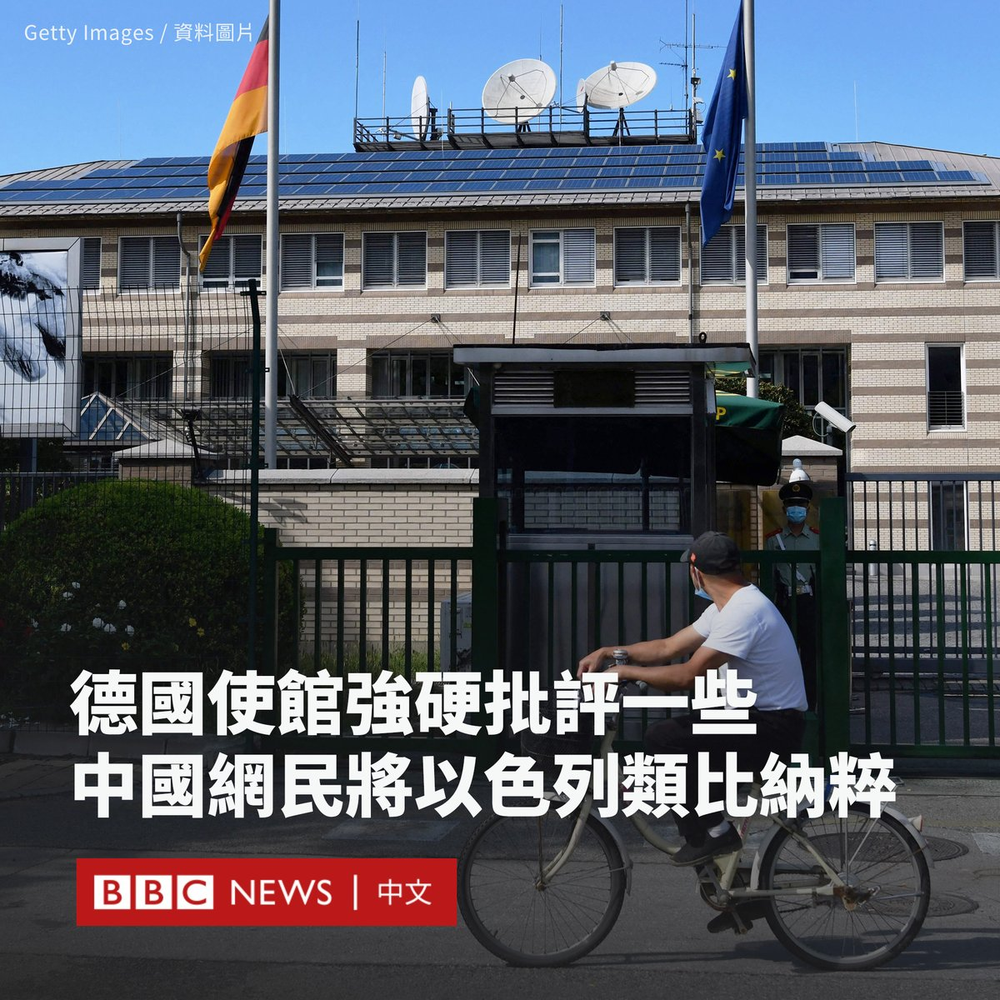

D英国广播公司BBC 北京时间 2023-10-26T23:45:45Z 1717568205135249719 乔治城大学亚洲法中心的数据分析指出，示威爆发起计首两年内，“反送中”示威相关案件的刑罚比“雨伞运动”严苛。 https://t.co/QlnkaJWfw3   D英国广播公司BBC 北京时间 2023-10-26T21:00:13Z 1717526545898590442 两名今年年初刚走马上任的重要部门部长在几个月后就被撤换，不断引发外界对于中国领导层的关注和猜测。

分析人士认为，尽管现有消息无法让人理解习近平罢免两人的考量，但该决定显示了他“不但有所不满，或许也对掌握局势的能力高度自信”。
https://t.co/nA8ubbJPkp   D英国广播公司BBC 北京时间 2023-10-26T19:41:29Z 1717506733252243850 联合国秘书长古特雷斯关于哈马斯袭击并非“凭空发生”的评论引起以色列不满，以色列官员要求他立即辞职。古特雷斯在周三表示，不接受他的话被“曲解”。
https://t.co/pfgazCa4jd   D英国广播公司BBC 北京时间 2023-10-26T16:53:32Z 1717464467808866660 随着中国网络上反对以色列的声音日益强烈，一些人甚至将以色列比作“纳粹”，德国驻华大使馆在微博发文斥责一些网民“无知”“无耻”。

德国驻华大使馆周二（10月24日）在一份声明中称，其允许网友发表批评性和有争议的评论，但将“不允许有美化纳粹主义的言论或者使用纳粹标志的行为存在”。

“随意地称呼别人为纳粹只会暴露自己的愚蠢。德国很不幸经历过纳粹主义肆虐的年代，我们深知那意味着什么。”声明写道。

大使馆还补充写道：“那些在头像里处心积虑地将以色列国旗与纳粹符号相结合的人不是无知的蠢货，就是无耻的混蛋！此类账户将被我们永久屏蔽。”

然而，德国大使馆的这番强硬表态招致了几乎一边倒的批评声。一条评论写道：“建议改名以色列国德意志省驻华办。”它收获了1.5万个赞。

还有网民评论说：“以色列和纳粹干的是同样的事情：种族灭绝。”

官方媒体《环球时报》评论员胡锡进批评该言论是“破防”和“失态”，称其是“第一个在中国土地上对中国人如此爆粗口的外国大使馆”。

在哈马斯和以色列冲突升级后，中国社交媒体上支持巴勒斯坦、反犹的情绪高涨。以色列驻华大使馆的微博遭到围攻。

许多网民还涌入西方国家的大使馆账号，留言指责这些国家的政府力挺以色列。一些激进的网友还将以色列国旗中的六芒星替换为二战时纳粹的符号。

1993年反战电影《辛德勒的名单》（Schindler's List）也成为受害者。这部讲述二战时拯救犹太人故事的电影在中国视频网站哔哩哔哩上遭到大量网友刷低分，从原来的9分以上滑落至最低时的4分。

许多网友指责以色列持续封锁和轰炸加沙，“受害者早就成为了加害者”。

德国总理肖尔茨（Olaf Scholz）在哈马斯袭击以色列后表示，德国将坚定站在以色列一边。

“以色列的安全现在是并将继续是德国行动的主要动机。”他说道。“我们自己的历史，我们因大屠杀而承担的责任使我们永远有义务维护以色列的存在和安全。”

德国法律严禁对纳粹进行美化和宣传，包括分享纳粹标志、行纳粹礼以及发表支持希特勒（Adolf Hitler）的言论，违者可能面临监禁或罚款。   D英国广播公司BBC 北京时间 2023-10-26T18:00:12Z 1717481242768417017 一位知名YouTuber在发布了一段标题为《不花钱游日本》（I Travelled Across Japan For Free）的影片后引起了当地民众不满，他就此道歉。

菲迪亚斯·帕纳约托（Fidias Panayiotou）的这条影片获得近50万次观看。他在影片中拍下了自己逃票和装作五星级酒店住客而获得早餐的过程。

这惹怒了很多日本人，一些网民留言呼吁把他逮捕，铁路公司也在考虑对他采取进一步的行动。

影片引起关注后，菲迪亚斯表示：“如果我们让日本人感到难过，我向他们道歉，这不是我们的目的。”

菲迪亚斯在他的YouTube频道上自称为“专业犯错者”，拥有240万订阅者。

《不花钱游日本》影片中还有另三位参与者，他们参加了这个价值一万美元的挑战，在不花钱的情况下，从日本长崎前往青森。

挑战期间，菲迪亚斯选择乘搭新干线，为了躲避检票人员一度躲进厕所。然后他假装生病，并跑去搭乘另一列火车。

此外，他还向陌生人乞讨巴士车费，但还差80日元（0.53美元）。结果，他被司机锁在巴士里并被带到警察局，被拘留了五小时后才被释放。

后来，他假装是酒店的住客以获取免费早餐。他对镜头说：“刚刚吃了一顿五星级自助式早餐，没有被抓住。”

目前尚不清楚该影片是何时拍摄的，以及菲迪亚斯和他的同伴是否仍在日本。

许多社交媒体用户要求菲迪亚斯删除他的影片以证明他的道歉是真诚的。截至周二（10月24日）中午，他的影片似乎已被删除。

在日本，人们很注重在公共场所的良好举止，恶作剧往往被视为无礼而不受欢迎。   D英国广播公司BBC 北京时间 2023-10-26T14:01:20Z 1717421133216027117 迈克·约翰逊，这个国际观众可能并不熟知的保守派共和党人在一天之内成为了美国众议院议长。他是何许人也？为何能成功地让分歧严重的共和党达成一致？
https://t.co/b7s1n6ocmy   D英国广播公司BBC 北京时间 2023-10-26T10:58:25Z 1717375097311211939 【最新消息】美国缅因州刘易斯顿（Lewiston）发生大规模枪击事件，美国媒体报道称至少有22人丧生，数十人受伤。

据报道，枪击案发生在保龄球馆和酒吧等多个地点。警方称，正在追捕一名在逃嫌疑人。 https://t.co/sYVm38ZFxQ   D英国广播公司BBC 北京时间 2023-10-26T12:09:30Z 1717392985456025663 中国国家主席习近平周三（10月25日）会见了加州州长加文·纽森（Gavin Newsom），两人讨论了在美中关系脆弱的情况下加强气候变化合作的问题。

此次会晤是纽森为期一周的访华行程的一部分。这是四年来首位访问中国的美国州长，也是自2017年以来习近平首次会见加州州长。

纽森在会后告诉记者，他与习近平深入和实质性地讨论了气候问题，同时他们还谈及以色列和致命药物芬太尼问题。

“除非美中两国携手合作，否则我们无法在气候变化问题上取得进展。”他补充说，美中关系存在“战略红线”，但双方都有能力处理好它们。

在中国官方电视台播出的画面中，习近平对纽森说：“（中美关系）活力在地方。我们可以在各个方面都努力去推动中美关系的发展，营造中美关系好的氛围。”

据报道，习近平还表示，中美在绿色发展、应对气候变化等领域合作潜力巨大，双方可以加强这方面合作，将其打造成中美关系发展“新亮点”。

尽管北京和华盛顿的关系正处于中美建交以来的低谷，但近月来中美官员和商界人士进行了一系列会晤。外界预计习近平和美国总统拜登（Joe Biden）将于11月在旧金山亚太经合组织（APEC）峰会上会面，但这尚未得到确认。

在去年美国时任众议院议长佩洛西（Nancy Pelosi）因访问台湾而激怒中国后，两国的气候合作陷入停滞，今年七月，美国气候特使约翰·克里（John Kerry）访问北京，期望推动恢复两国之间的气候合作。

纽森此行还访问了香港和深圳，并会见了中国最高外交官员王毅和国家副主席韩正。他还与中国国家发改委签署了一份“加强低碳发展和绿色转型合作”的谅解备忘录。

不过，纽森此行也受到人权组织和一些共和党议员的批评。包括前众议院议长麦卡锡（Kevin McCarthy）在内的共和党人呼吁他取消访问，指其回避了中国人权问题。   D英国广播公司BBC 北京时间 2023-10-26T09:20:45Z 1717350518404620700 被哈马斯掳走的超过200名以色列人质都是谁？BBC整理了他们的经历。https://t.co/2MIElNRGYS   D英国广播公司BBC 北京时间 2023-10-26T02:06:50Z 1717241322132632043 【最新消息】在三周的僵局之后，迈克·约翰逊（Mike Johnson）当选美国新一任众议院议长。共和党籍的约翰逊被视为是前总统特朗普（Donald Trump）的盟友。 https://t.co/Bq9o6oEKHL   