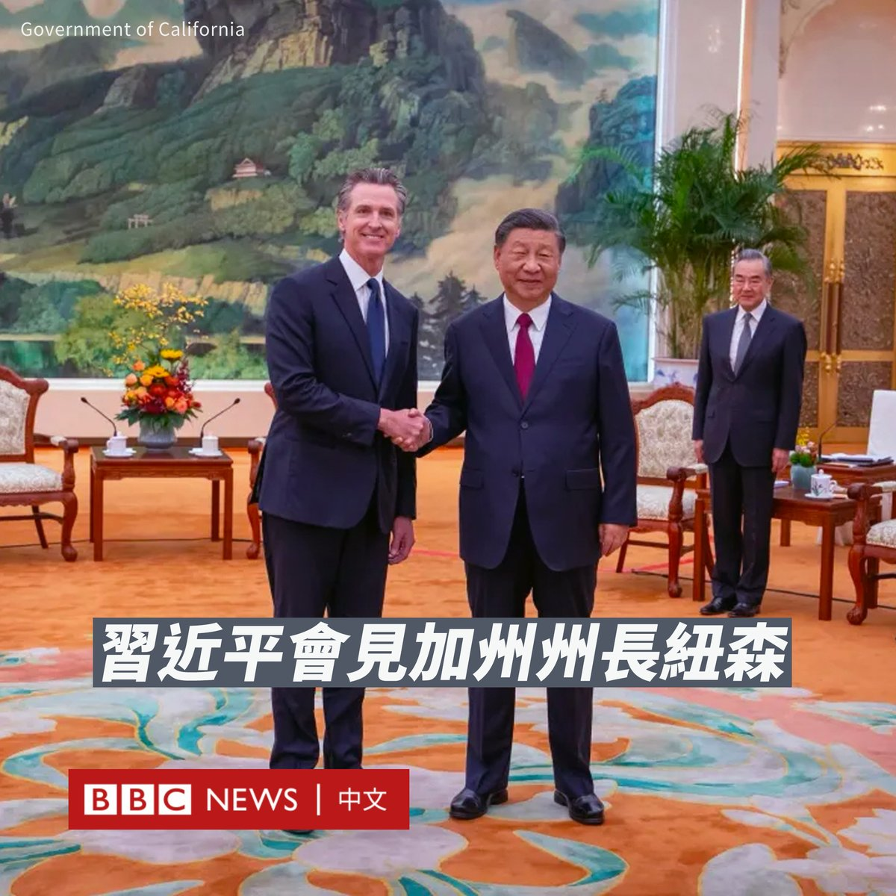

D英国广播公司BBC 北京时间 2023-10-26T12:09:30Z 1717392985456025663 中国国家主席习近平周三（10月25日）会见了加州州长加文·纽森（Gavin Newsom），两人讨论了在美中关系脆弱的情况下加强气候变化合作的问题。

此次会晤是纽森为期一周的访华行程的一部分。这是四年来首位访问中国的美国州长，也是自2017年以来习近平首次会见加州州长。

纽森在会后告诉记者，他与习近平深入和实质性地讨论了气候问题，同时他们还谈及以色列和致命药物芬太尼问题。

“除非美中两国携手合作，否则我们无法在气候变化问题上取得进展。”他补充说，美中关系存在“战略红线”，但双方都有能力处理好它们。

在中国官方电视台播出的画面中，习近平对纽森说：“（中美关系）活力在地方。我们可以在各个方面都努力去推动中美关系的发展，营造中美关系好的氛围。”

据报道，习近平还表示，中美在绿色发展、应对气候变化等领域合作潜力巨大，双方可以加强这方面合作，将其打造成中美关系发展“新亮点”。

尽管北京和华盛顿的关系正处于中美建交以来的低谷，但近月来中美官员和商界人士进行了一系列会晤。外界预计习近平和美国总统拜登（Joe Biden）将于11月在旧金山亚太经合组织（APEC）峰会上会面，但这尚未得到确认。

在去年美国时任众议院议长佩洛西（Nancy Pelosi）因访问台湾而激怒中国后，两国的气候合作陷入停滞，今年七月，美国气候特使约翰·克里（John Kerry）访问北京，期望推动恢复两国之间的气候合作。

纽森此行还访问了香港和深圳，并会见了中国最高外交官员王毅和国家副主席韩正。他还与中国国家发改委签署了一份“加强低碳发展和绿色转型合作”的谅解备忘录。

不过，纽森此行也受到人权组织和一些共和党议员的批评。包括前众议院议长麦卡锡（Kevin McCarthy）在内的共和党人呼吁他取消访问，指其回避了中国人权问题。   D英国广播公司BBC 北京时间 2023-10-26T09:20:45Z 1717350518404620700 被哈马斯掳走的超过200名以色列人质都是谁？BBC整理了他们的经历。https://t.co/2MIElNRGYS   D英国广播公司BBC 北京时间 2023-10-26T02:06:50Z 1717241322132632043 【最新消息】在三周的僵局之后，迈克·约翰逊（Mike Johnson）当选美国新一任众议院议长。共和党籍的约翰逊被视为是前总统特朗普（Donald Trump）的盟友。 https://t.co/Bq9o6oEKHL   