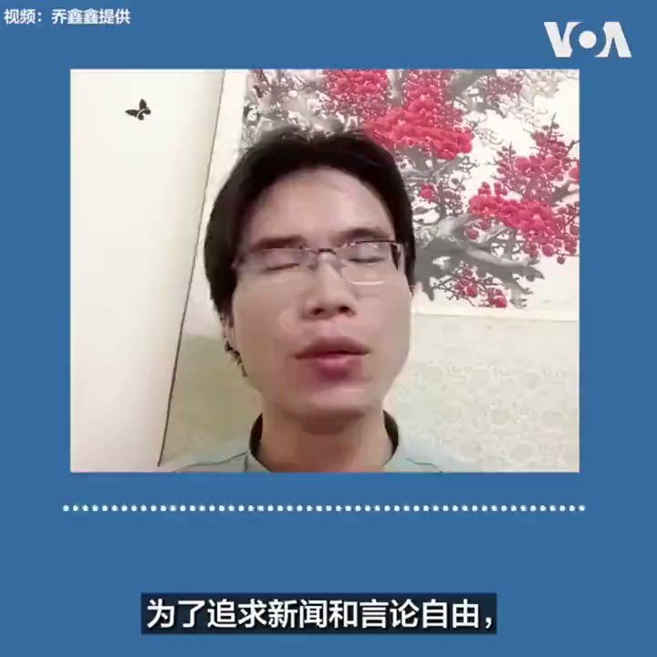

拆墙运动公号 北京时间 2023-10-26T04:07:59Z 1717271809790300489 美国之音采访 #拆墙运动 发起人 #杨泽伟 ，他这样说：为了追求新闻和言论自由，我们发起一个让全世界参与拆除中国 #互连网防火墙 的一个运动。中共统治中国主要是靠谎言， #防火墙 就是中国政府用谎言统治的工具。至2000年以来，中国就是世界上最大的电子监狱，中国政府每年花费60亿美金打造了中国 #互连网防火墙。封锁谷歌、推特、BBC、CNN等全球31万个网站，造成大家只能够接受中国政府的洗脑信息、、、、、、
迫使人们无端端的仇美、反日、攻台，造成全球的冲突连绵不断、、、、、、
我们要通过不断的写帖和举牌来引起大家不断的在网上热议，方便我们接下来去海牙国际法庭进行控告，去各个议会进行游说，从而达到拆墙的效果！   