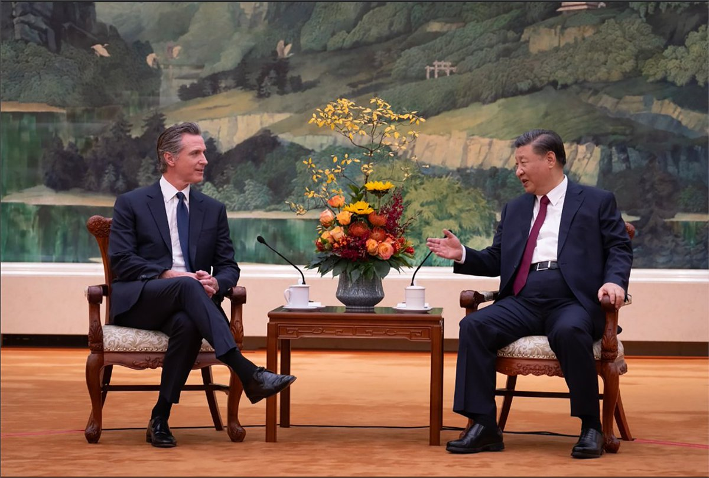

自由亚洲电台 北京时间 2023-10-26T06:00:06Z 1717300026492453148 加州州长 ＃纽森访华　＃习近平 释放与美缓和信息
https://t.co/T7YA9GJuFS https://t.co/sS8xXHhJIU   自由亚洲电台 北京时间 2023-10-26T02:54:18Z 1717253266344677430 奇怪的是北京至今仍然没有对 #李尚福 或者 #秦刚 的落马给出解释。 https://t.co/fOr6dfWS4j   自由亚洲电台 北京时间 2023-10-26T04:02:46Z 1717270495157260343 #事实快查｜#以哈冲突 中的热传视频：#哈马斯童军 突袭警局？#加沙 孩子饿到吃草？
 https://t.co/reWh22BJvC   自由亚洲电台 北京时间 2023-10-26T00:50:04Z 1717222001402957907 iPhone 15 Pro Max机型零部件的比重，按成本计算: 
美系零部件占比约33%居首；
韩系占比约29%居次;
日系比重维持在10%，排名第三；
台湾供应的零部件比重扩增至9%;
中国供应的零部件占比则萎缩到了2%
印度占比升高，未来可能取代中国，成为新的 #苹果产业链 全球生产中心? https://t.co/bozxXK6eQi   自由亚洲电台 北京时间 2023-10-26T01:18:26Z 1717229142448787634 10月25日，国务院办公厅公布2024年部分节假日安排。其中最引人关注的是春节2月10日至17日放假调休，共8天。2月4日(星期日)、2月18日(星期日)上班。
官媒强调 #2024春节放8天假 ，但网民热议的是 #除夕不放假。
做个小调查，您喜欢这样的春节放假安排吗？为什么？   自由亚洲电台 北京时间 2023-10-26T01:35:04Z 1717233326145393002 对于 #中国新防长人选，目前外界众说纷纭。路透社12日曾引用多名知情人士透露，长年任职参谋首长职务的 #刘振立，最有可能接替李尚福出任国防部长。《明报》随后报导则指，为求稳定，不排除由习近平亲信、排名第2的中央军委副主席 #何卫东 兼任国防部长。 https://t.co/8sq2X3eDHh   自由亚洲电台 北京时间 2023-10-26T02:09:51Z 1717242080886440264 RT @RFA_Chinese: 10月25日，国务院办公厅公布2024年部分节假日安排。其中最引人关注的是春节2月10日至17日放假调休，共8天。2月4日(星期日)、2月18日(星期日)上班。
官媒强调 #2024春节放8天假 ，但网民热议的是 #除夕不放假。
做个小调查，您…   自由亚洲电台 北京时间 2023-10-26T02:10:15Z 1717242183361675312 RT @RFA_Chinese: #事实查核｜#美国 把 #高铁 建成了"慢铁"？
 https://t.co/gUluPGV9e0   自由亚洲电台 北京时间 2023-10-26T02:21:46Z 1717245077997916552 加拿大与台湾共同宣布完成“投资促进及保障协议”（FIPA）谈判，很快就会签署协定。由於加拿大是明年《#全面与进步跨太平洋伙伴关系协定》CPTPP轮值主席国，台湾政府和一些学者相信这有助台湾加入 #CPTPP，也有学者认为，中国没有资格加入CPTPP。

 https://t.co/iYdiIurx0c   自由亚洲电台 北京时间 2023-10-26T00:06:39Z 1717211074305646743 中国 #医保 费二十年增近四十倍　
要不要 #退保，这对很多人来说已不是一个问题
去年2517万人退保
 https://t.co/FcfJ64QAki   