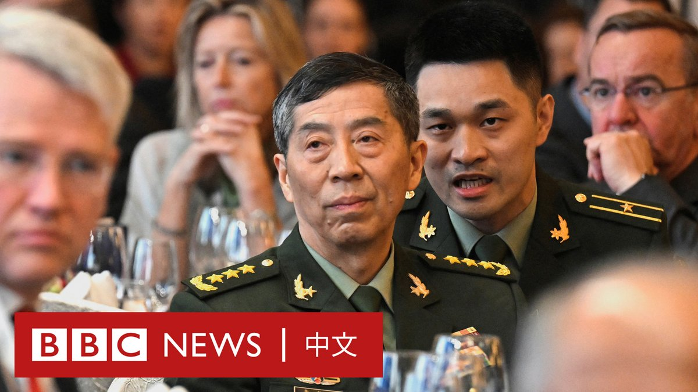
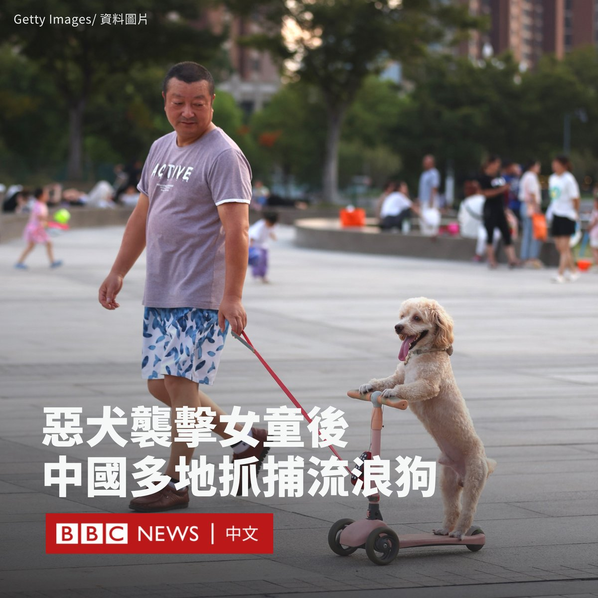
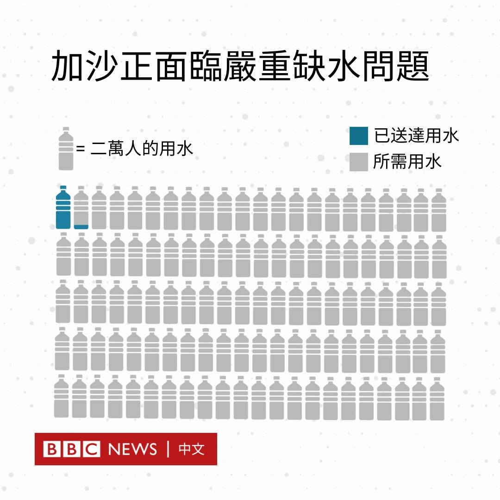
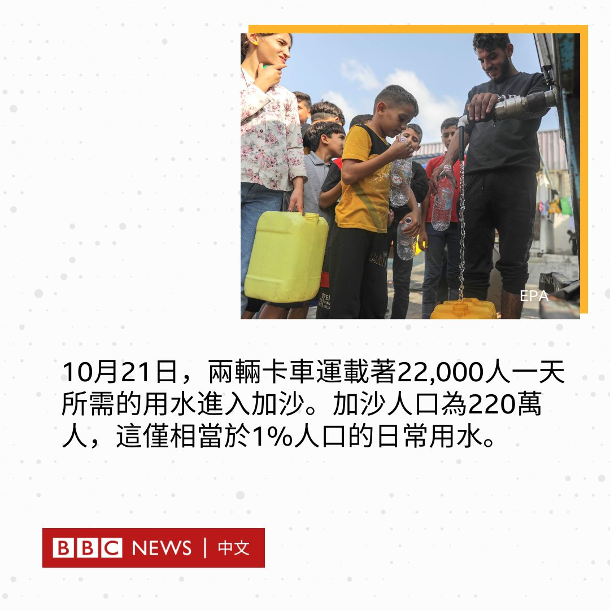
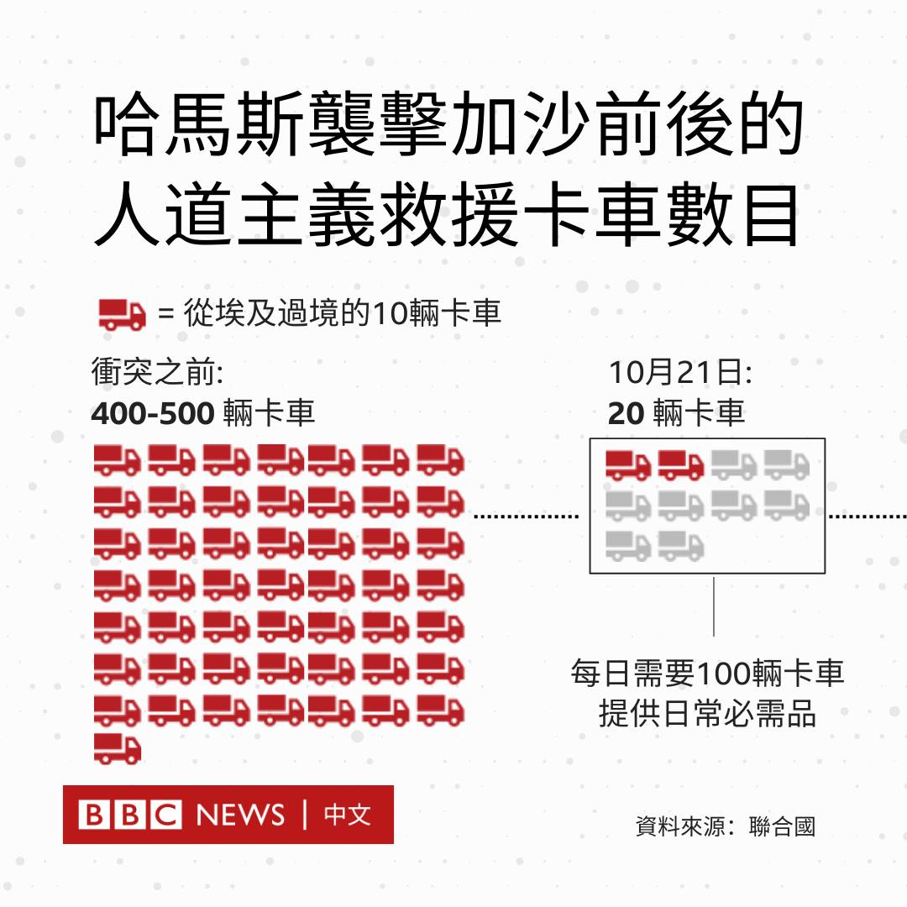
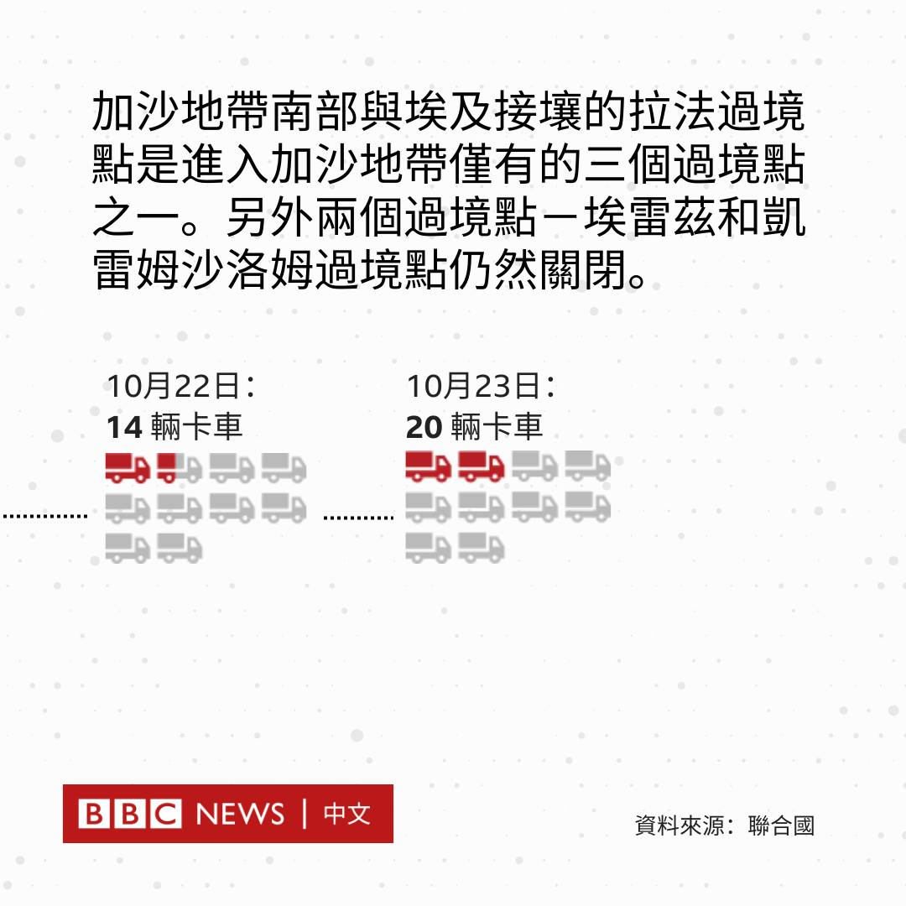
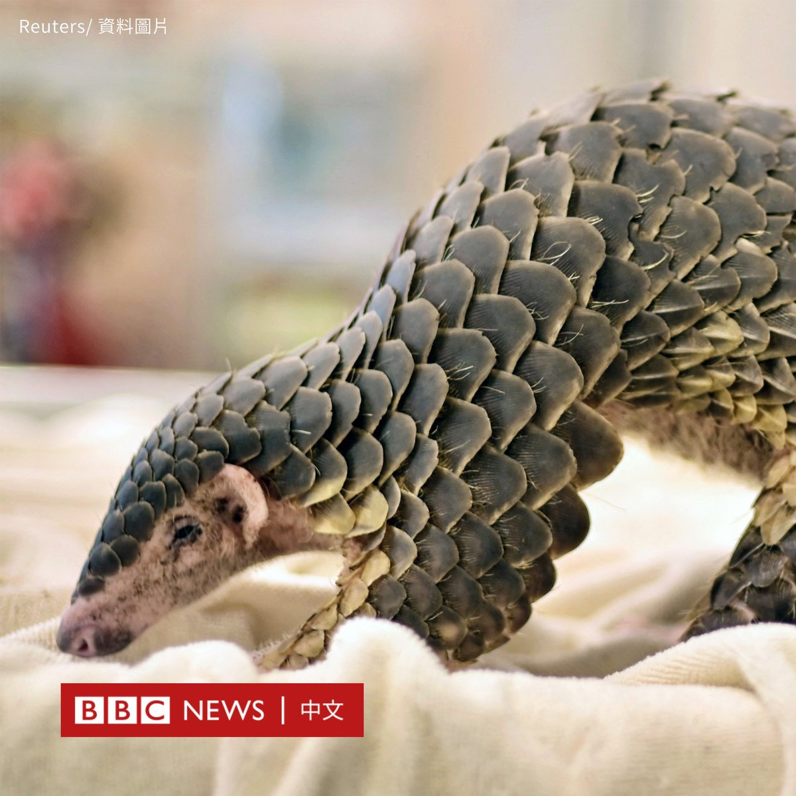

D英国广播公司BBC 北京时间 2023-10-25T20:44:39Z 1717160241379369472 香港特首李家超发表其任内第二份施政报告，尽管以“拼经济谋发展，惠民生添幸福”为题，但他将维护国安政策放在首位，确认将在2024年内完成备受争议的《基本法》第23条立法。https://t.co/jMrMw2YfWn   D英国广播公司BBC 北京时间 2023-10-25T19:28:39Z 1717141115747418520 中国刚上任七个月的国防部长李尚福被免职，当局没有说明原因和接替他的人选。这是习近平在三个月内第二次突然撤换为其第三届政府亲手挑选的内阁官员。 https://t.co/R6q09ezkTl   D英国广播公司BBC 北京时间 2023-10-25T16:56:04Z 1717102716466663879 在四川一名两岁女童被一条恶犬咬伤后，中国多地开始对流浪狗和未登记的大型犬展开打击行动，在社交媒体引发广泛关注。

上周，一段两分钟的影片震动了中国的互联网。画面显示，在一个居民小区里，一只黑色罗威纳犬扑向一名幼童，她的母亲奋力抵挡狗的撕咬，直到另两名路人用棍子协力将狗赶走。

这个蹒跚学步的孩子肾脏挫裂，肋骨骨折，全身被多处咬伤。据报道，她的生命体征平稳。狗的主人被警方拘留。

在该事件后，四川和中国其他省份的多个城市都宣布，将加强针对流浪狗和宠物狗的管理措施，包括对流浪狗进行捕杀。

在山东、江西、河南和湖北省，都有市政部门展开流浪狗抓捕行动。江西新余市表示，如果没有主人认领，被捕获的流浪狗将被杀死。

河南沈丘县宣布，在公共场所发现的大型犬和烈性犬将被收缴，并对主人处以人民币最高一万元的罚款。

四川峨边县当局也警告称，凡是在公共场所发现的未栓养和无人看管的犬只，一律视为流浪犬进行捕捉。

然而，一些过度和残酷的抓捕行为在社交媒体引发反弹，有批评者指责这属于“一刀切”的懒政，还有人呼吁当局应该通过《动物保护法》立法，减少遗弃和虐待行为。

在一起案件中，保安和房东强行闯进租客的办公室，杀死了租客的两只狗。在辽宁省的一所学校，一名保安在校园里将流浪狗活活勒死，他后来被解雇。

一些中国明星也对此发声。杨迪表示，“请求大家都善良些，合理处置，不要虐杀！”

还有地方政府正在免费发放宠物牵引绳和嘴套，并进行文明养犬宣传教育，以试图解决问题的根源。   D英国广播公司BBC 北京时间 2023-10-25T18:07:24Z 1717120666858611128 有数以万计的泰国人曾在以色列农场打工。在这次哈马斯袭击后，一些死里逃生的泰国人誓言永不回头，也有人却期盼战争结束后重返以色列。https://t.co/DLKBiGJJuh   D英国广播公司BBC 北京时间 2023-10-25T14:05:51Z 1717059881113702657 以色列对加沙持续的空袭已经摧毁了该地大部分的社区，加沙正面临严重缺水问题。

尽管第二批救援物资于10月22日进到加沙，但联合国近东巴勒斯坦难民救济和工程处（UNRWA）称，其收容所已人满为患，燃料和药品也即将耗尽。

加沙的人道援助，还需要多少？

相关报导：https://t.co/bE0eNdiSQ1 https://t.co/BVKIdJJOs3   D英国广播公司BBC 北京时间 2023-10-25T11:54:36Z 1717026851191959985 英国环保组织环境调查署（EIA）发布报告指，全球银行业巨头正在投资将豹子和穿山甲入药的中药企业。这两种动物都被列为濒危物种。

环境调查署发现，有62家银行和金融机构投资于三家药企，后者正在生产的产品中有九种据称含有豹子或穿山甲成分。

这些公司包括汇丰银行（HSBC）、保诚集团（Prudential）和励正（Legal & General）等英国金融服务巨头，以及高盛（Goldman Sachs）、瑞银（UBS）、德意志银行（Deutsche Bank）和贝莱德（BlackRock）等全球投资公司。

豹子和穿山甲都是濒危物种，这两种动物也被列入《濒危野生动植物种国际贸易公约》（CITES），该公约禁止对它们及其部分进行国际商业贸易，以确保它们在野外的生存免受威胁。

环境调查署报告中重点提到的三家药企分别是同仁堂集团、天津医药集团和吉林敖东药业集团。

环境调查署报告中列出的公司并非都投资于这三家公司，但它们都至少投资了其中一家。

报告发布后，环境调查署的法律与政策专家阿维纳什·巴斯克（Avinash Basker）呼吁中国政府“履行《濒危野生动植物种国际贸易公约》的建议，禁止在国内市场上将各种来源的豹子、穿山甲、老虎和犀牛的身体部位用于任何商业目的”。

@BBCWorld 英文报道：https://t.co/24kQui6zzj   D英国广播公司BBC 北京时间 2023-10-25T09:44:56Z 1716994217094918147 最近，新一轮南海争端正在电视媒体的镁光灯下展开，许多记者拍摄到菲律宾和中国船只近距离“相撞”的画面。

这并非偶然，而是菲律宾政府有意采取的战略之一，中国起初似乎对这些新战术感到措手不及。https://t.co/FKp6LLbJyr   