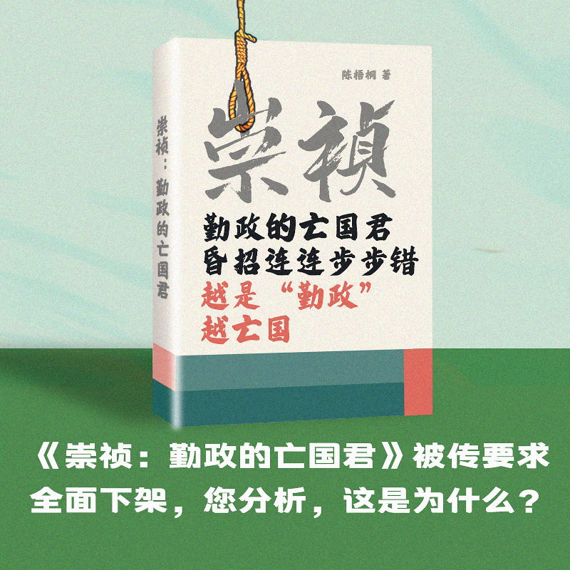

自由亚洲电台 北京时间 2023-10-25T17:41:54Z 1717114249808634350 【台湾退役空军上校吸收军官当 #共谍】
【7人判刑最重20年6月】
【涉案军官赫见积欠赌债“夫妻档”】
综合台湾媒体报道，台湾刘姓空军退役上校被控吸收7名现职校级军官为中国刺探军情，经台湾高等检察署高雄分署依违反国家机密保护法等罪起诉后，高等法院高雄分院25日宣判，7名现役和退役军官分别被判20年6月到2年徒刑不等，为近来台湾的共谍案判决最重的案件。报道：https://t.co/BaLMdo1j4d   自由亚洲电台 北京时间 2023-10-25T11:08:10Z 1717015165479109069 RT @RFA_Chinese: 【#您怎么看】据台媒报道，上海文汇出版社于今年9月再版的书籍《崇祯：勤政的亡国君》传出了全面下架的消息，理由是“因印制问题”。其封面推广语写道，“勤政的亡国君，昏招连连步步错，越是‘勤政’越亡国”、“翻开本书，看懂崇祯皇帝如何一步步把自己逼上绝…   自由亚洲电台 北京时间 2023-10-25T13:13:24Z 1717046680451948717 【#科大讯飞 学习机涉“#辱毛”遭举报】
【股票市值蒸发120亿】

科大讯飞的股价本周二大跌至停板，收市报46.7元，下跌近一成。前一天，该公司旗下的学习机被指涉嫌“诋譭”中共已故领导人毛泽东，发动文化大革命残酷打击异己等等的内容。一学生家长说，在自家孩子的科大讯飞学习机中“发现了一些诋毁伟人、扭曲历史等违背主流价值观的内容。”他联系了科大讯飞的在线客服，被告知“这个文章都是审核过的”。详细报道：https://t.co/fEHjb95fQG   自由亚洲电台 北京时间 2023-10-25T11:08:38Z 1717015280986055054 RT @RFA_Chinese: 正在中东访问的中国政府中东问题特使翟隽周日对外表示，中国对加沙的形势感到非常担忧，并称将向巴勒斯坦提供紧急人道援助。但与此同时，国际社会也注意到，中国政府拒绝谴责造成这次以哈冲突的恐怖主义组织哈马斯。而这让外界质疑中国政府在这场冲突中的真实立场…   自由亚洲电台 北京时间 2023-10-25T11:27:04Z 1717019922235334970 【英国防委员会发布印太报告】
【要求英政府为中国对台行动拟反应计划】

根据中央社24日发自伦敦的消息，英国国会下议院国防委员会24日发布“英国防卫与印太区域”（UK Defence and the Indo-Pacific）报告，要求英国政府及武装部队与盟友伙伴协调，为中国一系列可能的对台行动拟定反应计划，并以机密会议形式，向委员会说明相关计划。报道 :https://t.co/CXcNedSETO   自由亚洲电台 北京时间 2023-10-25T04:53:26Z 1716920859603165210 欢迎收听和订阅播客【亚太报道（2023-10-24）】 
https://t.co/MjLNSvVMqc
#王毅将会 #布林肯/翟隽斡旋 #中东 再次站在西方对立面？/#中国 展开16省督查防 #歧视民企/中国将发行1万亿人民币 #国债/#三菱 汽车退出中国市场 https://t.co/9223Wv2YhQ   自由亚洲电台 北京时间 2023-10-25T04:22:19Z 1716913027235344586 两面永久性的连侬墙和涂鸦墙日前在美国南加州 #自由雕塑公园 落成。自由雕塑公园创办人 #陈维明 表示，这两座墙体的建设，将为自由雕塑公园提供一处供人们自由表达观点的场地。 https://t.co/2ajP39Ym0Y   自由亚洲电台 北京时间 2023-10-25T04:23:03Z 1716913211583402234 美国财政部表示，美中两国官员周一（23日）举行了长达两个小时的线上会议，讨论国内和全球宏观经济发展，并称会议“富有成效且具有实质性”。 https://t.co/F7FsDODRxY   自由亚洲电台 北京时间 2023-10-25T04:53:54Z 1716920979371458891 正在中东访问的中国政府中东问题特使翟隽周日对外表示，中国对加沙的形势感到非常担忧，并称将向巴勒斯坦提供紧急人道援助。但与此同时，国际社会也注意到，中国政府拒绝谴责造成这次以哈冲突的恐怖主义组织哈马斯。而这让外界质疑中国政府在这场冲突中的真实立场。 https://t.co/YIzHHgKKGa   自由亚洲电台 北京时间 2023-10-25T04:55:22Z 1716921347266564219 本周二，美国国会及行政当局中国委员会（CECC）针对 #中国 海鲜供应链的 #强迫劳动 问题举办了听证会，与会议员及专家共同针对 #中国渔业 #过度捕捞，以及相关产业侵害劳工 #人权 的问题表达了担忧。 https://t.co/Lym1SGDfrS   自由亚洲电台 北京时间 2023-10-25T05:38:50Z 1716932285713575961 【#您怎么看】据台媒报道，上海文汇出版社于今年9月再版的书籍《崇祯：勤政的亡国君》传出了全面下架的消息，理由是“因印制问题”。其封面推广语写道，“勤政的亡国君，昏招连连步步错，越是‘勤政’越亡国”、“翻开本书，看懂崇祯皇帝如何一步步把自己逼上绝路”。
您分析，“崇祯”为何被下架？ https://t.co/E8BvbvvXXI   自由亚洲电台 北京时间 2023-10-25T05:39:31Z 1716932456711074108 《中华人民共和国爱国主义教育法》即将实施，从草案推出到通过耗时四个月，明年起生效。该法案通过的时机以及对中国社会将产生何种影响？ https://t.co/Gogsxq0Eop   自由亚洲电台 北京时间 2023-10-25T01:24:46Z 1716868348443832777 因"煽动颠覆国家政权"罪成被判刑四年的中国 #异议诗人 #王藏（本名：王玉文）服刑的情况一直不为人所知。他的妻子王丽（本名：王利芹）首次披露，丈夫怀疑遭受狱方特殊对待，包括无法与家属近距离接触，原因是王臧拒绝放弃信念。 https://t.co/metm3aNbhr   自由亚洲电台 北京时间 2023-10-25T01:25:55Z 1716868637125190073 随着五角大楼向美国国会提交的本年度《#中国军力报告》于上周出炉，美国国防部高级官员本周表示，#中国 正在快速扩张其 #核力量，但解放军内部贪腐问题将影响其现代化进程，甚至波及核武项目的继续扩张。 https://t.co/zifaqd0JaV   