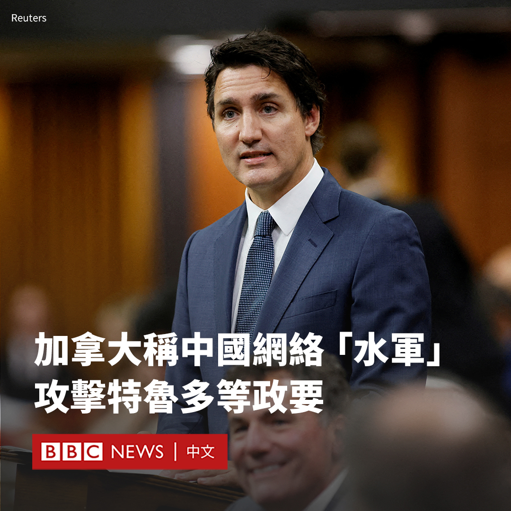

D英国广播公司BBC 北京时间 2023-10-24T10:56:43Z 1716649895082484085 加拿大表示，该国侦测到了一场可能与中国有关的虚假信息运动，目标包括总理特鲁多（Justin Trudeau）等数十名加拿大政界人士。

加拿大外交部表示，该运动利用一波又一波的网络发帖来抹黑加拿大议员，压制对北京的批评。

中国表示加拿大的指控是一种污蔑和抹黑，指责加拿大“颠倒黑白”。

中国驻加拿大使馆发言人周二（10月24日）在一份声明中说：“加方在拿不出任何直接和实质性证据的情况下，多次诬称中方散布针对加政客的虚假信息，加此举本身就是散布虚假信息。”

加拿大外交部表示，其用于监控外国政府支持的虚假信息活动的快速反应机制（Rapid Response Mechanism），在8月发现了一场与北京有关的“spamouflage”（垃圾信息伪装）活动。

该部门表示，这场运动在9月初加速进行，通过机器人账号网络，在几位加拿大政客的社交媒体账户上用英语和法语“留下数以千计的评论”。

加拿大外交部表示：“spamouflage还包括使用可能是‘深度伪造’的影片，这些影片经过人工智能进行数字修改，以个人为目标。”

加拿大官员表示，这些账户还参与传播有关今年8月夏威夷大火的虚假信息，谎称这些野火是由美军的秘密“气象武器”引起。

官员表示，除了特鲁多之外，这场运动还针对反对党保守党领袖博励治（Pierre Polievre）和多名内阁官员。

加拿大外交部表示，已就这些帖子通知了受影响的社交媒体平台，目前“大部分活动和网络被移除”。   D英国广播公司BBC 北京时间 2023-10-24T11:29:08Z 1716658052084953479 【BBC独家“加沙日记”】BBC找到加沙南部城市汗尤尼斯（Khan Younis）两名苦苦寻找庇护所的人，透过他们的视频日记来反映当前战火下的真实生活。

据联合国统计，自10月7日以来，加沙地带已有60多万人离开家园。 https://t.co/9OPQav7A2P   D英国广播公司BBC 北京时间 2023-10-24T08:02:03Z 1716605938352710073 相熟兽医透露，获吉尼斯世界纪录认证为“史上最长寿狗狗”的纯种阿兰多獒犬Bobi，于10月21日在葡萄牙家中逝世，享寿31岁又165日，约相当于人类的217岁。

饲主Leonel Costa曾说，Bobi的长寿秘诀包括从来不被链子绑起来，还有跟饲主一家吃一样的食物。

@BBCWorld 英文报道： https://t.co/wndp8YBwQx https://t.co/94HLiwR9KL   D英国广播公司BBC 北京时间 2023-10-24T01:09:31Z 1716502120801931739 美国一名休班飞行员涉嫌意图蓄意撞毁客机，10月23日被起诉83项意图谋杀罪。美国联邦调查局（FBI）初步表示，案件“不涉及持续威胁”。

涉事航班为阿拉斯加航空AS2059，原订22日美西夏令时间17:25（23日00:25 GMT；京港台时间08:25）从华盛顿州埃弗里特（Everett, Washington）起飞往加州旧金山，原订于19:30到达。飞行员报告有人试图将飞机引擎熄火后，转飞俄勒冈州波特兰（Portland, Oregon）备降。

警察检控文件显示，嫌犯是44岁的艾玛森（Joseph David Emerson），相关官员表示，他在飞机降落波特兰后被制服。航空公司发表声明称，他当时坐在驾驶舱内的待命座席上，与执勤的机长和副机长在一起。

客机于19:18从波特兰起飞，最终将全体80名乘客送到目的地。

@BBCNorthAmerica 英文报道： https://t.co/OBNpkqeRVK   