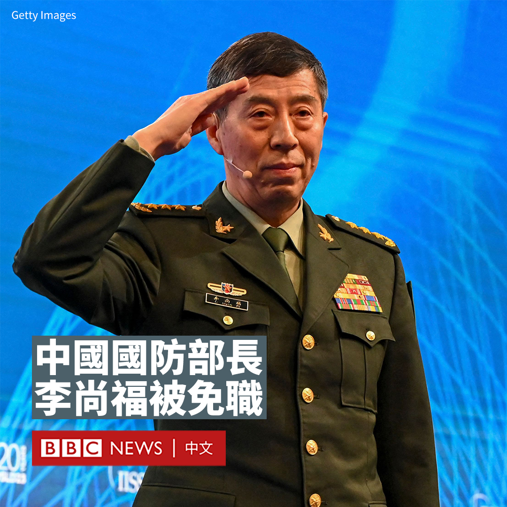
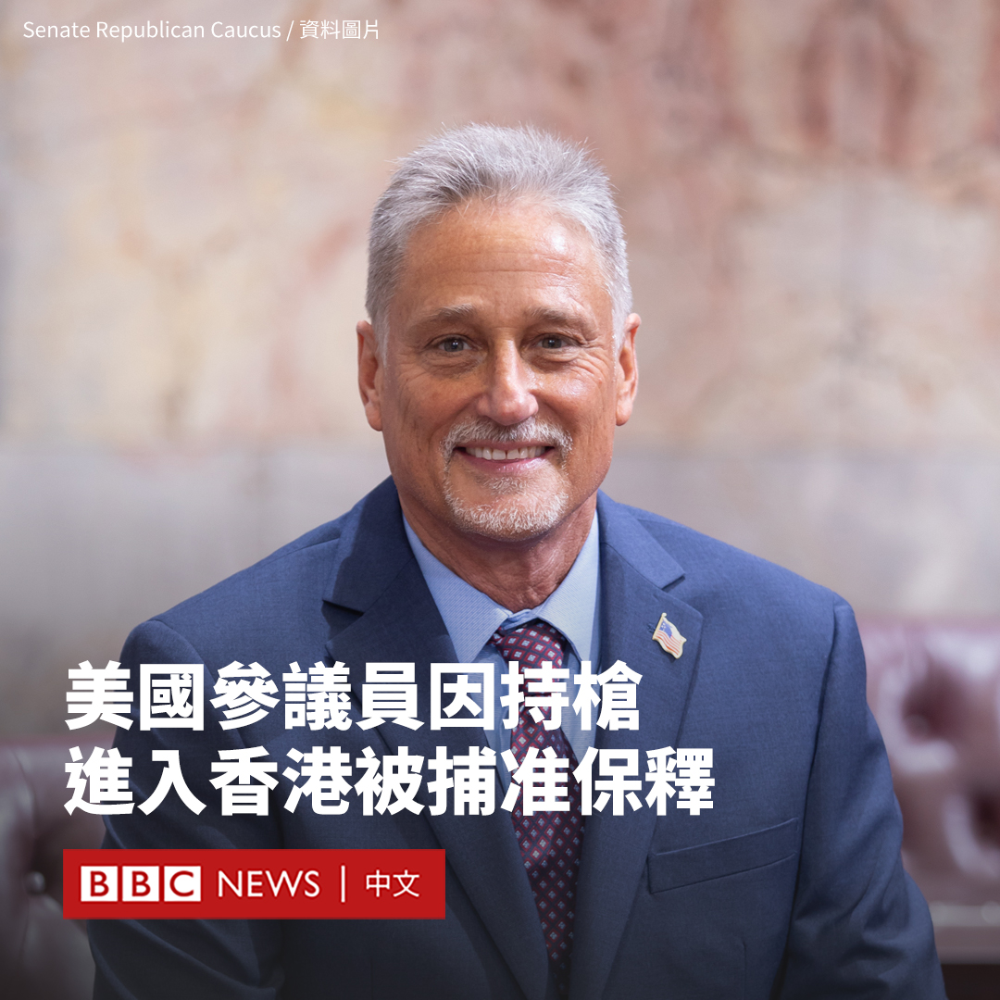
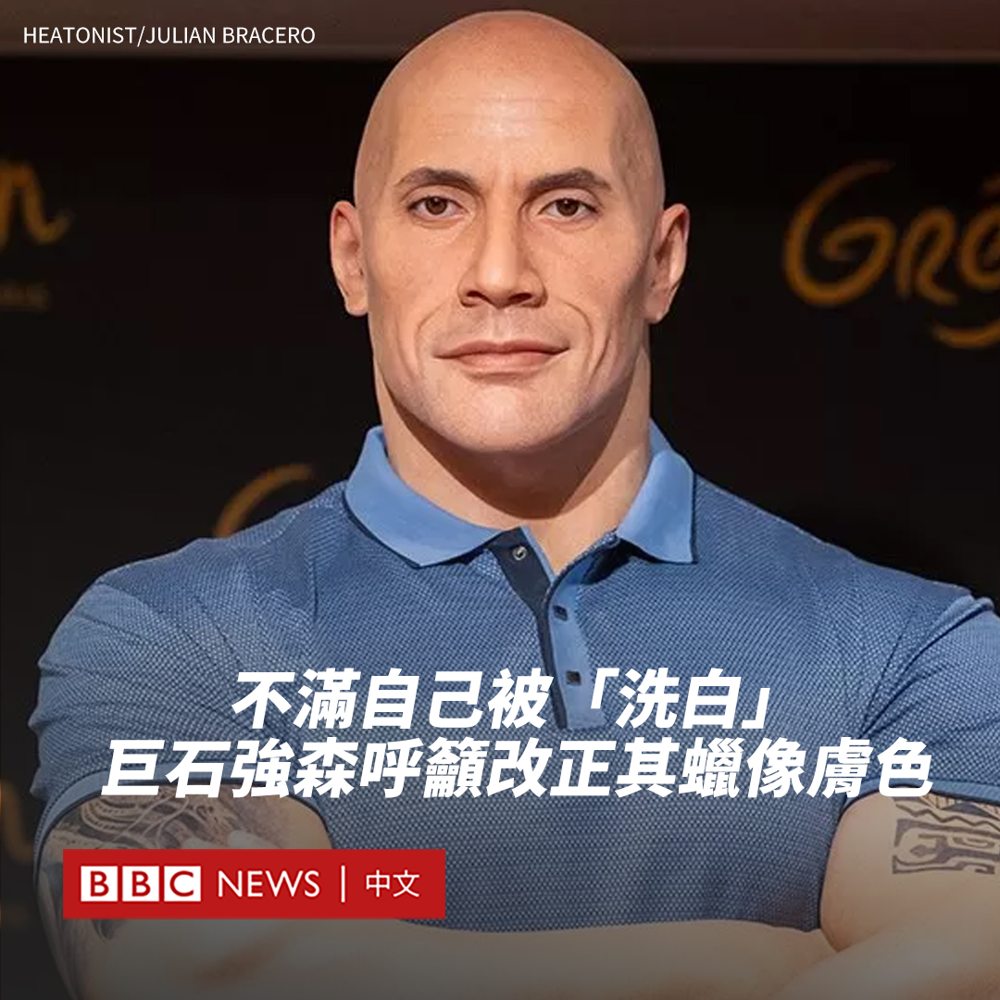
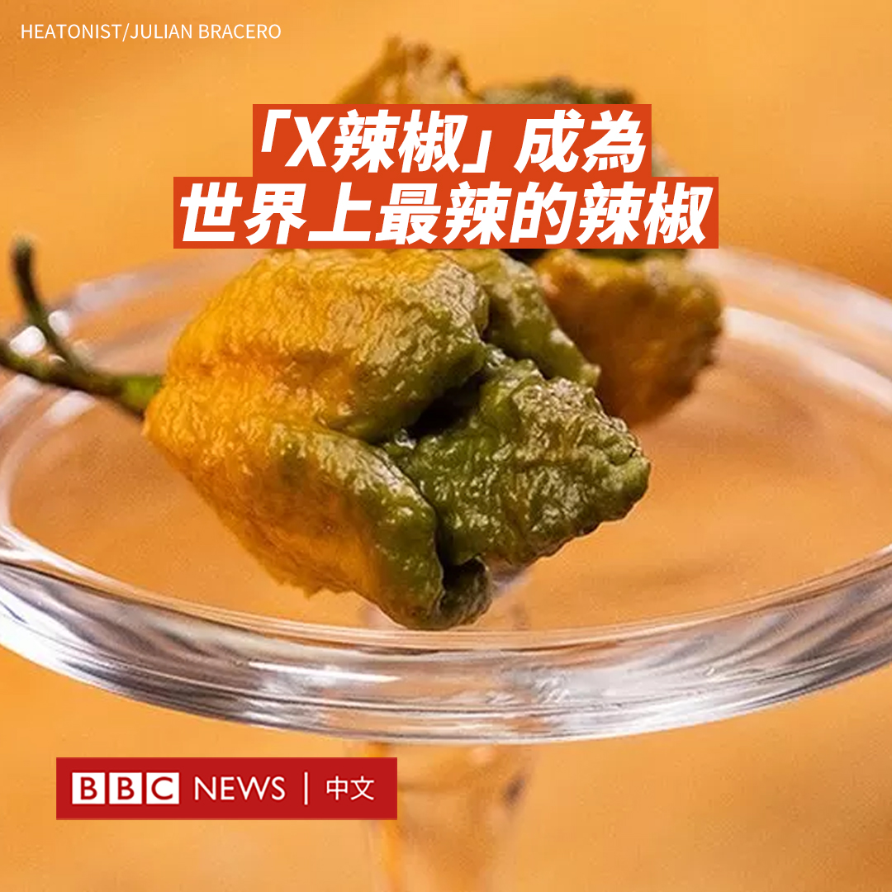

D英国广播公司BBC 北京时间 2023-10-24T21:00:06Z 1716801741029576828 美国已承诺毫不动摇地支持以色列，并以军事援助表决心。但鉴于该地区过往的纠葛至今仍挥之不去，美国参与其中的限度会在哪里？https://t.co/X7HwTUwbPp   D英国广播公司BBC 北京时间 2023-10-24T19:48:54Z 1716783824611496290 中国宣布国防部长李尚福被免职，此前他已从公众视野中“消失”近两个月，持续缺席多场活动。

官方媒体中央电视台在《新闻联播》节目中宣布了全国人大常委会的这一决定，但没有解释原因，也没有宣布接替人选。

早前被免去外交部长一职的秦刚也被免去兼任的国务委员职务。

65岁的李尚福于今年3月被任命为国防部长，仅七个月后就被免职，在中国政坛中很罕见。美国官员曾表示，李尚福正在接受北京的调查。

路透社也曾引述消息人士报道，指李尚福是因军备采购问题而遭到当局调查，但中国政府此前一直拒绝公开透露他的下落。

李尚福最后一次公开现身是8月29日，当时他在北京举行的中非和平安全论坛上发表演说。

李尚福于1958年出生。中国官方媒体报道称，他的父亲曾是中国人民解放军铁道兵西南指挥部的一名副司令员。

他曾在隶属于中国解放军的西昌卫星发射中心工作了三十多年，负责中国探月工程的火箭发射任务。

2016年，他出任解放军战略支援部队副司令员兼参谋长。2017年，他担任中央军委装备发展部部长。2018年，美国曾因中国军队采购俄罗斯武器，对当时主管装备工作的李尚福实施制裁。

2022年10月，他当选为第二十届中共中央军委委员。

在中国，国防部长并不拥有绝对的决策权，更多地负责国防外交工作。在最高军事机构中央军委中，两名副主席张又侠与何卫东排名在他之上。   D英国广播公司BBC 北京时间 2023-10-24T16:47:59Z 1716738296146186628 一名美国华盛顿州参议员因携带枪支在入境香港时被捕，他获准交保外出，但不得离开香港。

据报道，这位名叫杰夫·威尔逊（Jeff Wilson）的共和党籍参议员上周六（10月21日）在香港国际机场被拘捕，原因是其行李内有一支左轮手枪。

他被控无牌管有枪械罪，最高可判处14年监禁，并罚款12,800美元。

据香港媒体报道，威尔逊周一（10月23日）在沙田裁判法院首次出庭，他获准以两万元交保外出。该案将于下周一继续开庭审理。

在一份声明中，威尔逊表示这是一个“无心之过”。威尔森表示，他正和妻子前往东南亚度假。

声明称，威尔逊是在旧金山到香港的飞机上在公文包中发现了这把武器。在落地后，他“立即”向海关报告了该情况。

声明补充称，他的枪在华盛顿州注册。

在华盛顿州，无需许可证亦可公开携带长枪和手枪，而香港对枪械有严格的管制，必须拥有牌照才能持枪。   D英国广播公司BBC 北京时间 2023-10-24T12:46:28Z 1716677514842780018 在以色列的撤离命令下，大批加沙北部居民涌进南部城市汗尤尼斯（Khan Younis）。BBC找到了两位在这里苦苦寻找庇护所的人，透过他们的视频日记来反映当前战火下的真实生活。

据联合国统计，自10月7日以来，加沙地带已有60多万人离开家园。 https://t.co/OW7Y75JzbZ   D英国广播公司BBC 北京时间 2023-10-24T15:42:40Z 1716721858538869126 “巨石”强森（Dwayne Johnson）对自己的新蜡像并不满意。他表示，已经与巴黎一家蜡像馆联系要求修改蜡像的肤色。

拥有萨摩亚和非裔血统的巨石强森是美国知名职业摔角手和演员，以硬汉形象著称。格雷万蜡像馆（Grevin Museum）上周揭幕了一尊强森的蜡像，但粉丝们指出蜡像的肤色太浅。

强森也在社交媒体上分享了喜剧演员小詹姆斯·安德烈·杰斐逊（James Andre Jefferson Jr）的一段影片，片中询问蜡像创作者是否在谷歌搜索过他，还调侃称：“这是你们失去小美人鱼时的感受吗？”

强森呼吁该蜡像馆“在一些重要细节上更新我的蜡像，从我的肤色开始”。他还写道：“我将让我的团队联系我们在格雷万蜡像馆的朋友。”

格雷万蜡像馆于10月16日在巴黎为这尊蜡像揭幕。其网站上称，艺术家史蒂芬·巴雷特（Stéphane Barret）不得不依靠照片和影片来创作这尊蜡像。   D英国广播公司BBC 北京时间 2023-10-24T13:50:27Z 1716693616603836844 名为“X辣椒”（Pepper X）的辣椒被吉尼斯世界纪录正式认定为世界上最辣的辣椒，取代了此前已问鼎纪录十年的“卡罗来纳死神”（Carolina Reaper）辣椒。

曾有“辣椒之王”之称的哈瓦那辣椒通常能达到10万史高维尔辣度单位，“卡罗来纳死神”为164万史高维尔。但“X辣椒”的辣度达到了惊人的269万史高维尔。

“X辣椒”和“卡罗来纳死神”辣椒都由育种者埃德·柯里（Ed Currie）创造。作为一种专有辣椒，“X辣椒”的种子将不会出售。

柯里已在南卡罗来纳州的农场种植了十年的“X辣椒”，但为了保护自己的知识产权，他对自己的项目守口如瓶。

柯里在一份声明中表示：“这是团队的努力”。

柯里是目前仅有的五名食用过一整只“X辣椒”的人之一。他告诉美联社：“我感觉辣味持续了三个半小时。然后发生了痉挛。”

“我在雨中平躺在大理石墙上大约一个小时，痛苦地呻吟。”

他称，“X辣椒”是用“卡罗来纳死神”和他的一位朋友从密歇根州寄来的巨辣辣椒进行杂交的产物。

辣椒素是一种化学物质，能给人灼烧感，促使体内释放多巴胺和内啡肽。   D英国广播公司BBC 北京时间 2023-10-24T10:56:43Z 1716649895082484085 加拿大表示，该国侦测到了一场可能与中国有关的虚假信息运动，目标包括总理特鲁多（Justin Trudeau）等数十名加拿大政界人士。

加拿大外交部表示，该运动利用一波又一波的网络发帖来抹黑加拿大议员，压制对北京的批评。

中国表示加拿大的指控是一种污蔑和抹黑，指责加拿大“颠倒黑白”。

中国驻加拿大使馆发言人周二（10月24日）在一份声明中说：“加方在拿不出任何直接和实质性证据的情况下，多次诬称中方散布针对加政客的虚假信息，加此举本身就是散布虚假信息。”

加拿大外交部表示，其用于监控外国政府支持的虚假信息活动的快速反应机制（Rapid Response Mechanism），在8月发现了一场与北京有关的“spamouflage”（垃圾信息伪装）活动。

该部门表示，这场运动在9月初加速进行，通过机器人账号网络，在几位加拿大政客的社交媒体账户上用英语和法语“留下数以千计的评论”。

加拿大外交部表示：“spamouflage还包括使用可能是‘深度伪造’的影片，这些影片经过人工智能进行数字修改，以个人为目标。”

加拿大官员表示，这些账户还参与传播有关今年8月夏威夷大火的虚假信息，谎称这些野火是由美军的秘密“气象武器”引起。

官员表示，除了特鲁多之外，这场运动还针对反对党保守党领袖博励治（Pierre Polievre）和多名内阁官员。

加拿大外交部表示，已就这些帖子通知了受影响的社交媒体平台，目前“大部分活动和网络被移除”。   D英国广播公司BBC 北京时间 2023-10-24T11:29:08Z 1716658052084953479 【BBC独家“加沙日记”】BBC找到加沙南部城市汗尤尼斯（Khan Younis）两名苦苦寻找庇护所的人，透过他们的视频日记来反映当前战火下的真实生活。

据联合国统计，自10月7日以来，加沙地带已有60多万人离开家园。 https://t.co/9OPQav7A2P   D英国广播公司BBC 北京时间 2023-10-24T08:02:03Z 1716605938352710073 相熟兽医透露，获吉尼斯世界纪录认证为“史上最长寿狗狗”的纯种阿兰多獒犬Bobi，于10月21日在葡萄牙家中逝世，享寿31岁又165日，约相当于人类的217岁。

饲主Leonel Costa曾说，Bobi的长寿秘诀包括从来不被链子绑起来，还有跟饲主一家吃一样的食物。

@BBCWorld 英文报道： https://t.co/wndp8YBwQx https://t.co/94HLiwR9KL   D英国广播公司BBC 北京时间 2023-10-24T01:09:31Z 1716502120801931739 美国一名休班飞行员涉嫌意图蓄意撞毁客机，10月23日被起诉83项意图谋杀罪。美国联邦调查局（FBI）初步表示，案件“不涉及持续威胁”。

涉事航班为阿拉斯加航空AS2059，原订22日美西夏令时间17:25（23日00:25 GMT；京港台时间08:25）从华盛顿州埃弗里特（Everett, Washington）起飞往加州旧金山，原订于19:30到达。飞行员报告有人试图将飞机引擎熄火后，转飞俄勒冈州波特兰（Portland, Oregon）备降。

警察检控文件显示，嫌犯是44岁的艾玛森（Joseph David Emerson），相关官员表示，他在飞机降落波特兰后被制服。航空公司发表声明称，他当时坐在驾驶舱内的待命座席上，与执勤的机长和副机长在一起。

客机于19:18从波特兰起飞，最终将全体80名乘客送到目的地。

@BBCNorthAmerica 英文报道： https://t.co/OBNpkqeRVK   