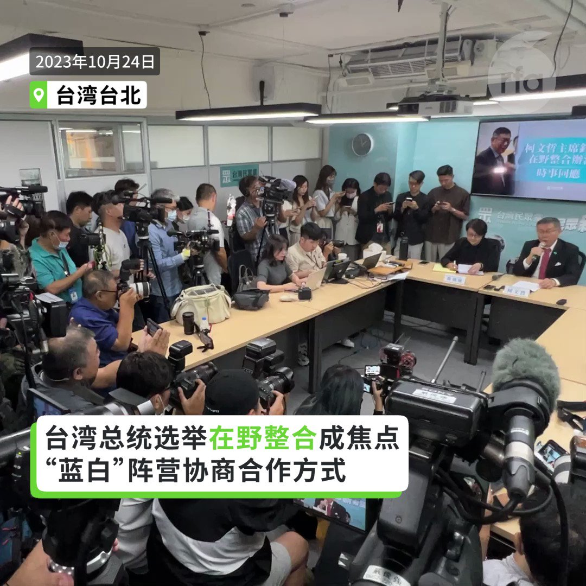
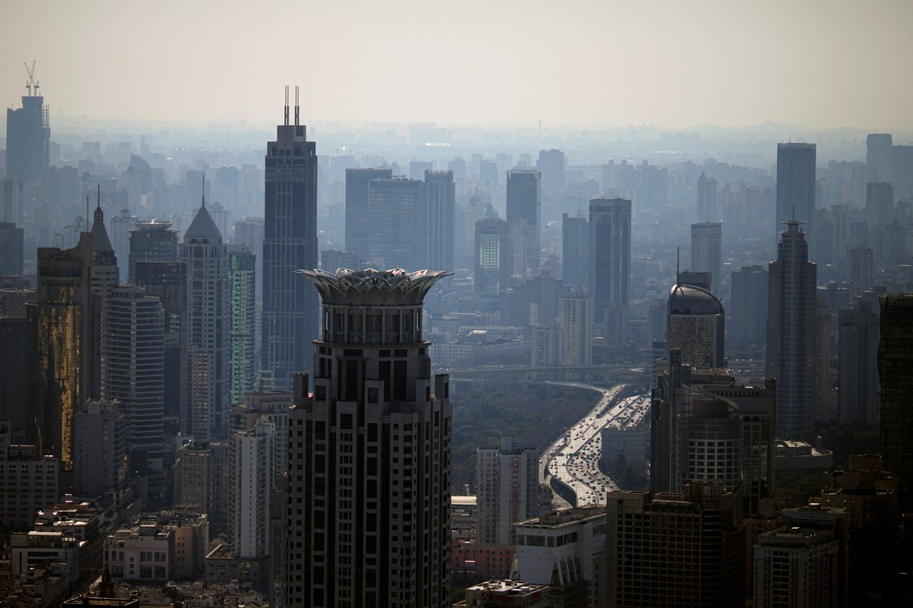
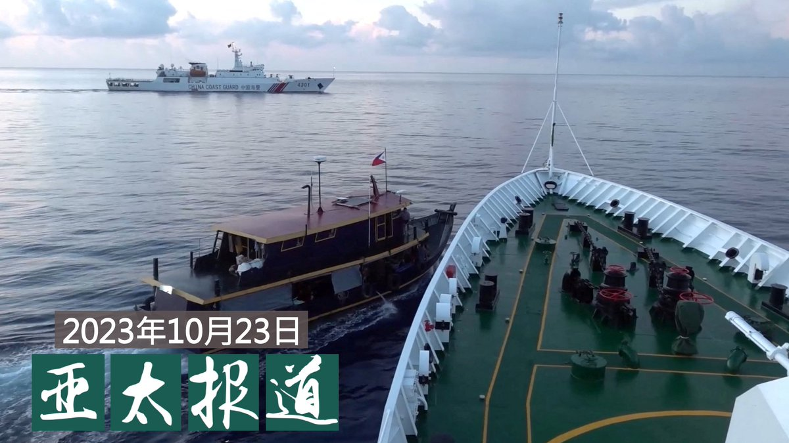
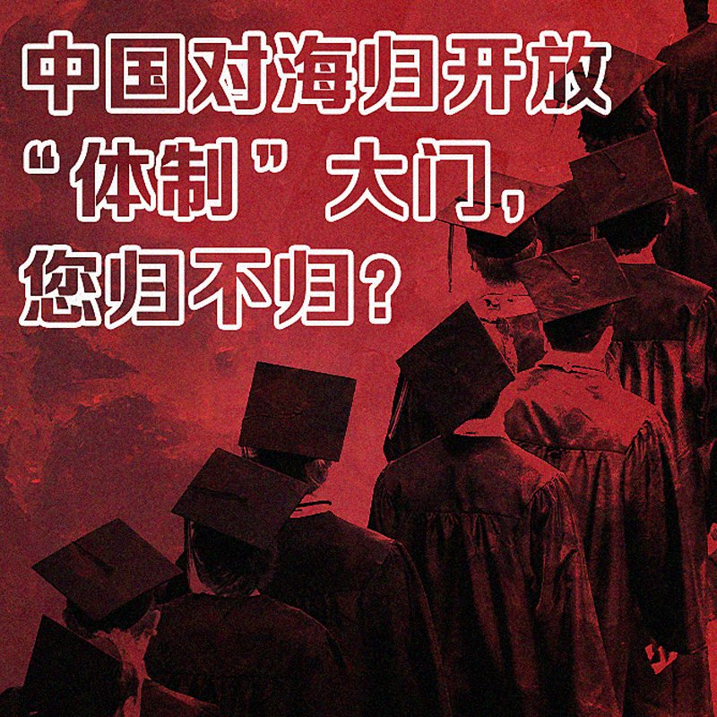
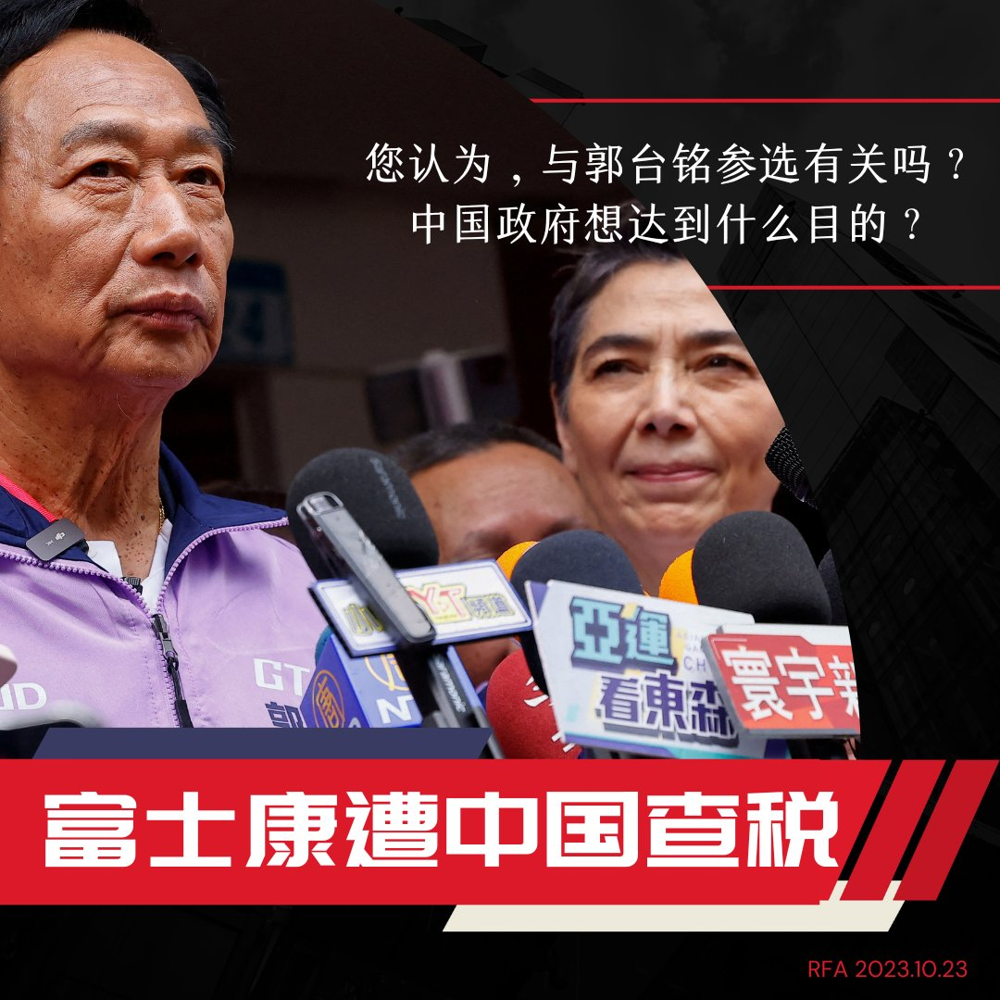

自由亚洲电台 北京时间 2023-10-24T22:06:08Z 1716818361320091990 中国人大常委会第六次会议24日决定免去李尚福的国务委员、国防部部长职务；免去秦刚的国务委员职务。新华社于傍晚发布国家主席习近平签署的第十四号主席令。其中还免去王志刚的科学技术部部长职务、任命阴和俊为科学技术部部长。另外免去刘昆的财政部部长职务、任命蓝佛安为财政部部长。https://t.co/Ca5mlSG6XJ   自由亚洲电台 北京时间 2023-10-24T22:56:43Z 1716831091229958481 #读者广场 | #中东战争 几时休？ https://t.co/HSMAfXMBaE   自由亚洲电台 北京时间 2023-10-24T23:09:12Z 1716834232335741083 中国官方24日证实，将在今年第四季度增发国债1万亿人民币，并将全部通过转移支付方式安排给地方，支持灾后恢复重建和弥补防灾减灾救灾短板。2008年金融海啸时，中国政府曾撒出人民币4万亿的救市计划。 https://t.co/zBKIcYsuxD   自由亚洲电台 北京时间 2023-10-24T23:39:18Z 1716841803721351321 日本三菱汽车已决定不在中国生产汽车。三菱董事会周二正式决定完全退出中国市场。广州三菱员工披露，该厂一千一百多名员工与中国国企广汽埃安签署合同，将正式让中国公司接手。2012年三菱汽车和广汽签署为期三十年的合作协议，如今协议刚过十年，#三菱 就要 #退出中国。 https://t.co/LNAW0uq40N   自由亚洲电台 北京时间 2023-10-24T23:40:37Z 1716842136501669978 #胡润百富榜：地产大亨财富缩水　#拼多多 创始人黄峥成第三富豪 https://t.co/TdSCbuRPZi   自由亚洲电台 北京时间 2023-10-24T20:25:31Z 1716793040336265279 【台湾 #总统大选 在野热议整合】
【蓝白磋商合作方式 “#民主初选”vs“#全民调”】
国民党总统参选人 #侯友宜 抛出愿意接受“柯侯配”的可能，而 #蓝白 合前提是两人名字要在实体投票的“民主初选”同张选票上，希望民众党总统参选人 #柯文哲 最迟25日回覆。但柯文哲认为这是大党在逼迫小党“逼婚”。另外柯文哲在与外国媒体记者会面时，谈到对 #九二共识 和 #香港 等问题的看法。   自由亚洲电台 北京时间 2023-10-24T15:49:39Z 1716723615201460360 【立陶宛议长台湾立法院演说】
【共同民主信念 距离远但紧密相连】
#立陶宛 国会议长 #希米利特 （Viktorija Čmilytė-Nielsen）24日在台湾的立法院发表演说，指出立陶宛与 #台湾 团结共同追求 #民主 理念，人民可以决定自己的命运，有共同目标维护选民托付的民主原则，尽管立陶宛和台湾距离遥远，却有共同的立场，让人民紧密相连。她期盼，台湾与立陶宛的关系能展现民主国家间一起行动的潜力，建立充满力量、韧性和进步的传奇。   自由亚洲电台 北京时间 2023-10-24T16:20:05Z 1716731274189234269 【国务院督查16省市歧视民企问题】
【学者：当局另一只手没停止“操作”】
中国国务院办公厅本发布公告，打算派员开对北京、天津、河北、上海以及湖南等16个省市，展开实地督查，并就地方行政当局阻碍 #民营经济 发展的问题，征集线索。近期，有众多外商和台商被捕或遭地方当局 #调查税务 等问题，学者蔡慎坤认为，当局“另一只手”没有停止“操作”。
https://t.co/6ejc4MrFcr   自由亚洲电台 北京时间 2023-10-24T08:04:08Z 1716606461483368482 欢迎收听和订阅播客【亚太报道（2023-10-23）】 https://t.co/MjLNSvVMqc
外企员工在中国遭拘留；美日欧等谴责 #中国海警 违法撞击菲船；#郭台铭 参选总统，#富士康 被查税；中国面临财政金融失衡系统性风险；中国 #流浪猫狗 遭虐待 https://t.co/IlIiYboSQC   自由亚洲电台 北京时间 2023-10-24T11:56:57Z 1716665052932026443 近日，四川发布2024年面向国（境）外留学生选调的公告，共有54所境外院校入围。
据10月21日《中国新闻周刊》报道，进入中国 #公务员 队伍的“ #国考”“#省考”和 #选调 竞争日益激烈，#定向选调 录取率更高，越来越受到毕业生的关注。近一年来，北京、上海、重庆、广东、山东、四川、河南、河北、山西在内的多个省级行政区，已经对归国留学生开放了定向选调。
关于海外院校入围标准和学制时间，成为民众热议焦点。有网民吐槽：
“是海归吃香了，还是红二代，三代的孩子都回来了？”
“一般认定归国留学生能力比国内学生强的原因，不是说学生本身能力和素质，而是能送出国留学特别是英国、美国的，家里条件都比较好，要么有钱要么有权，所以他们在后面的工作中先天条件会领先别人很多...”
#您怎么看？   自由亚洲电台 北京时间 2023-10-24T09:06:32Z 1716622167209828674 在 #菲律宾 指责 #中国海警船 危险拦截其补给船后，白宫发表一份声明，指出美国国家安全顾问杰克·沙利文（Jake Sullivan）23日与菲律宾国家安全顾问爱德华多·M·阿诺（Eduardo M. Año ）通了电话。
 https://t.co/di1G0unGPV   自由亚洲电台 北京时间 2023-10-24T05:44:25Z 1716571302931427474 随着消费者在经济放缓的情况下勒紧裤腰带，拼多多和淘宝等零售商为苹果iPhone 15提供大幅折扣。 https://t.co/b19GDNxQqS   自由亚洲电台 北京时间 2023-10-24T09:09:40Z 1716622956145803571 山东 #青岛啤酒 三厂工人爬进原料仓小便事件持续引发关注。青岛啤酒周一（23日）股市开盘前发布公告称，近日关注到媒体关于青岛啤酒三厂的相关报道。公司第一时间向公安机关报警。公安机关已介入调查。该批次麦芽已经全部封存。目前生产经营情况一切正常。
  https://t.co/sLFiNqlNov   自由亚洲电台 北京时间 2023-10-24T04:26:09Z 1716551605338919071 评论 | 魏京生 @WEI_JINGSHENG：中国的经济困境有解吗？
 https://t.co/52cwqJEG5v   自由亚洲电台 北京时间 2023-10-24T05:20:22Z 1716565249024025077 据路透社报道，总部位于伦敦的环保组织“环境调查署”（Environment Investigation Agency，EIA）表示，有72家公司使用濒危的豹子和穿山甲等，作为至少 88 种中药产品的原料。#北京同仁堂集团、#天津医药集团 和 #吉林敖东制药集团 这三家上市公司都在其中。
 https://t.co/B0JljUnDaw   自由亚洲电台 北京时间 2023-10-24T05:41:56Z 1716570677006778447 【#您怎么看】环球时报22日报道，税务部门近期依法对富士康集团在广东、江苏等地的重点企业进行税务稽查，自然资源部门对富士康在河南、湖北等地的重点企业用地情况进行现场调查。

鸿海集团创办人 #郭台铭 今年8月宣布独立参选 #2024年台湾总统大选。随后他辞去了富士康董事会职务。

您认为，大型台商富士康此时被查税，与郭台铭参选有关吗？中国政府想达到什么目的？   自由亚洲电台 北京时间 2023-10-24T05:50:20Z 1716572791481520537 专栏 | #夜话中南海：#习近平 全家都是 #毛泽东 的忠实奴仆
 https://t.co/2aCacMEwn9   自由亚洲电台 北京时间 2023-10-24T06:13:43Z 1716578677545210142 狗常常被看作是人类最好的朋友，而近期，中国却上演了又一波消灭其最好朋友的行动。是什么原因促使中国政府抓捕流浪猫狗？而文明社会又是如何对待 #流浪猫狗 的问题呢？
https://t.co/b8ZQTjaQWp   自由亚洲电台 北京时间 2023-10-24T02:43:51Z 1716525859329442005 据路透社 23 日援引消息人士的话称，十四届全国人大常委会第六次会议将于 10 月 20 日至 24 日举行, 会议最后一天将批准额外发行略高于 1 万亿元人民币的 #主权债券。其中近一半将用于水利防洪项目，其余资金将主要用于灾后重建和高标准农田建设。
 https://t.co/rbIF1GgQQu   自由亚洲电台 北京时间 2023-10-24T03:34:15Z 1716538544934781140 评论 | 何清涟 @HeQinglian：两场战争对中国"#一带一路"的影响
 https://t.co/kRxEzDCJL3   自由亚洲电台 北京时间 2023-10-24T00:46:14Z 1716496260667187216 【#您怎么看】中国与 #菲律宾 船只周日在争议海域发生碰撞事件。
中国称，海警依法拦阻菲律宾向 #仁爱礁 非法“坐滩”军舰运送违规建筑物资的船只。
菲律宾指责中国船只“故意”撞击菲方船只.
中国海警局则称菲律宾“恶意碰瓷”。
您站谁？ https://t.co/Bi1ls52JTP   自由亚洲电台 北京时间 2023-10-24T01:37:51Z 1716509251831803967 有中央政府为金融系统做靠山，技术官僚把控局势，中国就能避开系统性风险吗？ https://t.co/jLHBubweUN   自由亚洲电台 北京时间 2023-10-24T02:07:52Z 1716516804745658452 “圈的钱去哪了”？#中国足协 总负债4年增7.3亿
 https://t.co/elWV0xSkxy   自由亚洲电台 北京时间 2023-10-24T00:21:37Z 1716490066288361510 “#反间谍法”7月上路，在中国的外企员工接连被捕。
10月21日，英国广告公司WPP旗下的群邑集团（#GroupM)一名高层和两名前员工，因涉嫌贿赂被中国当局拘留。
此外，一家日企在中国的员工也传出遭扣留。

 https://t.co/nnSnrmTz8Q   