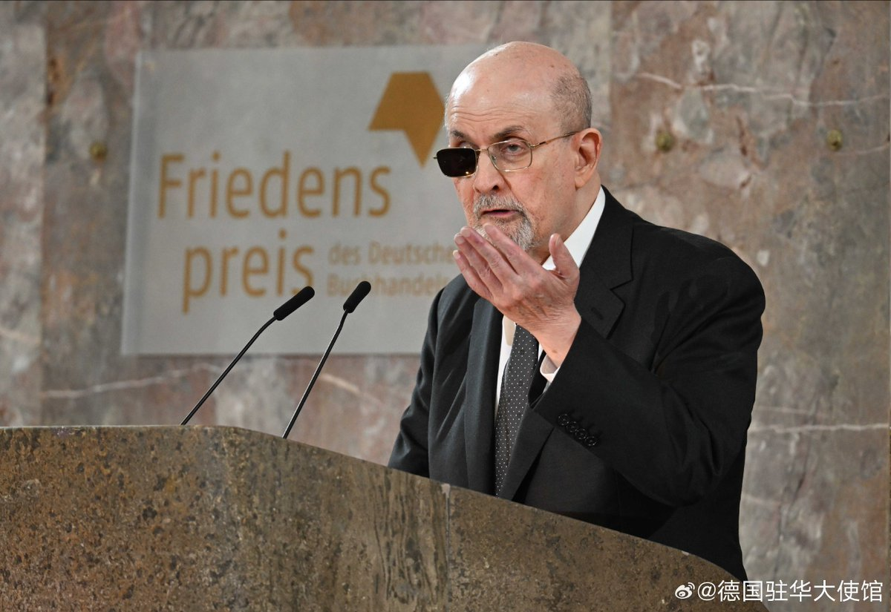

谁将十万横扫三江 北京时间 2023-10-24T10:42:21Z 1716646278795513992 “我未曾想过会不得不经历我们所处的当今这样一个时代。在这个时代，自由——尤其是言论自由，没有它，书籍的世界就不会存在——受到反动、专制、民粹、煽动、一知半解、自恋和漠不关心的声音的全方位攻击。在这个时代，教育机构和图书馆面临审查和敌对，极端主义宗教和偏执意识形态开始侵入生活中不该侵入的领域。”

昨天，印度裔英国作家萨尔曼·拉什迪在法兰克福被授予德国书业和平奖。他的书《撒旦诗篇》出版后的1989年，伊朗革命领袖阿亚图拉·霍梅尼曾呼吁对拉什迪执行谋杀。但拉什迪在警方保护下继续写作。2022年八月，他在美国的一次演讲中遇袭，从此一只眼睛失明。在周日的获奖感言中，拉什迪号召捍卫言论自由：

“而当言论自由以如此多的方式被滥用，我们该怎么办？我们应当以全新的热情继续去做我们一直以来必须做的事：用更好的言论回击糟糕的言论；用更佳的叙事对抗错误的叙事；用爱回应仇恨；即便在谎言横行的时代，也不要放弃真相终将获胜的希望。我们必须坚决捍卫言论自由并尽可能广义地定义它。这当然也意味着，我们要捍卫自由的言论，哪怕它冒犯到我们，因为否则根本就谈不上捍卫言论自由。”

【网评】想到这句话 “即使你的观点和我的观点不同 但我誓死捍卫你表达自己观点的权利”（但是这不代表我会对宣扬歧视 仇恨 支持战争等等的言论保持宽容 因为对不宽容的宽容总是会导致不宽容）

【网评】“理念是可以杀死的，用更好的理念。”   谁将十万横扫三江 北京时间 2023-10-24T09:58:22Z 1716635212959133939 【伊朗又一起“头巾风波”，16岁女孩已确认脑死亡】据伊朗半官方通讯社塔斯尼姆通讯社10月22日报道，最新健康状况报告显示，10月1日在德黑兰地铁站晕倒的16岁少女阿米塔·杰拉万德（Armita Geravand）目前被确认“脑死亡”。

对于杰拉万德晕倒原因，各方说法不一。伊朗人权组织和西方媒体称，事发当天，杰拉万德没有佩戴头巾，有目击者看到她晕倒前曾与道德警察发生冲突；而伊朗官方坚称杰拉万德晕倒前没有与他人发生冲突，并发布监控视频片段和援引杰拉万德友人的话予以佐证，同时批评“敌人试图借此在伊朗制造紧张和混乱”。

16岁少女阿米塔·杰拉万德近期成为伊朗国内外热议焦点。当地时间10月1日清晨，杰拉万德与两名女性友人在德黑兰一个地铁站搭乘地铁。

伊朗官方公布的监控视频显示，一名同行的女孩先下车厢，弯下腰，和其他几名乘客将昏迷不醒的杰拉万德搬到站台上。稍晚时候，赶来的急救人员将杰拉万德送到医院救治。

10月22日，塔斯尼姆通讯社援引最新报告称，尽管医护人员尽了最大努力，但杰拉万德的健康状况不容乐观，“脑死亡的情况似乎是确定的”。

对于杰拉万德晕倒原因，各方有不同说法。此事件在伊朗国内外引发争议。

路透社、英国广播公司（BBC）报道称，伊朗国内人权组织表示，有目击者看到，杰拉万德因为没有佩戴头巾与伊朗道德警察发生争执，随后陷入昏迷。根据伊朗头巾法，所有女性都被规定必须在公共场合佩戴头巾，道德警察则是负责头巾法等“公共道德”执法工作的单位。

但伊朗官方坚决否认上述说法。根伊通社和塔斯尼姆通讯社报道，杰拉万德的同伴作证说，杰拉万德是在登上地铁后“突然仰头向后摔倒，头撞到了地上”。德黑兰地铁总经理也称，杰拉万德晕倒前没有与“乘客或地铁管理人员”之间存在“任何言语或身体冲突”。

塔斯尼姆通讯社还称，根据监控视频，杰拉万德登上地铁和晕倒后被抬出车厢之间只有几分钟，这就排除了杰拉万德与他人发生冲突的可能性。但BBC提到，伊朗官方并没有公布车厢内部的视频。

路透社、BBC等媒体将杰拉万德事件与阿米尼事件联系在一起。2022年9月16日，22岁的伊朗女子玛莎·阿米尼（Mahsa Amini）因涉嫌违反头巾法被道德警察拘留后陷入昏迷死亡。随后，伊朗各地爆发大规模示威游行，期间造成至少有200名示威者死亡，数千人受伤。   谁将十万横扫三江 北京时间 2023-10-24T10:28:48Z 1716642871372284118 华盛顿举行支持巴勒斯坦的示威活动。 https://t.co/K5CkFEOiju   谁将十万横扫三江 北京时间 2023-10-24T10:47:19Z 1716647531034374187 巴勒斯坦是世界上精神疾病发病率最高的国家之一。四分之一青少年曾试图自杀；约23.2%的人患有创伤后应激障碍——美国的比例为6-9%；巴勒斯坦是地中海东岸抑郁症患者最高的地区。

巴勒斯坦卫生部心理健康部门负责人Samah Jabr——巴勒斯坦领土上的32位精神科医生之一——对这些统计数字表示怀疑。“

我质疑的是方法。我认为他们在测量社会心理疼痛、社会痛苦，他们说这叫抑郁症。什么病了，是背景还是人？在巴勒斯坦，我们看到很多人的症状——不寻常的情绪反应或行为——是对致病环境的正常反应。”很多巴勒斯坦人在受苦。但西方发达国家测量抑郁的工具，比如贝克抑郁问卷，对合情合理的痛苦反应和临床抑郁不做区分。

她说，同样，对创伤后应激障碍的临床定义也不适用于巴勒斯坦人的经历。“创伤后应激障碍适合描述的是去伊拉克轰炸、返回安全的美国后的美国士兵的经验。他的噩梦、恐惧和战场有关，他的恐惧是想象的。而加沙巴勒斯坦人的家遭到轰炸，再一次遭到轰炸的威胁是非常真实的。这不是想象的。没有前、后之分——创伤是重复的、持续的、连续的。我认为我们需要对我们的经验实事求是，而不是把不是我们的经验强加给自己。”

“我们用西方能理解的术语来描述我们的心理经验，所以我们谈了很多创伤后应激障碍。车祸后患者会有创伤后应激障碍，进入被监禁、被轰炸、被标签化的旋转门则不同。后者是更深的——个性的改变，信仰体系的改变——与创伤后应激障碍不同。”

Jabr说，巴勒斯坦人面临持续性的创伤，更易改变个性，并表现出各种症状——情绪压力反映在身体上。比如她有个病人呼吸困难，检查身体没问题，遂被送到精神科。“几个月后，在他足够信任我之后，他告诉我，这些症状出现在以色列士兵袭击他、强迫他骂自己的母亲和妻子之后。他为此事无比羞愧……反映在了身体上。我们经常看到这种状况。”

生活在巴勒斯坦的人们承受着持续的创伤。有人的房屋被以色列政府摧毁，然后还要为以色列摧毁房屋支付罚金。40%的巴勒斯坦男性曾被以色列关押，原因通常是投石。很多家庭面临以色列占领军的突袭和审讯威胁。

巴勒斯坦的精神卫生专业人员太少，无法满足人口需求。数百万人，32名精神科医生。Jabr已经培训了数百名医生和护士，识别、应对精神疾病。她自己每天要看30位患者。Jabr拿出了自己的巴勒斯坦心理健康标准：“能够批判思维，保持同情能力。”她不否认在其他创伤和压力症状中使用其他定义，但她的主要目的是与患者一起培养这两种能力。她说，制定自己的心理健康标准很重要，“不只是世界卫生组织的定义。”

【网评】我們也應該用文章結尾的標準自問，我是否“能够批判思维，保持同情能力”。另外對於經歷過戰爭的祖母輩，經歷過浩劫的母輩，我們大概也不應該用現代社會文明國家所定義的精神疾病去生搬硬套，幻想他們被矯正成理想的長輩，而是要看到他們的時代與人生故事......   谁将十万横扫三江 北京时间 2023-10-24T10:19:17Z 1716640473622974975 苏格兰，格拉斯哥，街头充满对加沙的声援。 https://t.co/lKfevlPvBK   谁将十万横扫三江 北京时间 2023-10-24T10:22:41Z 1716641331425288609 RT @Acephale01: 有人认为哈马斯的极端恐怖主义是“革命恐怖主义”的一种，这里我帮SR澄清一下——根本不是

纵观社革党人的炸弹人生，所有目标都是针对俄国的高官权贵，过程中确实有误伤但却绝非有意

革命恐怖主义的目的不是报复个人，而是打击制度的指令环节 https:…   谁将十万横扫三江 北京时间 2023-10-24T10:23:12Z 1716641460601458698 纽约举行支持巴勒斯坦的示威活动。 https://t.co/eO0im34XCo   谁将十万横扫三江 北京时间 2023-10-24T00:40:23Z 1716494791939408135 广东佛山一老板疑因扣员工工资被员工杀害 https://t.co/jt72xxpobj   谁将十万横扫三江 北京时间 2023-10-24T00:10:49Z 1716487350002590092 RT @whyyoutouzhele: 10月23日，国内食品技术网站“食品伙伴网”发布了2023年第三季度美国FDA拒绝进口我国食品情况统计。
其中，多款奶制品和烘培产品疑含三聚氰胺和/或三聚氰胺类似物。
目前原文已经404 https://t.co/1hBdjQIosV   