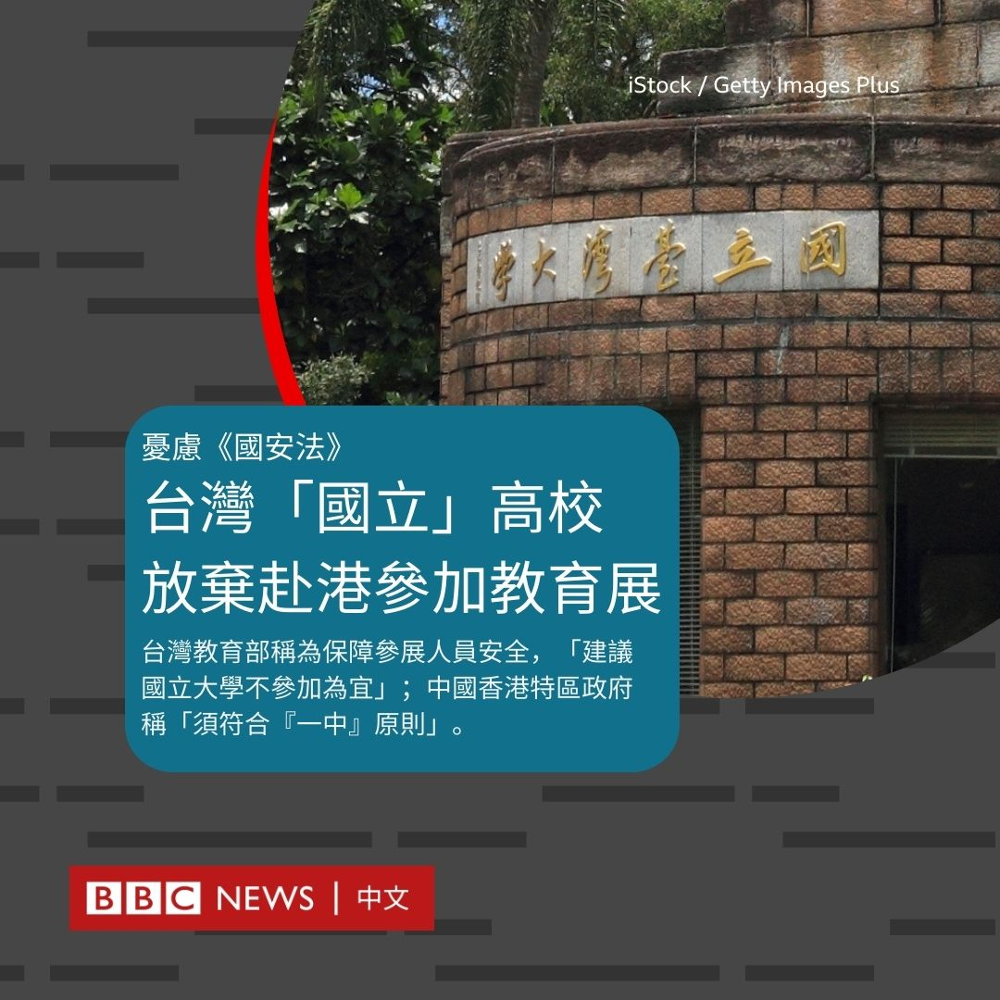
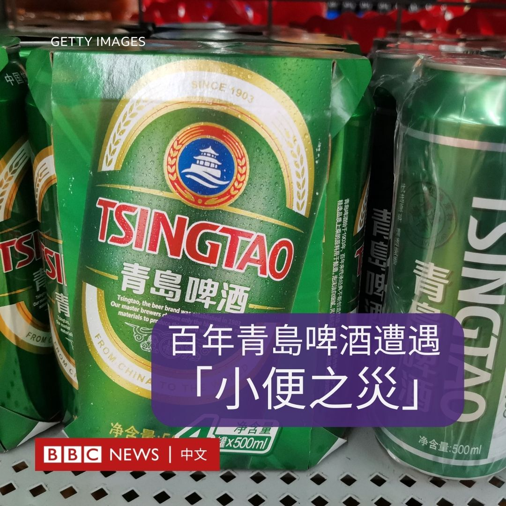
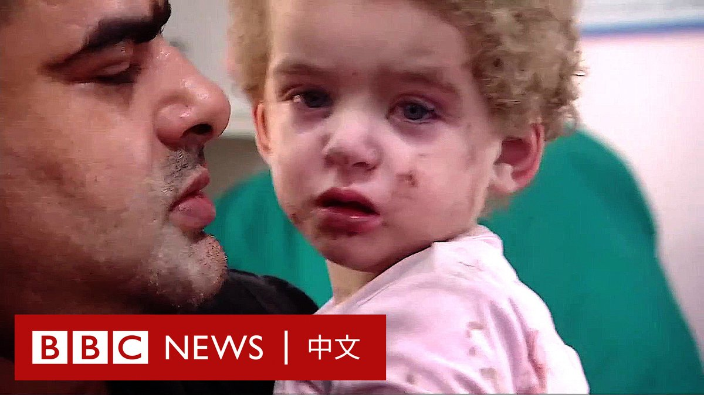

D英国广播公司BBC 北京时间 2023-10-23T21:03:24Z 1716440186115215375 台湾本周将在香港举办高等教育展，宣传赴台升学，但十多家公立院校因“国立”名号而放弃参展。台湾教育部称这是出于《香港国安法》实施后的安全考虑，中国香港特区政府称“不评论个别个案”，但强调任何涉台活动都必须符合“一个中国”原则。

台湾《旺报》报道，“香港官方”要求台湾公立大学不能以“国立”头衔，参加10月27到28日在香港九龙湾举行的“2023年香港台湾高等教育展”，大陆委员会与教育部评估后，原本报名参加的十多家公立大学全部退出，只剩39家私立与台北市立院校预定继续参展。

台湾教育部称，为维护台湾主权，决定各参展国立大学的名号“以全衔方式呈现”，并透过策划展览的海外联合招生委员会向港方表达台方立场，“另考量香港于『国安法』实施后之情势，为保障我国参展人员安全，建议国立大学不参加为宜。”

BBC中文记者23日追问台湾教育部能否说明具体接获哪个“香港官方”机构要求，对招生工作会有何影响，教育部回覆没有补充。

教育部称不更改公立院校名号赴会的决定是“经教育部与陆委会共同会商后”所作出，但陆委会对台湾媒体表示，主管机关是教育部，陆委会对其意见表示尊重。

香港特区教育局对香港媒体称，“没有参与有关活动的筹办工作，也没有联络相关机构”。BBC中文记者尝试询问特区保安局曾否就此联络台方，以及此举是否香港警察引据《香港国安法》所采取的法律行动。一名香港特区政府发言人回应称，“不评论个别个案”。

不过，这位发言人续称：“必须指出，《中华人民共和国宪法》的序言列明，台湾是中华人民共和国的神圣领土的一部分。任何活动涉及台湾相关事宜，必须根据《宪法》、《（香港）基本法》及『一个中国』原则处理。”

半官方的中央社引述国立暨南国际大学校长武东星说，10月中旬在越南和8月份在澳门举办的台湾高教展也出现类似状况。校方认为没必要更改文宣、文案迁就，决定只派员到香港展览现场向参观学生发放资料。

据台湾媒体报道，越南的其中一场展览，主舞台布景板在最后关头被贴上“中国台湾”字样。

香港《明报》指出，这次是新冠病毒病（COVID-19）疫情过后，台湾高教展首次在香港恢复实体展览。四年前的主办方包括陆委会驻港“台北经济文化办事处”，但该处人员已于2021年全面撤走。今年的主办单位除了台湾海外联招委员会外，还有台湾大专院校香港校友会总会和台湾各大学香港校友会总会。

2022年10月，台湾各大学香港校友会总会曾自行筹办“台湾各大学教育展”，但在最后关头因租用办展的中学突然表示无法租出场地而取消，总会当时称“实在非常不解、无奈、难过与遗憾”。

自北京于2020年6月颁布《香港国安法》后，以拥护在野中国国民党人士为主的香港亲台团体已无法举办中华民国“双十节”国庆活动。   D英国广播公司BBC 北京时间 2023-10-23T23:19:10Z 1716474349107228853 近日一段疑似有工人在啤酒原料仓库内小便的影片，让刚庆祝创业120周年的中国青岛啤酒备受压力。当地警察与市场监管部门正分别展开调查。

有关影片最先在10月19日出现在互联网上，内容暗示是一位工人在位于山东平度市的青岛啤酒三厂内攀上原料储存棚顶小便。该影片收看人次数以千万计。

目前相关视频真伪与涉事人员动机仍未清楚。青岛啤酒称已报警，并将涉事麦芽全数封存。BBC记者曾尝试联络青啤作进一步评论，目前未获答覆。平度市公安局23日回应《新京报》称，“正在进行调查，稍后就会发一个对外公告”。

不过，事件对该公司可能造成的经济损失逐渐浮现：青岛啤酒上海挂牌买卖股份23日开盘后价格急跌近7%，至收盘比上日跌0.3%，报80.85元人民币；香港股份因重阳节假期休市，影响未知。

青啤23日傍晚再次向香港与上海证交所提交公告，称其生产经营情况“一切正常”。   D英国广播公司BBC 北京时间 2023-10-23T21:54:45Z 1716453106534490355 【“我们没有足够的裹尸布”——加沙撤离区儿童遭空袭，巴勒斯坦死者家属迁怒哈马斯】以色列当局告诉BBC，在得到一名哈马斯指挥官“就在附近”的情报后，以色列在周末对加沙一家医院附近的地区进行了空袭。哈马斯控制的卫生部称有100人丧生。死者中有两名儿童。 https://t.co/GhHIYiVK2T   D英国广播公司BBC 北京时间 2023-10-23T18:59:04Z 1716408894669328669 富士康在其创办人郭台铭竞选台湾总统之际遭中国大陆税务当局调查。政治学者对BBC中文分析称，若其竞选团队能够很好地处理这场危机，不排除能给他加分。 https://t.co/OZL9lqyGar   D英国广播公司BBC 北京时间 2023-10-23T19:21:34Z 1716414558066159616 “在与会代表中，有63%是男性，你或许会认为63%的问题会来自男性，但事实上男性提出了78%的问题。”——女性不敢在公开场合提问，原因何在？ https://t.co/JOU1G5MHBz   D英国广播公司BBC 北京时间 2023-10-23T20:17:39Z 1716428671773479143 以色列围堵与空袭加沙持续，第二批救援物资于10月22日进到加沙，数十辆载有食物和医疗用品的卡车从与埃及接壤的边境送达；前一天也有20辆抵达加沙，但联合国表示这远远不及这里超过200万人每日所需的500车物资。 https://t.co/xWUKMlCW0X   D英国广播公司BBC 北京时间 2023-10-23T17:55:47Z 1716392967546737068 中国与菲律宾10月23日互相指责对方海警“蓄意”在有主权争议的南中国海南沙群岛仁爱礁（菲律宾称阿云津礁）碰撞对方船只，双方互相提出抗议。中国海警指责菲方海警船“恶意碰瓷制造事端”；菲律宾国防部长特奥多罗（Gilbert Teodoro）指责中方海警船“公然违反国际法”。

事件发生在22日，菲律宾当时正尝试向搁浅仁爱礁上的菲律宾军舰马德雷山脉号（BRP Sierra Madre）运送补给品。两国海警先后发放片段，显示如何遭对方撞击。

菲律宾外交部23日传召中国驻菲律宾大使黄溪连提出抗议，但使馆只派出首席馆员周志勇公参赴会。中国使馆称，周志勇就菲方船只“擅闯仁爱礁海域向菲方提出严正交涉，表达强烈不满和坚决反对”。美国国务院发表声明声援盟友菲律宾。

中国一直强调对整个南海及其岛礁拥有主权，中菲两国近期多次在仁爱礁海域对峙。今年8月，菲律宾指责中方海警船向其船只发射水炮。10月初，BBC采访队在同一水域目睹中方船舰阻挠菲方补给搁浅军舰。

仁爱礁是中方对该争议岛礁的称呼，菲律宾称其为阿云津礁（Ayungin），英文通称第二托马斯礁（Second Thomas Shoal）。菲律宾于1999年把马德雷山脉号搁浅于仁爱礁以宣示主权，并派驻海军陆战队员。军舰日久失修，状况甚差。

特奥多罗23日与外交部联合会见媒体时，形容事件中的中方的海警5203船为“民兵”船艇，并称对方以“危险”方式航行，最终与菲方补给船尤娜扎·5月二号（Unaiza May 2）与海警船卡布拉号（BRP Cabra）碰撞。

菲律宾外交部发言人达沙（Teresita Daza）说：“凡此种种，都将证明菲律宾并非侵略者，对方才是——也就是中国。”

达沙说：“阿云津礁是我国专属经济区（EEZ）与大陆架的一部分，我们对它享有主权与司法管辖权。”

美国国务院22日批评中方“蓄意干预菲方船舰行驶在公海上的航行自由，违反国际法”，并重申《美菲共同防御条约》适用于包括海警船在内的菲方公私船舰，在南海任何区域一旦遭遇攻击。

中国外交部发言人毛宁23日回答记者提问时称：“我们觉得真正应当停止挑衅的是菲律宾方面。”

毛宁批评马尼拉当局“无视中方的善意和诚意，违背自身承诺，不断派船擅闯仁爱礁海域，蓄意挑衅，还持续散布虚假信息，渲染炒作”，要求菲方“停止对中国的攻击抹黑，尽快拖走非法『坐滩』的军舰，避免破坏南海的和平与稳定，损害本地区国家的共同利益”。

对于华盛顿的表态，毛宁批评是“无视事实”，并称美方声明才是违反国际法。   D英国广播公司BBC 北京时间 2023-10-23T14:44:11Z 1716344750452957282 中国最近实施针对指定型号无人机的出口管制，BBC国际媒体观察部（BBC Monitoring）注意到，正与俄罗斯交战的乌克兰对此感到担忧。

此前，中国商务部、海关总署、国家国防科工局与中央军委装备发展部联合公告，自今年9月1日起，所有重4公斤或以上的长距离无人机，以及摄像头与无线电模组等周边产品，均受管制。

公告称：“出口经营者明知或者应当知道出口将用于大规模杀伤性武器扩散、恐怖主义活动或者军事目的的，不得出口。”中国无人机巨头大疆（DJI）当时回应称，将严格遵守禁令。

BBC国际媒体观察部从支援乌克兰军方的民间组织了解到，自2022年2月俄罗斯入侵乌克兰以来，DJI停止向两国直接销售无人机，也下令全球经销商不得将产品转售俄乌两国客户。去年8至9月间，DJI对欧洲的出货量猛跌。

对此，DJI在接受BBC国际媒体观察部查询时，既不承认，也不否认。

俄乌双方在当前战事中大量应用无人机。英国皇家三军联合研究所（Royal United Services Institute, RUSI）指出，乌克兰每月损失约1万架无人机。

民间援乌组织对BBC国际媒体观察部表示，虽然中国的禁令未对无人机供应造成即时影响，但零部件供应已受影响。他们也担忧情况将持续恶化。

@BBCMonitoring 英文报道： https://t.co/wJ5vdM5S9r   D英国广播公司BBC 北京时间 2023-10-23T08:00:10Z 1716243078359494940 联合国表示，超过140万加沙居民已经流离失所，其中有超过50万人居住在联合国提供的147个避难所内。目前，第一批救援卡车已进入加沙。https://t.co/czgMWcnH94   