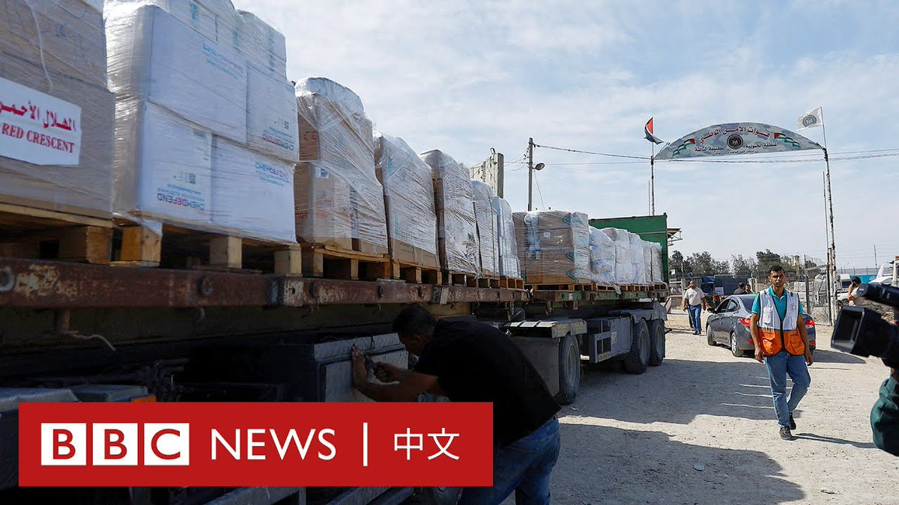
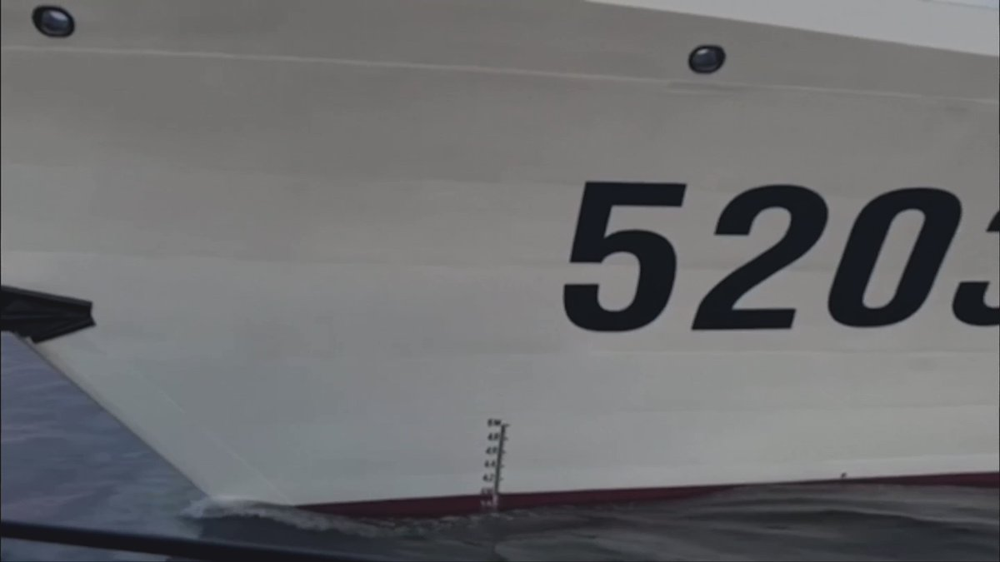
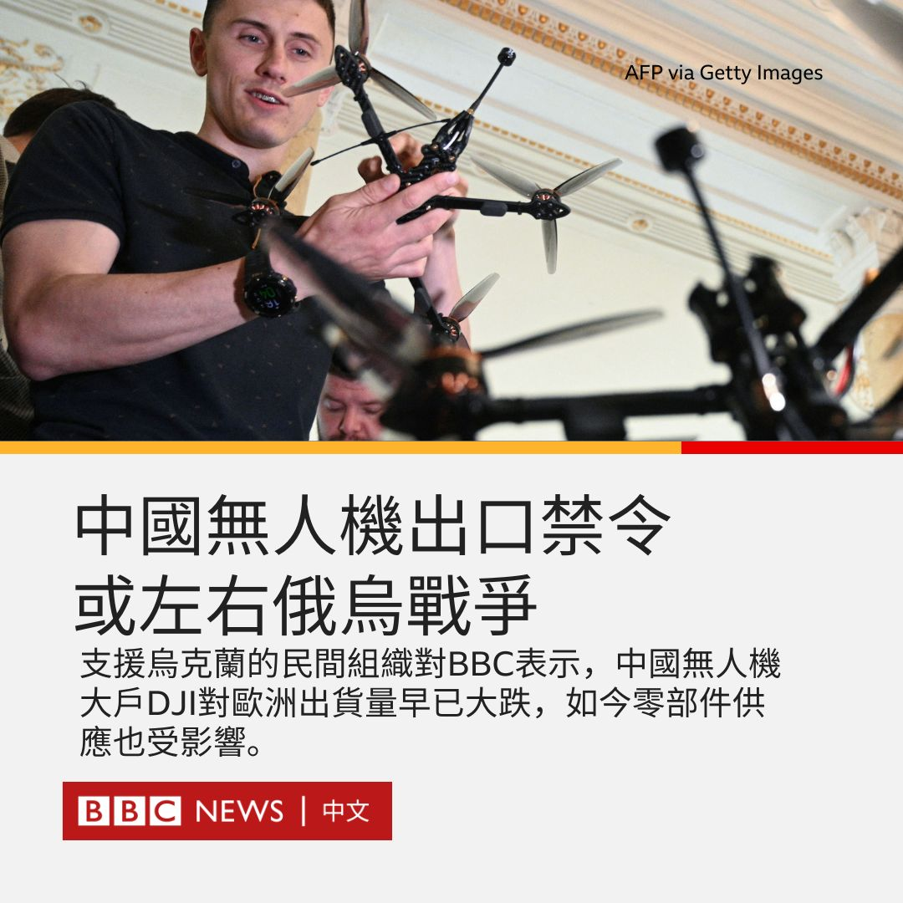

D英国广播公司BBC 北京时间 2023-10-23T18:59:04Z 1716408894669328669 富士康在其创办人郭台铭竞选台湾总统之际遭中国大陆税务当局调查。政治学者对BBC中文分析称，若其竞选团队能够很好地处理这场危机，不排除能给他加分。 https://t.co/OZL9lqyGar   D英国广播公司BBC 北京时间 2023-10-23T19:21:34Z 1716414558066159616 “在与会代表中，有63%是男性，你或许会认为63%的问题会来自男性，但事实上男性提出了78%的问题。”——女性不敢在公开场合提问，原因何在？ https://t.co/JOU1G5MHBz   D英国广播公司BBC 北京时间 2023-10-23T20:17:39Z 1716428671773479143 以色列围堵与空袭加沙持续，第二批救援物资于10月22日进到加沙，数十辆载有食物和医疗用品的卡车从与埃及接壤的边境送达；前一天也有20辆抵达加沙，但联合国表示这远远不及这里超过200万人每日所需的500车物资。 https://t.co/xWUKMlCW0X   D英国广播公司BBC 北京时间 2023-10-23T17:55:47Z 1716392967546737068 中国与菲律宾10月23日互相指责对方海警“蓄意”在有主权争议的南中国海南沙群岛仁爱礁（菲律宾称阿云津礁）碰撞对方船只，双方互相提出抗议。中国海警指责菲方海警船“恶意碰瓷制造事端”；菲律宾国防部长特奥多罗（Gilbert Teodoro）指责中方海警船“公然违反国际法”。

事件发生在22日，菲律宾当时正尝试向搁浅仁爱礁上的菲律宾军舰马德雷山脉号（BRP Sierra Madre）运送补给品。两国海警先后发放片段，显示如何遭对方撞击。

菲律宾外交部23日传召中国驻菲律宾大使黄溪连提出抗议，但使馆只派出首席馆员周志勇公参赴会。中国使馆称，周志勇就菲方船只“擅闯仁爱礁海域向菲方提出严正交涉，表达强烈不满和坚决反对”。美国国务院发表声明声援盟友菲律宾。

中国一直强调对整个南海及其岛礁拥有主权，中菲两国近期多次在仁爱礁海域对峙。今年8月，菲律宾指责中方海警船向其船只发射水炮。10月初，BBC采访队在同一水域目睹中方船舰阻挠菲方补给搁浅军舰。

仁爱礁是中方对该争议岛礁的称呼，菲律宾称其为阿云津礁（Ayungin），英文通称第二托马斯礁（Second Thomas Shoal）。菲律宾于1999年把马德雷山脉号搁浅于仁爱礁以宣示主权，并派驻海军陆战队员。军舰日久失修，状况甚差。

特奥多罗23日与外交部联合会见媒体时，形容事件中的中方的海警5203船为“民兵”船艇，并称对方以“危险”方式航行，最终与菲方补给船尤娜扎·5月二号（Unaiza May 2）与海警船卡布拉号（BRP Cabra）碰撞。

菲律宾外交部发言人达沙（Teresita Daza）说：“凡此种种，都将证明菲律宾并非侵略者，对方才是——也就是中国。”

达沙说：“阿云津礁是我国专属经济区（EEZ）与大陆架的一部分，我们对它享有主权与司法管辖权。”

美国国务院22日批评中方“蓄意干预菲方船舰行驶在公海上的航行自由，违反国际法”，并重申《美菲共同防御条约》适用于包括海警船在内的菲方公私船舰，在南海任何区域一旦遭遇攻击。

中国外交部发言人毛宁23日回答记者提问时称：“我们觉得真正应当停止挑衅的是菲律宾方面。”

毛宁批评马尼拉当局“无视中方的善意和诚意，违背自身承诺，不断派船擅闯仁爱礁海域，蓄意挑衅，还持续散布虚假信息，渲染炒作”，要求菲方“停止对中国的攻击抹黑，尽快拖走非法『坐滩』的军舰，避免破坏南海的和平与稳定，损害本地区国家的共同利益”。

对于华盛顿的表态，毛宁批评是“无视事实”，并称美方声明才是违反国际法。   D英国广播公司BBC 北京时间 2023-10-23T14:44:11Z 1716344750452957282 中国最近实施针对指定型号无人机的出口管制，BBC国际媒体观察部（BBC Monitoring）注意到，正与俄罗斯交战的乌克兰对此感到担忧。

此前，中国商务部、海关总署、国家国防科工局与中央军委装备发展部联合公告，自今年9月1日起，所有重4公斤或以上的长距离无人机，以及摄像头与无线电模组等周边产品，均受管制。

公告称：“出口经营者明知或者应当知道出口将用于大规模杀伤性武器扩散、恐怖主义活动或者军事目的的，不得出口。”中国无人机巨头大疆（DJI）当时回应称，将严格遵守禁令。

BBC国际媒体观察部从支援乌克兰军方的民间组织了解到，自2022年2月俄罗斯入侵乌克兰以来，DJI停止向两国直接销售无人机，也下令全球经销商不得将产品转售俄乌两国客户。去年8至9月间，DJI对欧洲的出货量猛跌。

对此，DJI在接受BBC国际媒体观察部查询时，既不承认，也不否认。

俄乌双方在当前战事中大量应用无人机。英国皇家三军联合研究所（Royal United Services Institute, RUSI）指出，乌克兰每月损失约1万架无人机。

民间援乌组织对BBC国际媒体观察部表示，虽然中国的禁令未对无人机供应造成即时影响，但零部件供应已受影响。他们也担忧情况将持续恶化。

@BBCMonitoring 英文报道： https://t.co/wJ5vdM5S9r   D英国广播公司BBC 北京时间 2023-10-23T08:00:10Z 1716243078359494940 联合国表示，超过140万加沙居民已经流离失所，其中有超过50万人居住在联合国提供的147个避难所内。目前，第一批救援卡车已进入加沙。https://t.co/czgMWcnH94   