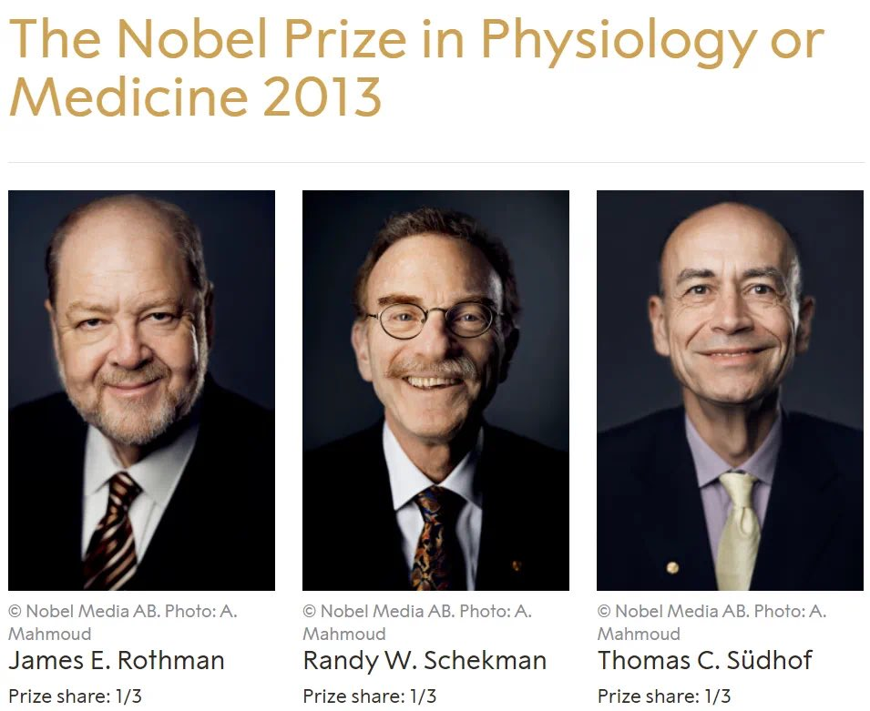
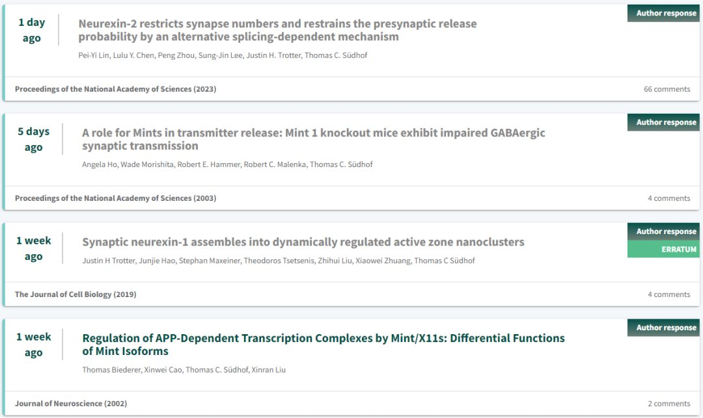
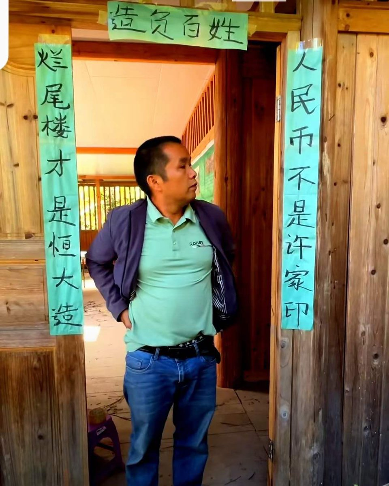

Petrichor 北京时间 2023-10-23T15:49:32Z 1716361197400866824 “多灾多难的犹太人虽然在历史上经历了无数磨难，但是作为一个族群，犹太人中涌现出了一批又一批杰出的科学家，深刻地改变了人类的历史进程。提起著名的犹太科学家，可以说是群星璀璨、光芒四射。最杰出的有“现代物理学之父”爱因斯坦，有量子物理的奠基人之一的尼尔斯·波尔，有“原子弹之父”奥本海默，有“航空航天时代的科学奇才”冯·卡门，有历史上最伟大的十位物理学家之一的理查德·费曼，同时还有“精神分析之父” 西格蒙德·弗洛伊德……毫不讳言，如果没有犹太科学家，人类的文明发展可能要被大大地拖后了。”   Petrichor 北京时间 2023-10-23T12:33:58Z 1716311982389727517 Thomas C. Südhof于2013年与James Rothman和Randy Schekman共同获得诺贝尔生理学或医学奖，以表彰他们发现了调节细胞内主要运输系统——囊泡运输的机制的突出贡献。
在2023年，Thomas C. Südhof，被质疑多篇论文涉嫌学术不端，目前Pubpeer已经挂了他至少14篇论文。这些被质疑涉嫌学术不端的论文，时间跨度从2002年到2023年，论文发表的期刊包括PNAS, Cell ，Nature，Science ，eLife，Nature Communications，Neuron 等期刊。这些被质疑的论文，主要是图片重复、数据重复及数据异常等。Thomas C. Südhof对于大部分文章做了回复。
近期，Gregg L. Semenza（获得2019年诺贝尔生理与医学奖）被指涉嫌学术不端，被撤回了10篇PNAS等高水平文章，论文被曝52篇论文P图造假（点击阅读）。   Petrichor 北京时间 2023-10-23T12:37:14Z 1716312804368507019 “交了一百多万，连一张瓦片都没见着。”苦啊！ https://t.co/Aw5EguagFZ   Petrichor 北京时间 2023-10-23T04:41:51Z 1716193169551827303 韩勇，男，汉族，1956年10月生，吉林九台人，1974年6月参加工作，1976年4月加入中国共产党，中央党校研究生学历。曾任陕西省政协党组书记、主席，第十三届全国政协人口资源环境委员会副主任等职务。
2023年10月，韩勇涉嫌严重违纪违法，接受中央纪委国家监委纪律审查和监察调查。 https://t.co/rO8ZSZChKj   