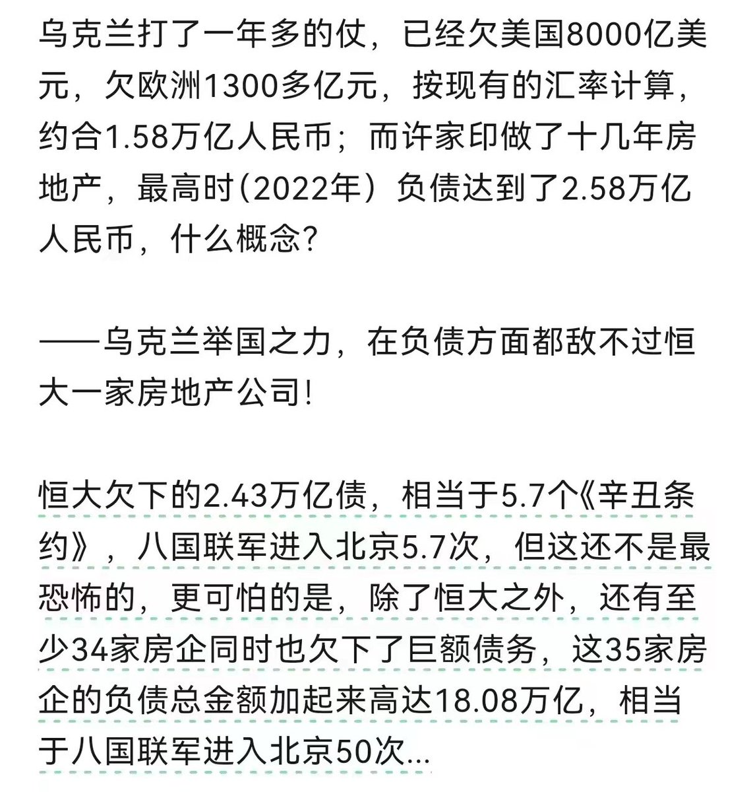

Petrichor 北京时间 2023-10-22T23:11:55Z 1716110139462148549 欧洲航天局（ESA）近日宣布终止与中国空间站的合作。官员公布的原因是：首先，中国空间站最近发生了一些技术泄漏事件，这使得欧洲航天局对中国空间站的信任度降低。其次，欧洲航天局认为中国空间站的发展速度已经超过了计划预期，这可能导致双方在未来的合作中存在不兼容的问题。为了保护自身的利益和独立性，欧洲航天局决定终止与中国空间站的合作。背后的真相可能是地缘政治，中欧尖端科技的脱轨，也表示欧洲对中国空间技术用于未来战争的担忧。   Petrichor 北京时间 2023-10-22T23:57:05Z 1716121506634166485 有个老头，叫陈平，复旦大学教授，说在美国月入三千美元，生活质量不如在中国月入三千人民币。他在美国德州买房，然后吹牛说月入三千人民币比在美国月入三千美元舒服，就是在割韭菜忽悠傻子。现在女版李佳琦来了，忽然觉得陈平也不是那么扯淡了。真的是江山代有才人出。以后再有更荒诞的言论，我也不会感到惊讶了。我已经有些麻木了。   Petrichor 北京时间 2023-10-22T10:29:18Z 1715918220316578231 从恒大人们开始理解为什么海外一部分华人特别有钱了，他们的钱不都是从国内转到国外的吗？ https://t.co/vCWd5BzF4S   Petrichor 北京时间 2023-10-22T09:23:01Z 1715901538067988898 南京市长姓江名大桥？ https://t.co/zMnDO9TiN1   Petrichor 北京时间 2023-10-22T09:34:09Z 1715904342488678664 仅仅清王朝这样吗？ https://t.co/b1uUObn54C   Petrichor 北京时间 2023-10-22T03:53:44Z 1715818671031885852 听不懂，不知他们在喊什么，估计是支持哈马斯的阿拉拍人在示威，抗议以色列的反恐行动。平时不知道，原来世界各地伊斯兰信徒很多。 https://t.co/cpjUxQCNhh   