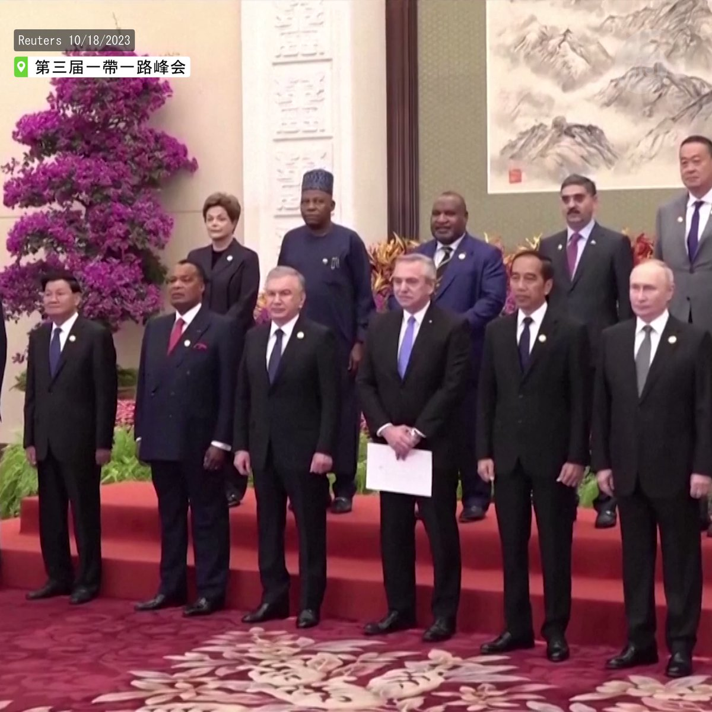
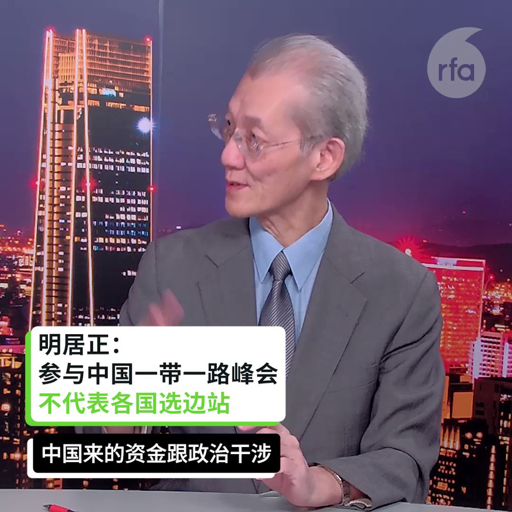

自由亚洲电台 北京时间 2023-10-22T22:41:53Z 1716102580445561255 RT @RFA_Chinese: 【各国派专机撤侨 | 中国: 请自行购票】
以哈全面战争一触即发，各国连日派机疏散侨民，包括台湾。尽管返台侨民仅九人，台北依然派机接载。惟中国不但没派 #专机，更建议回国民众“搭乘商业航班”。近日35名中国公民向台湾求助，希望搭乘 #台湾 顺风…   自由亚洲电台 北京时间 2023-10-22T23:01:40Z 1716107559940047173 【一带一路十字路口: 意大利欲退出 | 塔利班要加入】
第三届一带一路论坛落下帷幕。期间，阿富汗 #塔利班 政府表示有意愿加入，希望能像 #印尼高铁 一样分一杯羹。

2020年，英国也曾考虑聘用 #中铁集团 建设伦敦至曼城的高铁 #HS2。惟中英关系恶化，计划未果。近日 #英国 因入不敷出，取消高铁延长段。前首相 #鲍里斯·约翰逊 引用中国大学教科书，批评民选政府半途而废，鼠目寸光。说这样的话的教科书, 您读过吗?   自由亚洲电台 北京时间 2023-10-22T07:43:32Z 1715876501965386194 RT @RFA_Chinese: 【#刘晓波 的妻子 #刘霞 访问纽约】 
中国知名活动人士、诺贝尔和平奖获得者刘晓波的妻子刘霞前不久访问了美国纽约。 中国人权执行主任周锋锁亲自带领刘霞参观了中国人权和人道中国为其已故丈夫建立的纪念馆。… https://t.co/GeI9Cl…   自由亚洲电台 北京时间 2023-10-22T02:59:04Z 1715804915711250486 【四天工作制】耐克（#Nike）公司大中华区近日在内部宣布从明年开始，其办公室员工每周只需在即周一至周四公司工作。
https://t.co/8OVpjumjFs   自由亚洲电台 北京时间 2023-10-22T03:45:08Z 1715816506448109676 RT @RFA_Chinese: 【#明居正：#一带一路 收缩规模 帝国主义过度扩张结果】
【#庄嘉颖：峰会塑造中国中心习威望 实质有落差】
https://t.co/jUTnkg2dx8
#亚洲很想聊 https://t.co/p53NIF5eU3   自由亚洲电台 北京时间 2023-10-22T03:47:40Z 1715817144263323954 RT @RFA_Chinese: 【各国派专机撤侨 | 中国: 请自行购票】
以哈全面战争一触即发，各国连日派机疏散侨民，包括台湾。尽管返台侨民仅九人，台北依然派机接载。惟中国不但没派 #专机，更建议回国民众“搭乘商业航班”。近日35名中国公民向台湾求助，希望搭乘 #台湾 顺风…   自由亚洲电台 北京时间 2023-10-22T05:39:50Z 1715845374626177350 广西 #平果市 兴越材料科技公司车间 #爆炸，6人死亡，4人送院。起因或是铝棒在拉铸过程中，高温铝液泄漏到冷却水池内。目前明火已扑灭，现场机器坍塌，周围房子开裂。
https://t.co/6ds5Mzg3y6   自由亚洲电台 北京时间 2023-10-22T06:11:59Z 1715853465933504694 【中国特色的公务员制度】

周五：组织部部长李干杰说: “要着力建设堪当民族复兴重任的高素质 #公务员 队伍。要严格把好入口关”。

周六：广西法制办原书记被除党籍；海南退役军人事务厅副厅长被除党籍；曲靖纪委副书记被除党籍；湖北巡视组原组长被调查。
https://t.co/hkUcgrkNch   自由亚洲电台 北京时间 2023-10-22T03:48:28Z 1715817347682857006 RT @RFA_Chinese: 【欢迎订阅自由亚洲电台电邮新闻】 
点击https://t.co/197BDI7DqA
输入您的电邮地址，即可收到本台每周二和周五发送的“新闻快递”。
不翻墙也知天下事！ https://t.co/MpqlDbZXTE   自由亚洲电台 北京时间 2023-10-22T01:28:47Z 1715782195204305259 【咩都唔得】香港男子因购买18本列为“煽动性”的《羊村》刊物，被判入狱四个月，是 #香港 第一例因输入刊物被判监的罪案。过去两年，不仅五名 #出版人 被监禁，港府更要求Google移除《#羊村》搜索结果。
https://t.co/1LGog5Ee7o   自由亚洲电台 北京时间 2023-10-22T02:18:41Z 1715794752451334294 英国公关公司 #WPP 旗下的群邑媒介集团（#GroupM）四名前任和现任高管被上海警方带走。 几个月前，公司高管才公开表示他们打算长期在 #中国市场 投资......
https://t.co/Pj5EHaWHsg   自由亚洲电台 北京时间 2023-10-22T00:07:37Z 1715761769551892928 RT @RFA_Chinese: 【欢迎加入自由亚洲电台电报群】https://t.co/UkKZmFSRkG https://t.co/Qid2LNZxJn   