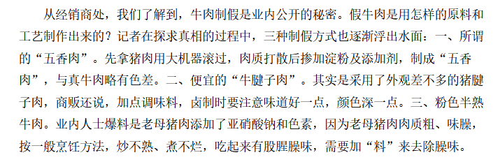
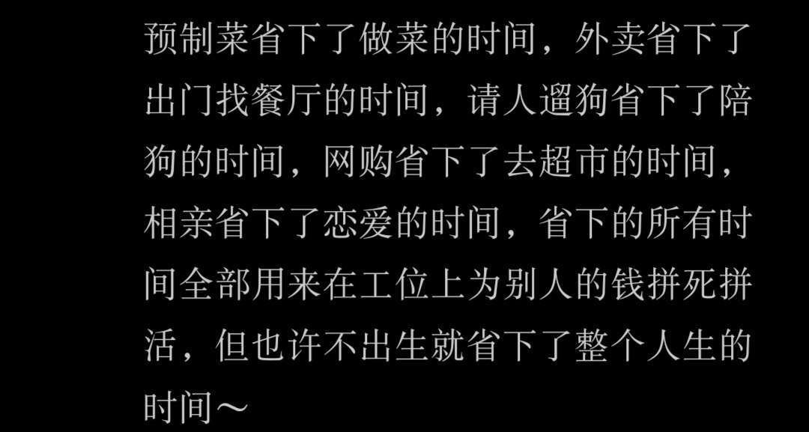
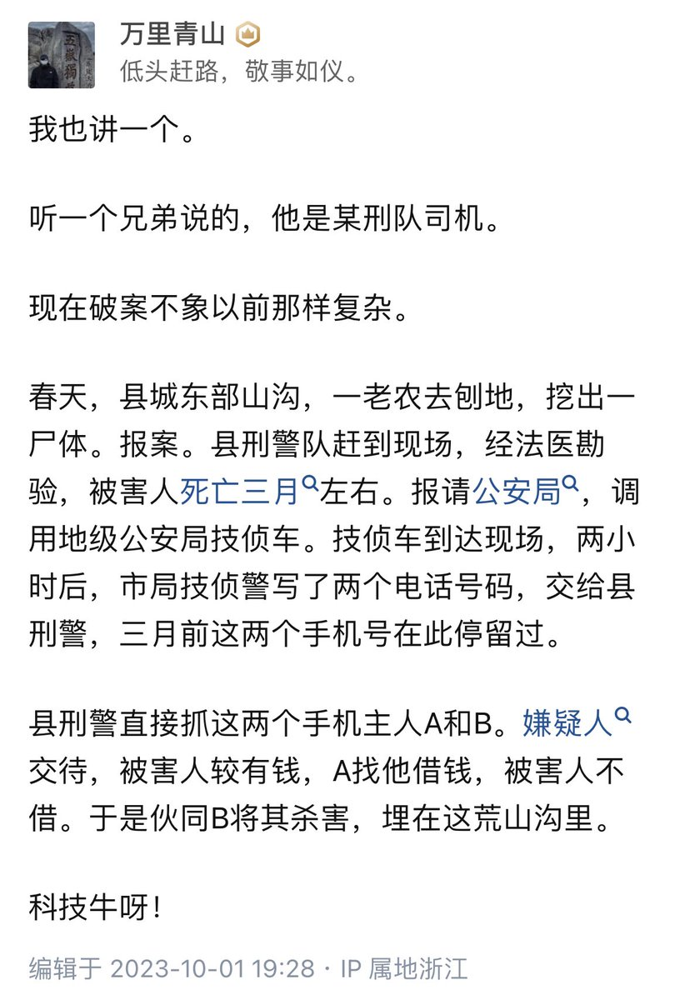
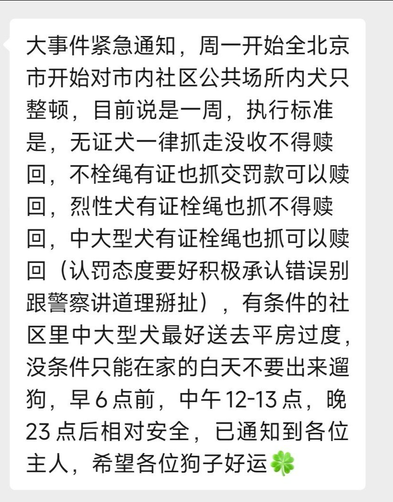

谁将十万横扫三江 北京时间 2023-10-22T15:06:59Z 1715988101393490311 网友感慨：不想再过吃假牛肉和预制菜①的生活

忙碌一天从早到晚学习，晚上点开外卖软件下单一个评分还算不错的店铺。菜单上的牛肉写着“原切"，外卖到了之后打开发现牛肉泛着诡异的红色，口感是嚼不烂的橡皮筋和外层包裹的嫩肉粉的味道。

想着吃口下面的意面，一股没有搁一个的番茄酱粉感溢满口腔。我有时候在想外卖业发展的极致是不是把人彻底工具化，把打工人点外卖变成给车加汽油一样平常。

想起暑假在国贸实习工作一天微薄的工资还要给楼下的预制菜贡献40大洋，而学校食堂里面很多菜都被塞了料理包，现在才明白原来那些可以在家吃饭的日子何其珍贵。

小时候努力奋斗的意义是改变世界，
现在努力奋斗就是想少吃几口来路不明的肉和料理包。
穷人没资格呼吸，我只能祈祷自己快点死

PS：关于假肉，十年前曝光过，但是现在还有这样的媒体吗？不会有了

①2月13日，中共中央、国务院发布《关于做好2023年全面推进乡村振兴重点工作的意见》。《意见》提出提升净菜、中央厨房等产业标准化和规范化水平，培育发展预制菜产业。   谁将十万横扫三江 北京时间 2023-10-22T13:14:06Z 1715959692063838495 RT @whyyoutouzhele: 10月21日，北京某学校门口，小摊贩遭遇暴力执法，掀翻了自己的摊子。 https://t.co/5xPPBfD7vE   谁将十万横扫三江 北京时间 2023-10-22T13:42:43Z 1715966896137453960 RT @Pandazhq: 好可怕的技侦车！恐怕防疫期间的时空伴随也是用这玩意搞出来的。 https://t.co/lgqmCTzWaS   谁将十万横扫三江 北京时间 2023-10-22T13:55:56Z 1715970220937118076 在北京养狗的注意了 https://t.co/WvKlk8L2xb   