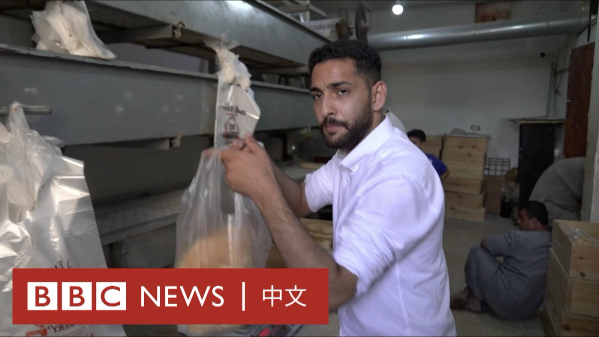

D英国广播公司BBC 北京时间 2023-10-21T20:57:48Z 1715714000183247136 【一周热点回顾】“当我敲开这些家庭的门时，我感觉自己就像一个死神。”

在以色列，所有在军事行动或恐怖袭击中丧生的以色列人家属，都会被一名军人亲自登门正式通知死讯。在哈马斯发动袭击后，这项服务变得前所未有的忙碌。https://t.co/JeAQYdKbwo   D英国广播公司BBC 北京时间 2023-10-21T16:53:40Z 1715652561762689202 哈马斯基于“人道主义理由”释放一对美国母女，这是本月冲突爆发以来首度有人质获释，卡塔尔扮演了关键角色，在以巴之间斡旋。
https://t.co/n7V3etF54V   D英国广播公司BBC 北京时间 2023-10-21T16:18:19Z 1715643664972525628 哈马斯基於“人道主义理由”释放一对美国母女，这是本月冲突爆发以来首度有人质获释，卡塔尔扮演了关键角色，在以巴之间斡旋。

目前仍有约200名不同国籍人士被扣押，分析指若以色列坚持攻入加沙，恐影响人质营救工作。

https://t.co/eKxCGh0h3P   D英国广播公司BBC 北京时间 2023-10-21T14:06:19Z 1715610445237674342 【一周热点回顾】随着以色列誓言将对哈马斯发动清剿行动，这个武装组织在加沙地下兴建的宛如迷宫的隧道网络引发关注。哈马斯曾宣称已经扩建了长达500公里的隧道，这让巷战的难度大幅提高。https://t.co/xl8WXazpHS   D英国广播公司BBC 北京时间 2023-10-21T12:12:11Z 1715581724548268219 以色列警告加沙北部居民撤离至南部后，南部城市汗尤尼斯（Khan Younis）人口激增。当地一些志愿者正在向这些新移民提供帮助。 https://t.co/c5fS3lkVRb   