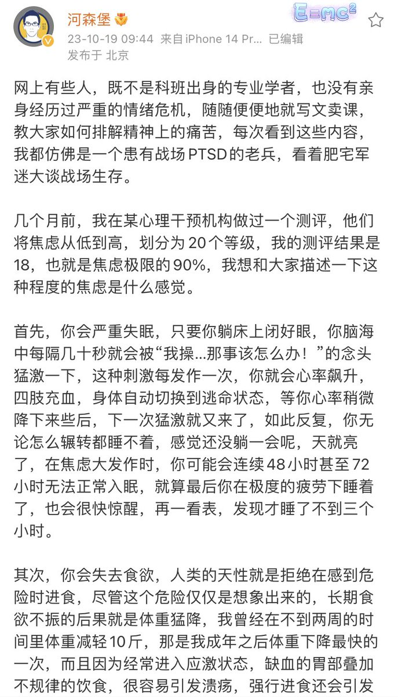
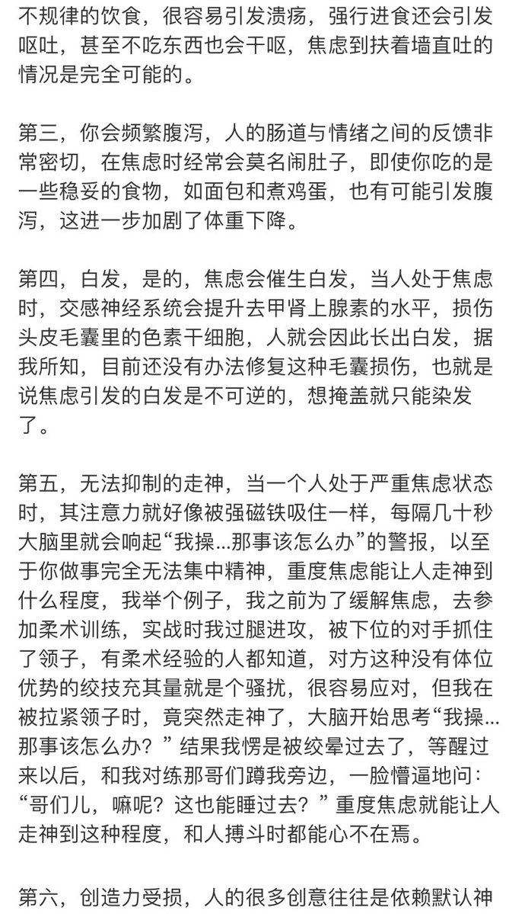
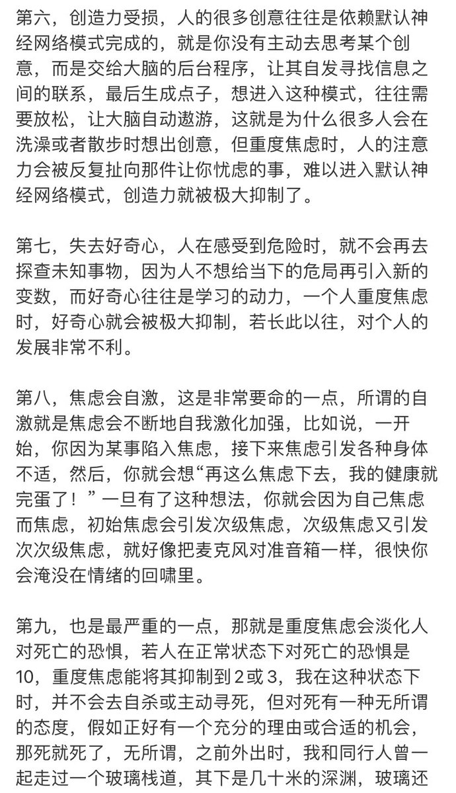
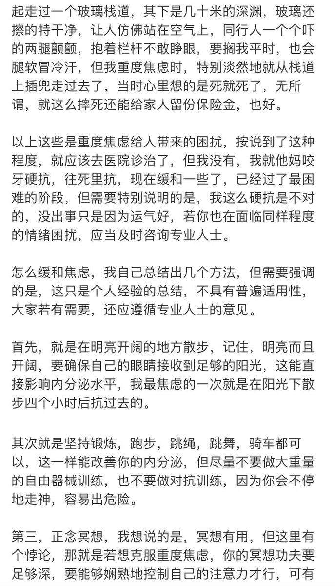

谁将十万横扫三江 北京时间 2023-10-21T21:27:24Z 1715721449397506384 瑞典左翼党通过其援助组织向加沙的DFLP捐款。 https://t.co/j42Ir2TrCC   谁将十万横扫三江 北京时间 2023-10-21T18:22:02Z 1715674799417208892 最近B站发生一件有趣的事:

一个吉林本地的up主为了宣传查干湖°的鱼，特地在查干湖拍了一条视频，把当地的鱼一阵猛夸。说当地都是纯朴的老乡，绝不可能卖“洗澡鱼”。

然后，他就到查干湖边上的一家饭店，点了六条重两斤半的黄辣丁，一边吃又是一顿猛夸:这鱼如何如何好吃,希望大家都来查干湖吃鱼。

视频上传后，有一个自称是钓鱼佬的人留言说: up以我多年的钓鱼经验，你在饭店点的黄辣丁最多一斤多点,而饭店的秤显示的是两斤半!你这是遇到了“五两秤”了!

随后，又有一人留言说:up主,你点鱼的时候是六条，上菜的时候盆里有七条鱼。很可能饭店把你点的鱼调包了。

这个up随后找饭店理论，老板死活不承认。一会说不能看视频定份量，一会说上七条鱼是我们送了你一条。

不久之后，该up主又发了一条视频:到当地菜场买两斤半黄辣丁，看看到底有多少，自己是不是真的遇到五两秤了。结果确实如预期的一样，两斤半的黄辣丁比在饭店里吃的几乎多一倍。

然而，最好玩的是，这个视频上传后，好多人回复: up主你又上当了，卖鱼的趁你不注意，把死鱼捞给你了!   谁将十万横扫三江 北京时间 2023-10-21T20:00:22Z 1715699544414122352 网友投稿：知名博主户晨风因为支持以色列被人身威胁 https://t.co/X0BVfCSnQ9   谁将十万横扫三江 北京时间 2023-10-21T15:59:26Z 1715638914227245139 RT @Pandazhq: 河森堡焦虑时的症状，及其缓解焦虑的方法，好像很有用。 https://t.co/HHYUQTh2ax   谁将十万横扫三江 北京时间 2023-10-21T17:51:29Z 1715667112319230304 RT @whyyoutouzhele: 对流浪狗被屠杀的同情并不是反对对流浪狗的治理，这是一个要搞清楚的问题
在处理流浪动物和所谓的禁养动物之前，是否已经做好预案，包括人道的处理流程和大面积扑杀可能造成的病毒传染防控机制？现在看来并没有，只是一场运动式的执法和毫无人道的泄愤式屠…   谁将十万横扫三江 北京时间 2023-10-21T15:31:31Z 1715631888034042154 RT @whyyoutouzhele: 10月20日，海南省澄迈县思源高级中学
一名家长拉横幅称该学校的王姓校长强奸了自己9岁的女儿。 https://t.co/fypNzNRWqr   谁将十万横扫三江 北京时间 2023-10-21T16:01:21Z 1715639393871081984 RT @cskun1989: 以色列的邻国几乎都是巴勒斯坦甚至是哈马斯的支持者，以色列即将展开对加沙的地面战，要求巴勒斯坦平民从哈马斯聚集的北部地区撤到南部沙漠地带，以免酿成人道灾难，按说巴勒斯坦的兄弟国家关键时刻安顿百万难民也算有情有义，沒想到这些国家坚决拒绝接收巴勒斯坦难民…   