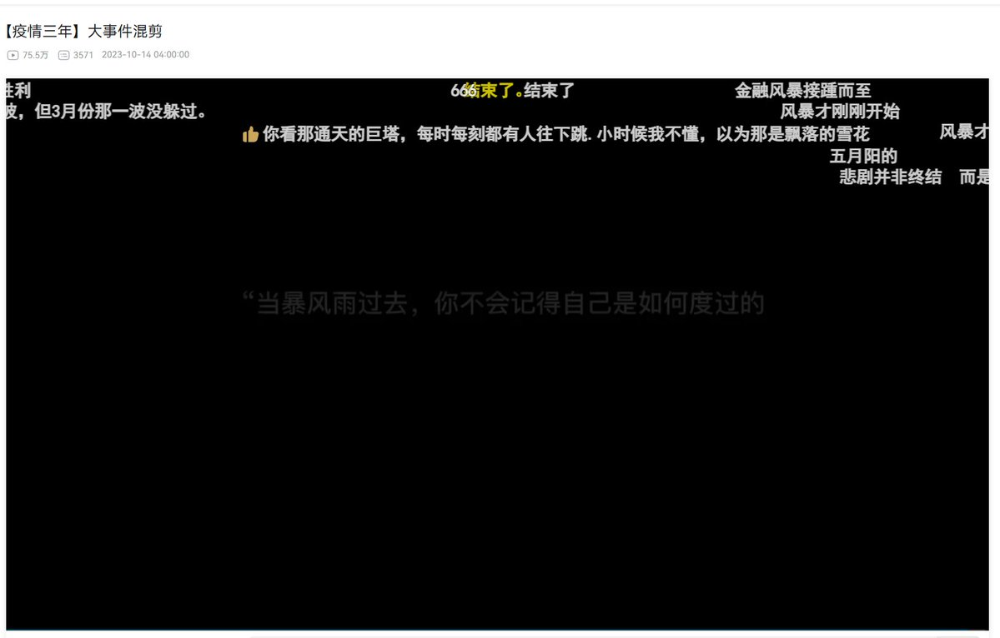
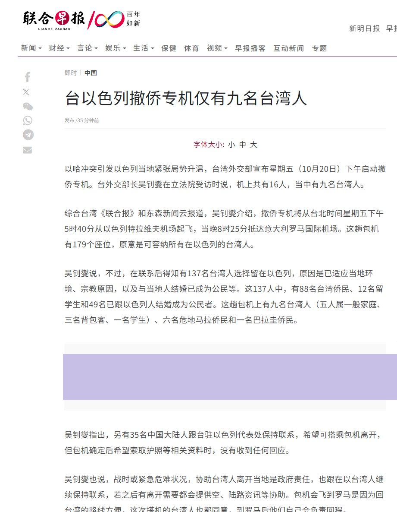
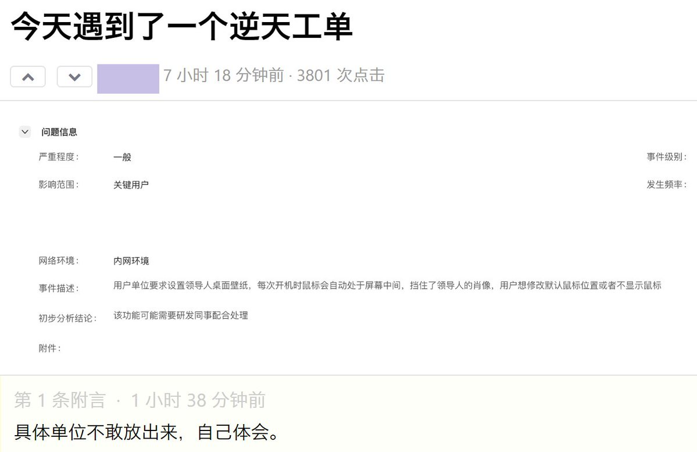

A李老师不是你老师 北京时间 2023-10-20T16:34:18Z 1715285298299453520 随着全国扑杀流浪猫狗的行动
曾经已经隐匿起来的虐猫犯们又开始“合法”行凶了 https://t.co/6iAMLKugdy   A李老师不是你老师 北京时间 2023-10-20T19:31:08Z 1715329802159202708 【体验服】
一带一路峰会，中外记者们排队做核酸 https://t.co/2PBjhWALcq   A李老师不是你老师 北京时间 2023-10-20T20:22:10Z 1715342643914248562 https://t.co/M57Ff1WKvE   A李老师不是你老师 北京时间 2023-10-20T17:10:04Z 1715294299393282417 10月20日，台湾启动以色列撤侨
此前曾有35名中国大陆人跟台湾驻以色列代表保持联系，希望可以搭乘包机离开。但是在包机确定后索要护照等相关资料时，没有再收到他们的回应。 https://t.co/8Gex05MUdk   A李老师不是你老师 北京时间 2023-10-20T17:45:21Z 1715303178382532694 10月20日，成都电子信息职业中学
校方和公安机关将所有学生集中到操场上统一注册安装反诈app https://t.co/nSH6DSwuVz   A李老师不是你老师 北京时间 2023-10-20T17:58:35Z 1715306508848673090 一位网友分享的翻墙经验，也欢迎更多人在评论区补充。

自高中起，我已有十余年的翻墙经验，在这里简单聊聊心得，有一些是从编程随想博客学习的。

一 翻墙之前的准备
1 硬件
在2023年的今天，大多数国产安卓手机都内置反诈中心，或者带有可以监控手机的服务，如果你使用国产安卓手机翻墙的话，被发现的概率非常大，甚至无法安装翻墙工具。解决方案：购买iPhone、购买Google Pixel。

如果使用Windows系统的PC翻墙，请务必保证系统内没有国产安全软件（例如360、金山毒霸等）、没有腾讯微信和腾讯QQ。事实上，你应该尽量不使用国产软件。

如果你是上访者、社会活动家，或者政治敏感人士，建议使用带有Tensor处理器的Google Pixel手机（据传目前相关部门无法破解取证这类手机，消息未证实），或者全新安装自己的Windows PC，且手机与PC均不安装任何国产应用。

如果你使用iPhone且有被审查手机的风险，可使用Xlocker或者AAlocker隐藏相关APP。

如果你已润出墙，请放弃使用国内购买的手机。

2 软件
若使用Windows系统的PC，请使用Firefox ESR（编程随想推荐）或者Chrome浏览器。如果你无法获取这两个浏览器，可临时使用Edge。

若使用国行iPhone，且使用Safari浏览器，请在“设置-Safari浏览器-欺骗性网站警告“处关闭该选项。

若使用国行安卓系统，为安全考虑，不建议翻墙。

3 联系方式：邮箱和手机号
无论注册机场还是VPN，都不应该使用国产电子邮箱，更不能提供手机号。请使用Protonmail，此处不展开介绍，可自行搜索。若你无法翻墙注册Protonmail或Gmail，可临时注册Outlook，注册时不要使用真实姓名和手机号。

可以购买Ultramobile的Paygo手机卡，月租3美元，由此可注册Google Voice，这样就有了一个实体卡号 、一个虚拟卡号。实体卡和Google Voice均可用于注册Twitter（现X）、Telegram（据传将与腾讯合作，故已不推荐）等平台。

二 翻墙途径
目前大约有三种：自建服务器、购买机场服务、购买VPN。我并不会自建服务器，所以只讨论后两者。

1 购买机场服务（又称梯子）
三原则：使用非常用非国产邮箱、月付而非年付、遵守客户守则。

当你注册一个机场后，先观察能否试用，若不能试用，可以先购买最便宜的套餐月付。随后使用该机场服务，尝试访问品葱和大纪元，若无法访问，说明该机场有嫌疑与相关部门合作。建议及时删除账户更换机场，直至这个测试通过。

若可以使用加密货币付款，更建议使用之。

机场可能随时跑路，请同时购买两家机场服务。若一家跑路，可使用另一家。

若机场提供QQ交流群，则嫌疑加重

若可以正常使用其服务，请遵守相关规则，例如防止泄露节点信息、不要使用P2P服务等。

2 购买VPN
在你能用机场服务的前提下，又有Paypal或者其他支付方式，就可以购买VPN了。

三 假如你无法翻墙，如何开始
第一步：使用PC，打开国内的必应；

第二步：搜索擦边关键词可以搜索到部分机场，且不翻墙可访问；

第三步：观察机场网站能否提供Clash for Windows之类的工具。若提供，则可在不翻墙的情况下，下载翻墙工具。然后试用或购买服务，便可初步翻墙，打破”不翻墙就无法获得翻墙工具”的困境。

第四步：挂代理打开Duckduckgo或Google，开始寻找一家安全的机场，或者购买VPN，就此进入自由的网络世界。

——这只是提供一种思路，办法还有很多。例如找一个翻墙的朋友帮你，或者使用赛风、Lantern这种不安全的翻墙方式临时翻墙，等等。

四 翻墙之后
为了自身安全，请学习社会工程学和信息安全相关知识，可以看编程随想的博客。学习使用TOR。在这里简单说几个tips：

1 海外平台账户不要和国内平台账户的网名相同，最好每个平台使用随机产生的不同的网名。防止撞库。

2 请使用不同的密码。应该有自己的密码算法，此处不展开介绍。

3 若频繁发布言论，请改变自己的语言习惯。例如你在国内习惯说“今儿个吃了么？“，则可以改为 ”今天吃饭了吗 ？”，如此便不会被有心之人认出来。如果嫌麻烦，把自己的语言翻译成英文，再Google翻译成中文，发布翻译后的结果，就不再带有你的语言习惯（此条即编程随想提到的“行文风格“）。

4 若需发表的内容里含有自己的声音，请使用AI配音或者变声器，防止声纹识别。

5 若需发布图片，请清除EXIF信息。

6 请不要分享、点击有安全嫌疑的链接

7 付费会暴露自己的个人信息。在你使用支付宝或微信支付购买机场服务时，就已经不够安全。

8 简体中文互联网世界充斥着大量诈骗信息和假信息。请努力学习英语，突破信息茧房。

9 如果你也是反贼，在墙内请隐藏自己的倾向，保护自己。伪装成粉红，在朋友圈转发一些正能量。

10 如果你使用iPhone，记得关闭某些APP的iCloud同步。

11 编程随想在2010年就提到了输入法问题。亦要及时清理浏览记录和Cookies等。   A李老师不是你老师 北京时间 2023-10-20T15:35:10Z 1715270420021080322 受巴以冲突影响，B站用户纷纷前往给《辛德勒名单》打差评，致使其评分从9.6下降到4.3 https://t.co/5Wa76ByKBN   A李老师不是你老师 北京时间 2023-10-20T16:02:55Z 1715277401578504555 10月20日，河南禹州市政府门口，烂尾楼业主维权 https://t.co/jm56AVMpf9   A李老师不是你老师 北京时间 2023-10-20T16:21:00Z 1715281951211295230 B站也将在月底前施行前台实名制 https://t.co/ndGnbbDXCy   A李老师不是你老师 北京时间 2023-10-20T14:10:10Z 1715249026851856594 10月20日，泰国接回在以色列遇难的泰国公民遗体。 https://t.co/GPoThz4tJF   A李老师不是你老师 北京时间 2023-10-20T00:10:26Z 1715037699353034949 V2EX上有用户表示自己遇到一个工单
用户单位要求设置领导人桌面壁纸，每次开机时鼠标会遮挡领导人肖像，用户想要修改默认鼠标位置或不显示鼠标，以达到不遮挡领导人的效果。 https://t.co/htUGx1s5qP   