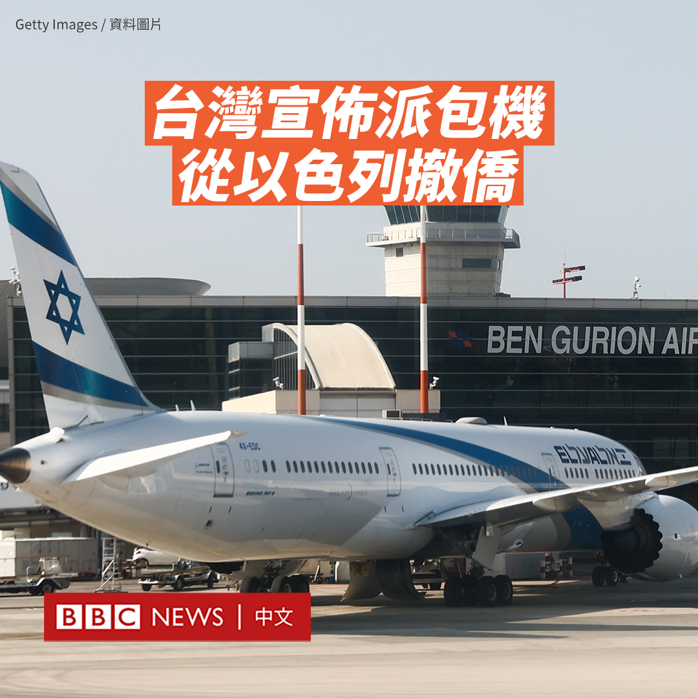
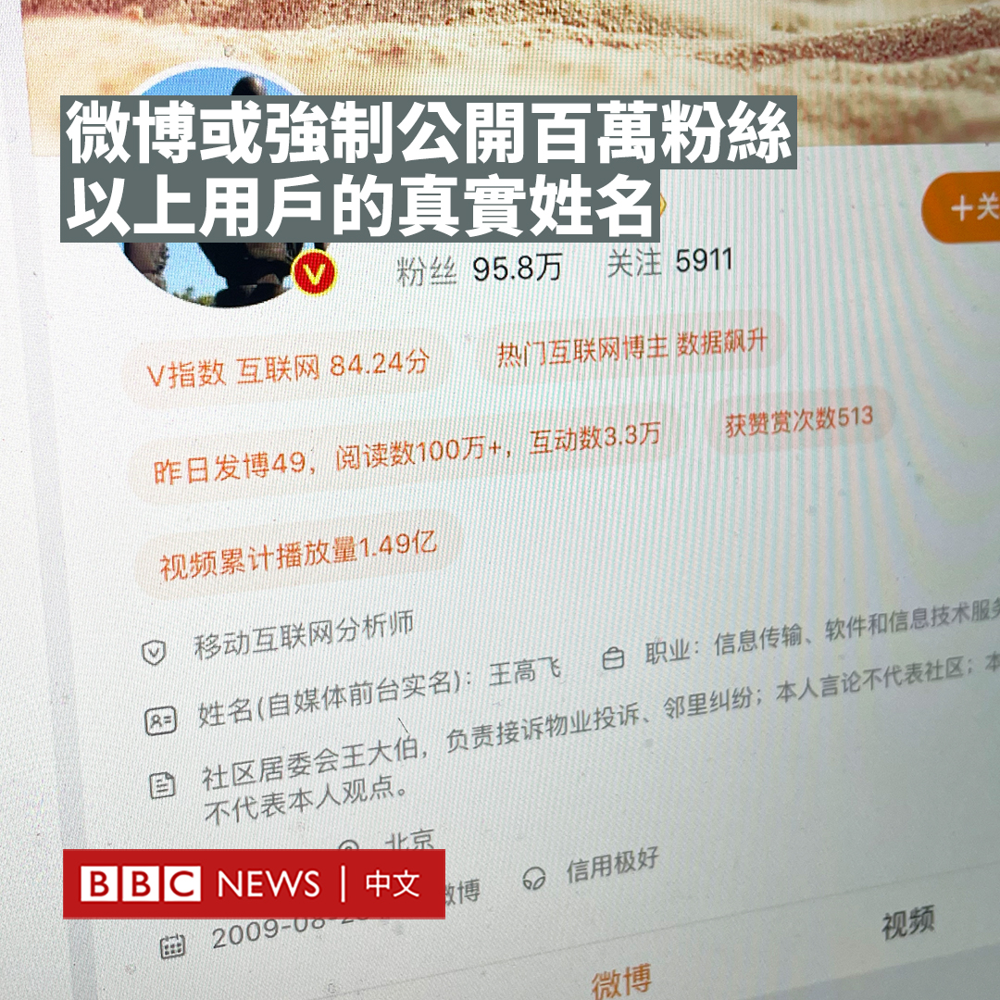
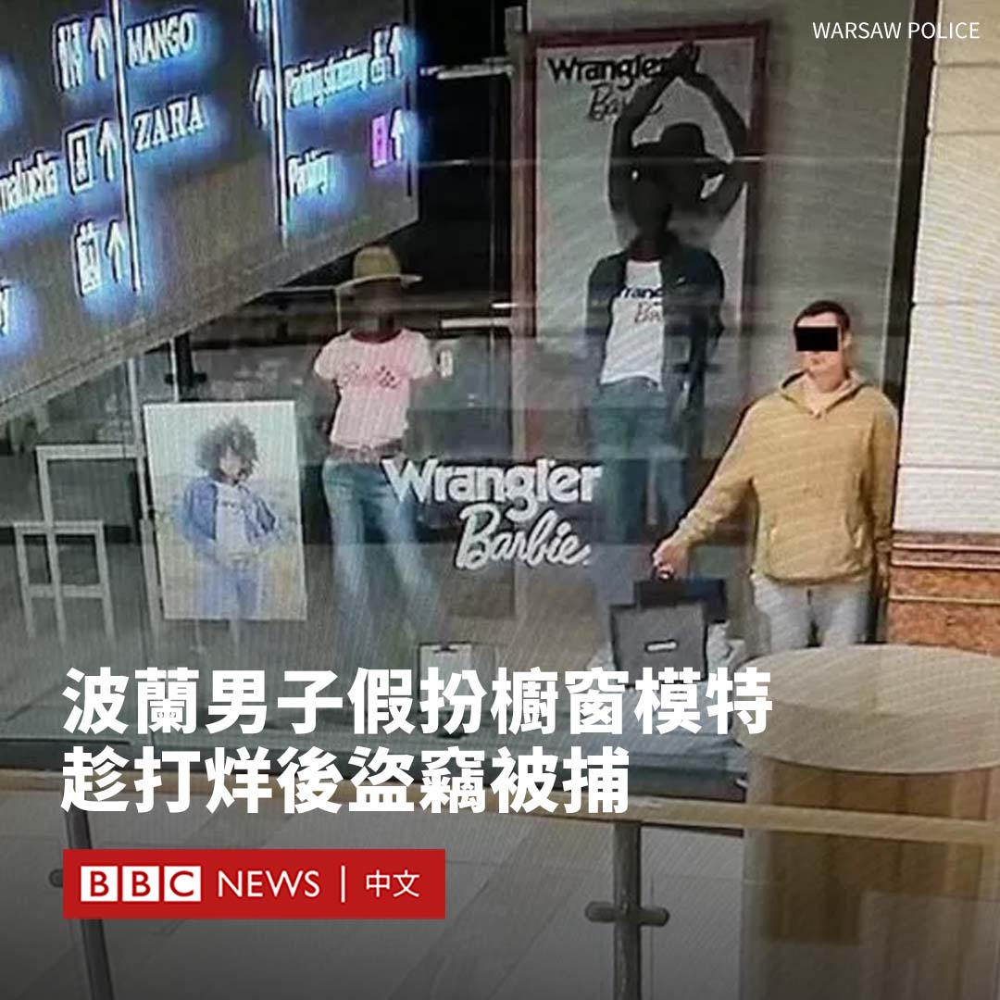
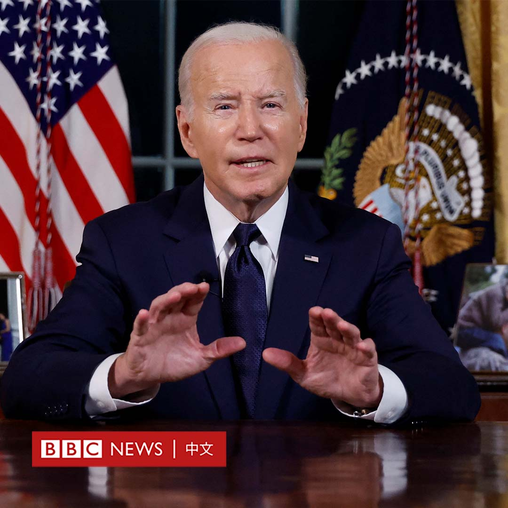

D英国广播公司BBC 北京时间 2023-10-20T16:54:56Z 1715290490416087115 随着以色列和哈马斯的冲突升级，台湾宣布将在周五（10月20日）下午进行撤侨。

据台湾中央社报导，台湾外交部周四宣布将通过专机从以色列撤侨，将台湾公民从特拉维夫送往意大利罗马。

台湾外交部长吴钊燮周五对媒体表示，该飞机预计将搭载16人，包括九名台湾人，六名危地马拉人和一名巴拉圭人。他称，这些人中包括游客和学生。

他补充说，尽管经过劝说，但有137名台湾人仍决定留在以色列。

吴钊燮还表示，有35名中国大陆公民曾表达希望搭乘包机的愿望，但在被要求提供护照等信息后没有收到回应。

以色列军队正在继续集结兵力，准备对加沙发动地面进攻。目前，美国、英国、加拿大、德国、日本、韩国等多国都已宣布撤侨。   D英国广播公司BBC 北京时间 2023-10-20T18:08:56Z 1715309116678127634 美国国防部发布年度中国军力报告称，中国在过去一年大幅扩充了核武库，目前拥有约500枚可用于作战的核弹头。报告还称，北京希望到2030年将其增至1000枚。https://t.co/tl6bps92ZT   D英国广播公司BBC 北京时间 2023-10-20T15:27:56Z 1715268599022338495 继中国社交媒体强制披露用户IP属地之后，该国最大的社交平台微博可能将强制公开粉丝达到一定数量的用户的真实姓名。

据中国媒体报道，多名拥有数百万粉丝的博主收到了微博平台的通知，称将实行“前台实名制”，即姓名等信息对所有人都可见。

微博官方尚未发布任何公告，但该公司首席执行官王高飞证实了该消息，表示该政策针对的是粉丝超过100万的自媒体账号，未来可能将门槛降至50万。

据报道，该政策将主要针对时政、财经和娱乐领域的博主。是否会拓展到其他领域尚不清楚。

截至2022年底，微博月活跃用户达到5.86亿人。

该消息最早由有着300多万粉丝的职业投资人、洪大教育创始人洪榕透露。他表示，一些自媒体账号还将被要求展示职业信息。

“粉丝可以知道自己关注的大V究竟是男是女，是现实中的谁了”。他补充道。“估计有些大V会消失。”

微博平台似乎已开始测试这项功能。王高飞本人的微博账号“来去之间”的页面上增加了两行内容，分别是“姓名（自媒体前台实名）：王高飞”和“职业：信息传输、软件和信息技术服务人员”。

这一政策引发了不同的反响。《环球时报》评论员胡锡进对此表示赞赏，他称：“一个大V在互联网上发言，公众应当知道他是谁，他周围的人则应当知道他在互联网上说了什么”。

一些质疑者则认为，这可能导致激进的网友对表达不同意见的博主进行人肉搜索，甚至带来人身威胁。

近年来，中国不断收紧网络管制。去年4月，微博、微信、抖音和快手等社交媒体开始显示社交媒体用户的地理位置。官方媒体表示，这有助于发现破坏稳定的海外虚假信息宣传。

实行一年多以来，IP属地的强制披露被认为毁誉参半。支持者认为其有效阻止了网络欺诈，以及通过冒充进行炒作的行为，但反对者称这增加了地域偏见，并且让一些身处境外的人因害怕被称为外国间谍而不敢说话。

中国从2017年开始全面实施网络实名制，要求用户在各大平台注册账号时提供真实身份信息。实际操作中，这主要是通过要求用户绑定经实名注册的手机号而实现。

这种认证帮助当局在现实中快速找到发帖人，但不会导致用户的真实姓名被公开展现。   D英国广播公司BBC 北京时间 2023-10-20T11:03:07Z 1715201952509055415 在波兰华沙，一名男子被指控假扮人体模型，待商店关门后偷走珠宝。

这名22岁的男子被拍到纹丝不动地站在一家商店的橱窗中，手中拎着一个包。警方尚未透露其姓名。

警方表示，嫌犯在商店打烊后开始在多处“寻猎”，最后选择了一个珠宝店。

该男子还被指从其他商场盗窃物品。他被控犯有入室盗窃罪，面临最高10年的监禁。

华沙警方表示，当这名男子站在橱窗里，与几个人体模型混在一起时，工作人员和购物者没有察觉到任何异常。

警方表示，他一直站着不动直到“感到安全”，然后在关门后穿过各个店铺，拿走珠宝。

他最终被安保人员发现。

该男子还在另外两起事件中受到指控。警方表示，有一次他在另一家购物中心的一家餐厅停留到很晚，待周边店铺关门后，他通过半开的铁卷门潜入一家服装店，然后“换上了新衣服”。

警方发言人说，在第三起案件中，该男子一直等到商店关门后，“从几个收银机里拿走钱，并试图偷走其他物品”。

华沙的检察官表示，该男子目前已被还押三个月。   D英国广播公司BBC 北京时间 2023-10-20T12:10:50Z 1715218995044073539 美国总统拜登（Joe Biden）周四（10月19日）在椭圆形办公室发表罕见的全国演讲，他将俄乌战争和以巴冲突联系起来，敦促国会采取行动，通过支持乌克兰和以色列的援助计划。

拜登并未透露其要求的额外资金金额，但预计会达1000亿美元。

“哈马斯和普京代表着不同的威胁，但他们有一个共同点：他们都想彻底消灭邻国的民主国家。”他说道。

拜登表示，哈马斯在世界上释放了“不折不扣的邪恶”，并称“没有比被劫持为人质的美国人的安全更重要的事”。

“风险在于，冲突和混乱可能会蔓延到世界其他地区……尤其是中东。”他说道。

他谈到许多美国人对这两场冲突感到遥远，表示确保以色列和乌克兰取得成功，“对美国国家安全至关重要”。他补充说，拒绝帮助以色列和乌克兰是“得不偿失的”。

拜登还呼吁，美国必须拒绝一切形式的伊斯兰恐惧症和反犹太主义。   D英国广播公司BBC 北京时间 2023-10-20T09:31:38Z 1715178930368364965 无论是美国还是中东的领导人们为哈以之间重燃战火十分头疼，因为这代表着过去旧有的“确定性”大多已经破灭。

多年来，内塔尼亚胡使用“分而治之”的战略，试图削弱哈马斯的主要对手巴勒斯坦权力机构，回避巴勒斯坦建国问题。若要完全摆脱战争阴霾，以色列的执政者必须改变思维。https://t.co/7m6i6eZ8sW   