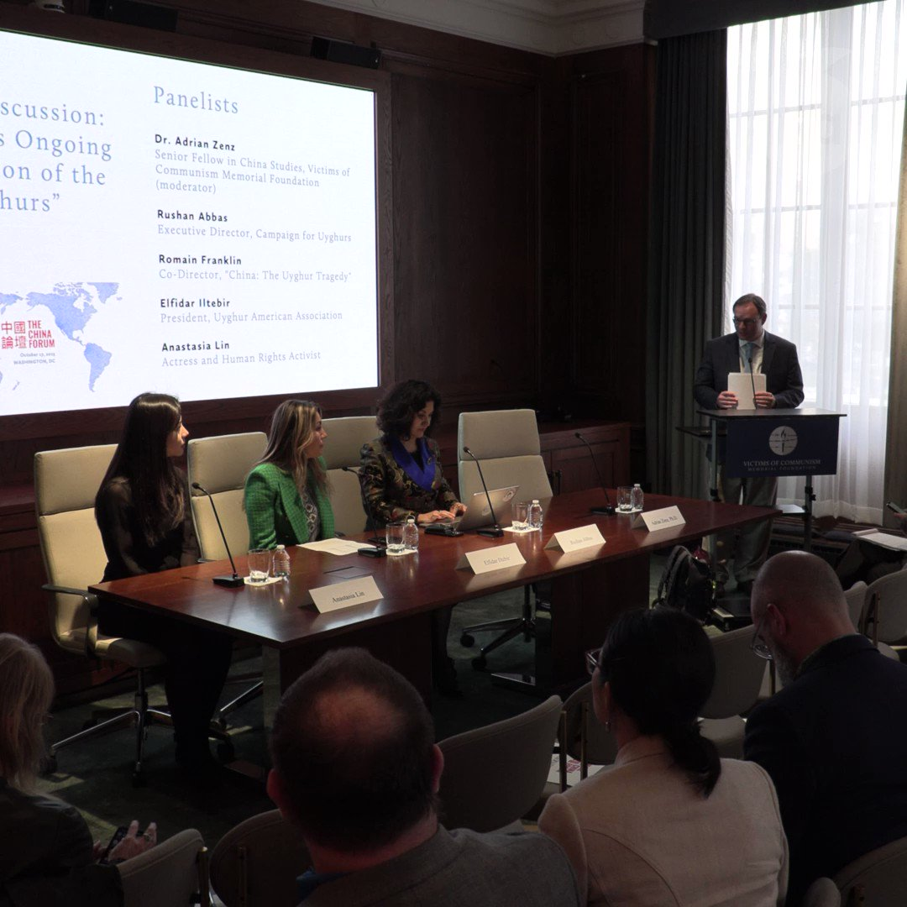
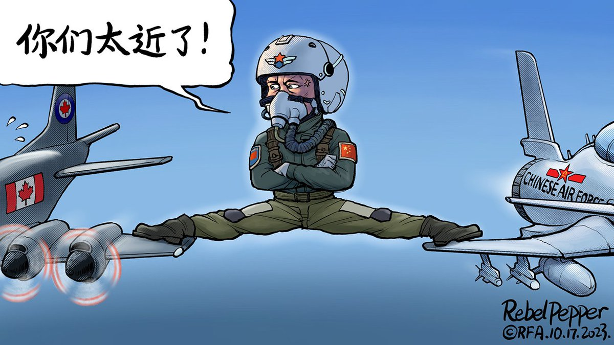

自由亚洲电台 北京时间 2023-10-20T05:22:08Z 1715116141176385945 【”这是一个生存危机！“ 林耶凡谈疫后中国人权问题】
加拿大华人演员，2015年世姐加拿大冠军，人权活动人士 #林耶凡 10月17日出席美国"#共产主义受难者纪念基金会"就中国新疆的人权问题举办的研讨会，就中国人权问题发表看法。 https://t.co/4cN40xvqBG   自由亚洲电台 北京时间 2023-10-20T05:24:56Z 1715116848390471915 中国上周在争议声中连任 #联合国人权理事会 后，包英、美等51国18日在联合国会议上发表联合声明，敦促中国停止在 #新疆 的侵犯人权行为。中方反斥英、美"少数国家"对中国无端指责，又搬出巴基斯坦等72个"友好国家"，强调这些国家都支持中方在涉疆、涉港、涉藏议题上的立场。

 https://t.co/NftDBjrUyL   自由亚洲电台 北京时间 2023-10-20T06:00:01Z 1715125678138597633 美国商务部更新出口管制规定，本周三，淘宝、京东等网站紧急下架受管制的 #显卡，有显卡价格被炒至翻倍却有价无市。另外，十三家中国科技企业被美国列入受制裁的"#实体清单"。

 https://t.co/xRFRTPfiDk   自由亚洲电台 北京时间 2023-10-20T02:53:18Z 1715078689996845268 中国实施的 #网络攻击 和 #间谍 活动数量远超俄罗斯及朝鲜总和。
本周四，有专家在美国国会举行的一场听证会上警告说。 https://t.co/cRP4nrRlEH   自由亚洲电台 北京时间 2023-10-20T00:25:23Z 1715041464659661033 即将公布的 #港府施政报告 会着力 #鼓励生育。重点措施是向每名新生婴儿的父母派发两万港元。婴儿必须在香港出生，但不包括领养，只要父母其中一方属于香港永久居民就符合资格。
港人会因此考虑多生吗？ https://t.co/9LbxAaw1Xd   自由亚洲电台 北京时间 2023-10-20T01:38:23Z 1715059834310275491 #一带一路高峰论坛 日前在北京落幕。十年来，中国在该项目中投入超过一万亿美元，多达150个国家和地区加入中国的合作伙伴行列，但也有不少国家落入 #债务陷阱，而中国却跃升为全世界最大的债主。那么，"一带一路"否改变了地缘政治格局呢？
最新一期 #亚洲很想聊，周五上线

 https://t.co/B1HFxIcBJ2   自由亚洲电台 北京时间 2023-10-20T01:59:19Z 1715065101445918913 【#变态辣椒：长空中的争拗】
#加拿大侦察机 近日在中国海岸线附近的国际公海航道上飞行时被 #解放军军机 拦截，最近时只有五米。北京当局声称加侵犯中国领空。而美国表示，中国军机在过去两年已经执行超过180次高风险拦截行动。五角大楼最近公开了十几起拦截事件的视频和图片。 https://t.co/5UwnEfL6Nv   自由亚洲电台 北京时间 2023-10-20T00:00:45Z 1715035263758721440 曾因声援人权律师 #王全璋 被判处有期徒刑的天津居民 #张建中，获释后因发表有关“六四”的言论，遭国保上门抄家。获准取保候审的张建中表示，当局没有把抄走的大量贵重品归还，而且还拒不认账。

 https://t.co/MMubTeMy5T   