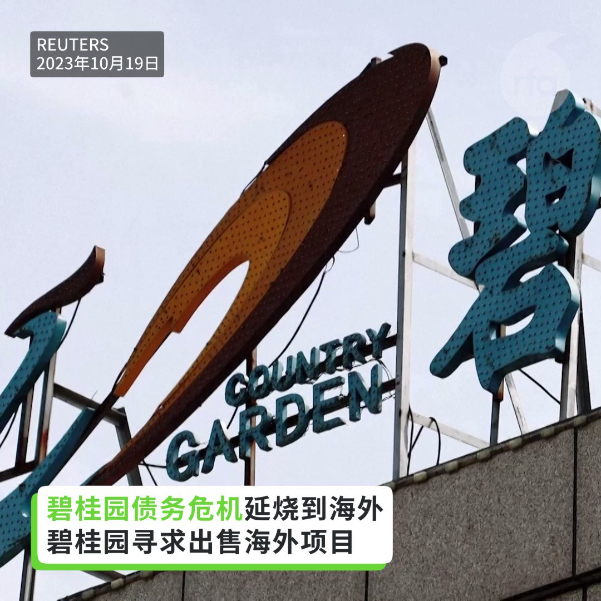
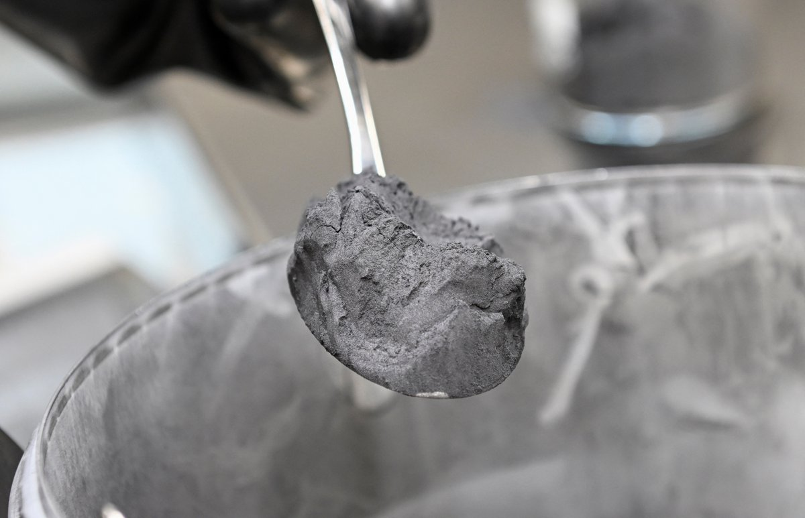
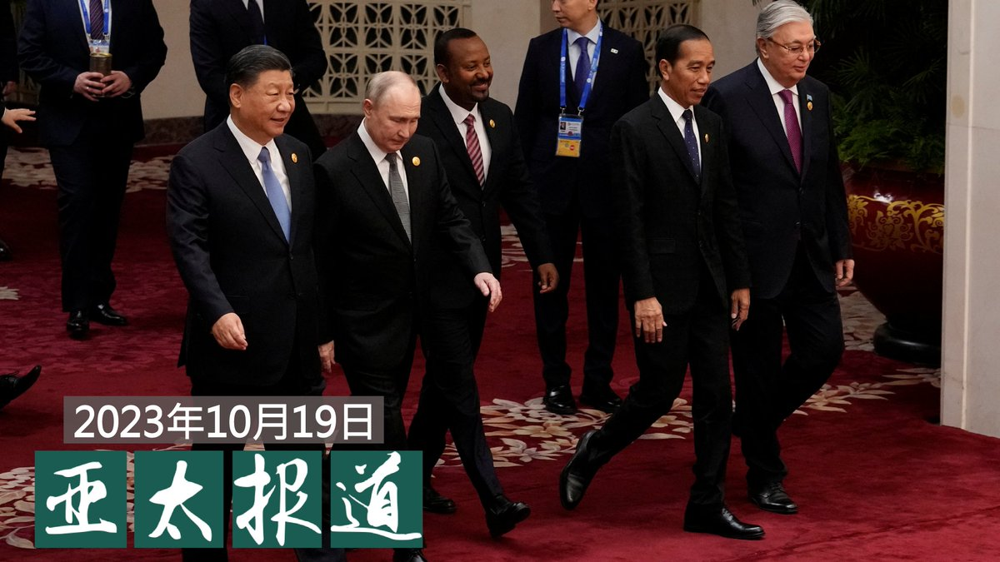
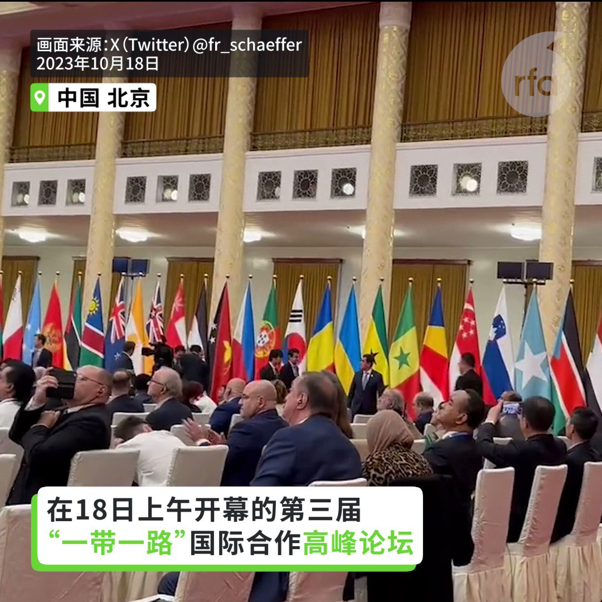

自由亚洲电台 北京时间 2023-10-20T18:36:11Z 1715315973602042324 【碧桂园债务危机延烧到海外】
【寻求出售海外项目】

路透社报道，四年前碧桂园宣布启动澳大利亚悉尼西南一小时车程 #威尔顿 的一处占地 433 公顷的大型住宅社区，预算20亿澳币，约92亿人民币。当时碧桂园宣称可建3600套住宅，如今在建却不到50套，原本承诺的公园、运动场和学校也都没有建成。如今碧桂园寻求出售这个进展缓慢并陷入不确定性的项目。
#碧桂园   自由亚洲电台 北京时间 2023-10-20T20:13:30Z 1715340460833571111 RT @RFA_Chinese: 【”这是一个生存危机！“ 林耶凡谈疫后中国人权问题】
加拿大华人演员，2015年世姐加拿大冠军，人权活动人士 #林耶凡 10月17日出席美国"#共产主义受难者纪念基金会"就中国新疆的人权问题举办的研讨会，就中国人权问题发表看法。 https:/…   自由亚洲电台 北京时间 2023-10-20T15:31:58Z 1715269613733265786 RT @RFA_Chinese: #事实查核｜#新疆 存在 #强迫劳动，是 #反华势力 编造的谎言？
 https://t.co/htLDO2doJq   自由亚洲电台 北京时间 2023-10-20T15:32:26Z 1715269728296714505 【中国管制电动车电池材料石墨出口】
【称为维护国家安全 保障全球供应链】

中国商务部20日表示，商务部会同海关总署发布关于优化调整石墨物项临时出口管制措施的公告，将此前实施临时管制的球化石墨等3种高敏感石墨物项正式纳入两用物项出口管制清单。中国是全球最大的石墨生产国和出口国，商务部称这有利于保障全球供应链产业链安全稳定，有利于更好维护国家安全和利益。石墨是制造电动车电池的材料。报道:https://t.co/MN4eVoXo3h #电动车 #石墨   自由亚洲电台 北京时间 2023-10-20T15:32:26Z 1715269730431287320 RT @RFA_Chinese: 【"在任何形式下都不与俄罗斯进行互动"  】
10月18日，#普京 在“#一带一路”峰会论坛发表讲话前，欧洲代表纷纷离席。
法国《回声报》记者Frédéric Schaeffer @fr_schaeffer在社交媒体X上称 ："法国方面说，在任…   自由亚洲电台 北京时间 2023-10-20T15:38:00Z 1715271129923993946 【前台实名制 #微博 CEO带头】
【部分网民拒绝配合】
新浪微博本周宣布，10月底之前，所有超过100万粉丝的大V用户实施前台实名。本周四（19日）新浪微博首席执行官王高飞带头在个人账号展示实名，其职业栏标注为“软件和信息技术服务人员”。有网民说，如果要前台展示个人姓名，就会注销账号，也有网民开始删除自己的贴文。详细报道:https://t.co/57CWrNtBKr   自由亚洲电台 北京时间 2023-10-20T12:52:20Z 1715229439129436634 【欢迎订阅自由亚洲电台电邮新闻】 
点击https://t.co/197BDI7DqA
输入您的电邮地址，即可收到本台每周二和周五发送的“新闻快递”。
不翻墙也知天下事！ https://t.co/MpqlDbZXTE   自由亚洲电台 北京时间 2023-10-20T07:55:59Z 1715154859530276906 RT @RFA_Chinese: 【亚太报道（2023-10-19）】
欢迎收听和订阅播客【亚太报道】 https://t.co/MjLNSvVMqc
美国宣布制裁十余家中国科技企业；“#一带一路”与中国的地缘政治角色；#以色列华侨 为何没等到“#战狼”的军舰？；“#崇祯亡国君…   自由亚洲电台 北京时间 2023-10-20T06:30:01Z 1715133224702316659 #事实查核｜#新疆 存在 #强迫劳动，是 #反华势力 编造的谎言？
 https://t.co/htLDO2doJq   自由亚洲电台 北京时间 2023-10-20T07:00:07Z 1715140802849149106 【亚太报道（2023-10-19）】
欢迎收听和订阅播客【亚太报道】 https://t.co/MjLNSvVMqc
美国宣布制裁十余家中国科技企业；“#一带一路”与中国的地缘政治角色；#以色列华侨 为何没等到“#战狼”的军舰？；“#崇祯亡国君” 旧版一书难求；天津维权人士 #张建中 遭警方抄家； https://t.co/uGCnN9Oyqb   自由亚洲电台 北京时间 2023-10-20T07:30:00Z 1715148322049253552 #美国制裁 参与 #伊朗导弹、无人机制造的中港公司和个人
 https://t.co/04vlmiBR5I   自由亚洲电台 北京时间 2023-10-20T07:57:22Z 1715155209167536152 RT @RFA_Chinese: 【"在任何形式下都不与俄罗斯进行互动"  】
10月18日，#普京 在“#一带一路”峰会论坛发表讲话前，欧洲代表纷纷离席。
法国《回声报》记者Frédéric Schaeffer @fr_schaeffer在社交媒体X上称 ："法国方面说，在任…   自由亚洲电台 北京时间 2023-10-20T08:28:34Z 1715163058719555898 “我没被抓”之后是“我没跑路” 中国企业家走到绝路？
中国车企威马汽车创始人 #沈晖 也要跑路？ https://t.co/5IjFYQsNFZ   自由亚洲电台 北京时间 2023-10-20T08:39:42Z 1715165862540546232 美国《华尔街日报》周四（10月19日）报道说，中国银行体系正暴露于两方面的风险，包括房地产市场泡沫退去，和地方政府偿债困难。虽然中国不太可能发生类似于2008年美国金融公司雷曼兄弟倒闭后的金融崩溃，但中国财政和金融失衡状况已非常严重。 https://t.co/dFhXBZX9G3   自由亚洲电台 北京时间 2023-10-20T02:24:48Z 1715071513735639379 【"在任何形式下都不与俄罗斯进行互动"  】
10月18日，#普京 在“#一带一路”峰会论坛发表讲话前，欧洲代表纷纷离席。
法国《回声报》记者Frédéric Schaeffer @fr_schaeffer在社交媒体X上称 ："法国方面说，在任何形式下都不与俄罗斯 进行互动。" https://t.co/eINfPMxCLs   自由亚洲电台 北京时间 2023-10-20T04:27:12Z 1715102320063828139 #哈以冲突 至今，美、日、韩等国已相继为在中东的侨民提供紧急援助，并实施了多种 #撤侨 行动。但与此同时，中国侨民为何还没等到"#战狼"开来的军舰呢？

 https://t.co/b37FbHPyEE   自由亚洲电台 北京时间 2023-10-20T05:14:40Z 1715114265429094716 专栏 | #军事无禁区：美国战略态势对准中俄
 https://t.co/3d8gq9tkhs   自由亚洲电台 北京时间 2023-10-20T05:22:08Z 1715116141176385945 【”这是一个生存危机！“ 林耶凡谈疫后中国人权问题】
加拿大华人演员，2015年世姐加拿大冠军，人权活动人士 #林耶凡 10月17日出席美国"#共产主义受难者纪念基金会"就中国新疆的人权问题举办的研讨会，就中国人权问题发表看法。 https://t.co/4cN40xvqBG   自由亚洲电台 北京时间 2023-10-20T05:24:56Z 1715116848390471915 中国上周在争议声中连任 #联合国人权理事会 后，包英、美等51国18日在联合国会议上发表联合声明，敦促中国停止在 #新疆 的侵犯人权行为。中方反斥英、美"少数国家"对中国无端指责，又搬出巴基斯坦等72个"友好国家"，强调这些国家都支持中方在涉疆、涉港、涉藏议题上的立场。

 https://t.co/NftDBjrUyL   自由亚洲电台 北京时间 2023-10-20T06:00:01Z 1715125678138597633 美国商务部更新出口管制规定，本周三，淘宝、京东等网站紧急下架受管制的 #显卡，有显卡价格被炒至翻倍却有价无市。另外，十三家中国科技企业被美国列入受制裁的"#实体清单"。

 https://t.co/xRFRTPfiDk   自由亚洲电台 北京时间 2023-10-20T02:53:18Z 1715078689996845268 中国实施的 #网络攻击 和 #间谍 活动数量远超俄罗斯及朝鲜总和。
本周四，有专家在美国国会举行的一场听证会上警告说。 https://t.co/cRP4nrRlEH   自由亚洲电台 北京时间 2023-10-20T00:25:23Z 1715041464659661033 即将公布的 #港府施政报告 会着力 #鼓励生育。重点措施是向每名新生婴儿的父母派发两万港元。婴儿必须在香港出生，但不包括领养，只要父母其中一方属于香港永久居民就符合资格。
港人会因此考虑多生吗？ https://t.co/9LbxAaw1Xd   自由亚洲电台 北京时间 2023-10-20T01:38:23Z 1715059834310275491 #一带一路高峰论坛 日前在北京落幕。十年来，中国在该项目中投入超过一万亿美元，多达150个国家和地区加入中国的合作伙伴行列，但也有不少国家落入 #债务陷阱，而中国却跃升为全世界最大的债主。那么，"一带一路"否改变了地缘政治格局呢？
最新一期 #亚洲很想聊，周五上线

 https://t.co/B1HFxIcBJ2   自由亚洲电台 北京时间 2023-10-20T01:59:19Z 1715065101445918913 【#变态辣椒：长空中的争拗】
#加拿大侦察机 近日在中国海岸线附近的国际公海航道上飞行时被 #解放军军机 拦截，最近时只有五米。北京当局声称加侵犯中国领空。而美国表示，中国军机在过去两年已经执行超过180次高风险拦截行动。五角大楼最近公开了十几起拦截事件的视频和图片。 https://t.co/5UwnEfL6Nv   自由亚洲电台 北京时间 2023-10-20T00:00:45Z 1715035263758721440 曾因声援人权律师 #王全璋 被判处有期徒刑的天津居民 #张建中，获释后因发表有关“六四”的言论，遭国保上门抄家。获准取保候审的张建中表示，当局没有把抄走的大量贵重品归还，而且还拒不认账。

 https://t.co/MMubTeMy5T   