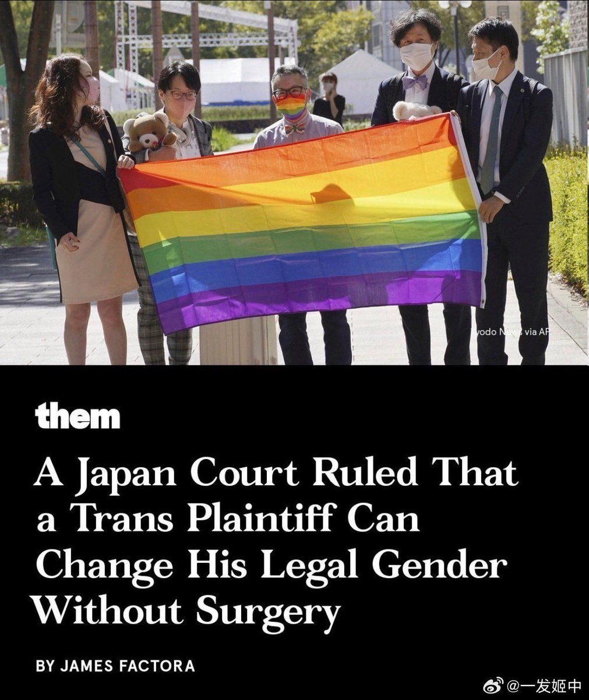
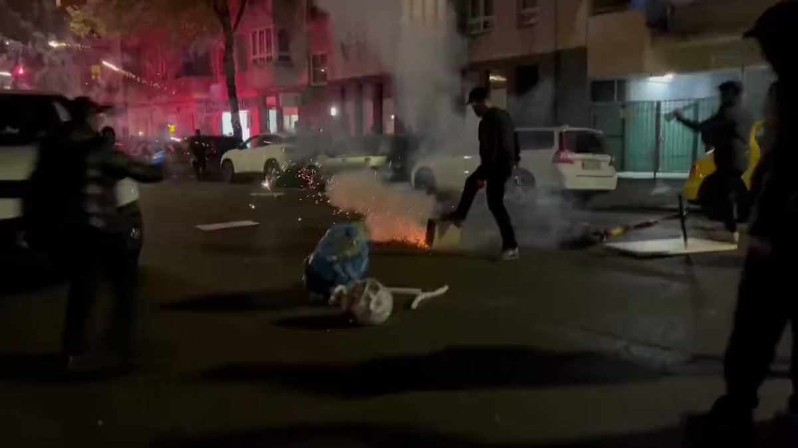

谁将十万横扫三江 北京时间 2023-10-20T10:42:02Z 1715196649029661078 这是1980年新西兰原住民毛利人的艾滋预防宣传单。

宣传单上的文字：知识就是力量。作为年轻的毛利同志，让我们了解艾滋。 

source (https://t.co/WyZVSeB8kq) https://t.co/5VWvElfLvC   谁将十万横扫三江 北京时间 2023-10-20T10:43:32Z 1715197027158753329 大家好。我叫萨尔玛·舒拉布。我是加沙人。我生在加沙长在加沙，从来没有离开过加沙。也就是说我这辈子经历过了很多针对加沙的战事。但这次战事之激烈，是我也没有见过的。现在已经是以色列持续袭击加沙地带的第五天了。

我很幸运。我家还没有被轰炸。我也还没有死。我的家人也还都幸存着。但这次我不确定我能不能活下去。所有我认识的朋友，要么已经死了，要么就是有家人死了，要么就是家里被炸平了。这次袭击是全面式的，我们没有任何可以安全逃难的地方。昨天我们整栋楼被拉响了警报，然后我们尝试去撤离到安全的地方，但后来我们发现我们撤离到的地方还不如我们楼安全，所以我们又回来了。我想如果我要死的话，我也想要死在家里。

我现在身后是我的床垫。因为我们需要躲到比较安全的房间，所以我们会把床垫拖来拖去。这是我的包。我包里放着所有必备的东西，好让我在需要的时候第一时间逃难。我也不知道我能不能活下来，但我想尽量活的长一些，把加沙这边的真相告诉给大家。昨天以色列轰炸了我们唯一可以逃难出战争区域的路，我们所有人都出不去了，我们被关在战争区了。我们现在只能等死。

加沙现在是一座鬼城。所有的大建筑都被夷平了。我打工的地方被轰炸了。我上学的大学被轰炸了。今年我本来应该毕业的，但看上去我等不到毕业这一天了。现在没有任何可以就地避难的地方，我们没有水，没有厕所，网也基本被断了。以色列做的就是把所有有网的地方一个个炸掉。我现在的网也是时断时续，随时都可能断。这也就是为什么你很少听到加沙人出来讲自己的情况，因为我们很难把我们这边发生的事情传播出去。

我已经两天没有睡了。我每次要睡觉的时候，都会被轰炸声、惊叫声、强光、邻居撤离的声音惊醒。我也不知道我现在是该撤离还是该在自己家里等死。我们现在生活在一个完全没有人性的环境里。战争快点结束吧。我们的命也是命啊。我们不是死亡统计里的数字。我们是活生生的人。 source (https://t.co/xXg7YYaQt6)   谁将十万横扫三江 北京时间 2023-10-20T10:57:23Z 1715200509974565332 大家好。我叫萨尔玛·舒拉布。我是加沙人。我生在加沙长在加沙，从来没有离开过加沙。也就是说我这辈子经历过了很多针对加沙的战事。但这次战事之激烈，是我也没有见过的。现在已经是以色列持续袭击加沙地带的第五天了。

我很幸运。我家还没有被轰炸。我也还没有死。我的家人也还都幸存着。但这次我不确定我能不能活下去。所有我认识的朋友，要么已经死了，要么就是有家人死了，要么就是家里被炸平了。这次袭击是全面式的，我们没有任何可以安全逃难的地方。昨天我们整栋楼被拉响了警报，然后我们尝试去撤离到安全的地方，但后来我们发现我们撤离到的地方还不如我们楼安全，所以我们又回来了。我想如果我要死的话，我也想要死在家里。

我现在身后是我的床垫。因为我们需要躲到比较安全的房间，所以我们会把床垫拖来拖去。这是我的包。我包里放着所有必备的东西，好让我在需要的时候第一时间逃难。我也不知道我能不能活下来，但我想尽量活的长一些，把加沙这边的真相告诉给大家。昨天以色列轰炸了我们唯一可以逃难出战争区域的路，我们所有人都出不去了，我们被关在战争区了。我们现在只能等死。

加沙现在是一座鬼城。所有的大建筑都被夷平了。我打工的地方被轰炸了。我上学的大学被轰炸了。今年我本来应该毕业的，但看上去我等不到毕业这一天了。现在没有任何可以就地避难的地方，我们没有水，没有厕所，网也基本被断了。以色列做的就是把所有有网的地方一个个炸掉。我现在的网也是时断时续，随时都可能断。这也就是为什么你很少听到加沙人出来讲自己的情况，因为我们很难把我们这边发生的事情传播出去。

我已经两天没有睡了。我每次要睡觉的时候，都会被轰炸声、惊叫声、强光、邻居撤离的声音惊醒。我也不知道我现在是该撤离还是该在自己家里等死。我们现在生活在一个完全没有人性的环境里。战争快点结束吧。我们的命也是命啊。我们不是死亡统计里的数字。我们是活生生的人。 source (https://t.co/xXg7YYaQt6)   谁将十万横扫三江 北京时间 2023-10-20T11:01:57Z 1715201660811948181 日本法院首次判定：跨性别无需手术即可更改法定性别

自2004年以来，日本要求性别确认手术才能更改法定性别。2021年，原告Suzuki向静冈家庭裁判所提出请求，该法院上周四判定支持原告，并称该手术“会造成严重的、不可逆转的生殖功能丧失”。这是一项史无前例的裁决。最高法院似乎也在朝着更加包容的方向转变。今年7月，日本最高法院首次就性少数群体的工作场所保护做出裁决，承认禁止跨性别员工使用意向厕所为违法。   谁将十万横扫三江 北京时间 2023-10-20T11:36:56Z 1715210465608192288 重轻讲148天美国编剧罢工这期，非常推荐。即便在他自己的维度里都棒极了。不但把这场罢工拆解得清清楚楚，为什么对抗，怎么对抗，遇到哪些问题又如何克服……尤其最后20分钟讲经济下行期、零工化时代劳工权益和尊严如何保障、驳斥“提高最低收入水平只会降低整体福利水平”的纯自由主义经济学论调，非常感人。听了他在各种播客流窜的那么多期节目，这也是印象中他最动感情的一段，连我都快听哭了。

有真的工会真了不起。“你所习以为常的一切，都是前人斗争的结果”。

网页链接 https://t.co/pboeZgn9a7   谁将十万横扫三江 北京时间 2023-10-20T11:37:43Z 1715210662924976274 网上有些人，既不是科班出身的专业学者，也没有亲身经历过严重的情绪危机，随随便便地就写文卖课，教大家如何排解精神上的痛苦，每次看到这些内容，我都仿佛是一个患有战场PTSD的老兵，看着肥宅军迷大谈战场生存。

几个月前，我在某心理干预机构做过一个测评，他们将焦虑从低到高，划分为20个等级，我的测评结果是18，也就是焦虑极限的90%，我想和大家描述一下这种程度的焦虑是什么感觉。

首先，你会严重失眠，只要你躺床上闭好眼，你脑海中每隔几十秒就会被“我操…那事该怎么办！”的念头猛激一下，这种刺激每发作一次，你就会心率飙升，四肢充血，身体自动切换到逃命状态，等你心率稍微降下来些后，下一次猛激就又来了，如此反复，你无论怎么辗转都睡不着，感觉还没躺一会呢，天就亮了，在焦虑大发作时，你可能会连续48小时甚至72小时无法正常入眠，就算最后你在极度的疲劳下睡着了，也会很快惊醒，再一看表，发现才睡了不到三个小时。

其次，你会失去食欲，人类的天性就是拒绝在感到危险时进食，尽管这个危险仅仅是想象出来的，长期食欲不振的后果就是体重猛降，我曾经在不到两周的时间里体重减轻10斤，那是我成年之后体重下降最快的一次，而且因为经常进入应激状态，缺血的胃部叠加不规律的饮食，很容易引发溃疡，强行进食还会引发呕吐，甚至不吃东西也会干呕，焦虑到扶着墙直吐的情况是完全可能的。

第三，你会频繁腹泻，人的肠道与情绪之间的反馈非常密切，在焦虑时经常会莫名闹肚子，即使你吃的是一些非常稳妥的食物，如面包和煮鸡蛋，也有可能引发腹泻，这进一步加剧了体重下降。

第四，白发，是的，焦虑会催生白发，当人处于焦虑时，交感神经系统会提升去甲肾上腺素的水平，损伤头皮毛囊里的色素干细胞，人就会因此长出白发，据我所知，目前还没有办法修复这种毛囊损伤，也就是说焦虑引发的白发是不可逆的，想掩盖就只能染发了。

第五，无法抑制的走神，当一个人处于严重焦虑状态时，其注意力就好像被强磁铁吸住一样，每隔几十秒大脑里就会响起“我操…那事该怎么办”的警报，以至于你做事完全无法集中精神，重度焦虑能让人走神到什么程度，我举个例子，我之前为了缓解焦虑，去参加柔术训练，实战时我过腿进攻，被下位的对手抓住了领子，有柔术经验的人都知道，对方这种没有体位优势的绞技充其量就是个骚扰，很容易应对，但我在被拉紧领子时，竟突然走神了，大脑开始思考“我操…那事该怎么办？” 结果我愣是被绞晕过去了，等醒过来以后，和我对练那哥们蹲我旁边，一脸懵逼地问：“哥们儿，嘛呢？这也能睡过去？” 重度焦虑就能让人走神到这种程度，和人搏斗时都能心不在焉。

第六，创造力受损，人的很多创意往往是依赖默认神经网络模式完成的，就是你没有主动去思考某个创意，而是交给大脑的后台程序，让其自发寻找信息之间的联系，最后生成点子，想进入这种模式，往往需要放松，让大脑自动遨游，这就是为什么很多人会在洗澡或者散步时想出创意，但重度焦虑时，人的注意力会被反复扯向那件让你忧虑的事，难以进入默认神经网络模式，创造力就被极大抑制了。

第七，失去好奇心，人在感受到危险时，就不会再去探查未知事物，因为人不想给当下的危局再引入新的未知变数，而好奇心往往是学习的动力，一个人重度焦虑时，好奇心就会被极大抑制，若长此以往，对个人的发展非常不利。

第八，焦虑会自激，这是非常要命的一点，所谓的自激就是焦虑会不断地自我激化加强，比如说，一开始，你因为某事陷入焦虑，接下来焦虑引发各种身体不适，然后，你就会想“再这么焦虑下去，我的健康就完蛋了！” 一旦有了这种想法，你就会因为自己焦虑而焦虑，初始焦虑会引发次级焦虑，次级焦虑又引发次次级焦虑，就好像把麦克风对准音箱一样，很快你会淹没在情绪的回啸里。

第九，也是最严重的一点，那就是重度焦虑会淡化人对死亡的恐惧，若人在正常状态下对死亡的恐惧是10，重度焦虑能将其抑制到2或3，我在这种状态下时，并不会去自杀或主动寻死，但对死有一种无所谓的态度，假如正好有一个充分的理由或合适的机会，那死就死了，无所谓，之前外出时，我和同行人曾一起走过一个玻璃栈道，其下是几十米的深渊，玻璃还擦的特干净，让人仿佛站在空气上，同行人一个个吓的两腿颤颤，抱着栏杆不敢睁眼，要搁我平时，也会腿软冒冷汗，但我重度焦虑时，特别淡然地就从栈道上插兜走过去了，当时心里想的是死就死了，无所谓，就这么摔死还能给家人留份保险金，也好。

以上这些是重度焦虑给人带来的困扰，按说到了这种程度，就应该去医院诊治了，但我没有，我就他妈咬牙硬抗，往死里抗，现在缓和一些了，已经过了最困难的阶段，但需要特别说明的是，我这么硬抗是不对的，没出事只是因为运气好，若你也在面临同样程度的情绪困扰，应当及时咨询专业人士。

怎么缓和焦虑，我自己总结出几个方法，但需要说明的是，这只是个人经验的总结，不具有普遍的适用性，大家若有需要，还应遵循专业人士的意见。

首先，就是在明亮开阔的地方散步，记住，明亮而且开阔，要确保自己的眼睛接收到足够的阳光，这能直接影响内分泌水平，我最焦虑的一次就是在阳光下散步四个小时后抗过去的。

其次就是坚持锻炼，跑步，跳绳，跳舞，骑车都可以，这一样能改善你的内分泌，但尽量不要做大重量的自由器械训练，也不要做对抗训练，因为你会不停地走神，容易出危险。

第三，正念冥想，我想说的是，冥想有用，但这里有个悖论，那就是若想克服重度焦虑，你的冥想功夫要足够深，要能够娴熟地控制自己的注意力才行，可有这种冥想功力的人往往不会陷入重度焦虑，你若是已经陷入焦虑了，再开始临阵磨枪似的练冥想，不能说没用，用处还是有一些的，想看到效果需要一个不短的过程，指望着靠练冥想就能短时间内摆脱焦虑，很难。

最后一点，也是对付焦虑的终极奥义，那就是“该干啥干啥”，有人会觉得这是句废话，其实不是的，因为这句话有效地破解了焦虑情绪的一个魔咒，相信很多人都感受到过，那就是焦虑这种情绪之所以难缠，就在于无论你怎么应对它，你的努力都会被其吸收，成为令其膨胀的养料，比如说，你为了缓解焦虑去看了场电影，一旦你想到自己是为了缓解焦虑而看的电影，你马上就会变得更加焦虑，这意味着你在脑海中不能以任何理由触发与焦虑有关的念头，就算是否定或抑制它的都不行，否则只会加强焦虑，你唯一的选择就是做自己该做的事，去学习，去工作，去锻炼，这种“该干啥干啥”的战术之所以有用，是因为你不是为了应对焦虑而去做这些事的，而是你本来就该做这些事，与焦虑无关，如此一来，你就不会主动地去激起脑海中关于焦虑的概念，时间久了，焦虑情绪也就冷却下来了。

以上这些就是我这段时间被焦虑洗礼过的心得，希望能帮到你，需要再次提醒的是，上述内容只是个人经验总结，并不适用于每个人，若你现在正面临重度焦虑，要及时咨询医生和专业人士。

在我看来，焦虑就像一个巨大的玻璃碗，内壁涂满了肥皂水，置身其中的你无论怎么往上爬，最后都会出溜回碗底，一个正确的方法是让自己奔跑起来，不断地向前跑，只要速度起来了，人就会踩着内壁以螺旋线的方式越跑越高，最后脱困。

所以，归根结底，挣脱焦虑的方法是什么呢？

是向前，不断地向前。

【网评】良心文，胜过一万个心理咨询广告韭菜已经很惨了，连焦虑都要被心理课割一茬   谁将十万横扫三江 北京时间 2023-10-20T11:41:26Z 1715211597583704568 “国家不会害我的” https://t.co/nAf9m2FbLg   谁将十万横扫三江 北京时间 2023-10-20T09:23:16Z 1715176824618316207 德国柏林，支持巴勒斯坦的示威者与警察爆发冲突。 https://t.co/H5E7omKfLR   