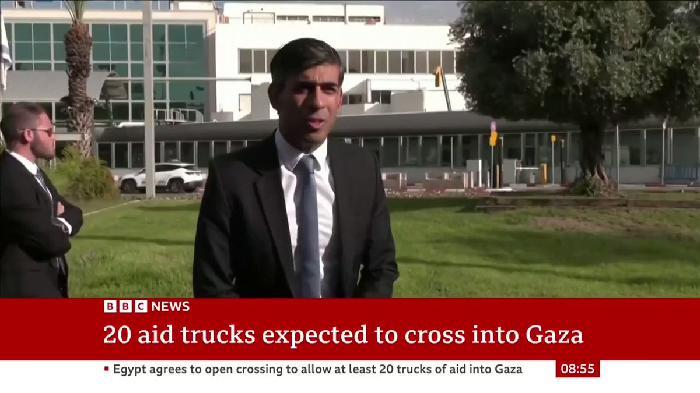
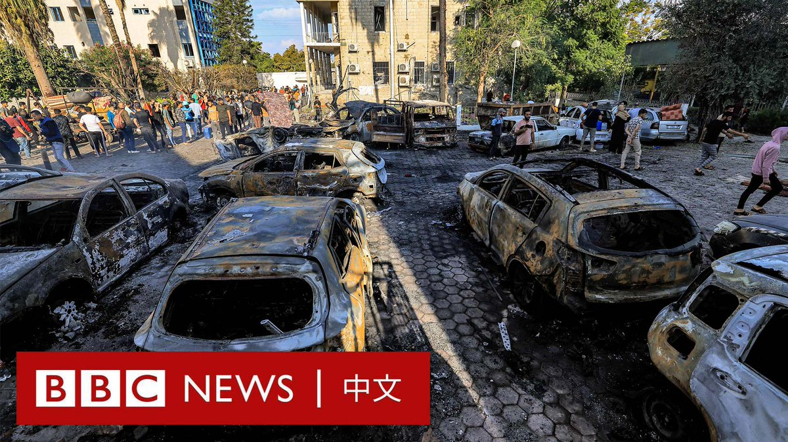
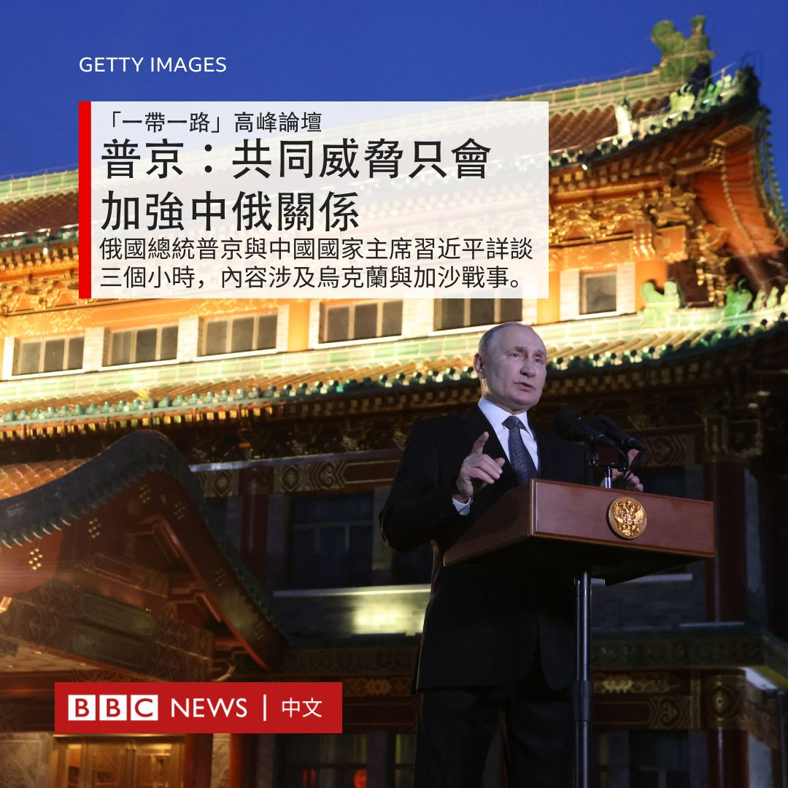

D英国广播公司BBC 北京时间 2023-10-19T21:37:46Z 1714999280669507845 【现场画面】英国首相苏纳克（Rishi Sunak）开始访问以色列。他在抵达时表示，“我很高兴在这个重要时刻来到以色列”。

“我来到这里，是为了表达我对以色列人民的声援。”苏纳克说道。

“你们遭受了难以形容的、可怕的恐怖主义行径，我想让你们知道，英国和我与你们站在一起。”他说道。 https://t.co/5lTgBJmfLj   D英国广播公司BBC 北京时间 2023-10-19T20:26:52Z 1714981437106204847 加沙一家医院发生致命爆炸后，悲伤的氛围仍笼罩着当地。悲痛欲绝的亲属们哀悼死者，并继续寻找其他受害者的遗体。

与此同时，美国总统拜登访问了以色列，表达对内塔尼亚胡政府的支持，而这可能加深阿拉伯世界对美国的不信任。

BBC记者从加沙医院爆炸现场和以色列发来报导。 https://t.co/IEiq8eJr0I   D英国广播公司BBC 北京时间 2023-10-19T17:46:50Z 1714941166603403327 以色列与哈马斯互相指责对方是加沙阿赫利医院爆炸事件的幕后黑手。我们能从事发后的现场殘骸发现什么？ https://t.co/r7YdUblPIh   D英国广播公司BBC 北京时间 2023-10-19T15:47:07Z 1714911036455661964 美国和中国半导体竞争升温之际，台湾厂商未来合作的对象是哪一方，涉入的程度有多深，都势必在地缘政治下受到高度检视。https://t.co/ykrSnUu2Cs   D英国广播公司BBC 北京时间 2023-10-19T12:26:21Z 1714860512456917458 “当我敲开这些家庭的门时，我感觉自己就像一个死神。”

在以色列，所有在军事行动或恐怖袭击中丧生的以色列人家属，都会被一名军人亲自登门正式通知死讯。在哈马斯发动袭击后，这项服务变得前所未有的忙碌。
https://t.co/m2yj2oWeeM   D英国广播公司BBC 北京时间 2023-10-19T13:30:03Z 1714876545435668837 一名网路安全研究人员利用美国中情局（CIA）官方X（推特）账户的一个漏洞，成功劫持了该单位一个用于招募间谍的频道。https://t.co/zuJFIyFdyW   D英国广播公司BBC 北京时间 2023-10-19T11:05:50Z 1714840248989974735 分析人士认为，在工业部门强劲发展、消费支出持续复苏以及全球贸易的触底反弹之下，中国经济的“顺风”之势正在增强，而未来最大的下行风险仍然是房地产行业的硬着陆。https://t.co/t6YV3Gb7A2   D英国广播公司BBC 北京时间 2023-10-19T08:24:40Z 1714799689432977587 俄罗斯总统普京（Vladimir Putin）10月18日在北京会晤中国国家主席习近平将近三个小时。普京表示，中国与俄国各自面对的外部因素和冲突“都是共同的威胁，它们将强化俄中协作”。

普京在总结访华行程的记者会上说，在正式会晤上，普京向习近平表示对发展“一带一路”倡议感兴趣，“我们还颇为详细地讨论了中东局势，我也向主席通报了乌克兰的局势发展”。

国营俄罗斯卫星社（Sputnik）引述普京与总统新闻秘书称，双方正式会谈持续了约1.5小时，然后两国元首与外长等一同午膳，并继续交谈。普京与习近平继而再“单独会面”。

普京说：“我们面对面交谈，确实就是这样，就是喝茶，我们交谈，可能是一个半小时，也许两个小时。我们面对面讨论了一些非常机密的问题，这是谈话中非常富有成效和内容丰富的部分。”

详细报导：https://t.co/ZOxJvYDVuL   D英国广播公司BBC 北京时间 2023-10-19T00:12:32Z 1714675840682696951 美国总统拜登（Joe Biden）仍按计划在周三抵达以色列访问，以显示美国对以色列的支持和“对其安全的坚定承诺”，但医院爆炸事件令他此次访问的背景不容乐观。https://t.co/zVqvTITGTv   