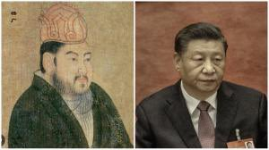

Ivy未央 北京时间 2023-10-19T10:42:23Z 1714834350875804098 习近平像不像隋炀帝杨广？
极爱面子，好大喜功，对外很讲排场。为了在外宾面前炫耀隋朝的强盛和富有，隋炀帝下令，在外宾所经道路和场所，把所有树木都缠上丝绸，对外大撒币……

结局：嘴里说着尧舜的话，做的却是桀纣的事，始终没有自知之明，最终必败亡！ https://t.co/8zvdYY7Z1Y   